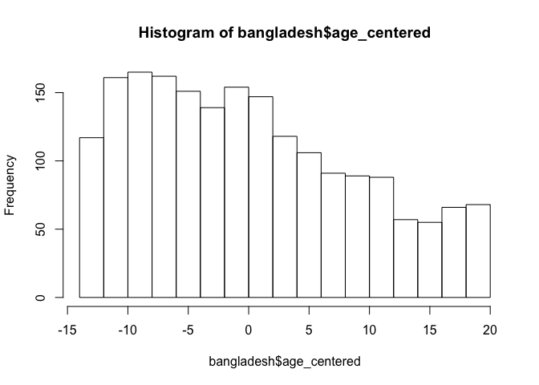
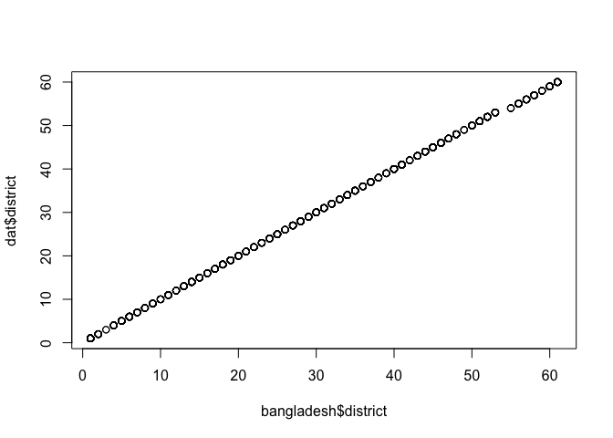
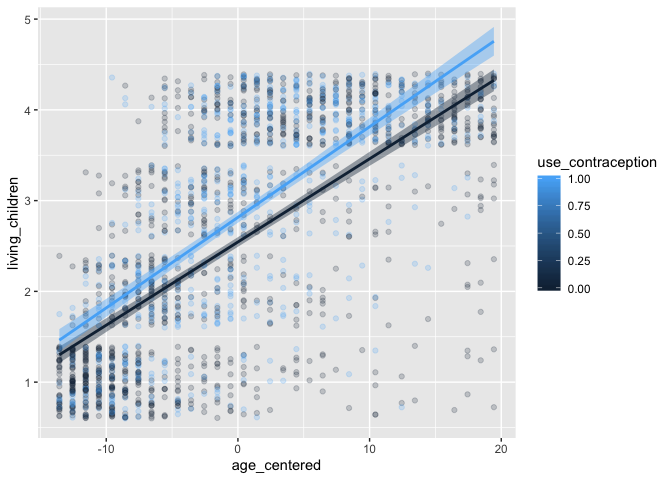
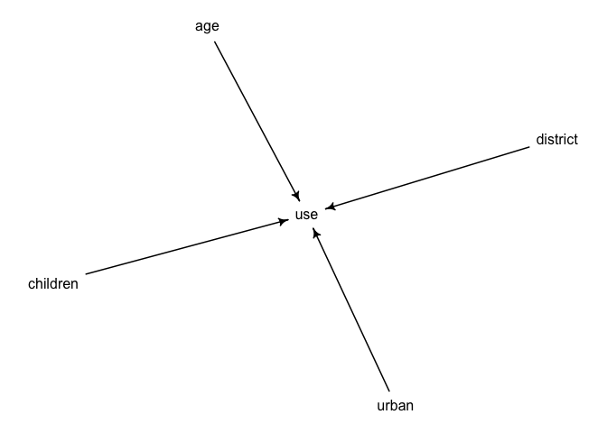
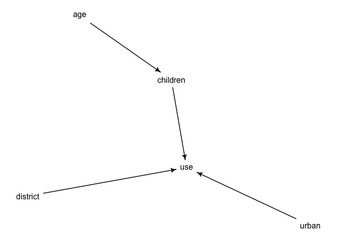
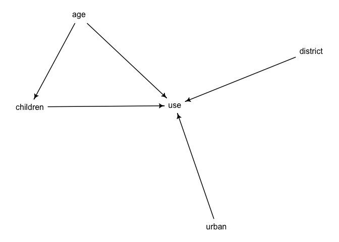

Load data and libraries:


```r
library(rethinking)
library(tidyverse)
library(tidybayes)
library(magrittr)
library(dagitty)

data(bangladesh) 

colnames(bangladesh) = str_replace(colnames(bangladesh), "\\.", "_")
```

Look at data:

```r
summary(bangladesh) 
```

```
##      woman           district     use_contraception living_children
##  Min.   :   1.0   Min.   : 1.00   Min.   :0.0000    Min.   :1.000  
##  1st Qu.: 484.2   1st Qu.:14.00   1st Qu.:0.0000    1st Qu.:1.000  
##  Median : 967.5   Median :29.00   Median :0.0000    Median :3.000  
##  Mean   : 967.5   Mean   :29.35   Mean   :0.3925    Mean   :2.652  
##  3rd Qu.:1450.8   3rd Qu.:45.00   3rd Qu.:1.0000    3rd Qu.:4.000  
##  Max.   :1934.0   Max.   :61.00   Max.   :1.0000    Max.   :4.000  
##   age_centered            urban       
##  Min.   :-13.560000   Min.   :0.0000  
##  1st Qu.: -7.559900   1st Qu.:0.0000  
##  Median : -1.559900   Median :0.0000  
##  Mean   :  0.002198   Mean   :0.2906  
##  3rd Qu.:  6.440000   3rd Qu.:1.0000  
##  Max.   : 19.440000   Max.   :1.0000
```

```r
hist(bangladesh$age_centered)
```

<!-- -->

Make data into list:


```r
dat = list(use_contraception = bangladesh$use_contraception, 
           district = as.numeric(as.factor(bangladesh$district)),
           urban = bangladesh$urban,
           age_centered = bangladesh$age_centered,
           living_children = bangladesh$living_children)
plot(bangladesh$district, dat$district)
```

<!-- -->

#### Problem 1

Basic model from problem 1:


```r
m1 = ulam(
  alist(
    use_contraception ~ dbinom(1, p),
    logit(p) <- a[district] + Bu[district]*urban,
    a[district] ~ dnorm(0, 1.5),
    Bu[district] ~ dnorm(0, 1.5)),
  data = dat, chains = 4, log_lik = TRUE, iter = 4e3, cores = 2
  )
```


```r
precis(m1, depth = 2)
```

```
##                 mean        sd        5.5%        94.5%    n_eff      Rhat
## a[1]   -1.7547982367 0.3615874 -2.34605213 -1.195080141 14074.92 0.9998294
## a[2]   -0.5888008885 0.4514371 -1.32830246  0.114508774 20617.03 0.9995536
## a[3]    0.9272625225 1.3078666 -1.10024933  3.032997383 16175.82 0.9997061
## a[4]   -0.7227598801 0.4530375 -1.45906001 -0.009184666 17932.18 0.9997133
## a[5]   -0.5806076156 0.3350909 -1.11951355 -0.055760243 18089.97 0.9998443
## a[6]   -1.0571934278 0.2880623 -1.52698856 -0.606975313 15765.06 1.0001941
## a[7]   -0.8993173044 0.5112286 -1.74217419 -0.123334738 20975.38 1.0000325
## a[8]   -0.5573592104 0.3453383 -1.11764447 -0.017268493 20570.83 0.9996517
## a[9]   -0.9242250193 0.4655742 -1.68188417 -0.207289905 17802.54 0.9996394
## a[10]  -1.9551559758 0.7304580 -3.17902255 -0.870990710 20381.97 0.9996026
## a[11]  -2.9570666142 0.8093207 -4.32088203 -1.763747357 15725.14 0.9996050
## a[12]  -0.6164657066 0.4233143 -1.29791229  0.045933317 13107.40 1.0000379
## a[13]  -0.2617445360 0.4628111 -1.01209832  0.469028004 14293.50 0.9996601
## a[14]  -0.4490835541 0.4601463 -1.18280920  0.269090972 14857.60 0.9999402
## a[15]  -0.5504766652 0.4992371 -1.35620163  0.228147095 15645.23 0.9997809
## a[16]   0.1117084450 0.4554523 -0.60627754  0.828454342 21808.17 0.9996899
## a[17]  -0.8453254280 0.4408221 -1.56520535 -0.160306586 20772.06 0.9996707
## a[18]  -0.8999643496 0.3708445 -1.49274819 -0.327239909 15224.20 0.9998678
## a[19]  -0.6206940216 0.4291319 -1.31927663  0.052590386 19503.34 0.9996451
## a[20]  -0.3806904631 0.5104401 -1.20416832  0.421860731 22209.34 0.9997182
## a[21]   0.1087707414 0.5703478 -0.79793992  1.025949223 15434.60 1.0000919
## a[22]  -1.2870618614 0.5239061 -2.16149732 -0.482979534 19398.59 0.9999534
## a[23]  -0.9400041520 0.5530966 -1.82603745 -0.098970080 20208.00 0.9995654
## a[24]  -2.0352376776 0.7515871 -3.29476889 -0.913366225 15710.15 0.9998269
## a[25]  -0.2043111974 0.2817439 -0.65572518  0.238566005 15320.99 0.9998394
## a[26]  -0.4425589158 0.5518763 -1.33921636  0.424038934 18669.96 0.9997398
## a[27]  -1.5612112949 0.3930474 -2.21156551 -0.951574557 15241.73 1.0000105
## a[28]  -1.1052598183 0.3345528 -1.64988803 -0.572801335 17608.95 0.9996273
## a[29]  -1.1936824180 0.4456946 -1.93092345 -0.515857558 18139.70 0.9996088
## a[30]  -0.3440436826 0.2912946 -0.81048519  0.111525856 16171.49 0.9997268
## a[31]  -0.2093214897 0.3728078 -0.81073172  0.383271454 19161.48 0.9997408
## a[32]  -1.2503871312 0.4654954 -2.02450845 -0.526577275 18854.75 0.9996445
## a[33]  -0.9511163876 0.7047652 -2.10320512  0.151755754 12358.30 0.9997028
## a[34]   1.0182302035 0.4279193  0.35185183  1.725119614 14949.82 0.9996378
## a[35]  -0.1169974987 0.3624534 -0.69855621  0.451644766 14478.91 0.9997614
## a[36]  -0.5671304527 0.5166813 -1.40991957  0.244692578 21549.16 0.9997629
## a[37]   0.1376121938 0.5490062 -0.73736611  1.020500865 19142.36 0.9997528
## a[38]  -1.5760425890 0.7565564 -2.83423365 -0.417599121 15101.32 0.9995711
## a[39]   0.0028151320 0.3988033 -0.62058807  0.634192244 24743.01 0.9995828
## a[40]  -0.2821790938 0.5190954 -1.11680257  0.515955391 13399.33 0.9997945
## a[41]   0.1319684329 0.4062255 -0.50243172  0.777784422 20135.28 0.9997501
## a[42]   0.7550381849 0.7056764 -0.31988756  1.896453637 14746.65 0.9997603
## a[43]   0.0198743520 0.3603585 -0.54894173  0.592331207 15957.84 0.9996809
## a[44]  -1.1884764987 0.4376025 -1.90462587 -0.507097972 18412.27 0.9996740
## a[45]  -0.8882437684 0.3632837 -1.47278622 -0.322968983 18090.81 0.9997568
## a[46]   0.0133900702 0.2293986 -0.35405962  0.380863233 18060.66 0.9995986
## a[47]  -0.1808440470 0.5881758 -1.10079350  0.749022576 15821.97 0.9999595
## a[48]   0.0102438130 0.3747668 -0.58645613  0.603713897 16008.21 0.9996410
## a[49]  -1.7264304521 1.0123999 -3.42758568 -0.214549593 19602.67 0.9996348
## a[50]  -0.4191980377 0.4906433 -1.19957694  0.358442545 17551.10 0.9997728
## a[51]  -0.5133758279 0.4261696 -1.19668773  0.158354635 13937.55 0.9998992
## a[52]   0.0524205962 0.3034299 -0.42792110  0.535738253 16438.95 0.9995905
## a[53]  -0.1431396384 1.0847845 -1.88549416  1.589811637 14473.16 0.9996727
## a[54]  -0.7414828255 1.1847472 -2.64798545  1.112712739 12515.73 0.9997947
## a[55]   0.1804163255 0.3821143 -0.42652435  0.795766906 13149.74 0.9998042
## a[56]  -1.4387967468 0.4988983 -2.26616812 -0.684095890 18004.11 0.9996984
## a[57]   0.1236021587 0.4146008 -0.53622190  0.781309009 15806.87 0.9999275
## a[58]  -1.7136740765 0.7692356 -3.02278586 -0.565212711 16020.35 0.9999538
## a[59]  -1.3487833103 0.4854125 -2.15238152 -0.603268127 13187.89 1.0000995
## a[60]  -1.3387874473 0.4087375 -2.01481578 -0.716516974 16723.82 0.9996030
## Bu[1]   1.1584688429 0.4370797  0.45990324  1.875938682 14244.40 0.9997527
## Bu[2]  -0.0139447023 1.4959304 -2.38225726  2.371809441 23155.00 0.9996912
## Bu[3]   0.9112023604 1.2674469 -1.10749695  2.937646027 15913.98 0.9997458
## Bu[4]   2.3499277603 0.8061435  1.11681661  3.685125021 14041.46 0.9996693
## Bu[5]   0.2725182095 1.1095056 -1.54972352  2.023890880 18525.15 0.9996695
## Bu[6]   1.5687155475 0.7715281  0.36933855  2.817206539 17783.41 0.9997320
## Bu[7]   0.0159103552 1.4792829 -2.35359298  2.387455746 19923.87 0.9997897
## Bu[8]   1.4700441791 1.1153220 -0.28821720  3.298323806 16359.50 0.9997644
## Bu[9]   1.0166319428 1.0149695 -0.60002267  2.641279455 18717.66 0.9996286
## Bu[10]  0.0020109201 1.5075747 -2.37310643  2.424114155 21719.93 0.9996274
## Bu[11]  0.0010545885 1.4643170 -2.34430854  2.331237916 20457.08 0.9996716
## Bu[12] -0.1216783950 0.8483083 -1.48529845  1.206431623 15997.00 0.9997434
## Bu[13] -0.2454971283 0.7680337 -1.48405531  0.974128480 15915.69 0.9995849
## Bu[14]  1.1560720082 0.4965904  0.37081592  1.948259426 14493.21 0.9999940
## Bu[15] -0.0237962550 0.7874630 -1.27890432  1.239736626 16998.35 0.9996951
## Bu[16]  1.1930986142 1.1683733 -0.58451071  3.128484938 16960.41 0.9998527
## Bu[17] -0.0054061642 1.4853168 -2.39372452  2.362404675 18301.21 0.9997243
## Bu[18]  0.7960941124 0.6163799 -0.17298833  1.770126657 15122.42 0.9998352
## Bu[19]  1.1882198490 0.9579696 -0.31010945  2.760394730 18588.96 0.9997558
## Bu[20]  0.0075309389 1.5246171 -2.41677540  2.489897858 20145.73 0.9998716
## Bu[21] -1.5775268001 0.8965638 -3.04882402 -0.175924556 14828.83 0.9999572
## Bu[22]  0.0006899424 1.4894105 -2.37477586  2.392817043 20486.56 0.9995782
## Bu[23] -0.0152696636 1.5240674 -2.44819222  2.445752347 20237.95 0.9996593
## Bu[24] -0.0037758825 1.4984935 -2.42077576  2.389318677 19956.76 0.9995938
## Bu[25] -0.0263948506 0.5355395 -0.88020586  0.836851155 15120.86 0.9998587
## Bu[26] -0.0031486437 1.4916076 -2.40277124  2.423711431 22938.65 0.9997850
## Bu[27]  0.7613438064 0.8687720 -0.65108717  2.111493773 18015.72 0.9995861
## Bu[28] -0.1230739545 0.9909805 -1.78254501  1.402364777 20895.82 0.9996303
## Bu[29]  1.1845269608 0.7962455 -0.08229114  2.460597870 17826.04 0.9996479
## Bu[30]  1.3206130769 0.5955317  0.38864729  2.294946630 16300.19 0.9997037
## Bu[31]  0.1644431605 0.7964632 -1.11007032  1.434162475 16063.69 0.9996739
## Bu[32]  0.0154612300 1.4939513 -2.38178313  2.402283341 20352.80 0.9997277
## Bu[33]  1.4939967757 0.9027412  0.07090998  2.952747595 14014.86 0.9996925
## Bu[34] -1.4538979739 0.7346675 -2.64771838 -0.289894737 14889.16 0.9998831
## Bu[35]  0.2966324826 0.5527820 -0.58718085  1.173350308 14453.66 0.9996438
## Bu[36] -0.1451601552 1.0493899 -1.83894680  1.519015275 22560.40 0.9998647
## Bu[37]  0.0045972855 1.4792823 -2.34767696  2.387881110 19198.12 0.9997266
## Bu[38]  1.4882803797 0.9254388  0.04601191  2.967745859 15498.99 0.9996296
## Bu[39]  0.0098228627 1.0963700 -1.76192598  1.763353488 18166.52 0.9997688
## Bu[40]  0.1950918964 0.6139148 -0.78876170  1.192273612 13496.80 0.9998037
## Bu[41] -1.5791733738 1.0824396 -3.36755881  0.076380787 17861.52 0.9998468
## Bu[42] -1.5366238488 0.9812539 -3.14146740 -0.006689403 14626.46 1.0000969
## Bu[43]  0.3166992954 0.5692573 -0.57424598  1.242758209 15710.98 0.9996298
## Bu[44]  0.0012199597 1.4999705 -2.40624411  2.375794306 20086.05 0.9995508
## Bu[45]  1.6258317468 0.8709251  0.27995014  3.021555210 17256.53 0.9998667
## Bu[46]  0.6216736389 0.6157074 -0.34471428  1.635802210 16721.35 0.9997088
## Bu[47]  0.1296067491 0.8635793 -1.25011028  1.476506192 14605.50 0.9996676
## Bu[48]  0.2288604828 0.5922925 -0.70855882  1.186808098 15672.20 0.9996244
## Bu[49]  0.0040285890 1.4741597 -2.36399725  2.388515952 18843.00 0.9995615
## Bu[50]  1.9644156069 1.0545592  0.35524992  3.736270266 18489.63 0.9997370
## Bu[51]  0.7998811536 0.6098584 -0.15676330  1.799991977 16336.07 0.9996738
## Bu[52] -1.0209723207 0.5545227 -1.92301890 -0.151479851 15452.46 0.9997020
## Bu[53] -0.1707198977 1.0803349 -1.89600614  1.549897957 15291.65 0.9996311
## Bu[54] -0.7401285163 1.1675793 -2.62298723  1.088870234 13140.45 0.9998951
## Bu[55]  0.2957311037 0.5659021 -0.61336920  1.208480394 14205.54 0.9998731
## Bu[56]  0.0652014574 1.0241604 -1.63136421  1.645109735 16049.80 0.9996190
## Bu[57] -0.8493060325 0.6696751 -1.91691215  0.217483547 15286.84 0.9997154
## Bu[58] -0.0111841330 1.4844673 -2.37821881  2.326580039 21720.90 0.9997277
## Bu[59]  0.3438394436 0.7748695 -0.91561717  1.572815803 14626.87 0.9999625
## Bu[60]  0.2205452517 0.7172678 -0.94484742  1.338193108 15042.89 0.9996810
```

(Plot correlation between intercepts and slopes, plot )

#### Problem 2

Does age affect contraception use directly? or only because of a correlation between age and children?

First, is there a correlation between age and children?


```r
ggplot(bangladesh, aes(x = age_centered, y = living_children, color = use_contraception, fill = use_contraception, group = use_contraception)) +
  geom_jitter(aes(color = use_contraception, fill = use_contraception), alpha = 0.2) +
  geom_smooth(method = "lm")
```

<!-- -->


Draw dags.


```r
dag1 = dagitty("dag { urban -> use
               age -> use
               district -> use
               children -> use }")
drawdag(dag1)
```

<!-- -->

```r
dag2 = dagitty("dag { urban -> use
               age -> children
               district -> use
               children -> use }")
drawdag(dag2)
```

<!-- -->

```r
dag3 = dagitty("dag { urban -> use
               age -> use
               age -> children
               district -> use
               children -> use }")
drawdag(dag3)
```

<!-- -->


Age and kids both have separate effects:


```r
m2 = ulam(
  alist(
    use_contraception ~ dbinom(1, p),
    logit(p) <- a[district] + Bu[district]*urban + Bage*age_centered + Bkids*living_children,
    a[district] ~ dnorm(0, 1.5),
    Bu[district] ~ dnorm(0, 1.5),
    Bage ~ dnorm(0, 1.5),
    Bkids ~ dnorm(0, 1.5),
    Bu[district] ~ dnorm(0, 1.5)),
  data = dat, chains = 4, log_lik = TRUE, iter = 4e3, cores = 2
  )
```


```r
precis(m2)
```

```
## 120 vector or matrix parameters hidden. Use depth=2 to show them.
```

```
##               mean          sd       5.5%       94.5%    n_eff      Rhat
## Bage  -0.006951042 0.007195827 -0.0183497 0.004609825 6300.968 0.9998871
## Bkids  0.183012828 0.045068448  0.1110075 0.255404119 3865.134 0.9999123
```


Only age:


```r
m3 = ulam(
  alist(
    use_contraception ~ dbinom(1, p),
    logit(p) <- a[district] + Bu[district]*urban + Bage*age_centered,
    a[district] ~ dnorm(0, 1.5),
    Bu[district] ~ dnorm(0, 1.5),
    Bage ~ dnorm(0, 1.5),
    Bu[district] ~ dnorm(0, 1.5)),
  data = dat, chains = 4, log_lik = TRUE, iter = 4e3, cores = 2
  )
```


```r
precis(m3)
```

```
## 120 vector or matrix parameters hidden. Use depth=2 to show them.
```

```
##            mean          sd        5.5%      94.5%    n_eff      Rhat
## Bage 0.01039074 0.005650261 0.001358813 0.01937458 14012.08 0.9996626
```

Only kids:


```r
m4 = ulam(
  alist(
    use_contraception ~ dbinom(1, p),
    logit(p) <- a[district] + Bu[district]*urban + Bkids*living_children,
    a[district] ~ dnorm(0, 1.5),
    Bu[district] ~ dnorm(0, 1.5),
    Bkids ~ dnorm(0, 1.5),
    Bu[district] ~ dnorm(0, 1.5)),
  data = dat, chains = 4, log_lik = TRUE, iter = 4e3, cores = 2
  )
```


```r
precis(m4)
```

```
## 120 vector or matrix parameters hidden. Use depth=2 to show them.
```

```
##            mean         sd       5.5%     94.5%   n_eff     Rhat
## Bkids 0.1544387 0.03647565 0.09691806 0.2141467 3591.42 1.000549
```

#### Problem 3

Now, try including children as an ordered category, rather than a continuous predictor. 

Level order should be ok. 


```r
# Need to make alpha? 

dat$alpha = rep(1, 3)

m5 = ulam(
  alist(
    use_contraception ~ ordered_logistic(phi, kappa),
    phi <- a +
      # a[district] + Bu[district]*urban 
       Bkids*sum(delta_k[1:living_children]),
    kappa ~ normal(0, 1.5),
    a ~ dnorm(0, 1.5),
    # a[district] ~ dnorm(0, 1.5),
    # Bu[district] ~ dnorm(0, 1.5),
    Bkids ~ dnorm(0, 1.5),
    vector[4]: delta_k <<- append_row(0, delta),
    simplex[3]: delta ~ dirichlet(alpha)),
  data = dat, chains = 4, log_lik = TRUE, iter = 4e3, cores = 2
  )


precis(m5, depth = 2, omit = "cutpoints")
```

