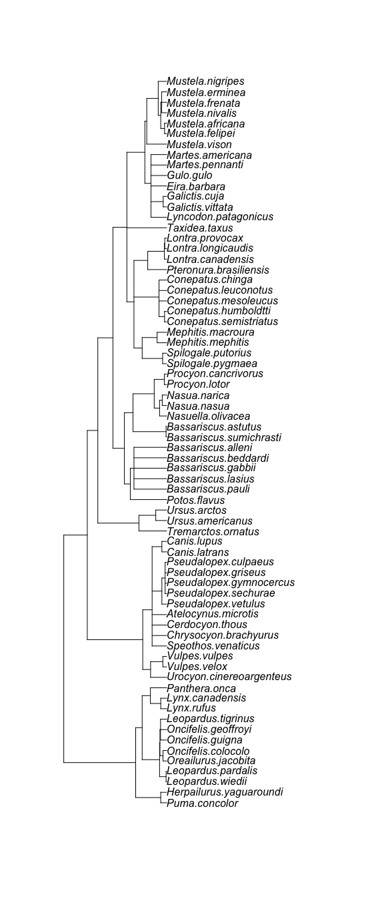
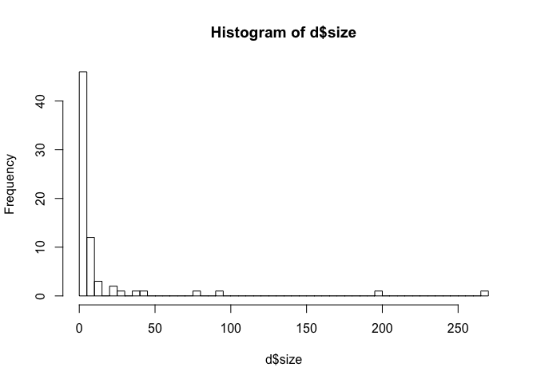
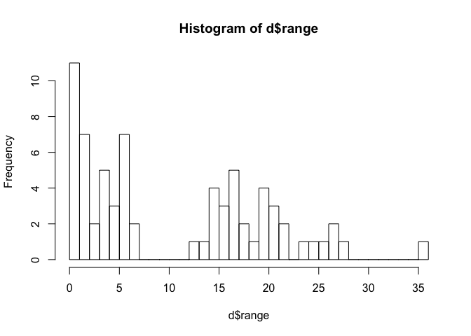
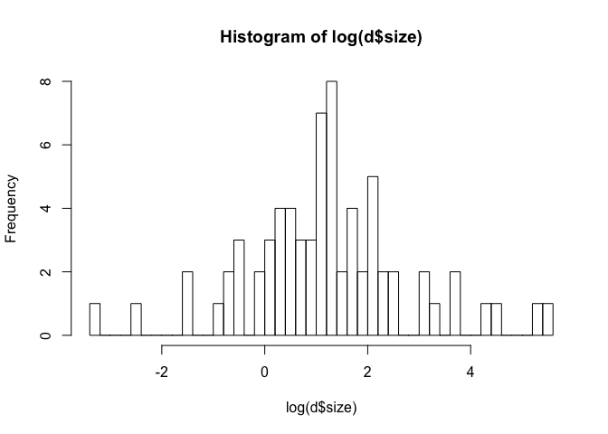
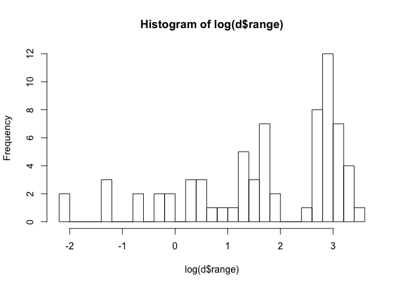
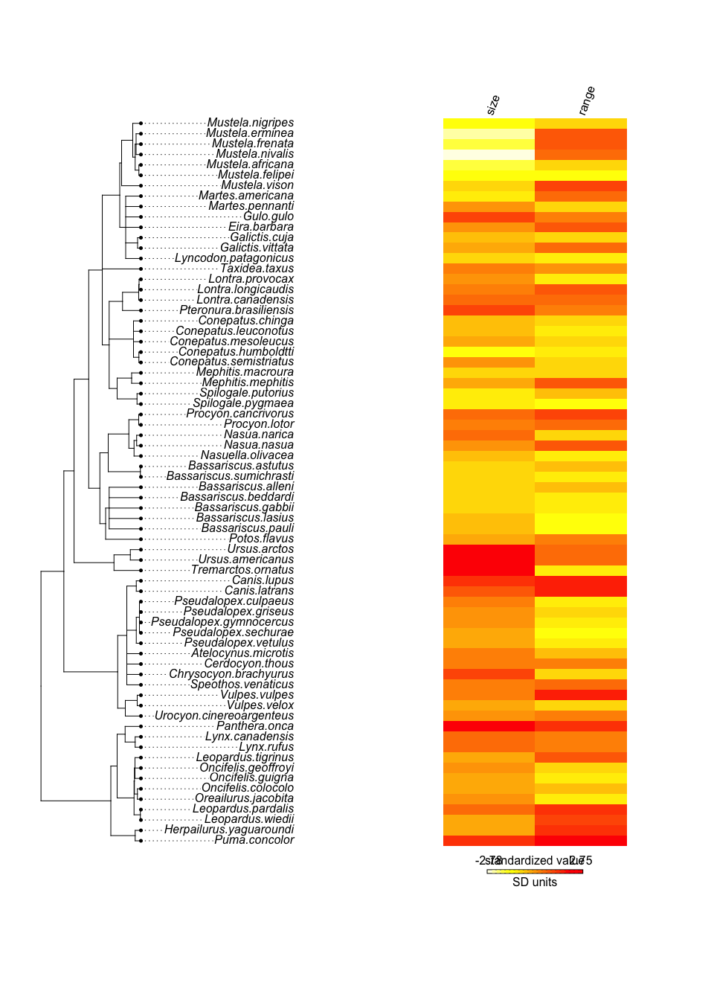
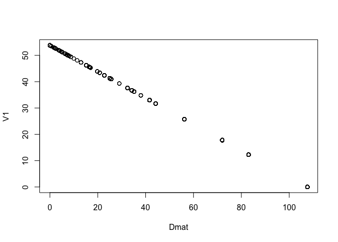
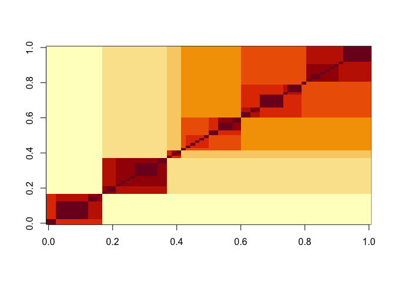

You want to test the hypothesis that the range size of carnivores is influenced by their body size (larger carnivores roam further).  You want to be sure that if you do see a relationship that is is not just due to shared evolutionary history.  That is you want to do a phylogenetic regression.

### 1) Load the data as follows:


```r
library(rethinking)
library(tidyverse)
library(ape)
library(ade4)
library(phytools)

data("carni70")

tre <- read.tree(text=carni70$tre)
length(tre$tip.label)
```

```
## [1] 70
```

```r
d <- carni70$tab
dim(d)
```

```
## [1] 70  2
```

View the tree:


```r
plot(tre)
```

<!-- -->


### 2) Note that the species name given in "rownames(d)" and in "tre$tip.label" do not match.  Fix that (e.g. using str_replace()).


```r
head(rownames(d))
```

```
## [1] "Puma_concolor"           "Herpailurus_yaguaroundi"
## [3] "Leopardus_wiedii"        "Leopardus_pardalis"     
## [5] "Oreailurus_jacobita"     "Oncifelis_colocolo"
```

```r
head(tre$tip.label)
```

```
## [1] "Puma.concolor"           "Herpailurus.yaguaroundi"
## [3] "Leopardus.wiedii"        "Leopardus.pardalis"     
## [5] "Oreailurus.jacobita"     "Oncifelis.colocolo"
```

```r
rownames(d) <- str_replace(rownames(d), "_", ".")
head(rownames(d))
```

```
## [1] "Puma.concolor"           "Herpailurus.yaguaroundi"
## [3] "Leopardus.wiedii"        "Leopardus.pardalis"     
## [5] "Oreailurus.jacobita"     "Oncifelis.colocolo"
```

```r
setdiff(tre$tip.label, rownames(d))
```

```
## character(0)
```

### 3) Should either range or size be transformed?


```r
hist(d$size, breaks = 40)
```

<!-- -->

```r
hist(d$range, breaks = 40)
```

<!-- -->

```r
hist(log(d$size), breaks = 40)
```

<!-- -->

```r
hist(log(d$range), breaks = 40)
```

<!-- -->

Size is very skewed, with way more small values than large values. I'll log transform it to pull in the large values.


### 4) Does size predict range?  Evaluate this question without and with accounting for phylogenetic relationships.

Plot range size and body size next to the tree.


```r
d_plot = d
d_plot$size = log(d_plot$size)
phylo.heatmap(tre, d_plot, standardize=TRUE, length=10)
```

<!-- -->

First without phylogenetic relationships:


```r
# Are data and tree in the same order? Does it matter?
# Oh, this gets dealt with in the next chunk when we make the covariance matrix.

# Species list
spp_obs = rownames(d)

# Prep data for stan
datlist1 = list(N_spp = nrow(d),
              S = standardize(log(d$size)),
              Range = standardize(d$range),
              Imat = diag(nrow(d)))

m1 = ulam(alist(Range ~ multi_normal(mu, SIGMA),
                mu <- a + bS * S,
                matrix[N_spp, N_spp]: SIGMA <- Imat * sigma_sq,
                a ~ normal(0, 1),
                bS ~ normal(0, 0.5),
                sigma_sq ~ exponential(1)),
          data = datlist1, chains = 4, cores = 4)
```

Now with phylogeny and brownian motion:


```r
# Make a distance matrix based on branch lengths
Dmat = cophenetic(tre)

# Prep covariance matrix: Brownian motion
# Rbm = corBrownian(phy = tre)
# V = vcv(Rbm)
# plot(Dmat, V)
# image(V)
# Get message
# No covariate specified, species will be taken as ordered in the data frame. To avoid this message, specify a covariate containing the species names with the 'form' argument.
# Specifying form (done below) makes this message go away
# Output appears the same either way?

# Make covariance matrix
Rbm1 = corBrownian(phy = tre, form = ~tre$tip.label)

# Convert to variance-covariance matrix
V1 = vcv(Rbm1)
plot(Dmat, V1)
```

<!-- -->

```r
image(V1)

datlist1$V1 = V1[spp_obs, spp_obs]

datlist1$R = datlist1$V1/max(V1) 

image(datlist1$R)
```

<!-- -->

```r
m2 = ulam(alist(Range ~ multi_normal(mu, SIGMA),
                mu <- a + bS * S,
                matrix[N_spp, N_spp]: SIGMA <- R * sigma_sq,
                a ~ normal(0, 1),
                bS ~ normal(0, 0.5),
                sigma_sq ~ exponential(1)),
          data = datlist1, chains = 4, cores = 4)
```

Getting C compilation error only when knitting. 

How about with OU process?


```r
# Scale distance matrix
datlist1$Dmat = Dmat[spp_obs, spp_obs]/max(Dmat)

# Run model
m3 = ulam(
  alist(Range ~ multi_normal(mu, SIGMA),
        mu <- a + bS * S,
        matrix[N_spp, N_spp]: SIGMA <- cov_GPL2(Dmat, etasq, rhosq, 0.01),
        a ~ normal(0, 1),
        bS ~ normal(0, 0.5),
        etasq ~ half_normal(1, 0.25),
        rhosq ~ half_normal(3, 0.25)),
        data = datlist1, chains = 4, cores = 4)
```

Compare parameters:


```r
precis(m1)
```

```
##                 mean        sd       5.5%     94.5%    n_eff     Rhat
## a        -0.00806802 0.1148764 -0.1960780 0.1705505 1446.140 1.001725
## bS        0.30193010 0.1095774  0.1238661 0.4792874 1865.506 1.001770
## sigma_sq  0.94039536 0.1693707  0.7075535 1.2363859 1621.683 1.000851
```

```r
precis(m2)
```

```
##                mean        sd       5.5%     94.5%    n_eff      Rhat
## a        0.05199723 0.7965120 -1.1879449 1.3327415 2031.533 0.9989916
## bS       0.38113524 0.1584494  0.1245604 0.6388496 1755.735 1.0026295
## sigma_sq 7.04167890 0.9958860  5.6132043 8.6896601 2009.492 0.9987005
```

```r
precis(m3)
```

```
##              mean         sd       5.5%     94.5%    n_eff      Rhat
## a     -0.02205856 0.66022003 -1.0524249 1.0454270 1946.688 0.9991848
## bS     0.43889786 0.07125185  0.3275597 0.5479276 2322.999 1.0016095
## etasq  3.43209128 0.17900347  3.1420931 3.7147218 2198.410 0.9983673
## rhosq  4.78057372 0.20145276  4.4592150 5.0969230 2315.496 0.9999663
```

### 5) Discuss your findings.

The positive relationship between body size and range size is just as positive, and perhaps moreso, once phylogeny is accounted for. 

