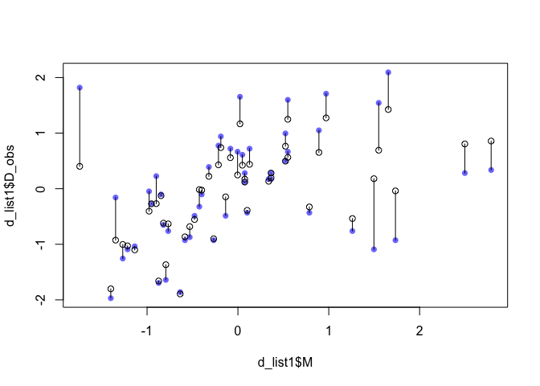

### 15E1


```r
    T ~ dpoisson(lambda),
    log(lambda) <- a + B*log(P_true)
    P_obs ~ dnorm(P_true, SE_P), 
    P_true ~ dnorm(0, 1),
    a ~ dnorm(0, 10), 
    B ~ dnorm(0, 1),
    SE_P ~ dexp(1))

# How to incorporate vector notation, eg.:
    # vector[N]:P_true ~ dnorm(mu, sigma), 
```


### 15E2


```r
    T ~ dpoisson(lambda),
    log(lambda) <- a + B*log(Pi)
    Pi ~ dnorm(v, SE_P)
    a ~ dnorm(0, 10), 
    B ~ dnorm(0, 1),
    v ~ dnorm(0,1),
    SE_P ~ dexp(1))
```

### 15M3
Repeat the divorce data measurement error models, but this time double the standard errors. Can you explain how doubling the standard errors impacts inference?


```r
library(rethinking)
data("WaffleDivorce")
d = WaffleDivorce

ggplot(d, aes(x = MedianAgeMarriage, y = Divorce)) +
  geom_errorbar(aes(x = MedianAgeMarriage, ymin = Divorce-Divorce.SE, ymax = Divorce+Divorce.SE)) +
  geom_point()
```

<!-- -->

First with original SE:


```r
d_list1 = list(
  D_obs = standardize(d$Divorce),
  D_sd = d$Divorce.SE/sd(d$Divorce),
  M = standardize(d$Marriage),
  A  = standardize(d$MedianAgeMarriage),
  N = nrow(d)
)

m1 = ulam(
  alist(
    D_obs ~ dnorm(D_true, D_sd),
    vector[N]:D_true ~ dnorm(mu, sigma), 
    mu <- a + bA*A + bM*M,
    a ~ dnorm(0, 0.2), 
    bA ~ dnorm(0, 0.5),
    bM ~ dnorm(0, 0.5),
    sigma ~ dexp(1)),
    data = d_list1, chains = 4, cores = 4,  iter = 2000)
```

```
## Running /Library/Frameworks/R.framework/Resources/bin/R CMD SHLIB foo.c
## clang -I"/Library/Frameworks/R.framework/Resources/include" -DNDEBUG   -I"/Library/Frameworks/R.framework/Versions/3.6/Resources/library/Rcpp/include/"  -I"/Library/Frameworks/R.framework/Versions/3.6/Resources/library/RcppEigen/include/"  -I"/Library/Frameworks/R.framework/Versions/3.6/Resources/library/RcppEigen/include/unsupported"  -I"/Library/Frameworks/R.framework/Versions/3.6/Resources/library/BH/include" -I"/Library/Frameworks/R.framework/Versions/3.6/Resources/library/StanHeaders/include/src/"  -I"/Library/Frameworks/R.framework/Versions/3.6/Resources/library/StanHeaders/include/"  -I"/Library/Frameworks/R.framework/Versions/3.6/Resources/library/rstan/include" -DEIGEN_NO_DEBUG  -D_REENTRANT  -DBOOST_DISABLE_ASSERTS -DBOOST_PENDING_INTEGER_LOG2_HPP -include stan/math/prim/mat/fun/Eigen.hpp   -isysroot /Library/Developer/CommandLineTools/SDKs/MacOSX.sdk -I/usr/local/include  -fPIC  -Wall -g -O2  -c foo.c -o foo.o
## In file included from <built-in>:1:
## In file included from /Library/Frameworks/R.framework/Versions/3.6/Resources/library/StanHeaders/include/stan/math/prim/mat/fun/Eigen.hpp:13:
## In file included from /Library/Frameworks/R.framework/Versions/3.6/Resources/library/RcppEigen/include/Eigen/Dense:1:
## In file included from /Library/Frameworks/R.framework/Versions/3.6/Resources/library/RcppEigen/include/Eigen/Core:88:
## /Library/Frameworks/R.framework/Versions/3.6/Resources/library/RcppEigen/include/Eigen/src/Core/util/Macros.h:613:1: error: unknown type name 'namespace'
## namespace Eigen {
## ^
## /Library/Frameworks/R.framework/Versions/3.6/Resources/library/RcppEigen/include/Eigen/src/Core/util/Macros.h:613:16: error: expected ';' after top level declarator
## namespace Eigen {
##                ^
##                ;
## In file included from <built-in>:1:
## In file included from /Library/Frameworks/R.framework/Versions/3.6/Resources/library/StanHeaders/include/stan/math/prim/mat/fun/Eigen.hpp:13:
## In file included from /Library/Frameworks/R.framework/Versions/3.6/Resources/library/RcppEigen/include/Eigen/Dense:1:
## /Library/Frameworks/R.framework/Versions/3.6/Resources/library/RcppEigen/include/Eigen/Core:96:10: fatal error: 'complex' file not found
## #include <complex>
##          ^~~~~~~~~
## 3 errors generated.
## make: *** [foo.o] Error 1
```

Now with doubled SE: 


```r
d_list2 = list(
  D_obs = standardize(d$Divorce),
  D_sd = 2*d$Divorce.SE/sd(d$Divorce),
  M = standardize(d$Marriage),
  A  = standardize(d$MedianAgeMarriage),
  N = nrow(d)
)

m2 = ulam(
  alist(
    D_obs ~ dnorm(D_true, D_sd),
    vector[N]:D_true ~ dnorm(mu, sigma), 
    mu <- a + bA*A + bM*M,
    a ~ dnorm(0, 0.2), 
    bA ~ dnorm(0, 0.5),
    bM ~ dnorm(0, 0.5),
    sigma ~ dexp(1)),
    data = d_list2, chains = 4, cores = 4, iter = 2000)
```

```
## Running /Library/Frameworks/R.framework/Resources/bin/R CMD SHLIB foo.c
## clang -I"/Library/Frameworks/R.framework/Resources/include" -DNDEBUG   -I"/Library/Frameworks/R.framework/Versions/3.6/Resources/library/Rcpp/include/"  -I"/Library/Frameworks/R.framework/Versions/3.6/Resources/library/RcppEigen/include/"  -I"/Library/Frameworks/R.framework/Versions/3.6/Resources/library/RcppEigen/include/unsupported"  -I"/Library/Frameworks/R.framework/Versions/3.6/Resources/library/BH/include" -I"/Library/Frameworks/R.framework/Versions/3.6/Resources/library/StanHeaders/include/src/"  -I"/Library/Frameworks/R.framework/Versions/3.6/Resources/library/StanHeaders/include/"  -I"/Library/Frameworks/R.framework/Versions/3.6/Resources/library/rstan/include" -DEIGEN_NO_DEBUG  -D_REENTRANT  -DBOOST_DISABLE_ASSERTS -DBOOST_PENDING_INTEGER_LOG2_HPP -include stan/math/prim/mat/fun/Eigen.hpp   -isysroot /Library/Developer/CommandLineTools/SDKs/MacOSX.sdk -I/usr/local/include  -fPIC  -Wall -g -O2  -c foo.c -o foo.o
## In file included from <built-in>:1:
## In file included from /Library/Frameworks/R.framework/Versions/3.6/Resources/library/StanHeaders/include/stan/math/prim/mat/fun/Eigen.hpp:13:
## In file included from /Library/Frameworks/R.framework/Versions/3.6/Resources/library/RcppEigen/include/Eigen/Dense:1:
## In file included from /Library/Frameworks/R.framework/Versions/3.6/Resources/library/RcppEigen/include/Eigen/Core:88:
## /Library/Frameworks/R.framework/Versions/3.6/Resources/library/RcppEigen/include/Eigen/src/Core/util/Macros.h:613:1: error: unknown type name 'namespace'
## namespace Eigen {
## ^
## /Library/Frameworks/R.framework/Versions/3.6/Resources/library/RcppEigen/include/Eigen/src/Core/util/Macros.h:613:16: error: expected ';' after top level declarator
## namespace Eigen {
##                ^
##                ;
## In file included from <built-in>:1:
## In file included from /Library/Frameworks/R.framework/Versions/3.6/Resources/library/StanHeaders/include/stan/math/prim/mat/fun/Eigen.hpp:13:
## In file included from /Library/Frameworks/R.framework/Versions/3.6/Resources/library/RcppEigen/include/Eigen/Dense:1:
## /Library/Frameworks/R.framework/Versions/3.6/Resources/library/RcppEigen/include/Eigen/Core:96:10: fatal error: 'complex' file not found
## #include <complex>
##          ^~~~~~~~~
## 3 errors generated.
## make: *** [foo.o] Error 1
```

```
## Warning: There were 881 divergent transitions after warmup. Increasing adapt_delta above 0.95 may help. See
## http://mc-stan.org/misc/warnings.html#divergent-transitions-after-warmup
```

```
## Warning: There were 4 chains where the estimated Bayesian Fraction of Missing Information was low. See
## http://mc-stan.org/misc/warnings.html#bfmi-low
```

```
## Warning: Examine the pairs() plot to diagnose sampling problems
```

```
## Warning: The largest R-hat is 1.43, indicating chains have not mixed.
## Running the chains for more iterations may help. See
## http://mc-stan.org/misc/warnings.html#r-hat
```

```
## Warning: Bulk Effective Samples Size (ESS) is too low, indicating posterior means and medians may be unreliable.
## Running the chains for more iterations may help. See
## http://mc-stan.org/misc/warnings.html#bulk-ess
```

```
## Warning: Tail Effective Samples Size (ESS) is too low, indicating posterior variances and tail quantiles may be unreliable.
## Running the chains for more iterations may help. See
## http://mc-stan.org/misc/warnings.html#tail-ess
```

Look at output:


```r
precis(m1)
```

```
##              mean         sd       5.5%      94.5%    n_eff      Rhat
## a     -0.05277024 0.09800792 -0.2079532  0.1047464 3400.763 0.9998804
## bA    -0.61341962 0.16048048 -0.8652629 -0.3519520 2309.528 1.0024884
## bM     0.05391673 0.16619002 -0.2112609  0.3158787 1864.899 1.0018482
## sigma  0.58302250 0.10580270  0.4216937  0.7588580 1343.912 1.0044646
```

```r
precis(m2)
```

```
##              mean         sd        5.5%       94.5%     n_eff     Rhat
## a     -0.08614464 0.09645643 -0.25895728  0.04058225  23.36829 1.092875
## bA    -0.69250882 0.15770524 -0.90611712 -0.41518501  50.62503 1.065810
## bM     0.16174753 0.17080992 -0.11746271  0.44561877 340.81853 1.012227
## sigma  0.14923465 0.10780984  0.03744615  0.35617833   9.12614 1.217875
```

Most parameter estimates aren't super different. 

Why is sigma smaller when SE is doubled? Is it because there is more uncertainty for each individual state, so each can shrink further towards the mean? 

Plot to try to understand:


```r
post1 = extract.samples(m1)
D_est1 = apply(post1$D_true, 2, mean)

plot(d_list1$M, d_list1$D_obs, pch = 16, col = rangi2)
points(d_list1$M, D_est1)
for (i in 1:nrow(d))
  lines(c(d_list1$M[i], d_list1$M[i]), c(d_list1$D_obs[i], D_est1[i]))
```

<!-- -->

```r
post2 = extract.samples(m2)
D_est2 = apply(post2$D_true, 2, mean)

plot(d_list2$M, d_list2$D_obs, pch = 16, col = rangi2)
points(d_list2$M, D_est2)
for (i in 1:nrow(d))
  lines(c(d_list2$M[i], d_list2$M[i]), c(d_list2$D_obs[i], D_est2[i]))
```

<!-- -->

Seems like that might be the case.


### 15H1

The data in data(elephants) are counts of matings observed for bull elephants of differing ages. There is a strong positive relationship between age and matings. However, age is not always assessed accurately. First, fit a Poisson model predicting MATINGS with AGE as a predictor. Second, assume that the observed AGE values are uncertain and have a standard error of ±5 years. Re-estimate the relationship between MATINGS and AGE, incorporating this measurement error. Compare the inferences of the two models.

Load data:


```r
data(elephants)

d3 = list(
  age = elephants$AGE,
  matings = elephants$MATINGS
)
```

Fit simple model:


```r
m3 = ulam(
  alist(
    matings ~ dpois(lambda),
    log(lambda) <- a + B*age,
    a ~ dnorm(0, 10), 
    B ~ dnorm(0, 1)), data = d3, chains = 4, cores = 4
)
```

```
## Running /Library/Frameworks/R.framework/Resources/bin/R CMD SHLIB foo.c
## clang -I"/Library/Frameworks/R.framework/Resources/include" -DNDEBUG   -I"/Library/Frameworks/R.framework/Versions/3.6/Resources/library/Rcpp/include/"  -I"/Library/Frameworks/R.framework/Versions/3.6/Resources/library/RcppEigen/include/"  -I"/Library/Frameworks/R.framework/Versions/3.6/Resources/library/RcppEigen/include/unsupported"  -I"/Library/Frameworks/R.framework/Versions/3.6/Resources/library/BH/include" -I"/Library/Frameworks/R.framework/Versions/3.6/Resources/library/StanHeaders/include/src/"  -I"/Library/Frameworks/R.framework/Versions/3.6/Resources/library/StanHeaders/include/"  -I"/Library/Frameworks/R.framework/Versions/3.6/Resources/library/rstan/include" -DEIGEN_NO_DEBUG  -D_REENTRANT  -DBOOST_DISABLE_ASSERTS -DBOOST_PENDING_INTEGER_LOG2_HPP -include stan/math/prim/mat/fun/Eigen.hpp   -isysroot /Library/Developer/CommandLineTools/SDKs/MacOSX.sdk -I/usr/local/include  -fPIC  -Wall -g -O2  -c foo.c -o foo.o
## In file included from <built-in>:1:
## In file included from /Library/Frameworks/R.framework/Versions/3.6/Resources/library/StanHeaders/include/stan/math/prim/mat/fun/Eigen.hpp:13:
## In file included from /Library/Frameworks/R.framework/Versions/3.6/Resources/library/RcppEigen/include/Eigen/Dense:1:
## In file included from /Library/Frameworks/R.framework/Versions/3.6/Resources/library/RcppEigen/include/Eigen/Core:88:
## /Library/Frameworks/R.framework/Versions/3.6/Resources/library/RcppEigen/include/Eigen/src/Core/util/Macros.h:613:1: error: unknown type name 'namespace'
## namespace Eigen {
## ^
## /Library/Frameworks/R.framework/Versions/3.6/Resources/library/RcppEigen/include/Eigen/src/Core/util/Macros.h:613:16: error: expected ';' after top level declarator
## namespace Eigen {
##                ^
##                ;
## In file included from <built-in>:1:
## In file included from /Library/Frameworks/R.framework/Versions/3.6/Resources/library/StanHeaders/include/stan/math/prim/mat/fun/Eigen.hpp:13:
## In file included from /Library/Frameworks/R.framework/Versions/3.6/Resources/library/RcppEigen/include/Eigen/Dense:1:
## /Library/Frameworks/R.framework/Versions/3.6/Resources/library/RcppEigen/include/Eigen/Core:96:10: fatal error: 'complex' file not found
## #include <complex>
##          ^~~~~~~~~
## 3 errors generated.
## make: *** [foo.o] Error 1
```

```
## Warning: Bulk Effective Samples Size (ESS) is too low, indicating posterior means and medians may be unreliable.
## Running the chains for more iterations may help. See
## http://mc-stan.org/misc/warnings.html#bulk-ess
```

```
## Warning: Tail Effective Samples Size (ESS) is too low, indicating posterior variances and tail quantiles may be unreliable.
## Running the chains for more iterations may help. See
## http://mc-stan.org/misc/warnings.html#tail-ess
```

```r
precis(m3)
```

```
##          mean        sd        5.5%       94.5%    n_eff     Rhat
## a -1.57195541 0.5105879 -2.36681021 -0.73791922 249.6607 1.017271
## B  0.06831497 0.0128711  0.04719147  0.08861119 271.7435 1.016803
```

Now fit model with SE of age.


```r
d3$N = nrow(elephants)

m4 = ulam(
  alist(
    matings ~ dpois(lambda),
    log(lambda) <- a + B*age_est,
    age_est ~ dnorm(age, 5),
    # But 5 is SE, need to change to sd
    vector[N]:age ~ dnorm(0, 1),
    a ~ dnorm(0, 10), 
    B ~ dnorm(0, 1)), data = d3, chains = 4, cores = 4
)
```

```
## Running /Library/Frameworks/R.framework/Resources/bin/R CMD SHLIB foo.c
## clang -I"/Library/Frameworks/R.framework/Resources/include" -DNDEBUG   -I"/Library/Frameworks/R.framework/Versions/3.6/Resources/library/Rcpp/include/"  -I"/Library/Frameworks/R.framework/Versions/3.6/Resources/library/RcppEigen/include/"  -I"/Library/Frameworks/R.framework/Versions/3.6/Resources/library/RcppEigen/include/unsupported"  -I"/Library/Frameworks/R.framework/Versions/3.6/Resources/library/BH/include" -I"/Library/Frameworks/R.framework/Versions/3.6/Resources/library/StanHeaders/include/src/"  -I"/Library/Frameworks/R.framework/Versions/3.6/Resources/library/StanHeaders/include/"  -I"/Library/Frameworks/R.framework/Versions/3.6/Resources/library/rstan/include" -DEIGEN_NO_DEBUG  -D_REENTRANT  -DBOOST_DISABLE_ASSERTS -DBOOST_PENDING_INTEGER_LOG2_HPP -include stan/math/prim/mat/fun/Eigen.hpp   -isysroot /Library/Developer/CommandLineTools/SDKs/MacOSX.sdk -I/usr/local/include  -fPIC  -Wall -g -O2  -c foo.c -o foo.o
## In file included from <built-in>:1:
## In file included from /Library/Frameworks/R.framework/Versions/3.6/Resources/library/StanHeaders/include/stan/math/prim/mat/fun/Eigen.hpp:13:
## In file included from /Library/Frameworks/R.framework/Versions/3.6/Resources/library/RcppEigen/include/Eigen/Dense:1:
## In file included from /Library/Frameworks/R.framework/Versions/3.6/Resources/library/RcppEigen/include/Eigen/Core:88:
## /Library/Frameworks/R.framework/Versions/3.6/Resources/library/RcppEigen/include/Eigen/src/Core/util/Macros.h:613:1: error: unknown type name 'namespace'
## namespace Eigen {
## ^
## /Library/Frameworks/R.framework/Versions/3.6/Resources/library/RcppEigen/include/Eigen/src/Core/util/Macros.h:613:16: error: expected ';' after top level declarator
## namespace Eigen {
##                ^
##                ;
## In file included from <built-in>:1:
## In file included from /Library/Frameworks/R.framework/Versions/3.6/Resources/library/StanHeaders/include/stan/math/prim/mat/fun/Eigen.hpp:13:
## In file included from /Library/Frameworks/R.framework/Versions/3.6/Resources/library/RcppEigen/include/Eigen/Dense:1:
## /Library/Frameworks/R.framework/Versions/3.6/Resources/library/RcppEigen/include/Eigen/Core:96:10: fatal error: 'complex' file not found
## #include <complex>
##          ^~~~~~~~~
## 3 errors generated.
## make: *** [foo.o] Error 1
```

```
## Warning: There were 136 transitions after warmup that exceeded the maximum treedepth. Increase max_treedepth above 10. See
## http://mc-stan.org/misc/warnings.html#maximum-treedepth-exceeded
```

```
## Warning: Examine the pairs() plot to diagnose sampling problems
```

```r
precis(m4)
```

```
##                mean        sd        5.5%      94.5%    n_eff      Rhat
## age_est 35.82442085 0.8160008  34.4580141 37.1228917 651.7491 0.9983888
## a       -0.45075254 9.9117089 -16.3553364 15.3350638 491.1673 1.0073260
## B        0.03948458 0.2771232  -0.4006105  0.4756612 491.6584 1.0073452
```


### 15H2 

Repeat the model fitting problem above, now increasing the assumed standard error on AGE. How large does the standard error have to get before the posterior mean for the coefficient on AGE reaches zero?

It seems like it already is pretty close. Maybe I set up the above model wrong.


### From book


```r
library(rethinking)
data("WaffleDivorce")
d = WaffleDivorce

ggplot(d, aes(x = MedianAgeMarriage, y = Divorce)) +
  geom_errorbar(aes(x = MedianAgeMarriage, ymin = Divorce-Divorce.SE, ymax = Divorce+Divorce.SE)) +
  geom_point()

d_list = list(
  D_obs = standardize(d$Divorce),
  D_sd = d$Divorce.SE/sd(d$Divorce),
  M = standardize(d$Marriage),
  A  = standardize(d$MedianAgeMarriage),
  N = nrow(d)
)

m15.1 = ulam(
  alist(
    D_obs ~ dnorm(D_true, D_sd),
    vector[N]:D_true ~ dnorm(mu, sigma), 
    mu <- a + bA*A + bM*M,
    a ~ dnorm(0, 0.2), 
    bA ~ dnorm(0, 0.5),
    bM ~ dnorm(0, 0.5),
    sigma ~ dexp(1)),
    data = d_list, chains = 4, cores = 4)
precis(m15.1)


d_list = list(
  D_obs = standardize(d$Divorce),
  D_sd = d$Divorce.SE/sd(d$Divorce),
  M_obs = standardize(d$Marriage),
  M_sd = d$Marriage.SE/sd(d$Marriage),
  A  = standardize(d$MedianAgeMarriage),
  N = nrow(d)
)

m15.2 = ulam(
  alist(
    D_obs ~ dnorm(D_est, D_sd),
    vector[N]:D_est ~ dnorm(mu, sigma), 
    mu <- a + bA*A + bM*M_est[i],
    M_obs ~ dnorm(M_est, M_sd),
    vector[N]:M_est ~ dnorm(0, 1),
    a ~ dnorm(0, 0.2), 
    bA ~ dnorm(0, 0.5),
    bM ~ dnorm(0, 0.5),
    sigma ~ dexp(1)),
    data = d_list, chains = 4, cores = 4)
# precis(m15.2, depth = 2)

post = extract.samples(m15.2)
D_est = apply(post$D_est, 2, mean)
M_est = apply(post$M_est, 2, mean)

plot(d_list$M_obs, d_list$D_obs, pch = 16, col = rangi2)
points(M_est, D_est)
for (i in 1:nrow(d)) 
  lines(c(d_list$M_obs[i], M_est[i]), c(d_list$D_obs[i], D_est[i]))
```

