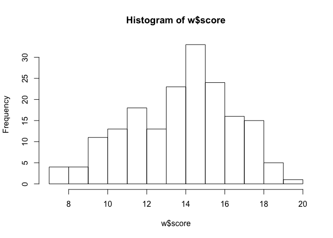
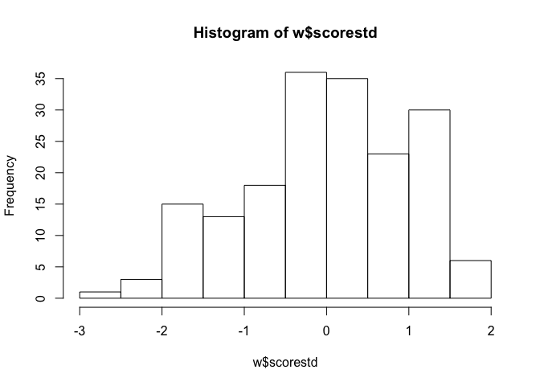
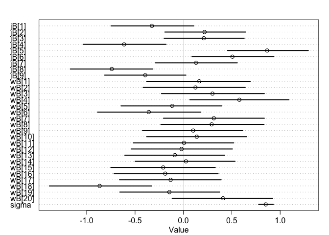
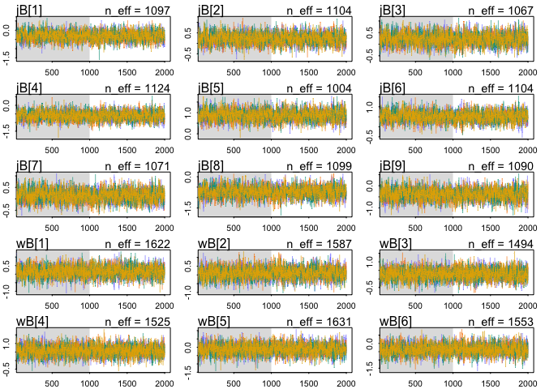
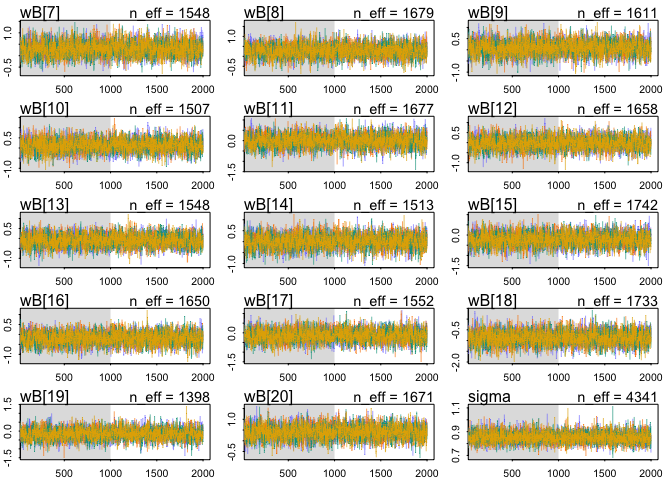
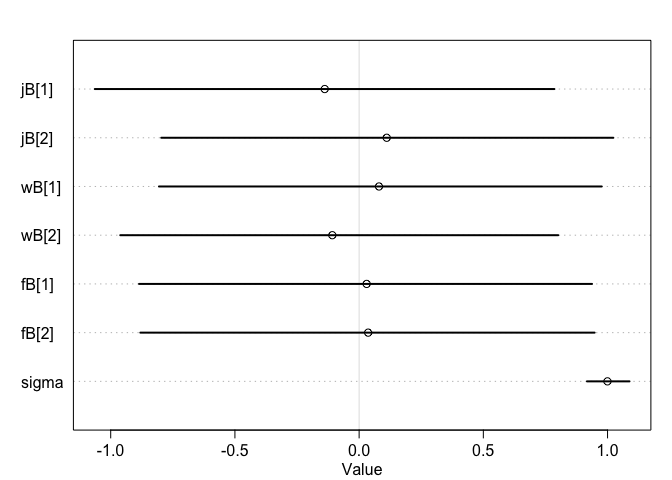
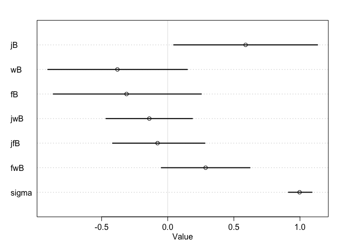
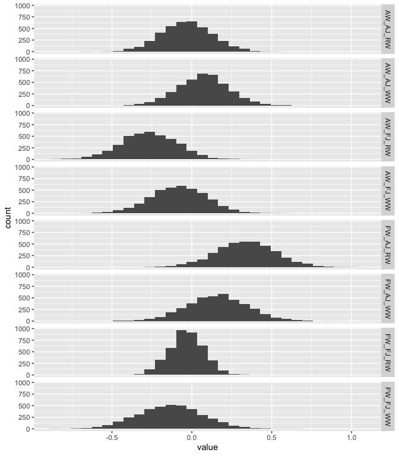

## Q1. 
Consider the data Wines2012. These data are expert ratings of 20 different French and American wines by 9 different French and American judges. Your goal is to model score, the subjective rating assigned by each judge to each wine. I recommend standardizing it.
In this first problem, consider only variation among judges and wines. Construct index variables of judge and wine and then use these index variables to construct a linear regression model. Justify your priors. You should end up with 9 judge parameters and 20 wine parameters. Use ulam instead of quap to build this model, and be sure to check the chains for convergence. If you’d rather build the model directly in Stan or PyMC3, go ahead. I just want you to use Hamiltonian Monte Carlo instead of quadratic approximation.
How do you interpret the variation among individual judges and individual wines? Do you notice any patterns, just by plotting the differences? Which judges gave the highest/lowest ratings? Which wines were rated worst/best on average?

First, explore the data:


```r
data("Wines2012")
w = Wines2012

names(w)
```

```
## [1] "judge"      "flight"     "wine"       "score"      "wine.amer" 
## [6] "judge.amer"
```

```r
table(w$judge, w$wine)
```

```
##                  
##                   A1 A2 B1 B2 C1 C2 D1 D2 E1 E2 F1 F2 G1 G2 H1 H2 I1 I2 J1
##   Daniele Meulder  1  1  1  1  1  1  1  1  1  1  1  1  1  1  1  1  1  1  1
##   Francis Schott   1  1  1  1  1  1  1  1  1  1  1  1  1  1  1  1  1  1  1
##   Jamal Rayyis     1  1  1  1  1  1  1  1  1  1  1  1  1  1  1  1  1  1  1
##   Jean-M Cardebat  1  1  1  1  1  1  1  1  1  1  1  1  1  1  1  1  1  1  1
##   John Foy         1  1  1  1  1  1  1  1  1  1  1  1  1  1  1  1  1  1  1
##   Linda Murphy     1  1  1  1  1  1  1  1  1  1  1  1  1  1  1  1  1  1  1
##   Olivier Gergaud  1  1  1  1  1  1  1  1  1  1  1  1  1  1  1  1  1  1  1
##   Robert Hodgson   1  1  1  1  1  1  1  1  1  1  1  1  1  1  1  1  1  1  1
##   Tyler Colman     1  1  1  1  1  1  1  1  1  1  1  1  1  1  1  1  1  1  1
##                  
##                   J2
##   Daniele Meulder  1
##   Francis Schott   1
##   Jamal Rayyis     1
##   Jean-M Cardebat  1
##   John Foy         1
##   Linda Murphy     1
##   Olivier Gergaud  1
##   Robert Hodgson   1
##   Tyler Colman     1
```

```r
table(w$flight)
```

```
## 
##   red white 
##    90    90
```

```r
table(w$wine.amer)
```

```
## 
##   0   1 
##  72 108
```

```r
table(w$judge.amer)
```

```
## 
##   0   1 
##  80 100
```

```r
hist(w$score)
```

<!-- -->

```r
# Standardize score 
w$scorestd = (w$score - mean(w$score))/sd(w$score)
hist(w$scorestd)
```

<!-- -->

```r
# Make indices
w$judgeind = as.integer(w$judge)
w$wineind = as.integer(w$wine)

# Check that they worked out as expected
table(w$judge, w$judgeind)
```

```
##                  
##                    1  2  3  4  5  6  7  8  9
##   Daniele Meulder 20  0  0  0  0  0  0  0  0
##   Francis Schott   0 20  0  0  0  0  0  0  0
##   Jamal Rayyis     0  0 20  0  0  0  0  0  0
##   Jean-M Cardebat  0  0  0 20  0  0  0  0  0
##   John Foy         0  0  0  0 20  0  0  0  0
##   Linda Murphy     0  0  0  0  0 20  0  0  0
##   Olivier Gergaud  0  0  0  0  0  0 20  0  0
##   Robert Hodgson   0  0  0  0  0  0  0 20  0
##   Tyler Colman     0  0  0  0  0  0  0  0 20
```

```r
table(w$wine, w$wineind)
```

```
##     
##      1 2 3 4 5 6 7 8 9 10 11 12 13 14 15 16 17 18 19 20
##   A1 9 0 0 0 0 0 0 0 0  0  0  0  0  0  0  0  0  0  0  0
##   A2 0 9 0 0 0 0 0 0 0  0  0  0  0  0  0  0  0  0  0  0
##   B1 0 0 9 0 0 0 0 0 0  0  0  0  0  0  0  0  0  0  0  0
##   B2 0 0 0 9 0 0 0 0 0  0  0  0  0  0  0  0  0  0  0  0
##   C1 0 0 0 0 9 0 0 0 0  0  0  0  0  0  0  0  0  0  0  0
##   C2 0 0 0 0 0 9 0 0 0  0  0  0  0  0  0  0  0  0  0  0
##   D1 0 0 0 0 0 0 9 0 0  0  0  0  0  0  0  0  0  0  0  0
##   D2 0 0 0 0 0 0 0 9 0  0  0  0  0  0  0  0  0  0  0  0
##   E1 0 0 0 0 0 0 0 0 9  0  0  0  0  0  0  0  0  0  0  0
##   E2 0 0 0 0 0 0 0 0 0  9  0  0  0  0  0  0  0  0  0  0
##   F1 0 0 0 0 0 0 0 0 0  0  9  0  0  0  0  0  0  0  0  0
##   F2 0 0 0 0 0 0 0 0 0  0  0  9  0  0  0  0  0  0  0  0
##   G1 0 0 0 0 0 0 0 0 0  0  0  0  9  0  0  0  0  0  0  0
##   G2 0 0 0 0 0 0 0 0 0  0  0  0  0  9  0  0  0  0  0  0
##   H1 0 0 0 0 0 0 0 0 0  0  0  0  0  0  9  0  0  0  0  0
##   H2 0 0 0 0 0 0 0 0 0  0  0  0  0  0  0  9  0  0  0  0
##   I1 0 0 0 0 0 0 0 0 0  0  0  0  0  0  0  0  9  0  0  0
##   I2 0 0 0 0 0 0 0 0 0  0  0  0  0  0  0  0  0  9  0  0
##   J1 0 0 0 0 0 0 0 0 0  0  0  0  0  0  0  0  0  0  9  0
##   J2 0 0 0 0 0 0 0 0 0  0  0  0  0  0  0  0  0  0  0  9
```

```r
wslim = w %>% select(scorestd, judgeind, wineind)
```

Now fit a model:


```r
mod1 = ulam(alist(
  scorestd ~ dnorm(mu, sigma),
            mu <- jB[judgeind] + wB[wineind],
            jB[judgeind] ~ dnorm(0, 1),
            wB[wineind] ~ dnorm(0, 1),
            sigma ~ dexp(1)),
            data = wslim,
            chains = 4, cores = 2, iter = 2e3
            )
```

Look at the results:


```r
precis(mod1, depth = 2)
```

```
##                mean         sd        5.5%       94.5%    n_eff      Rhat
## jB[1]  -0.325547031 0.26629532 -0.74853903  0.10798957 1097.238 1.0018408
## jB[2]   0.218659587 0.26196557 -0.19229203  0.64289618 1103.952 1.0007157
## jB[3]   0.210805486 0.26153960 -0.19956629  0.62815832 1066.567 1.0012683
## jB[4]  -0.613034558 0.26980464 -1.03687428 -0.17981704 1123.655 1.0002902
## jB[5]   0.865688883 0.26087828  0.45627022  1.29088015 1003.658 1.0024049
## jB[6]   0.506463966 0.26652639  0.08885745  0.93420815 1104.386 1.0011753
## jB[7]   0.130703043 0.26411441 -0.28945071  0.55707776 1070.535 1.0005112
## jB[8]  -0.739798440 0.26579634 -1.16934087 -0.31604385 1099.158 1.0016003
## jB[9]  -0.395299079 0.26559052 -0.81475306  0.02586677 1090.487 1.0021243
## wB[1]   0.164019130 0.33014406 -0.37950551  0.69035276 1622.383 1.0013372
## wB[2]   0.124421518 0.33042330 -0.41578169  0.63839263 1587.058 1.0003439
## wB[3]   0.300394710 0.33393115 -0.22701500  0.83638334 1493.863 1.0015883
## wB[4]   0.578305232 0.31980965  0.06671392  1.09045197 1525.280 1.0007158
## wB[5]  -0.116675989 0.32580729 -0.64569320  0.39818379 1631.113 1.0005437
## wB[6]  -0.358178369 0.33499322 -0.88798295  0.17925174 1552.712 1.0012868
## wB[7]   0.314423682 0.33037439 -0.20597824  0.83638044 1548.376 1.0013212
## wB[8]   0.291973629 0.33247970 -0.23333524  0.83337144 1679.144 1.0009372
## wB[9]   0.101161085 0.32659925 -0.42249270  0.61347193 1610.930 1.0004950
## wB[10]  0.137757609 0.32322992 -0.38017541  0.65407830 1506.535 1.0008914
## wB[11]  0.005834139 0.32620209 -0.51724796  0.51965175 1676.771 1.0006205
## wB[12] -0.018874496 0.32386687 -0.54028994  0.50638656 1658.094 1.0007408
## wB[13] -0.089187556 0.32357381 -0.60643205  0.42737174 1548.137 1.0015359
## wB[14]  0.026115647 0.32108187 -0.49882807  0.53336715 1513.365 1.0008906
## wB[15] -0.209045814 0.33388534 -0.75060239  0.32921697 1742.419 1.0008504
## wB[16] -0.187772127 0.33481406 -0.71669058  0.35834302 1650.479 1.0003314
## wB[17] -0.132009460 0.33223556 -0.66143251  0.39042503 1552.231 1.0006609
## wB[18] -0.865812383 0.32994072 -1.38599923 -0.32836475 1733.252 0.9998263
## wB[19] -0.145548970 0.32888119 -0.65773216  0.37477076 1397.893 1.0010028
## wB[20]  0.410679990 0.32382105 -0.11692654  0.92280099 1671.167 1.0001087
## sigma   0.850590808 0.04790222  0.77790978  0.92851572 4341.284 1.0005116
```

```r
plot(precis(mod1, depth = 2))
```

<!-- -->

From this, we can see that some judges tend to rate wines more highly, and some wines are, on average, less liked than average, and some are more liked. Judges 4 and 8 tend to rate wines lower, and judges 5 and 6 tend to rate wines higher. Wines 6 and 18 were disliked, and wines 20 and 4 were liked a lot.


```r
traceplot(mod1)
```

```
## Waiting to draw page 2 of 2
```

<!-- --><!-- -->

The traceplots and the Rhats look ok.

## Q2. 

Now consider three features of the wines and judges:
(1) flight: Whether the wine is red or white.
(2) wine.amer: Indicator variable for American wines. 
(3) judge.amer: Indicator variable for American judges.
Use indicator or index variables to model the influence of these features on the scores. Omit the individual judge and wine index variables from Problem 1. Do not include interaction effects yet. Again use ulam, justify your priors, and be sure to check the chains. What do you conclude about the differences among the wines and judges? Try to relate the results to the inferences in Problem 1.


```r
wslim2 = w %>% select(scorestd, wineamer = wine.amer, judgeamer = judge.amer, flight) %>% 
  mutate(wineamer = wineamer + 1, judgeamer = judgeamer + 1, flight = as.integer(flight))

mod2  = ulam(alist(
  scorestd ~ dnorm(mu, sigma),
            mu <- jB[judgeamer] + wB[wineamer] + fB[flight],
            jB[judgeamer] ~ dnorm(0, 1),
            wB[wineamer] ~ dnorm(0, 1),
            fB[flight] ~ dnorm(0, 1),
            sigma ~ dexp(1)),
            data = wslim2,
            chains = 4, cores = 2, iter = 2e3
            )
```

Look at the results:


```r
precis(mod2, depth = 2)
```

```
##              mean         sd       5.5%     94.5%    n_eff     Rhat
## jB[1] -0.13851108 0.58224582 -1.0640784 0.7860431 1572.940 1.003439
## jB[2]  0.11106303 0.58025754 -0.7964494 1.0233303 1526.673 1.004172
## wB[1]  0.08000704 0.56671870 -0.8057080 0.9765217 1661.299 1.004673
## wB[2] -0.10791340 0.56401750 -0.9615070 0.8014191 1700.705 1.003796
## fB[1]  0.03023731 0.57366288 -0.8858765 0.9375410 1700.035 1.001684
## fB[2]  0.03636713 0.57361656 -0.8806677 0.9479641 1718.870 1.001822
## sigma  0.99959697 0.05376087  0.9172071 1.0883531 2174.641 1.001922
```

```r
plot(precis(mod2, depth = 2))
```

<!-- -->

There aren't strong effects of wine origin or judge origin. French judges (category 1) tended to rate wines lower, and American wines (category 2) tended to be rated lower, but there is a ton of varation around these estimates. Red and white wines were equally favored.


## Q3. 
Now consider two-way interactions among the three features. You should end up with three different interaction terms in your model. These will be easier to build, if you use indicator variables. Again use ulam, justify your priors, and be sure to check the chains. Explain what each interaction means. Be sure to interpret the model’s predictions on the outcome scale (mu, the expected score), not on the scale of individual parameters. You can use link to help with this, or just use your knowledge of the linear model instead.
What do you conclude about the features and the scores? Can you relate the results of your model(s) to the individual judge and wine inferences from Problem 1?


```r
mod3  = ulam(alist(
  scorestd ~ dnorm(mu, sigma),
            mu <- jB*judgeamer + wB*wineamer + fB*flight +
                  jwB*judgeamer*wineamer + jfB*judgeamer*flight + fwB*wineamer*flight,
            jB ~ dnorm(0, 1),
            wB ~ dnorm(0, 1),
            fB ~ dnorm(0, 1),
            jwB ~ dnorm(0, 0.5),
            jfB ~ dnorm(0, 0.5),
            fwB ~ dnorm(0, 0.5),
            sigma ~ dexp(1)),
            data = wslim2,
            chains = 4, cores = 2, iter = 2e3
            )
```


```r
precis(mod3)
```

```
##             mean         sd        5.5%     94.5%    n_eff     Rhat
## jB     0.5887030 0.34204909  0.04500315 1.1326965 1468.343 1.001319
## wB    -0.3807981 0.33265578 -0.90689670 0.1481016 1429.278 1.002781
## fB    -0.3116105 0.35258646 -0.86576315 0.2537168 1514.451 1.002277
## jwB   -0.1394179 0.20553556 -0.46710020 0.1868029 1590.796 1.002948
## jfB   -0.0771625 0.21524293 -0.41713947 0.2809449 1361.360 1.002329
## fwB    0.2862837 0.20880505 -0.04859178 0.6215731 1534.921 1.001895
## sigma  0.9968261 0.05487915  0.91268070 1.0905744 2522.041 1.000155
```

```r
plot(precis(mod3))
```

<!-- -->

All of the interactions still overlap with 0, but some trend positive or negative. Now generate predictions for different combinations of wine, judge, and flight to make these effects more interpretable. 


```r
predictions = data.frame(wineamer = c(1,1,1,1,2,2,2,2),
                         judgeamer = c(2,2,1,1,2,2,1,1),
                         flight = c(2,1,2,1,2,1,2,1))

means = data.frame(link(mod3, predictions)) %>% 
  rename(FW_AJ_WW = X1, FW_AJ_RW = X2, FW_FJ_WW = X3, FW_FJ_RW = X4, AW_AJ_WW = X5, AW_AJ_RW = X6, AW_FJ_WW = X7, AW_FJ_RW = X8) %>% 
  gather()
```


```r
ggplot(means, aes(x = value)) +
  geom_histogram() +
  facet_grid(key ~ .)
```

```
## `stat_bin()` using `bins = 30`. Pick better value with `binwidth`.
```

<!-- -->


