## 10E4
Why do Poisson regressions sometimes require the use of an offset? Provide an example.

An offset accounts for difference in the time or space during which an event might have occurred (i.e., the amount of time or space over which a rate could be estimated). Offsets could be used, for example, to account for different observation window lengths if you were counting pollinator visits. 


## 10M2

If a coefficient in a Poisson regression has value 1.7, what does this imply about the change in the outcome?

This means that for one unit of change in the predictor, there is a exp(1.7*x) change in the lambda of the Poisson distribution.

## 10M3

Explain why the log link is appropriate for a Poisson generalized linear model.

Responses in a Poisson GLM are positive - the underlying data is typically a count. The log transforms a linear predictor, which could be positive or negative, to a positive scale, because negative values on the linear scale will be between 0 and 1 on the log scale.

## 10M4

What would it imply to use a logit link for the mean of a Poisson generalized linear model? Can you think of a real research problem for which this would make sense?


##10H4

The data contained in data(salamanders) are counts of salamanders (Plethodonelongatus) from 47 different 49-m2 plots in northern California. The column SALAMAN is the count in each plot, and the columns PCTCOVER and FORESTAGE are percent of ground cover and age of trees in the plot, respectively. You will model SALAMAN as a Poisson variable.

(a) Model the relationship between density and percent cover, using a log-link (same as the example in the book and lecture). Use weakly informative priors of your choosing. Check the quadratic approximation again, by comparing quap to ulam. Then plot the expected counts and their 89% interval against percent cover. In which ways does the model do a good job? In which ways does it do a bad job?


```r
data(salamanders)

# Explore the data

pairs(salamanders[,2:4])
```

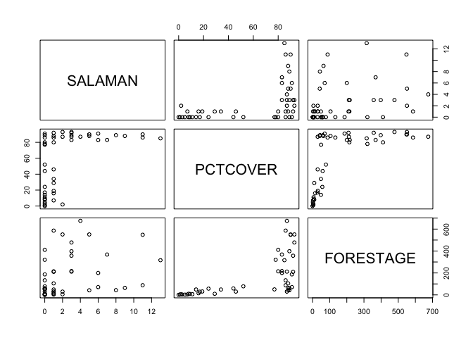<!-- -->

```r
# Percent cover and forest age are kind of related; only very young forests have low percent cover.

# Drop first column for a slim dataframe
sal_slim = data.frame(sal = salamanders$SALAMAN, pct = scale(salamanders$PCTCOVER), age = scale(salamanders$FORESTAGE))

hist(sal_slim$pct)
```

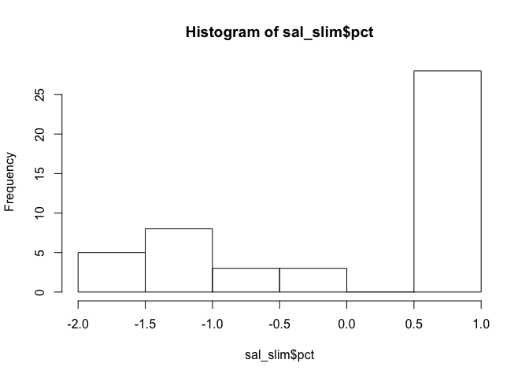<!-- -->

```r
# Simulate some priors; starting with his from the book

curve(dlnorm(x , 2, 0.5), from = 0, to = 100, n = 200)
```

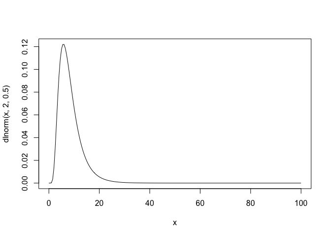<!-- -->

```r
set.seed(10)
N <- 100
a <- rnorm( N , 2 , 0.5 )
b <- rnorm( N , 0 , 0.2 )
plot( NULL , xlim=c(-2,2) , ylim=c(0,40) )
for ( i in 1:N ) curve( exp( a[i] + b[i]*x ) , add=TRUE , col=col.alpha("black",0.5) )
```

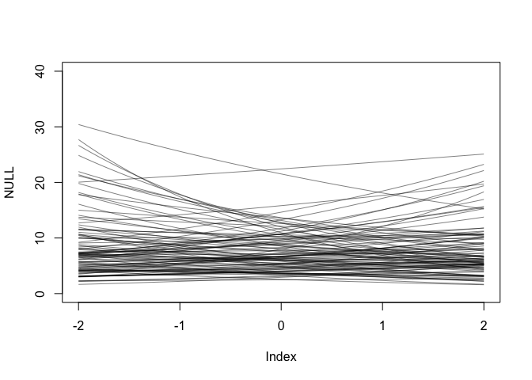<!-- -->

```r
# Not too wild; shifted mean a bit lower for intercept because I noticed many small numbers in the response. 


m1 = ulam(
  alist(
    sal ~ dpois(lambda),
    log(lambda) <- a + Bpct*pct,
    a ~ dnorm(3, 0.5),
    Bpct ~ dnorm(0, 0.2)
  ),
  data = sal_slim, chains = 4, iter = 2000, log_lik = TRUE)
```

```
## 
## SAMPLING FOR MODEL 'e14d2bb6b4270e72633770d66fbdd690' NOW (CHAIN 1).
## Chain 1: 
## Chain 1: Gradient evaluation took 2.6e-05 seconds
## Chain 1: 1000 transitions using 10 leapfrog steps per transition would take 0.26 seconds.
## Chain 1: Adjust your expectations accordingly!
## Chain 1: 
## Chain 1: 
## Chain 1: Iteration:    1 / 2000 [  0%]  (Warmup)
## Chain 1: Iteration:  200 / 2000 [ 10%]  (Warmup)
## Chain 1: Iteration:  400 / 2000 [ 20%]  (Warmup)
## Chain 1: Iteration:  600 / 2000 [ 30%]  (Warmup)
## Chain 1: Iteration:  800 / 2000 [ 40%]  (Warmup)
## Chain 1: Iteration: 1000 / 2000 [ 50%]  (Warmup)
## Chain 1: Iteration: 1001 / 2000 [ 50%]  (Sampling)
## Chain 1: Iteration: 1200 / 2000 [ 60%]  (Sampling)
## Chain 1: Iteration: 1400 / 2000 [ 70%]  (Sampling)
## Chain 1: Iteration: 1600 / 2000 [ 80%]  (Sampling)
## Chain 1: Iteration: 1800 / 2000 [ 90%]  (Sampling)
## Chain 1: Iteration: 2000 / 2000 [100%]  (Sampling)
## Chain 1: 
## Chain 1:  Elapsed Time: 0.062086 seconds (Warm-up)
## Chain 1:                0.064694 seconds (Sampling)
## Chain 1:                0.12678 seconds (Total)
## Chain 1: 
## 
## SAMPLING FOR MODEL 'e14d2bb6b4270e72633770d66fbdd690' NOW (CHAIN 2).
## Chain 2: 
## Chain 2: Gradient evaluation took 1.2e-05 seconds
## Chain 2: 1000 transitions using 10 leapfrog steps per transition would take 0.12 seconds.
## Chain 2: Adjust your expectations accordingly!
## Chain 2: 
## Chain 2: 
## Chain 2: Iteration:    1 / 2000 [  0%]  (Warmup)
## Chain 2: Iteration:  200 / 2000 [ 10%]  (Warmup)
## Chain 2: Iteration:  400 / 2000 [ 20%]  (Warmup)
## Chain 2: Iteration:  600 / 2000 [ 30%]  (Warmup)
## Chain 2: Iteration:  800 / 2000 [ 40%]  (Warmup)
## Chain 2: Iteration: 1000 / 2000 [ 50%]  (Warmup)
## Chain 2: Iteration: 1001 / 2000 [ 50%]  (Sampling)
## Chain 2: Iteration: 1200 / 2000 [ 60%]  (Sampling)
## Chain 2: Iteration: 1400 / 2000 [ 70%]  (Sampling)
## Chain 2: Iteration: 1600 / 2000 [ 80%]  (Sampling)
## Chain 2: Iteration: 1800 / 2000 [ 90%]  (Sampling)
## Chain 2: Iteration: 2000 / 2000 [100%]  (Sampling)
## Chain 2: 
## Chain 2:  Elapsed Time: 0.06218 seconds (Warm-up)
## Chain 2:                0.05405 seconds (Sampling)
## Chain 2:                0.11623 seconds (Total)
## Chain 2: 
## 
## SAMPLING FOR MODEL 'e14d2bb6b4270e72633770d66fbdd690' NOW (CHAIN 3).
## Chain 3: 
## Chain 3: Gradient evaluation took 1e-05 seconds
## Chain 3: 1000 transitions using 10 leapfrog steps per transition would take 0.1 seconds.
## Chain 3: Adjust your expectations accordingly!
## Chain 3: 
## Chain 3: 
## Chain 3: Iteration:    1 / 2000 [  0%]  (Warmup)
## Chain 3: Iteration:  200 / 2000 [ 10%]  (Warmup)
## Chain 3: Iteration:  400 / 2000 [ 20%]  (Warmup)
## Chain 3: Iteration:  600 / 2000 [ 30%]  (Warmup)
## Chain 3: Iteration:  800 / 2000 [ 40%]  (Warmup)
## Chain 3: Iteration: 1000 / 2000 [ 50%]  (Warmup)
## Chain 3: Iteration: 1001 / 2000 [ 50%]  (Sampling)
## Chain 3: Iteration: 1200 / 2000 [ 60%]  (Sampling)
## Chain 3: Iteration: 1400 / 2000 [ 70%]  (Sampling)
## Chain 3: Iteration: 1600 / 2000 [ 80%]  (Sampling)
## Chain 3: Iteration: 1800 / 2000 [ 90%]  (Sampling)
## Chain 3: Iteration: 2000 / 2000 [100%]  (Sampling)
## Chain 3: 
## Chain 3:  Elapsed Time: 0.053078 seconds (Warm-up)
## Chain 3:                0.044863 seconds (Sampling)
## Chain 3:                0.097941 seconds (Total)
## Chain 3: 
## 
## SAMPLING FOR MODEL 'e14d2bb6b4270e72633770d66fbdd690' NOW (CHAIN 4).
## Chain 4: 
## Chain 4: Gradient evaluation took 2.4e-05 seconds
## Chain 4: 1000 transitions using 10 leapfrog steps per transition would take 0.24 seconds.
## Chain 4: Adjust your expectations accordingly!
## Chain 4: 
## Chain 4: 
## Chain 4: Iteration:    1 / 2000 [  0%]  (Warmup)
## Chain 4: Iteration:  200 / 2000 [ 10%]  (Warmup)
## Chain 4: Iteration:  400 / 2000 [ 20%]  (Warmup)
## Chain 4: Iteration:  600 / 2000 [ 30%]  (Warmup)
## Chain 4: Iteration:  800 / 2000 [ 40%]  (Warmup)
## Chain 4: Iteration: 1000 / 2000 [ 50%]  (Warmup)
## Chain 4: Iteration: 1001 / 2000 [ 50%]  (Sampling)
## Chain 4: Iteration: 1200 / 2000 [ 60%]  (Sampling)
## Chain 4: Iteration: 1400 / 2000 [ 70%]  (Sampling)
## Chain 4: Iteration: 1600 / 2000 [ 80%]  (Sampling)
## Chain 4: Iteration: 1800 / 2000 [ 90%]  (Sampling)
## Chain 4: Iteration: 2000 / 2000 [100%]  (Sampling)
## Chain 4: 
## Chain 4:  Elapsed Time: 0.05945 seconds (Warm-up)
## Chain 4:                0.05791 seconds (Sampling)
## Chain 4:                0.11736 seconds (Total)
## Chain 4:
```

```r
precis(m1)
```

```
##           mean         sd     5.5%    94.5%    n_eff     Rhat
## a    0.7926316 0.09846568 0.629073 0.948079 1990.028 1.000147
## Bpct 0.6569726 0.10438180 0.491980 0.824186 1780.353 1.003871
```

```r
m1_lambda = link(m1, data = data.frame(pct = seq(-2.5, 1.5, length.out = 100)))
m1_mu = data.frame(mu = apply(m1_lambda, 2, mean))
m1_ci = data.frame(t(apply(m1_lambda, 2, PI)))
colnames(m1_ci) = c("cilow", "cihigh")

preds = data.frame(pct = seq(-2, 1, length.out = 100), mu = m1_mu$mu, low = m1_ci$cilow, high = m1_ci$cihigh)

# Add in un-scaling pct if time

ggplot() +
  geom_point(data = sal_slim, aes(x = pct, y = sal)) +
  geom_line(data = preds, aes(x = pct, y = mu)) +
  geom_ribbon(data = preds, aes(x = pct, ymin = low, ymax = high), alpha = 0.3)
```

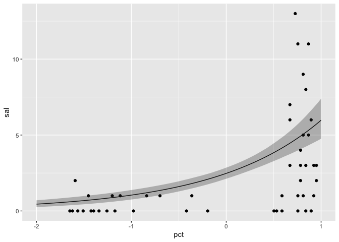<!-- -->

The model does a decent job predicting the mean, but there is a lot of variation at the high end of the predictor.

(b) Can you improve the model by using the other predictor, FORESTAGE? Try any models you think useful. Can you explain why FORESTAGE helps or does not help with prediction?

I don't think forest age will be useful since it seems kind of confounded with percent cover. 


```r
plot(sal_slim$age, sal_slim$pct)
```

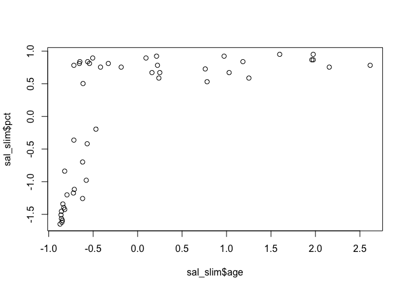<!-- -->

```r
plot(log(salamanders$FORESTAGE), salamanders$PCTCOVER)
```

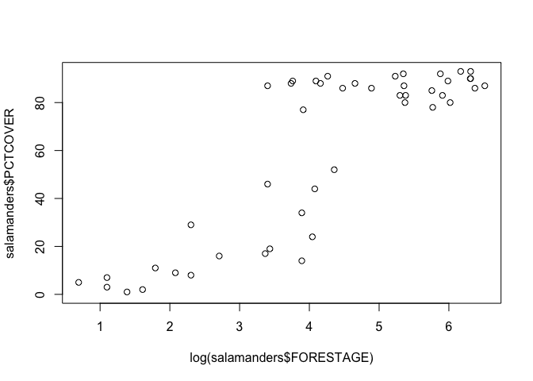<!-- -->

```r
# Model with age and pct cover
m2 = ulam(
  alist(
    sal ~ dpois(lambda),
    log(lambda) <- a + Bpct*pct + Bage*age,
    a ~ dnorm(3, 0.5),
    Bpct ~ dnorm(0, 0.2),
    Bage ~ dnorm(0, 0.2)
  ),
  data = sal_slim, chains = 4, iter = 2000, log_lik = TRUE)
```

```
## 
## SAMPLING FOR MODEL '37f795430cb26a4ee93917b870f5d1de' NOW (CHAIN 1).
## Chain 1: 
## Chain 1: Gradient evaluation took 2.5e-05 seconds
## Chain 1: 1000 transitions using 10 leapfrog steps per transition would take 0.25 seconds.
## Chain 1: Adjust your expectations accordingly!
## Chain 1: 
## Chain 1: 
## Chain 1: Iteration:    1 / 2000 [  0%]  (Warmup)
## Chain 1: Iteration:  200 / 2000 [ 10%]  (Warmup)
## Chain 1: Iteration:  400 / 2000 [ 20%]  (Warmup)
## Chain 1: Iteration:  600 / 2000 [ 30%]  (Warmup)
## Chain 1: Iteration:  800 / 2000 [ 40%]  (Warmup)
## Chain 1: Iteration: 1000 / 2000 [ 50%]  (Warmup)
## Chain 1: Iteration: 1001 / 2000 [ 50%]  (Sampling)
## Chain 1: Iteration: 1200 / 2000 [ 60%]  (Sampling)
## Chain 1: Iteration: 1400 / 2000 [ 70%]  (Sampling)
## Chain 1: Iteration: 1600 / 2000 [ 80%]  (Sampling)
## Chain 1: Iteration: 1800 / 2000 [ 90%]  (Sampling)
## Chain 1: Iteration: 2000 / 2000 [100%]  (Sampling)
## Chain 1: 
## Chain 1:  Elapsed Time: 0.083419 seconds (Warm-up)
## Chain 1:                0.080431 seconds (Sampling)
## Chain 1:                0.16385 seconds (Total)
## Chain 1: 
## 
## SAMPLING FOR MODEL '37f795430cb26a4ee93917b870f5d1de' NOW (CHAIN 2).
## Chain 2: 
## Chain 2: Gradient evaluation took 1.2e-05 seconds
## Chain 2: 1000 transitions using 10 leapfrog steps per transition would take 0.12 seconds.
## Chain 2: Adjust your expectations accordingly!
## Chain 2: 
## Chain 2: 
## Chain 2: Iteration:    1 / 2000 [  0%]  (Warmup)
## Chain 2: Iteration:  200 / 2000 [ 10%]  (Warmup)
## Chain 2: Iteration:  400 / 2000 [ 20%]  (Warmup)
## Chain 2: Iteration:  600 / 2000 [ 30%]  (Warmup)
## Chain 2: Iteration:  800 / 2000 [ 40%]  (Warmup)
## Chain 2: Iteration: 1000 / 2000 [ 50%]  (Warmup)
## Chain 2: Iteration: 1001 / 2000 [ 50%]  (Sampling)
## Chain 2: Iteration: 1200 / 2000 [ 60%]  (Sampling)
## Chain 2: Iteration: 1400 / 2000 [ 70%]  (Sampling)
## Chain 2: Iteration: 1600 / 2000 [ 80%]  (Sampling)
## Chain 2: Iteration: 1800 / 2000 [ 90%]  (Sampling)
## Chain 2: Iteration: 2000 / 2000 [100%]  (Sampling)
## Chain 2: 
## Chain 2:  Elapsed Time: 0.084011 seconds (Warm-up)
## Chain 2:                0.082669 seconds (Sampling)
## Chain 2:                0.16668 seconds (Total)
## Chain 2: 
## 
## SAMPLING FOR MODEL '37f795430cb26a4ee93917b870f5d1de' NOW (CHAIN 3).
## Chain 3: 
## Chain 3: Gradient evaluation took 1.1e-05 seconds
## Chain 3: 1000 transitions using 10 leapfrog steps per transition would take 0.11 seconds.
## Chain 3: Adjust your expectations accordingly!
## Chain 3: 
## Chain 3: 
## Chain 3: Iteration:    1 / 2000 [  0%]  (Warmup)
## Chain 3: Iteration:  200 / 2000 [ 10%]  (Warmup)
## Chain 3: Iteration:  400 / 2000 [ 20%]  (Warmup)
## Chain 3: Iteration:  600 / 2000 [ 30%]  (Warmup)
## Chain 3: Iteration:  800 / 2000 [ 40%]  (Warmup)
## Chain 3: Iteration: 1000 / 2000 [ 50%]  (Warmup)
## Chain 3: Iteration: 1001 / 2000 [ 50%]  (Sampling)
## Chain 3: Iteration: 1200 / 2000 [ 60%]  (Sampling)
## Chain 3: Iteration: 1400 / 2000 [ 70%]  (Sampling)
## Chain 3: Iteration: 1600 / 2000 [ 80%]  (Sampling)
## Chain 3: Iteration: 1800 / 2000 [ 90%]  (Sampling)
## Chain 3: Iteration: 2000 / 2000 [100%]  (Sampling)
## Chain 3: 
## Chain 3:  Elapsed Time: 0.083201 seconds (Warm-up)
## Chain 3:                0.082313 seconds (Sampling)
## Chain 3:                0.165514 seconds (Total)
## Chain 3: 
## 
## SAMPLING FOR MODEL '37f795430cb26a4ee93917b870f5d1de' NOW (CHAIN 4).
## Chain 4: 
## Chain 4: Gradient evaluation took 1.2e-05 seconds
## Chain 4: 1000 transitions using 10 leapfrog steps per transition would take 0.12 seconds.
## Chain 4: Adjust your expectations accordingly!
## Chain 4: 
## Chain 4: 
## Chain 4: Iteration:    1 / 2000 [  0%]  (Warmup)
## Chain 4: Iteration:  200 / 2000 [ 10%]  (Warmup)
## Chain 4: Iteration:  400 / 2000 [ 20%]  (Warmup)
## Chain 4: Iteration:  600 / 2000 [ 30%]  (Warmup)
## Chain 4: Iteration:  800 / 2000 [ 40%]  (Warmup)
## Chain 4: Iteration: 1000 / 2000 [ 50%]  (Warmup)
## Chain 4: Iteration: 1001 / 2000 [ 50%]  (Sampling)
## Chain 4: Iteration: 1200 / 2000 [ 60%]  (Sampling)
## Chain 4: Iteration: 1400 / 2000 [ 70%]  (Sampling)
## Chain 4: Iteration: 1600 / 2000 [ 80%]  (Sampling)
## Chain 4: Iteration: 1800 / 2000 [ 90%]  (Sampling)
## Chain 4: Iteration: 2000 / 2000 [100%]  (Sampling)
## Chain 4: 
## Chain 4:  Elapsed Time: 0.083987 seconds (Warm-up)
## Chain 4:                0.068624 seconds (Sampling)
## Chain 4:                0.152611 seconds (Total)
## Chain 4:
```

```r
precis(m2)
```

```
##            mean         sd       5.5%     94.5%    n_eff      Rhat
## a    0.77665412 0.10490892  0.6045133 0.9419235 2823.416 0.9997436
## Bpct 0.62029313 0.11587782  0.4369158 0.8051537 2495.663 0.9997414
## Bage 0.07700372 0.08422843 -0.0579427 0.2104538 3050.063 0.9998991
```

```r
# Pct cover doesn't seem to add information.

# Model with age only
m3 = ulam(
  alist(
    sal ~ dpois(lambda),
    log(lambda) <- a + Bage*age,
    a ~ dnorm(3, 0.5),
    Bage ~ dnorm(0, 0.2)
  ),
  data = sal_slim, chains = 4, iter = 2000, log_lik = TRUE)
```

```
## 
## SAMPLING FOR MODEL 'd00f9bf28d24399958a2c548f9d7fb5f' NOW (CHAIN 1).
## Chain 1: 
## Chain 1: Gradient evaluation took 2.2e-05 seconds
## Chain 1: 1000 transitions using 10 leapfrog steps per transition would take 0.22 seconds.
## Chain 1: Adjust your expectations accordingly!
## Chain 1: 
## Chain 1: 
## Chain 1: Iteration:    1 / 2000 [  0%]  (Warmup)
## Chain 1: Iteration:  200 / 2000 [ 10%]  (Warmup)
## Chain 1: Iteration:  400 / 2000 [ 20%]  (Warmup)
## Chain 1: Iteration:  600 / 2000 [ 30%]  (Warmup)
## Chain 1: Iteration:  800 / 2000 [ 40%]  (Warmup)
## Chain 1: Iteration: 1000 / 2000 [ 50%]  (Warmup)
## Chain 1: Iteration: 1001 / 2000 [ 50%]  (Sampling)
## Chain 1: Iteration: 1200 / 2000 [ 60%]  (Sampling)
## Chain 1: Iteration: 1400 / 2000 [ 70%]  (Sampling)
## Chain 1: Iteration: 1600 / 2000 [ 80%]  (Sampling)
## Chain 1: Iteration: 1800 / 2000 [ 90%]  (Sampling)
## Chain 1: Iteration: 2000 / 2000 [100%]  (Sampling)
## Chain 1: 
## Chain 1:  Elapsed Time: 0.055346 seconds (Warm-up)
## Chain 1:                0.047545 seconds (Sampling)
## Chain 1:                0.102891 seconds (Total)
## Chain 1: 
## 
## SAMPLING FOR MODEL 'd00f9bf28d24399958a2c548f9d7fb5f' NOW (CHAIN 2).
## Chain 2: 
## Chain 2: Gradient evaluation took 1.2e-05 seconds
## Chain 2: 1000 transitions using 10 leapfrog steps per transition would take 0.12 seconds.
## Chain 2: Adjust your expectations accordingly!
## Chain 2: 
## Chain 2: 
## Chain 2: Iteration:    1 / 2000 [  0%]  (Warmup)
## Chain 2: Iteration:  200 / 2000 [ 10%]  (Warmup)
## Chain 2: Iteration:  400 / 2000 [ 20%]  (Warmup)
## Chain 2: Iteration:  600 / 2000 [ 30%]  (Warmup)
## Chain 2: Iteration:  800 / 2000 [ 40%]  (Warmup)
## Chain 2: Iteration: 1000 / 2000 [ 50%]  (Warmup)
## Chain 2: Iteration: 1001 / 2000 [ 50%]  (Sampling)
## Chain 2: Iteration: 1200 / 2000 [ 60%]  (Sampling)
## Chain 2: Iteration: 1400 / 2000 [ 70%]  (Sampling)
## Chain 2: Iteration: 1600 / 2000 [ 80%]  (Sampling)
## Chain 2: Iteration: 1800 / 2000 [ 90%]  (Sampling)
## Chain 2: Iteration: 2000 / 2000 [100%]  (Sampling)
## Chain 2: 
## Chain 2:  Elapsed Time: 0.052206 seconds (Warm-up)
## Chain 2:                0.047916 seconds (Sampling)
## Chain 2:                0.100122 seconds (Total)
## Chain 2: 
## 
## SAMPLING FOR MODEL 'd00f9bf28d24399958a2c548f9d7fb5f' NOW (CHAIN 3).
## Chain 3: 
## Chain 3: Gradient evaluation took 1.1e-05 seconds
## Chain 3: 1000 transitions using 10 leapfrog steps per transition would take 0.11 seconds.
## Chain 3: Adjust your expectations accordingly!
## Chain 3: 
## Chain 3: 
## Chain 3: Iteration:    1 / 2000 [  0%]  (Warmup)
## Chain 3: Iteration:  200 / 2000 [ 10%]  (Warmup)
## Chain 3: Iteration:  400 / 2000 [ 20%]  (Warmup)
## Chain 3: Iteration:  600 / 2000 [ 30%]  (Warmup)
## Chain 3: Iteration:  800 / 2000 [ 40%]  (Warmup)
## Chain 3: Iteration: 1000 / 2000 [ 50%]  (Warmup)
## Chain 3: Iteration: 1001 / 2000 [ 50%]  (Sampling)
## Chain 3: Iteration: 1200 / 2000 [ 60%]  (Sampling)
## Chain 3: Iteration: 1400 / 2000 [ 70%]  (Sampling)
## Chain 3: Iteration: 1600 / 2000 [ 80%]  (Sampling)
## Chain 3: Iteration: 1800 / 2000 [ 90%]  (Sampling)
## Chain 3: Iteration: 2000 / 2000 [100%]  (Sampling)
## Chain 3: 
## Chain 3:  Elapsed Time: 0.052823 seconds (Warm-up)
## Chain 3:                0.047144 seconds (Sampling)
## Chain 3:                0.099967 seconds (Total)
## Chain 3: 
## 
## SAMPLING FOR MODEL 'd00f9bf28d24399958a2c548f9d7fb5f' NOW (CHAIN 4).
## Chain 4: 
## Chain 4: Gradient evaluation took 1e-05 seconds
## Chain 4: 1000 transitions using 10 leapfrog steps per transition would take 0.1 seconds.
## Chain 4: Adjust your expectations accordingly!
## Chain 4: 
## Chain 4: 
## Chain 4: Iteration:    1 / 2000 [  0%]  (Warmup)
## Chain 4: Iteration:  200 / 2000 [ 10%]  (Warmup)
## Chain 4: Iteration:  400 / 2000 [ 20%]  (Warmup)
## Chain 4: Iteration:  600 / 2000 [ 30%]  (Warmup)
## Chain 4: Iteration:  800 / 2000 [ 40%]  (Warmup)
## Chain 4: Iteration: 1000 / 2000 [ 50%]  (Warmup)
## Chain 4: Iteration: 1001 / 2000 [ 50%]  (Sampling)
## Chain 4: Iteration: 1200 / 2000 [ 60%]  (Sampling)
## Chain 4: Iteration: 1400 / 2000 [ 70%]  (Sampling)
## Chain 4: Iteration: 1600 / 2000 [ 80%]  (Sampling)
## Chain 4: Iteration: 1800 / 2000 [ 90%]  (Sampling)
## Chain 4: Iteration: 2000 / 2000 [100%]  (Sampling)
## Chain 4: 
## Chain 4:  Elapsed Time: 0.055093 seconds (Warm-up)
## Chain 4:                0.049297 seconds (Sampling)
## Chain 4:                0.10439 seconds (Total)
## Chain 4:
```

```r
precis(m3)
```

```
##          mean         sd      5.5%     94.5%    n_eff     Rhat
## a    0.912825 0.09141875 0.7670097 1.0591297 2363.059 1.000079
## Bage 0.302969 0.07360500 0.1858993 0.4198055 2406.133 1.000445
```

```r
compare(m1, m2, m3)
```

```
##        WAIC    pWAIC     dWAIC       weight       SE       dSE
## m1 221.4146 3.801653  0.000000 8.527506e-01 24.84345        NA
## m2 224.9273 6.274912  3.512678 1.472494e-01 25.53960  3.055801
## m3 265.0819 6.110338 43.667292 2.809248e-10 31.84817 16.562640
```

```r
m3_lambda = link(m3, data = data.frame(age = seq(-2, 1, length.out = 100)))
m3_mu = data.frame(mu = apply(m3_lambda, 2, mean))
m3_ci = data.frame(t(apply(m3_lambda, 2, PI)))
colnames(m3_ci) = c("cilow", "cihigh")

preds = data.frame(age = seq(-1, 3, length.out = 100), mu = m3_mu$mu, low = m3_ci$cilow, high = m3_ci$cihigh)

# Add in un-scaling pct if time

ggplot() +
  geom_point(data = sal_slim, aes(x = age, y = sal)) +
  geom_line(data = preds, aes(x = age, y = mu)) +
  geom_ribbon(data = preds, aes(x = age, ymin = low, ymax = high), alpha = 0.3)
```

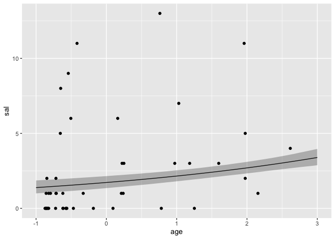<!-- -->


## Week 6 HW 3

3. The data in data(Primates301) were first introduced at the end of Chapter 7. In this problem, you will consider how brain size is associated with social learning. There are three parts.

First, model the number of observations of social_learning for each species as a function of the log brain size. Use a Poisson distribution for the social_learning outcome variable. Interpret the resulting posterior.


```r
data("Primates301")

Primates301 = Primates301 %>% select(brain, social_learning, research_effort)

summary(Primates301)
```

```
##      brain        social_learning research_effort 
##  Min.   :  1.63   Min.   :  0.0   Min.   :  1.00  
##  1st Qu.: 11.82   1st Qu.:  0.0   1st Qu.:  6.00  
##  Median : 58.55   Median :  0.0   Median : 16.00  
##  Mean   : 68.49   Mean   :  2.3   Mean   : 38.76  
##  3rd Qu.: 86.20   3rd Qu.:  0.0   3rd Qu.: 37.75  
##  Max.   :491.27   Max.   :214.0   Max.   :755.00  
##  NA's   :117      NA's   :98      NA's   :115
```

```r
pairs(Primates301)
```

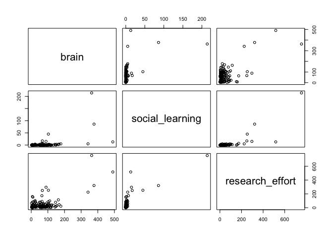<!-- -->

```r
d = Primates301 %>% select(social_learning, brain, research_effort) %>% mutate(log_brain = log(brain), log_re = log(research_effort)) %>% filter(!is.na(log_brain), !is.na(social_learning), !is.na(research_effort))

m4 = ulam(
  alist(
    social_learning ~ dpois(lambda),
    log(lambda) <- a + Bbrain*log_brain,
    a ~ dnorm(3, 0.5),
    Bbrain ~ dnorm(0, 0.2)
  ),
  data = d, chains = 4, iter = 2000, log_lik = TRUE)
```

```
## 
## SAMPLING FOR MODEL 'c51a3b312796016c81c20b7b33f3cad2' NOW (CHAIN 1).
## Chain 1: 
## Chain 1: Gradient evaluation took 3.2e-05 seconds
## Chain 1: 1000 transitions using 10 leapfrog steps per transition would take 0.32 seconds.
## Chain 1: Adjust your expectations accordingly!
## Chain 1: 
## Chain 1: 
## Chain 1: Iteration:    1 / 2000 [  0%]  (Warmup)
## Chain 1: Iteration:  200 / 2000 [ 10%]  (Warmup)
## Chain 1: Iteration:  400 / 2000 [ 20%]  (Warmup)
## Chain 1: Iteration:  600 / 2000 [ 30%]  (Warmup)
## Chain 1: Iteration:  800 / 2000 [ 40%]  (Warmup)
## Chain 1: Iteration: 1000 / 2000 [ 50%]  (Warmup)
## Chain 1: Iteration: 1001 / 2000 [ 50%]  (Sampling)
## Chain 1: Iteration: 1200 / 2000 [ 60%]  (Sampling)
## Chain 1: Iteration: 1400 / 2000 [ 70%]  (Sampling)
## Chain 1: Iteration: 1600 / 2000 [ 80%]  (Sampling)
## Chain 1: Iteration: 1800 / 2000 [ 90%]  (Sampling)
## Chain 1: Iteration: 2000 / 2000 [100%]  (Sampling)
## Chain 1: 
## Chain 1:  Elapsed Time: 0.3217 seconds (Warm-up)
## Chain 1:                0.286212 seconds (Sampling)
## Chain 1:                0.607912 seconds (Total)
## Chain 1: 
## 
## SAMPLING FOR MODEL 'c51a3b312796016c81c20b7b33f3cad2' NOW (CHAIN 2).
## Chain 2: 
## Chain 2: Gradient evaluation took 2.3e-05 seconds
## Chain 2: 1000 transitions using 10 leapfrog steps per transition would take 0.23 seconds.
## Chain 2: Adjust your expectations accordingly!
## Chain 2: 
## Chain 2: 
## Chain 2: Iteration:    1 / 2000 [  0%]  (Warmup)
## Chain 2: Iteration:  200 / 2000 [ 10%]  (Warmup)
## Chain 2: Iteration:  400 / 2000 [ 20%]  (Warmup)
## Chain 2: Iteration:  600 / 2000 [ 30%]  (Warmup)
## Chain 2: Iteration:  800 / 2000 [ 40%]  (Warmup)
## Chain 2: Iteration: 1000 / 2000 [ 50%]  (Warmup)
## Chain 2: Iteration: 1001 / 2000 [ 50%]  (Sampling)
## Chain 2: Iteration: 1200 / 2000 [ 60%]  (Sampling)
## Chain 2: Iteration: 1400 / 2000 [ 70%]  (Sampling)
## Chain 2: Iteration: 1600 / 2000 [ 80%]  (Sampling)
## Chain 2: Iteration: 1800 / 2000 [ 90%]  (Sampling)
## Chain 2: Iteration: 2000 / 2000 [100%]  (Sampling)
## Chain 2: 
## Chain 2:  Elapsed Time: 0.29452 seconds (Warm-up)
## Chain 2:                0.242851 seconds (Sampling)
## Chain 2:                0.537371 seconds (Total)
## Chain 2: 
## 
## SAMPLING FOR MODEL 'c51a3b312796016c81c20b7b33f3cad2' NOW (CHAIN 3).
## Chain 3: 
## Chain 3: Gradient evaluation took 2e-05 seconds
## Chain 3: 1000 transitions using 10 leapfrog steps per transition would take 0.2 seconds.
## Chain 3: Adjust your expectations accordingly!
## Chain 3: 
## Chain 3: 
## Chain 3: Iteration:    1 / 2000 [  0%]  (Warmup)
## Chain 3: Iteration:  200 / 2000 [ 10%]  (Warmup)
## Chain 3: Iteration:  400 / 2000 [ 20%]  (Warmup)
## Chain 3: Iteration:  600 / 2000 [ 30%]  (Warmup)
## Chain 3: Iteration:  800 / 2000 [ 40%]  (Warmup)
## Chain 3: Iteration: 1000 / 2000 [ 50%]  (Warmup)
## Chain 3: Iteration: 1001 / 2000 [ 50%]  (Sampling)
## Chain 3: Iteration: 1200 / 2000 [ 60%]  (Sampling)
## Chain 3: Iteration: 1400 / 2000 [ 70%]  (Sampling)
## Chain 3: Iteration: 1600 / 2000 [ 80%]  (Sampling)
## Chain 3: Iteration: 1800 / 2000 [ 90%]  (Sampling)
## Chain 3: Iteration: 2000 / 2000 [100%]  (Sampling)
## Chain 3: 
## Chain 3:  Elapsed Time: 0.304658 seconds (Warm-up)
## Chain 3:                0.334135 seconds (Sampling)
## Chain 3:                0.638793 seconds (Total)
## Chain 3: 
## 
## SAMPLING FOR MODEL 'c51a3b312796016c81c20b7b33f3cad2' NOW (CHAIN 4).
## Chain 4: 
## Chain 4: Gradient evaluation took 2e-05 seconds
## Chain 4: 1000 transitions using 10 leapfrog steps per transition would take 0.2 seconds.
## Chain 4: Adjust your expectations accordingly!
## Chain 4: 
## Chain 4: 
## Chain 4: Iteration:    1 / 2000 [  0%]  (Warmup)
## Chain 4: Iteration:  200 / 2000 [ 10%]  (Warmup)
## Chain 4: Iteration:  400 / 2000 [ 20%]  (Warmup)
## Chain 4: Iteration:  600 / 2000 [ 30%]  (Warmup)
## Chain 4: Iteration:  800 / 2000 [ 40%]  (Warmup)
## Chain 4: Iteration: 1000 / 2000 [ 50%]  (Warmup)
## Chain 4: Iteration: 1001 / 2000 [ 50%]  (Sampling)
## Chain 4: Iteration: 1200 / 2000 [ 60%]  (Sampling)
## Chain 4: Iteration: 1400 / 2000 [ 70%]  (Sampling)
## Chain 4: Iteration: 1600 / 2000 [ 80%]  (Sampling)
## Chain 4: Iteration: 1800 / 2000 [ 90%]  (Sampling)
## Chain 4: Iteration: 2000 / 2000 [100%]  (Sampling)
## Chain 4: 
## Chain 4:  Elapsed Time: 0.291863 seconds (Warm-up)
## Chain 4:                0.32089 seconds (Sampling)
## Chain 4:                0.612753 seconds (Total)
## Chain 4:
```

```
## Warning: Tail Effective Samples Size (ESS) is too low, indicating posterior variances and tail quantiles may be unreliable.
## Running the chains for more iterations may help. See
## http://mc-stan.org/misc/warnings.html#tail-ess
```

```r
precis(m4)
```

```
##             mean         sd      5.5%     94.5%    n_eff     Rhat
## a      -5.676398 0.23459276 -6.057099 -5.307814 622.6359 1.004415
## Bbrain  1.561264 0.04686449  1.486867  1.637525 639.8116 1.004673
```

```r
plot(precis(m4))
```

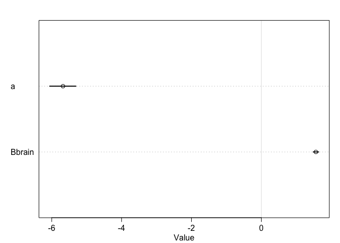<!-- -->

There is a positive realtionship between log brain size and social learning.

Second, some species are studied much more than others. So the number of reported instances of social_learning could be a product of research effort. Use the research_effort variable, specifically its logarithm, as an additional predictor variable. Interpret the coefficient for log research_effort. Does this model disagree with the previous one?


```r
m5 = ulam(
  alist(
    social_learning ~ dpois(lambda),
    log(lambda) <- a + Bbrain*log_brain + Bre*log_re,
    a ~ dnorm(3, 0.5),
    Bbrain ~ dnorm(0, 0.2),
    Bre ~ dnorm(0, 0.2)
  ),
  data = d, chains = 4, iter = 2000, log_lik = TRUE)
```

```
## 
## SAMPLING FOR MODEL '9221e6759b0ac4247ccd4dc6c048b9aa' NOW (CHAIN 1).
## Chain 1: 
## Chain 1: Gradient evaluation took 3.3e-05 seconds
## Chain 1: 1000 transitions using 10 leapfrog steps per transition would take 0.33 seconds.
## Chain 1: Adjust your expectations accordingly!
## Chain 1: 
## Chain 1: 
## Chain 1: Iteration:    1 / 2000 [  0%]  (Warmup)
## Chain 1: Iteration:  200 / 2000 [ 10%]  (Warmup)
## Chain 1: Iteration:  400 / 2000 [ 20%]  (Warmup)
## Chain 1: Iteration:  600 / 2000 [ 30%]  (Warmup)
## Chain 1: Iteration:  800 / 2000 [ 40%]  (Warmup)
## Chain 1: Iteration: 1000 / 2000 [ 50%]  (Warmup)
## Chain 1: Iteration: 1001 / 2000 [ 50%]  (Sampling)
## Chain 1: Iteration: 1200 / 2000 [ 60%]  (Sampling)
## Chain 1: Iteration: 1400 / 2000 [ 70%]  (Sampling)
## Chain 1: Iteration: 1600 / 2000 [ 80%]  (Sampling)
## Chain 1: Iteration: 1800 / 2000 [ 90%]  (Sampling)
## Chain 1: Iteration: 2000 / 2000 [100%]  (Sampling)
## Chain 1: 
## Chain 1:  Elapsed Time: 0.733589 seconds (Warm-up)
## Chain 1:                0.590663 seconds (Sampling)
## Chain 1:                1.32425 seconds (Total)
## Chain 1: 
## 
## SAMPLING FOR MODEL '9221e6759b0ac4247ccd4dc6c048b9aa' NOW (CHAIN 2).
## Chain 2: 
## Chain 2: Gradient evaluation took 2.3e-05 seconds
## Chain 2: 1000 transitions using 10 leapfrog steps per transition would take 0.23 seconds.
## Chain 2: Adjust your expectations accordingly!
## Chain 2: 
## Chain 2: 
## Chain 2: Iteration:    1 / 2000 [  0%]  (Warmup)
## Chain 2: Iteration:  200 / 2000 [ 10%]  (Warmup)
## Chain 2: Iteration:  400 / 2000 [ 20%]  (Warmup)
## Chain 2: Iteration:  600 / 2000 [ 30%]  (Warmup)
## Chain 2: Iteration:  800 / 2000 [ 40%]  (Warmup)
## Chain 2: Iteration: 1000 / 2000 [ 50%]  (Warmup)
## Chain 2: Iteration: 1001 / 2000 [ 50%]  (Sampling)
## Chain 2: Iteration: 1200 / 2000 [ 60%]  (Sampling)
## Chain 2: Iteration: 1400 / 2000 [ 70%]  (Sampling)
## Chain 2: Iteration: 1600 / 2000 [ 80%]  (Sampling)
## Chain 2: Iteration: 1800 / 2000 [ 90%]  (Sampling)
## Chain 2: Iteration: 2000 / 2000 [100%]  (Sampling)
## Chain 2: 
## Chain 2:  Elapsed Time: 0.735095 seconds (Warm-up)
## Chain 2:                0.71378 seconds (Sampling)
## Chain 2:                1.44888 seconds (Total)
## Chain 2: 
## 
## SAMPLING FOR MODEL '9221e6759b0ac4247ccd4dc6c048b9aa' NOW (CHAIN 3).
## Chain 3: 
## Chain 3: Gradient evaluation took 2.8e-05 seconds
## Chain 3: 1000 transitions using 10 leapfrog steps per transition would take 0.28 seconds.
## Chain 3: Adjust your expectations accordingly!
## Chain 3: 
## Chain 3: 
## Chain 3: Iteration:    1 / 2000 [  0%]  (Warmup)
## Chain 3: Iteration:  200 / 2000 [ 10%]  (Warmup)
## Chain 3: Iteration:  400 / 2000 [ 20%]  (Warmup)
## Chain 3: Iteration:  600 / 2000 [ 30%]  (Warmup)
## Chain 3: Iteration:  800 / 2000 [ 40%]  (Warmup)
## Chain 3: Iteration: 1000 / 2000 [ 50%]  (Warmup)
## Chain 3: Iteration: 1001 / 2000 [ 50%]  (Sampling)
## Chain 3: Iteration: 1200 / 2000 [ 60%]  (Sampling)
## Chain 3: Iteration: 1400 / 2000 [ 70%]  (Sampling)
## Chain 3: Iteration: 1600 / 2000 [ 80%]  (Sampling)
## Chain 3: Iteration: 1800 / 2000 [ 90%]  (Sampling)
## Chain 3: Iteration: 2000 / 2000 [100%]  (Sampling)
## Chain 3: 
## Chain 3:  Elapsed Time: 0.725607 seconds (Warm-up)
## Chain 3:                0.936005 seconds (Sampling)
## Chain 3:                1.66161 seconds (Total)
## Chain 3: 
## 
## SAMPLING FOR MODEL '9221e6759b0ac4247ccd4dc6c048b9aa' NOW (CHAIN 4).
## Chain 4: 
## Chain 4: Gradient evaluation took 2.4e-05 seconds
## Chain 4: 1000 transitions using 10 leapfrog steps per transition would take 0.24 seconds.
## Chain 4: Adjust your expectations accordingly!
## Chain 4: 
## Chain 4: 
## Chain 4: Iteration:    1 / 2000 [  0%]  (Warmup)
## Chain 4: Iteration:  200 / 2000 [ 10%]  (Warmup)
## Chain 4: Iteration:  400 / 2000 [ 20%]  (Warmup)
## Chain 4: Iteration:  600 / 2000 [ 30%]  (Warmup)
## Chain 4: Iteration:  800 / 2000 [ 40%]  (Warmup)
## Chain 4: Iteration: 1000 / 2000 [ 50%]  (Warmup)
## Chain 4: Iteration: 1001 / 2000 [ 50%]  (Sampling)
## Chain 4: Iteration: 1200 / 2000 [ 60%]  (Sampling)
## Chain 4: Iteration: 1400 / 2000 [ 70%]  (Sampling)
## Chain 4: Iteration: 1600 / 2000 [ 80%]  (Sampling)
## Chain 4: Iteration: 1800 / 2000 [ 90%]  (Sampling)
## Chain 4: Iteration: 2000 / 2000 [100%]  (Sampling)
## Chain 4: 
## Chain 4:  Elapsed Time: 0.782263 seconds (Warm-up)
## Chain 4:                0.792233 seconds (Sampling)
## Chain 4:                1.5745 seconds (Total)
## Chain 4:
```

```r
precis(m5)
```

```
##              mean         sd       5.5%      94.5%    n_eff      Rhat
## a      -5.2743877 0.21043288 -5.6154157 -4.9397744 1705.469 1.0018440
## Bbrain  0.2350599 0.05118876  0.1521036  0.3180908 1495.441 0.9997254
## Bre     1.3073586 0.04924129  1.2299201  1.3867353 1577.709 1.0014602
```

```r
plot(precis(m5))
```

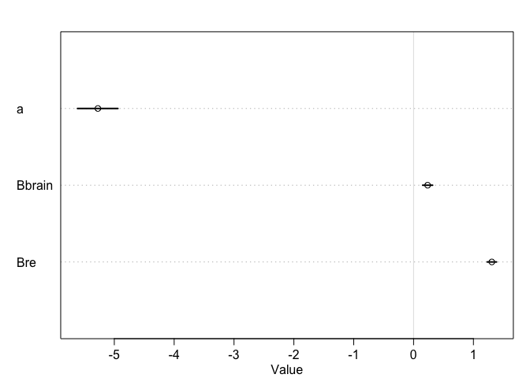<!-- -->
Some of the apparent effects of brain size might be due to research effort. 


Third, draw a DAG to represent how you think the variables social_learning, brain, and research_effort interact. Justify the DAG with the measured associations in the two models above (and any other models you used).

I think there might be an effect of brain size on social learning, but also a backdoor through research effort. Larger brain species might be studied more, and we might know more about their capacities to learn. 


