## 10H3

**The data contained in library(MASS);data(eagles) are records of salmon pirating attempts by Bald Eagles in Washington State. See ?eagles for details. While one eagle feeds, sometimes another will swoop in and try to steal the salmon from it. Call the feeding eagle the “victim” and the thief the “pirate.” Use the available data to build a binomial GLM of successful pirating attempts.**

**Consider the following model:**

$$y_i ∼ Binomial(n_i, p_i) \\

log(p_i/(1-p_i) ) = \alpha + \beta_P  P_i + \beta_V V_i + \beta_A A_i \\

\alpha \sim normal(0, 10) \\

\beta_P \sim normal(0, 5) \\

\beta_V \sim normal(0, 5) \\

\beta_A \sim normal(0, 5) $$

**where y is the number of successful attempts, n is the total number of attempts, P is a dummy variable indicating whether or not the pirate had large body size, V is a dummy variable indicating whether or not the victim had large body size, and finally A is a dummy variable indicating whether or not the pirate was an adult. Fit the model above to the eagles data, using both quap and ulam. Is the quadratic approximation okay?**


```r
data(eagles); eagles
```

```
##    y  n P A V
## 1 17 24 L A L
## 2 29 29 L A S
## 3 17 27 L I L
## 4 20 20 L I S
## 5  1 12 S A L
## 6 15 16 S A S
## 7  0 28 S I L
## 8  1  4 S I S
```

```r
# Make nice dataframe for plotting
eagles_plotting = eagles %>% 
  mutate(Category = paste0(P, "P.", V, "V.", A),
         Probability = y/n)

eagles$P = as.numeric(eagles$P) # 1 = large, 2 = small
eagles$V = as.numeric(eagles$V) # 1 = large, 2 = small
eagles$A = as.numeric(eagles$A) # 1 = adult, 2 = immature
```


```r
# Got errors about invalid start values so had to specify them
m3.1 = quap(
  alist(
    y ~ dbinom(n, p),
    logit(p) <- a + BP[P] + BV[V] + BA[A],
    a ~ dnorm(0, 10),
    BP[P] ~ dnorm(0, 5),
    BV[V] ~ dnorm(0, 5),
    BA[A] ~ dnorm(0, 5)
  ), data = eagles, start = list(a = 0, BP = 0, BV = 0, BA = 0)
)

m3.2 = ulam(
  alist(
    y ~ dbinom(n, p),
    logit(p) <- a + BP[P] + BV[V] + BA[A],
    a ~ dnorm(0, 10),
    BP[P] ~ dnorm(0, 5),
    BV[V] ~ dnorm(0, 5),
    BA[A] ~ dnorm(0, 5)
  ), data = eagles, chains = 2, iter = 4e3, cores = 2, log_lik = TRUE
)
```


```r
precis(m3.1, depth = 2); precis(m3.2, depth = 2)
```

```
##             mean       sd      5.5%    94.5%
## a      0.6992148 5.227361 -7.655117 9.053547
## BP[1]  2.2801108 3.405358 -3.162309 7.722531
## BP[2] -2.1022530 3.405212 -7.544439 3.339933
## BV[1] -2.2823694 3.408482 -7.729782 3.165043
## BV[2]  2.4631391 3.411640 -2.989320 7.915598
## BA[1]  0.6338604 3.381807 -4.770920 6.038641
## BA[2] -0.4546897 3.382030 -5.859827 4.950447
```

```
##             mean       sd      5.5%    94.5%    n_eff      Rhat
## a      0.9561357 5.222887 -7.404361 9.090628 1759.483 0.9998760
## BP[1]  2.3907804 3.384036 -2.878228 7.770172 2064.524 0.9996693
## BP[2] -2.4858394 3.391564 -7.859911 2.943258 1962.832 0.9996775
## BV[1] -2.6322324 3.439075 -8.208949 2.839080 1672.365 0.9997716
## BV[2]  2.6734438 3.437391 -2.841852 8.127858 1681.145 0.9998947
## BA[1]  0.6762353 3.502318 -5.004331 6.308459 1366.182 1.0004624
## BA[2] -0.4612692 3.496260 -6.123404 5.267273 1376.931 1.0002836
```

The parameter estimates from the two methods are very similar. 

**(b) Now interpret the estimates. If the quadratic approximation turned out okay, then it’s okay to use the quap estimates. Otherwise stick to ulam estimates. Then plot the posterior predictions. Compute and display both (1) the predicted probability of success and its 89% interval for each row (i) in the data, as well as (2) the predicted success count and its 89% interval. What different information does each type of posterior prediction provide?**

Large eagles are more likely than small eagles to successfully pirate salmon. When the victim is small, the theft attempt is more likely to be successful. These effects are similar in size. Adult eagles are more likely to successfully steal salmon than juvenile birds, however, this effect is small in magnitude (at least, once size is accounted for). All of these effects have very large CIs. 


```r
post.predictors = extract.samples(m3.2) %>%
  as.data.frame() %>%
  transmute(diff_P = BP.1 - BP.2,
            diff_V = BV.1 - BV.2,
            diff_A = BA.1 - BA.2) %>%
  # diff_P is diference in probability of successful steal for big pirate vs. small pirate
  # diff_A is diference in probability of successful steal for big victim vs. small victim
  # diff_A is diference in probability of successful steal for adult vs. immature
  gather(key = var, value = est) 

ggplot(post.predictors, aes(x = est)) +
  geom_density(fill = "grey") +
  facet_grid(.~var)
```

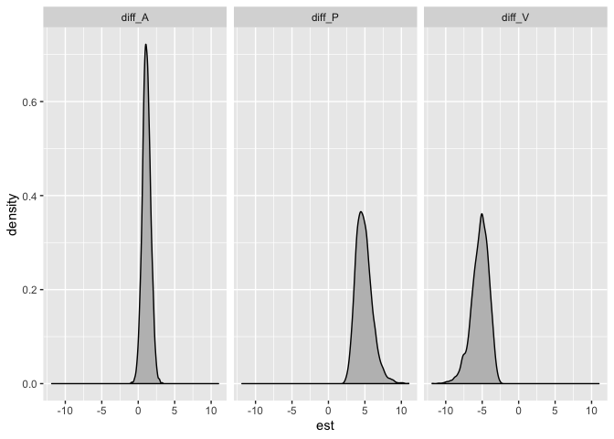<!-- -->

```r
post.response = extract.samples(m3.2) %>%
  as.data.frame() %>%
  mutate_all(inv_logit) %>%
  # Why do plots look so weird when backtransformed?
  transmute(diff_P = BP.1 - BP.2,
            diff_V = BV.1 - BV.2,
            diff_A = BA.1 - BA.2) %>%
  # diff_P is diference in probability of successful steal for big pirate vs. small pirate
  # diff_V is diference in probability of successful steal for big victim vs. small victim
  # diff_A is diference in probability of successful steal for adult vs. immature
  gather(key = var, value = est) 

ggplot(post.response, aes(x = est)) +
  geom_density(fill = "grey") +
  facet_grid(.~var)
```

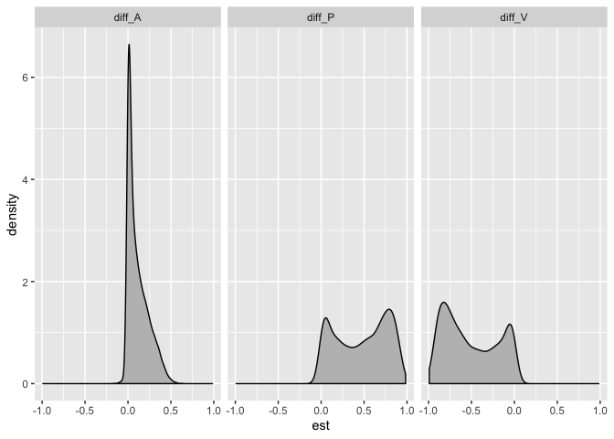<!-- -->

The plots look funny on the response scale. Have I done something wrong or are the bimodal peaks something to do with the interaction?

Plotting predicted probability of success and it's 89% interval:


```r
probs = as.data.frame(link(m3.2, data = data.frame(P = c(1, 1, 1, 1, 2, 2, 2, 2), 
                                                   V = c(1, 2, 1, 2, 1, 2, 1, 2), 
                                                   A = c(1, 1, 2, 2, 1, 1, 2, 2)))) %>% 
  rename(LP.LV.A = V1, 
         LP.SV.A = V2, 
         LP.LV.I = V3, 
         LP.SV.I = V4, 
         SP.LV.A = V5, 
         SP.SV.A = V6, 
         SP.LV.I = V7, 
         SP.SV.I = V8) %>% 
  gather(key = Category, value = Probability) 

probs_cis = probs %>% 
  group_by(Category) %>% 
  point_interval(Probability, .width = 0.89, .point = median, .interval = hdi)

ggplot() +
  geom_violin(data = probs, aes(x = Category, y = Probability)) +
  geom_errorbar(data = probs_cis, aes(x = Category, ymin = .lower, ymax = .upper), width = 0.1, color = "purple", position = position_nudge(x = 0.1)) +
  geom_point(data = probs_cis, aes(x = Category, y = Probability), width = 0.1, color = "purple", position = position_nudge(x = 0.1)) +
  geom_point(data = eagles_plotting, aes(x = Category, y = Probability), color = "blue", position = position_nudge(x = -0.1))
```

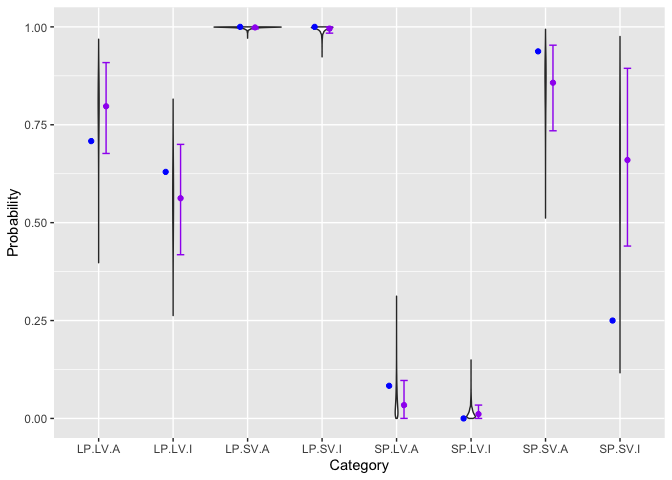<!-- -->


```r
counts = as.data.frame(sim(m3.2, data = data.frame(P = c(1, 1, 1, 1, 2, 2, 2, 2), 
                                                   V = c(1, 2, 1, 2, 1, 2, 1, 2), 
                                                   A = c(1, 1, 2, 2, 1, 1, 2, 2)))) %>% 
  rename(LP.LV.A = V1, 
         LP.SV.A = V2, 
         LP.LV.I = V3, 
         LP.SV.I = V4, 
         SP.LV.A = V5, 
         SP.SV.A = V6, 
         SP.LV.I = V7, 
         SP.SV.I = V8) %>% 
  gather(key = Category, value = Count) 

counts_cis = counts %>% 
  group_by(Category) %>% 
  point_interval(Count, .width = 0.89, .point = median, .interval = hdi) 

ggplot() +
  geom_violin(data = counts, aes(x = Category, y = Count)) +
  geom_errorbar(data = counts_cis, aes(x = Category, ymin = .lower, ymax = .upper), width = 0.1, color = "purple", position = position_nudge(x = 0.1)) +
  geom_point(data = counts_cis, aes(x = Category, y = Count), width = 0.1, color = "purple", position = position_nudge(x = 0.1)) +
  geom_point(data = eagles_plotting, aes(x = Category, y = Probability*1000), color = "blue", position = position_nudge(x = -0.1))
```

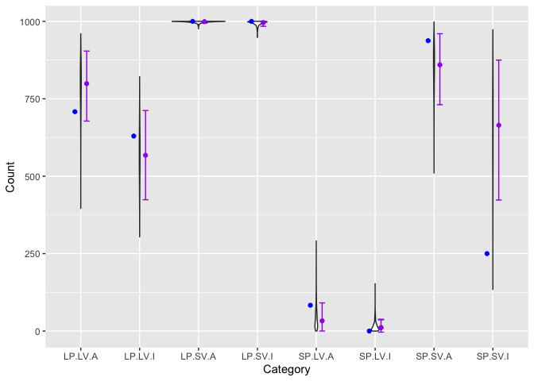<!-- -->

When a large pirate tries to steal from a small victim, the pirate almost always succeeds. When a small pirate tries to steal from a large victim, they almost always fail, though they tend to have a bit of success if they are an adult. Adult pirates have a slight advantage if they are large and their victim is large, this advantage appears magnified when both are small in the raw data, but this model doesn't capture that. 


**(c) Now try to improve the model. Consider an interaction between the pirate’s size and age (immature or adult). Compare this model to the previous one, using WAIC. Interpret.**


```r
# Make age an indicator variable for this.
eagles$A = ifelse(eagles$A == 1, 1, 0)
# 1 = adult, 0 = immature

m3.3 = ulam(
  alist(
    y ~ dbinom(n, p),
    logit(p) <- a + BP[P] + BA*A + BV[V] + XP_A[P]*A,
    # If adult, calculate interaction effect, which can be interpreted as the additional effect of pirate size when the pirate is an adult
    a ~ dnorm(0, 10),
    BP[P] ~ dnorm(0, 5),
    BV[V] ~ dnorm(0, 5),
    BA ~ dnorm(0, 5),
    XP_A[P] ~ dnorm(0, 5)
  ), data = eagles, chains = 2, iter = 4e3, cores = 2, log_lik = TRUE
)
precis(m3.3, depth = 2)
```


```r
probs_int = as.data.frame(link(m3.3, data = data.frame(P = c(1, 1, 1, 1, 2, 2, 2, 2), 
                                                   V = c(1, 2, 1, 2, 1, 2, 1, 2), 
                                                   A = c(1, 1, 0, 0, 1, 1, 0, 0)))) %>% 
  rename(LP.LV.A = V1, 
         LP.SV.A = V2, 
         LP.LV.I = V3, 
         LP.SV.I = V4, 
         SP.LV.A = V5, 
         SP.SV.A = V6, 
         SP.LV.I = V7, 
         SP.SV.I = V8) %>% 
  gather(key = Category, value = Probability) 

probs_int_cis = probs_int %>% 
  group_by(Category) %>% 
  point_interval(Probability, .width = 0.89, .point = median, .interval = hdi)

ggplot() +
  geom_violin(data = probs_int, aes(x = Category, y = Probability)) +
  geom_errorbar(data = probs_int_cis, aes(x = Category, ymin = .lower, ymax = .upper), width = 0.1, color = "purple", position = position_nudge(x = 0.1)) +
  geom_point(data = probs_int_cis, aes(x = Category, y = Probability), color = "purple", position = position_nudge(x = 0.1)) +
  geom_point(data = eagles_plotting, aes(x = Category, y = Probability), color = "blue", position = position_nudge(x = -0.1))
```

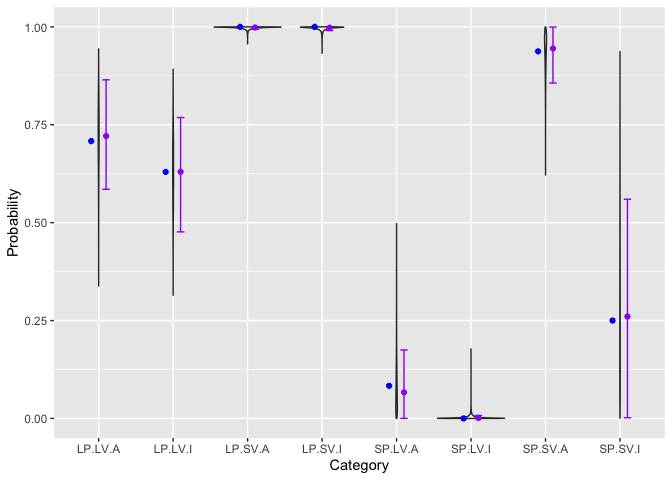<!-- -->

```r
compare(m3.2, m3.3)
```

```
##          WAIC    pWAIC    dWAIC      weight       SE      dSE
## m3.3 20.93397 2.217889  0.00000 0.993562507 5.787879       NA
## m3.2 31.01228 5.356194 10.07832 0.006437493 7.964758 3.535526
```
Much better fit. Age makes a difference in small pirate-small victim interactions. 


## 11E3

**When count data are zero-inflated, using a model that ignores zero-inflation will tend to induce which kind of inferential error?**

Ignoring zero-inflation may result in underestimates of the mean of the Poisson or binomial. 


## 11E4

**Over-dispersion is common in count data. Give an example of a natural process that might produce over-dispersed counts. Can you also give an example of a process that might produce under-dispersed counts?**

Overdispersion can occur when there are unaccounted for variables that are affecting the counts. For example, perhaps you count plants in 1 meter square plots to see if the number of plants can be explained by soil depth. But maybe the plants you're counting are also affected by the amount of shade in the plots. You might have more variance in your counts than your model predicts based on soil depth. 

A model might produce underdispersed counts if there is some process that causes clustering of individuals in space or time. For example, if a bird species you are counting tends to spend time in flocks, you may have very few solitary birds in any given space or time. As a result, the variance in your counts might be lower than would be predicted based on the mean. 


## 11M3 (optional)

**Can you modify the derivation of the zero-inflated Poisson distribution (ZIPoisson) from the chapter to construct a zero-inflated binomial distribution?**

\[
y \sim ZIBinomial(z, p, n) \\

logit(z_i) = \alpha_z + \beta_z x_i \\

logit(p_i) = \alpha_p + \beta_p x_i

\]

In this case, there is a zero-generating process that sometimes results in 0 counts out of n trials due, perhaps, to observation error or failure. For example, perhaps you are scoring germination of 10-seed sets that you have planted in the field. Sometimes you observe 0 seedlings because a bird came and ate all the seeds in the plot, not because the seeds failed to germinate. The probabaility that a bird raided the plot is binomial (bernoulli) distributed with mean z. The probability of germination in the undisturbed seed caches is binomially distributed with mena p and n = 10. 


## 11H1

**In 2014, a paper was published that was entitled “Female hurricanes are deadlier than male hurricanes.” As the title suggests, the paper claimed that hurricanes with female names have caused greater loss of life, and the explanation given is that people unconsciously rate female hurricanes as less dangerous and so are less likely to evacuate.**
**Statisticians severely criticized the paper after publication. Here, you’ll explore the complete data used in the paper and consider the hypothesis that hurricanes with female names are deadlier. Load the data with:**


```r
data(Hurricanes)
```

**Acquaint yourself with the columns by inspecting the help ?Hurricanes.**


```r
?Hurricanes
```

**In this problem, you’ll focus on predicting deaths using femininity of each hurricane’s name.**
**Fit and interpret the simplest possible model, a Poisson model of deaths using femininity as a predictor. You can use quap or ulam. Compare the model to an intercept-only Poisson model of deaths. How strong is the association between femininity of name and deaths? Which storms does the model fit (retrodict) well? Which storms does it fit poorly?**

Check on priors and prepare data:

```r
sd_fem = sd(Hurricanes$femininity)
mean_fem = mean(Hurricanes$femininity)

hslim = Hurricanes %>% 
  select(deaths, femininity) %>% 
  mutate(fem_scaled = (femininity-mean_fem)/sd_fem)

hist(hslim$femininity)
```

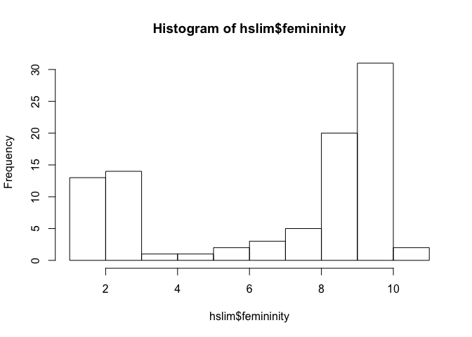<!-- -->

```r
hist(hslim$fem_scaled)
```

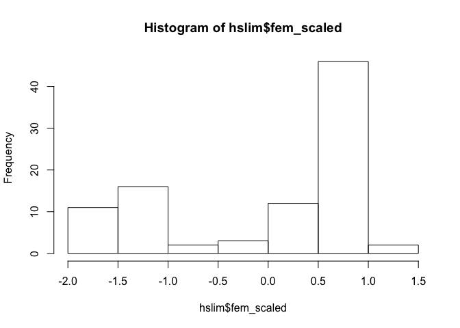<!-- -->

```r
hist(hslim$deaths)
```

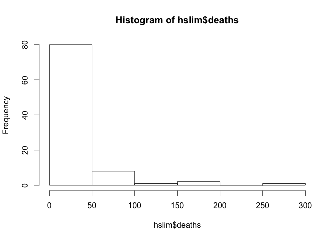<!-- -->

```r
mean(hslim$deaths)
```

```
## [1] 20.65217
```

```r
curve(dlnorm(x, 2.5, 1), from = 0, to  = 300, n = 200)
```

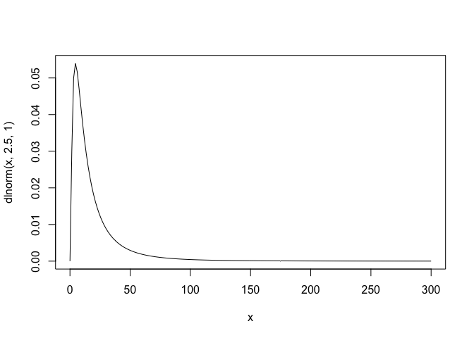<!-- -->

```r
# Seems plausible

N = 100
a = rnorm(N, 2.5, 1)
b = rnorm(N, 0, 0.5)
plot(NULL, xlim=c(-2, 2), ylim=c(0,300))
for(i in 1:N) curve(exp(a[i] + b[i]*x), add = TRUE)
```

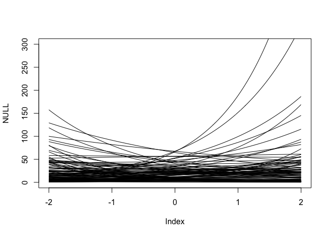<!-- -->


```r
# Model with femininity
m3.4 = ulam(
  alist(
    deaths ~ dpois(lambda),
    log(lambda) <- a + BF*fem_scaled,
    a ~ dnorm(2.5, 1),
    BF ~ dnorm(0, 0.5)
  ), data = hslim, chains = 2, iter = 4e3, cores = 2, log_lik = TRUE
)

# Model with intercept only
m3.5 = ulam(
  alist(
    deaths ~ dpois(lambda),
    log(lambda) <- a,
    a ~ dnorm(2.5, 1)
  ), data = hslim, chains = 2, iter = 4e3, cores = 2, log_lik = TRUE
)
```


```r
precis(m3.4, depth = 2)
```

```
##         mean         sd      5.5%     94.5%    n_eff     Rhat
## a  3.0001151 0.02386855 2.9620297 3.0381179 2136.747 1.000151
## BF 0.2383193 0.02546428 0.1977239 0.2780965 2190.649 1.000391
```

```r
precis(m3.5, depth = 2)
```

```
##      mean        sd     5.5%    94.5%    n_eff      Rhat
## a 3.02612 0.0228015 2.988554 3.061921 1369.548 0.9998003
```

```r
compare(m3.4, m3.5)
```

```
##          WAIC     pWAIC    dWAIC       weight       SE      dSE
## m3.4 4418.768 129.65161  0.00000 9.999997e-01 1000.925       NA
## m3.5 4448.954  79.14471 30.18659 2.786538e-07 1076.354 143.2021
```

The model that includes the slope is a much better fit. 

Which observations fit well and which fit poorly?


```r
probs_int = as.data.frame(link(m3.4, data = data.frame(fem_scaled = seq(-2, 2, 0.1)))) %>% 
  pivot_longer(names_to = "fem", values_to = "pred", cols = V1:V41) %>% 
  mutate(fem_scaled = (as.numeric(str_remove(fem, "V")) - 21)/10)

probs_int_cis = probs_int %>% 
  group_by(fem_scaled) %>% 
  point_interval(pred, .width = 0.89, .point = median, .interval = hdi)
```

```
## Warning: unnest() has a new interface. See ?unnest for details.
## Try `df %>% unnest(c(.lower, .upper))`, with `mutate()` if needed
```

```r
ggplot() +
  geom_ribbon(data = probs_int_cis, aes(x = (fem_scaled*sd_fem + mean_fem), ymin = .lower, ymax = .upper), width = 0.1, fill = "purple", alpha = 0.3) +
  geom_point(data = hslim, aes(x = (fem_scaled*sd_fem + mean_fem), y = deaths)) +
  xlab("femininity") +
  geom_text(data = filter(Hurricanes, deaths > 50), aes(x = femininity, y = deaths, label = name), nudge_x = 0.1, hjust = "left")
```

```
## Warning: Ignoring unknown parameters: width
```

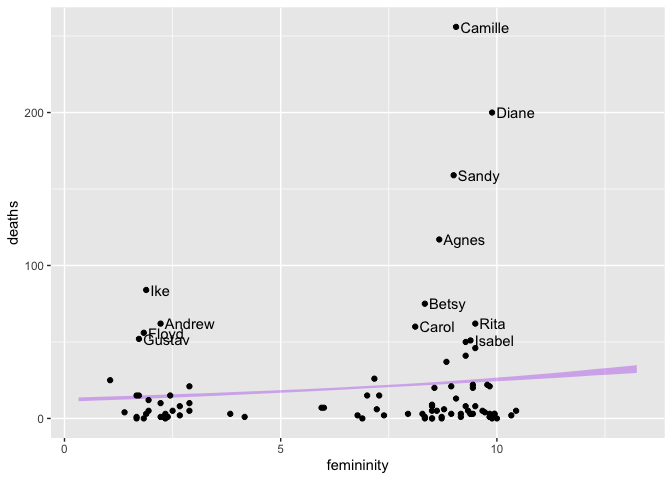<!-- -->

The model might be fitting the mean ok, but there is a lot of variation around the trend. The extreme hurricanes with feminine names are poorly predicted by the mean. 

## 11H2

**Counts are nearly always over-dispersed relative to Poisson. So fit a gamma-Poisson (aka negative-binomial) model to predict deaths using femininity. Show that the over-dispersed model no longer shows as precise a positive association between femininity and deaths, with an 89% interval that overlaps zero. Can you explain why the association diminished in strength?**


```r
# Model with femininity and overdispersion
m3.6 = ulam(
  alist(
    deaths ~ dgampois(lambda, phi),
    log(lambda) <- a + BF*fem_scaled,
    a ~ dnorm(2.5, 1),
    BF ~ dnorm(0, 0.5),
    phi ~ dexp(1)
  ), data = hslim, chains = 2, iter = 4e3, cores = 2, log_lik = TRUE
)
```


```r
precis(m3.6, depth = 2)
```

```
##          mean         sd        5.5%     94.5%    n_eff      Rhat
## a   3.0119368 0.15591465  2.77082684 3.2678729 3418.922 1.0005299
## BF  0.1979671 0.14807930 -0.04172164 0.4292531 4041.653 0.9998977
## phi 0.4543919 0.06159698  0.36448654 0.5581973 3736.329 0.9999077
```

```r
probs_int = as.data.frame(link(m3.6, data = data.frame(fem_scaled = seq(-2, 2, 0.1)))) %>% 
  pivot_longer(names_to = "fem", values_to = "pred", cols = V1:V41) %>% 
  mutate(fem_scaled = (as.numeric(str_remove(fem, "V")) - 21)/10)

probs_int_cis = probs_int %>% 
  group_by(fem_scaled) %>% 
  point_interval(pred, .width = 0.89, .point = median, .interval = hdi)
```

```
## Warning: unnest() has a new interface. See ?unnest for details.
## Try `df %>% unnest(c(.lower, .upper))`, with `mutate()` if needed
```

```r
ggplot() +
  geom_ribbon(data = probs_int_cis, aes(x = (fem_scaled*sd_fem + mean_fem), ymin = .lower, ymax = .upper), width = 0.1, fill = "purple", alpha = 0.3) +
  geom_point(data = hslim, aes(x = (fem_scaled*sd_fem + mean_fem), y = deaths)) +
  xlab("femininity") +
  geom_text(data = filter(Hurricanes, deaths > 50), aes(x = femininity, y = deaths, label = name), nudge_x = 0.1, hjust = "left")
```

```
## Warning: Ignoring unknown parameters: width
```

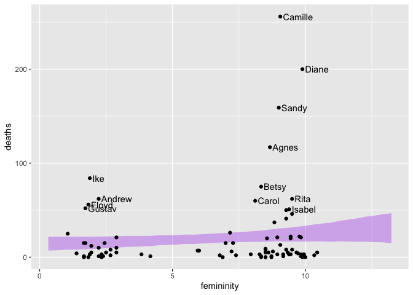<!-- -->

Now there is more uncertainty around the slope and the directionality of the relationship is less clear. In this iteration of the model, the model "expects" some large counts that might exceed the predicted distribution based on the mean, so the large values don't "pull" the mean up as much. 


## 11H6

**The data in data(Fish) are records of visits to a national park. See ?Fish for details. The question of interest is how many fish an average visitor takes per hour, when fishing. The problem is that not everyone tried to fish, so the fish_caught numbers are zero-inflated. As with the monks example in the chapter, there is a process that determines who is fishing (working) and another process that determines fish per hour (manuscripts per day), conditional on fishing (working). We want to model both. Otherwise we’ll end up with an underestimate of rate of fish extraction from the park.**

**You will model these data using zero-inflated Poisson GLMs. Predict fish_caught as a function of any of the other variables you think are relevant. One thing you must do, however, is use a proper Poisson offset/exposure in the Poisson portion of the zero-inflated model. Then use the hours variable to construct the offset.  This will adjust the model for the differing amount of time individuals spent in the park.**

Fish caught might be affected by whether the group used live bait and the number of adults in the group, in addition to the number of hours spent fishing.


```r
data(Fish)
?Fish

fish = Fish %>% 
  mutate(log_hours = log(hours))

m3.7 = ulam(
  alist(
    fish_caught ~ dgampois(lambda, phi),
    log(lambda) <- a + log_hours + Ba*persons + Bl*livebait,
    a ~ dnorm(0, 1),
    Ba ~ dnorm(0, 1),
    Bl ~ dnorm(0, 1),
    phi ~ dexp(1)
  ), data = fish, chains = 2, iter = 4e3, cores = 2, log_lik = TRUE
)
```


```r
precis(m3.7)
```

```
##           mean         sd        5.5%      94.5%    n_eff     Rhat
## a   -3.3720084 0.43927657 -4.06731635 -2.6746094 1833.438 1.001407
## Ba   1.0210045 0.10585879  0.85393683  1.1927925 2067.372 1.001835
## Bl   0.6115546 0.37882981 -0.01015721  1.2058366 1973.389 1.001833
## phi  0.4949383 0.07201912  0.38910125  0.6156022 2203.590 1.000992
```

Ok, how do we get information of interest out of this model fit? 

Calculating fish per hour for groups of different sizes, with/without live bait.


```r
fish_per_group = as.data.frame(link(m3.7, data = data.frame(persons = c(1, 2, 3, 4, 1, 2, 3, 4), livebait = c(0, 0, 0, 0, 1, 1, 1, 1), log_hours = 0))) %>% 
  rename(a1_b0 = V1, a2_b0 = V2, a3_b0 = V3, a4_b0 = V4, a1_b1 = V5, a2_b1 = V6, a3_b1 = V7, a4_b1 = V8) %>% 
  pivot_longer(names_to = "category", values_to = "estimate", a1_b0:a4_b1) %>% 
  separate(category, into = c("adults", "bait"), remove = FALSE)

fish_cis = fish_per_group %>% 
  group_by(category) %>% 
  point_interval(estimate, .width = 0.89, .point = median, .interval = hdi)%>% 
  separate(category, into = c("adults", "bait"), remove = FALSE)
```

```
## Warning: unnest() has a new interface. See ?unnest for details.
## Try `df %>% unnest(c(.lower, .upper))`, with `mutate()` if needed
```

```r
fish = fish %>% 
  mutate(category = paste0("a", persons, "_", "b", livebait)) %>% 
  separate(category, into = c("adults", "bait"), remove = FALSE)

fish_means = fish %>% 
  group_by(adults, bait) %>% 
  summarize(mean_fish = mean(fish_caught/hours))

ggplot() +
  geom_violin(data = fish, aes(x = adults, y = fish_caught, color = bait)) +
  geom_errorbar(data = fish_cis, aes(x = adults, ymin = .lower, ymax = .upper, color = bait), width = 0.1, size = 1, position  = position_dodge()) +
  geom_point(data = fish_means, aes(x = adults, y = mean_fish, color = bait))
```

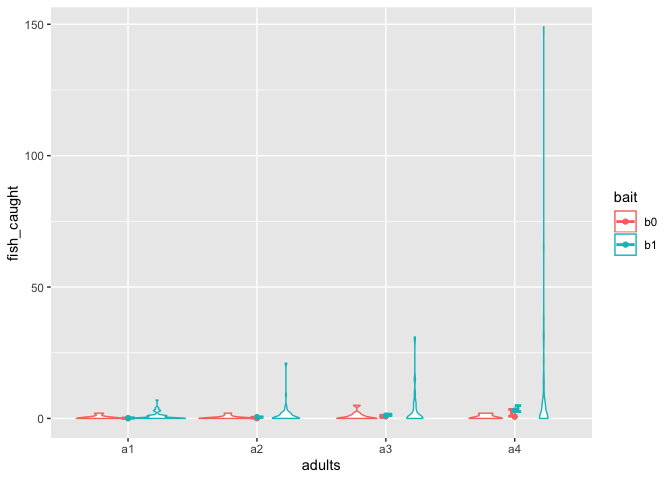<!-- -->

```r
ggplot() +
  geom_violin(data = fish, aes(x = adults, y = fish_caught, color = bait)) +
  geom_errorbar(data = fish_cis, aes(x = adults, ymin = .lower, ymax = .upper, color = bait), width = 0.1, size = 1, position  = position_dodge()) +
  geom_point(data = fish_means, aes(x = adults, y = mean_fish, color = bait)) +
  scale_y_sqrt()
```

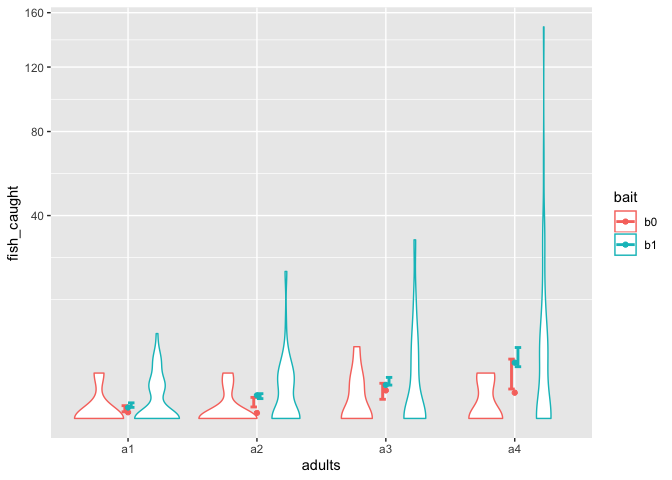<!-- -->

```r
ggplot() +
  geom_errorbar(data = fish_cis, aes(x = adults, ymin = .lower, ymax = .upper, color = bait), width = 0.1, size = 1, position  = position_dodge()) +
  geom_point(data = fish_means, aes(x = adults, y = mean_fish, color = bait)) 
```

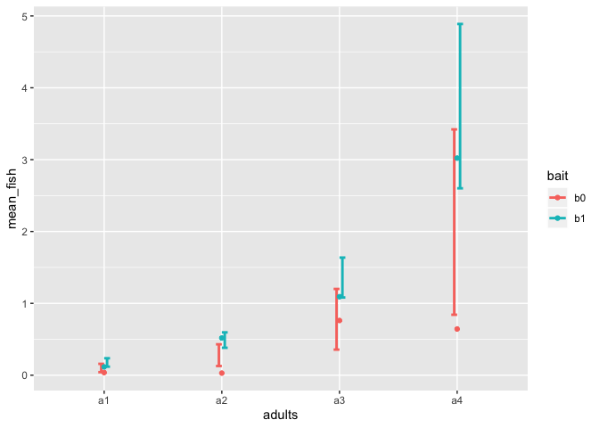<!-- -->


