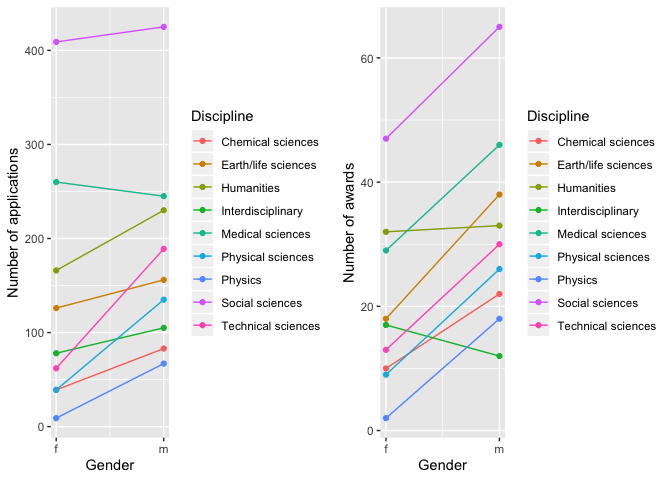
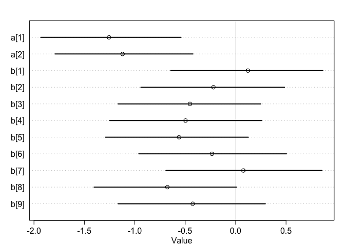

### 10E1

If an event has a probability 0.35, what are the log-odds of the event?


```r
logit(0.35)
```

```
## [1] -0.6190392
```

### 10E2

If an event has log-odds 3.2, what is the probability of the event?


```r
inv_logit(3.2)
```

```
## [1] 0.9608343
```

### 10E3

Suppose that a coefficient in a logistic regression has value 1.7. What does this imply about the proportional change in odds of the outcome?

This indicates that for a unit increase in that coefficient, there is a 1.7x proportional change in the response variable. 

### 10M1

As explained in the chapter, binomial data can be organized in aggregated and disaggregated forms, without any impact on inference. But the likelihood of the data does change when the data are converted between the two formats. Can you explain why?

When each trial is considered a replicate, rather than groups of trials, there are more possible ways to see the data. As a result, the deviance is higher and the loo/waic scores are lower. 


### Week 6 HW 1

The data in data(NWOGrants) are outcomes for scientific funding applications for the Netherlands Organization for Scientific Research (NWO) from 2010–2012 (see van der Lee and Ellemers doi:10.1073/pnas.1510159112). These data have a very similar structure to the UCBAdmit data discussed in Chapter 11.

I want you to consider a similar question: What are the total and indirect causal effects of gender on grant awards? Consider a mediation path (a pipe) through discipline. Draw the corresponding DAG and then use one or more binomial GLMs to answer the question.

Gender -> Award success
Gender -> Discipline -> Award success

Prepare data:

```r
data("NWOGrants")
d = NWOGrants

dat = compose_data(d)
# 1 = female, 2 = male
dat
```

```
## $discipline
##  [1] 1 1 6 6 7 7 3 3 9 9 4 4 2 2 8 8 5 5
## 
## $n_discipline
## [1] 9
## 
## $gender
##  [1] 2 1 2 1 2 1 2 1 2 1 2 1 2 1 2 1 2 1
## 
## $n_gender
## [1] 2
## 
## $applications
##  [1]  83  39 135  39  67   9 230 166 189  62 105  78 156 126 425 409 245
## [18] 260
## 
## $awards
##  [1] 22 10 26  9 18  2 33 32 30 13 12 17 38 18 65 47 46 29
## 
## $n
## [1] 18
```

First with gender only:

```r
m11.1 = ulam(
  alist(
    awards ~ dbinom(applications, p),
    logit(p) <- a[gender],
    a[gender] ~ dnorm(0, 1.5)
  ), data = dat, chains = 4, log_lik = TRUE
  )
```

```
## 
## SAMPLING FOR MODEL '512b3a20decb9881be2700f8516f785d' NOW (CHAIN 1).
## Chain 1: 
## Chain 1: Gradient evaluation took 1.7e-05 seconds
## Chain 1: 1000 transitions using 10 leapfrog steps per transition would take 0.17 seconds.
## Chain 1: Adjust your expectations accordingly!
## Chain 1: 
## Chain 1: 
## Chain 1: Iteration:   1 / 1000 [  0%]  (Warmup)
## Chain 1: Iteration: 100 / 1000 [ 10%]  (Warmup)
## Chain 1: Iteration: 200 / 1000 [ 20%]  (Warmup)
## Chain 1: Iteration: 300 / 1000 [ 30%]  (Warmup)
## Chain 1: Iteration: 400 / 1000 [ 40%]  (Warmup)
## Chain 1: Iteration: 500 / 1000 [ 50%]  (Warmup)
## Chain 1: Iteration: 501 / 1000 [ 50%]  (Sampling)
## Chain 1: Iteration: 600 / 1000 [ 60%]  (Sampling)
## Chain 1: Iteration: 700 / 1000 [ 70%]  (Sampling)
## Chain 1: Iteration: 800 / 1000 [ 80%]  (Sampling)
## Chain 1: Iteration: 900 / 1000 [ 90%]  (Sampling)
## Chain 1: Iteration: 1000 / 1000 [100%]  (Sampling)
## Chain 1: 
## Chain 1:  Elapsed Time: 0.016374 seconds (Warm-up)
## Chain 1:                0.016373 seconds (Sampling)
## Chain 1:                0.032747 seconds (Total)
## Chain 1: 
## 
## SAMPLING FOR MODEL '512b3a20decb9881be2700f8516f785d' NOW (CHAIN 2).
## Chain 2: 
## Chain 2: Gradient evaluation took 6e-06 seconds
## Chain 2: 1000 transitions using 10 leapfrog steps per transition would take 0.06 seconds.
## Chain 2: Adjust your expectations accordingly!
## Chain 2: 
## Chain 2: 
## Chain 2: Iteration:   1 / 1000 [  0%]  (Warmup)
## Chain 2: Iteration: 100 / 1000 [ 10%]  (Warmup)
## Chain 2: Iteration: 200 / 1000 [ 20%]  (Warmup)
## Chain 2: Iteration: 300 / 1000 [ 30%]  (Warmup)
## Chain 2: Iteration: 400 / 1000 [ 40%]  (Warmup)
## Chain 2: Iteration: 500 / 1000 [ 50%]  (Warmup)
## Chain 2: Iteration: 501 / 1000 [ 50%]  (Sampling)
## Chain 2: Iteration: 600 / 1000 [ 60%]  (Sampling)
## Chain 2: Iteration: 700 / 1000 [ 70%]  (Sampling)
## Chain 2: Iteration: 800 / 1000 [ 80%]  (Sampling)
## Chain 2: Iteration: 900 / 1000 [ 90%]  (Sampling)
## Chain 2: Iteration: 1000 / 1000 [100%]  (Sampling)
## Chain 2: 
## Chain 2:  Elapsed Time: 0.017879 seconds (Warm-up)
## Chain 2:                0.015166 seconds (Sampling)
## Chain 2:                0.033045 seconds (Total)
## Chain 2: 
## 
## SAMPLING FOR MODEL '512b3a20decb9881be2700f8516f785d' NOW (CHAIN 3).
## Chain 3: 
## Chain 3: Gradient evaluation took 6e-06 seconds
## Chain 3: 1000 transitions using 10 leapfrog steps per transition would take 0.06 seconds.
## Chain 3: Adjust your expectations accordingly!
## Chain 3: 
## Chain 3: 
## Chain 3: Iteration:   1 / 1000 [  0%]  (Warmup)
## Chain 3: Iteration: 100 / 1000 [ 10%]  (Warmup)
## Chain 3: Iteration: 200 / 1000 [ 20%]  (Warmup)
## Chain 3: Iteration: 300 / 1000 [ 30%]  (Warmup)
## Chain 3: Iteration: 400 / 1000 [ 40%]  (Warmup)
## Chain 3: Iteration: 500 / 1000 [ 50%]  (Warmup)
## Chain 3: Iteration: 501 / 1000 [ 50%]  (Sampling)
## Chain 3: Iteration: 600 / 1000 [ 60%]  (Sampling)
## Chain 3: Iteration: 700 / 1000 [ 70%]  (Sampling)
## Chain 3: Iteration: 800 / 1000 [ 80%]  (Sampling)
## Chain 3: Iteration: 900 / 1000 [ 90%]  (Sampling)
## Chain 3: Iteration: 1000 / 1000 [100%]  (Sampling)
## Chain 3: 
## Chain 3:  Elapsed Time: 0.017 seconds (Warm-up)
## Chain 3:                0.014455 seconds (Sampling)
## Chain 3:                0.031455 seconds (Total)
## Chain 3: 
## 
## SAMPLING FOR MODEL '512b3a20decb9881be2700f8516f785d' NOW (CHAIN 4).
## Chain 4: 
## Chain 4: Gradient evaluation took 6e-06 seconds
## Chain 4: 1000 transitions using 10 leapfrog steps per transition would take 0.06 seconds.
## Chain 4: Adjust your expectations accordingly!
## Chain 4: 
## Chain 4: 
## Chain 4: Iteration:   1 / 1000 [  0%]  (Warmup)
## Chain 4: Iteration: 100 / 1000 [ 10%]  (Warmup)
## Chain 4: Iteration: 200 / 1000 [ 20%]  (Warmup)
## Chain 4: Iteration: 300 / 1000 [ 30%]  (Warmup)
## Chain 4: Iteration: 400 / 1000 [ 40%]  (Warmup)
## Chain 4: Iteration: 500 / 1000 [ 50%]  (Warmup)
## Chain 4: Iteration: 501 / 1000 [ 50%]  (Sampling)
## Chain 4: Iteration: 600 / 1000 [ 60%]  (Sampling)
## Chain 4: Iteration: 700 / 1000 [ 70%]  (Sampling)
## Chain 4: Iteration: 800 / 1000 [ 80%]  (Sampling)
## Chain 4: Iteration: 900 / 1000 [ 90%]  (Sampling)
## Chain 4: Iteration: 1000 / 1000 [100%]  (Sampling)
## Chain 4: 
## Chain 4:  Elapsed Time: 0.018533 seconds (Warm-up)
## Chain 4:                0.014104 seconds (Sampling)
## Chain 4:                0.032637 seconds (Total)
## Chain 4:
```

```r
precis(m11.1, depth = 2)
```

```
##           mean         sd      5.5%    94.5%    n_eff      Rhat
## a[1] -1.737629 0.08241166 -1.870188 -1.60357 1271.617 1.0025376
## a[2] -1.534912 0.06628390 -1.637952 -1.42390 1576.060 0.9994342
```

```r
plot(precis(m11.1, depth = 2))
```

<!-- -->

Women tend to have slightly lower probabilites of being funded.


```r
post = extract.samples(m11.1)
p_award = as.data.frame(inv_logit(post$a))
ggplot(p_award) +
  geom_density(aes(x = V1), alpha = 0.5, color = "black") +
  geom_density(aes(x = V2), alpha = 0.5, color = "blue") +
  xlim(0,1)
```

<!-- -->


Visualise funding rate differences for men and women by discipline.

```r
ggplot(d) +
  geom_point(aes(y = awards/applications, x = as.numeric(gender), color = discipline)) +
  geom_line(aes(y = awards/applications, x = as.numeric(gender), color = discipline)) +
  scale_x_continuous(breaks = c(1, 2), labels = c("f", "m")) +
  labs(x = "Gender", color = "Discipline", y = "Proportion funded")
```

<!-- -->

Women appear especially less likely to be funded than men in Earth/life sciences, Medical sciences, sSocial sciences, and Physics. 

Visualise counts of funding applications and awards for men and women by discipline.

```r
a = ggplot(d) +
  geom_point(aes(y = applications, x = as.numeric(gender), color = discipline)) +
  geom_line(aes(y = applications, x = as.numeric(gender), color = discipline)) +
  scale_x_continuous(breaks = c(1, 2), labels = c("f", "m")) +
  labs(x = "Gender", color = "Discipline", y = "Number of applications")


b = ggplot(d) +
  geom_point(aes(y = awards, x = as.numeric(gender), color = discipline)) +
  geom_line(aes(y = awards, x = as.numeric(gender), color = discipline)) +
  scale_x_continuous(breaks = c(1, 2), labels = c("f", "m")) +
  labs(x = "Gender", color = "Discipline", y = "Number of awards")

plot_grid(a,b)
```

<!-- -->
In two fields where the most awards are made (Social and Medical), women are less likelty to recieve awards, even though they are submitting similar numbers of applications.

Now with gender and discipline:

```r
m11.2 = ulam(
  alist(
    awards ~ dbinom(applications, p),
    logit(p) <- a[gender] + b[discipline],
    a[gender] ~ dnorm(0, 1.5),
    b[discipline] ~ dnorm(0, 1.5)
  ), data = dat, chains = 4, log_lik = TRUE
  )
```

```
## 
## SAMPLING FOR MODEL 'f3f7a3c9fb31da9c3c6b12f206f8ccd6' NOW (CHAIN 1).
## Chain 1: 
## Chain 1: Gradient evaluation took 1.8e-05 seconds
## Chain 1: 1000 transitions using 10 leapfrog steps per transition would take 0.18 seconds.
## Chain 1: Adjust your expectations accordingly!
## Chain 1: 
## Chain 1: 
## Chain 1: Iteration:   1 / 1000 [  0%]  (Warmup)
## Chain 1: Iteration: 100 / 1000 [ 10%]  (Warmup)
## Chain 1: Iteration: 200 / 1000 [ 20%]  (Warmup)
## Chain 1: Iteration: 300 / 1000 [ 30%]  (Warmup)
## Chain 1: Iteration: 400 / 1000 [ 40%]  (Warmup)
## Chain 1: Iteration: 500 / 1000 [ 50%]  (Warmup)
## Chain 1: Iteration: 501 / 1000 [ 50%]  (Sampling)
## Chain 1: Iteration: 600 / 1000 [ 60%]  (Sampling)
## Chain 1: Iteration: 700 / 1000 [ 70%]  (Sampling)
## Chain 1: Iteration: 800 / 1000 [ 80%]  (Sampling)
## Chain 1: Iteration: 900 / 1000 [ 90%]  (Sampling)
## Chain 1: Iteration: 1000 / 1000 [100%]  (Sampling)
## Chain 1: 
## Chain 1:  Elapsed Time: 0.07377 seconds (Warm-up)
## Chain 1:                0.061704 seconds (Sampling)
## Chain 1:                0.135474 seconds (Total)
## Chain 1: 
## 
## SAMPLING FOR MODEL 'f3f7a3c9fb31da9c3c6b12f206f8ccd6' NOW (CHAIN 2).
## Chain 2: 
## Chain 2: Gradient evaluation took 7e-06 seconds
## Chain 2: 1000 transitions using 10 leapfrog steps per transition would take 0.07 seconds.
## Chain 2: Adjust your expectations accordingly!
## Chain 2: 
## Chain 2: 
## Chain 2: Iteration:   1 / 1000 [  0%]  (Warmup)
## Chain 2: Iteration: 100 / 1000 [ 10%]  (Warmup)
## Chain 2: Iteration: 200 / 1000 [ 20%]  (Warmup)
## Chain 2: Iteration: 300 / 1000 [ 30%]  (Warmup)
## Chain 2: Iteration: 400 / 1000 [ 40%]  (Warmup)
## Chain 2: Iteration: 500 / 1000 [ 50%]  (Warmup)
## Chain 2: Iteration: 501 / 1000 [ 50%]  (Sampling)
## Chain 2: Iteration: 600 / 1000 [ 60%]  (Sampling)
## Chain 2: Iteration: 700 / 1000 [ 70%]  (Sampling)
## Chain 2: Iteration: 800 / 1000 [ 80%]  (Sampling)
## Chain 2: Iteration: 900 / 1000 [ 90%]  (Sampling)
## Chain 2: Iteration: 1000 / 1000 [100%]  (Sampling)
## Chain 2: 
## Chain 2:  Elapsed Time: 0.073399 seconds (Warm-up)
## Chain 2:                0.059658 seconds (Sampling)
## Chain 2:                0.133057 seconds (Total)
## Chain 2: 
## 
## SAMPLING FOR MODEL 'f3f7a3c9fb31da9c3c6b12f206f8ccd6' NOW (CHAIN 3).
## Chain 3: 
## Chain 3: Gradient evaluation took 8e-06 seconds
## Chain 3: 1000 transitions using 10 leapfrog steps per transition would take 0.08 seconds.
## Chain 3: Adjust your expectations accordingly!
## Chain 3: 
## Chain 3: 
## Chain 3: Iteration:   1 / 1000 [  0%]  (Warmup)
## Chain 3: Iteration: 100 / 1000 [ 10%]  (Warmup)
## Chain 3: Iteration: 200 / 1000 [ 20%]  (Warmup)
## Chain 3: Iteration: 300 / 1000 [ 30%]  (Warmup)
## Chain 3: Iteration: 400 / 1000 [ 40%]  (Warmup)
## Chain 3: Iteration: 500 / 1000 [ 50%]  (Warmup)
## Chain 3: Iteration: 501 / 1000 [ 50%]  (Sampling)
## Chain 3: Iteration: 600 / 1000 [ 60%]  (Sampling)
## Chain 3: Iteration: 700 / 1000 [ 70%]  (Sampling)
## Chain 3: Iteration: 800 / 1000 [ 80%]  (Sampling)
## Chain 3: Iteration: 900 / 1000 [ 90%]  (Sampling)
## Chain 3: Iteration: 1000 / 1000 [100%]  (Sampling)
## Chain 3: 
## Chain 3:  Elapsed Time: 0.067311 seconds (Warm-up)
## Chain 3:                0.070573 seconds (Sampling)
## Chain 3:                0.137884 seconds (Total)
## Chain 3: 
## 
## SAMPLING FOR MODEL 'f3f7a3c9fb31da9c3c6b12f206f8ccd6' NOW (CHAIN 4).
## Chain 4: 
## Chain 4: Gradient evaluation took 8e-06 seconds
## Chain 4: 1000 transitions using 10 leapfrog steps per transition would take 0.08 seconds.
## Chain 4: Adjust your expectations accordingly!
## Chain 4: 
## Chain 4: 
## Chain 4: Iteration:   1 / 1000 [  0%]  (Warmup)
## Chain 4: Iteration: 100 / 1000 [ 10%]  (Warmup)
## Chain 4: Iteration: 200 / 1000 [ 20%]  (Warmup)
## Chain 4: Iteration: 300 / 1000 [ 30%]  (Warmup)
## Chain 4: Iteration: 400 / 1000 [ 40%]  (Warmup)
## Chain 4: Iteration: 500 / 1000 [ 50%]  (Warmup)
## Chain 4: Iteration: 501 / 1000 [ 50%]  (Sampling)
## Chain 4: Iteration: 600 / 1000 [ 60%]  (Sampling)
## Chain 4: Iteration: 700 / 1000 [ 70%]  (Sampling)
## Chain 4: Iteration: 800 / 1000 [ 80%]  (Sampling)
## Chain 4: Iteration: 900 / 1000 [ 90%]  (Sampling)
## Chain 4: Iteration: 1000 / 1000 [100%]  (Sampling)
## Chain 4: 
## Chain 4:  Elapsed Time: 0.070689 seconds (Warm-up)
## Chain 4:                0.0609 seconds (Sampling)
## Chain 4:                0.131589 seconds (Total)
## Chain 4:
```

```
## Warning: Bulk Effective Samples Size (ESS) is too low, indicating posterior means and medians may be unreliable.
## Running the chains for more iterations may help. See
## http://mc-stan.org/misc/warnings.html#bulk-ess
```

```
## Warning: Tail Effective Samples Size (ESS) is too low, indicating posterior variances and tail quantiles may be unreliable.
## Running the chains for more iterations may help. See
## http://mc-stan.org/misc/warnings.html#tail-ess
```

```r
precis(m11.2, depth = 2)
```

```
##             mean        sd       5.5%        94.5%    n_eff     Rhat
## a[1] -1.25651836 0.4366574 -1.9326733 -0.541526429 135.8595 1.039810
## a[2] -1.12111840 0.4315495 -1.7913761 -0.423079953 131.6844 1.040232
## b[1]  0.12159994 0.4710717 -0.6436057  0.865219232 165.7003 1.029418
## b[2] -0.21992172 0.4506269 -0.9392902  0.484664018 150.6239 1.037690
## b[3] -0.45291830 0.4416058 -1.1661458  0.248883427 141.7589 1.037651
## b[4] -0.49667834 0.4726128 -1.2487766  0.257087126 149.0674 1.037820
## b[5] -0.56103824 0.4441740 -1.2906279  0.126423365 137.0199 1.037501
## b[6] -0.23472491 0.4620500 -0.9609572  0.505117903 153.3232 1.037466
## b[7]  0.07684096 0.4961500 -0.6913041  0.855633577 164.9256 1.036709
## b[8] -0.67734035 0.4427671 -1.4035904  0.009830338 138.2403 1.039021
## b[9] -0.42555601 0.4592305 -1.1654405  0.294480756 149.9966 1.034154
```

```r
plot(precis(m11.2, depth = 2))
```

<!-- -->
This model indicates that men and women are funded at similar rates, but there is also variation in the rates at which different disciplines are funded. 

1 = Chemical sciences 
2 = Earth/life sciences 
3 = Humanities 
4 = Interdisciplinary 
5 = Medical sciences 
6 = Physical sciences 
7 = Physics 
8 = Social sciences 
9 = Technical sciences

Social sciences has lower success rates per application, while physics has higher success rates per application. 

One of the raw data plots made me think that there was an interaction between gender and discipline, but I'm not sure we have the power to look at that, since we have just one observation per combination. 

What is your causal interpretation? If NWO’s goal is to equalize rates of funding between the genders, what type of intervention would be most effective?

They could increase funding rates for disciplines where women are more likely to get awards. They could encourage women to enter fields where they are more likely to be funded, they could implement practices to reduce bias in fields where women are less than men. 


### Week 6 HW 2

Suppose that the NWO Grants sample has an unobserved confound that influences both choice of discipline and the probability of an award. One example of such a confound could be the career stage of each applicant. Suppose that in some disciplines, junior scholars apply for most of the grants. In other disciplines, scholars from all career stages compete. As a result, career stage influences discipline as well as the probability of being awarded a grant.

Add these influences to your DAG from Problem 1. What happens now when you condition on discipline? Does it provide an un-confounded estimate of the direct path from gender to an award? Why or why not? Justify your answer with the back-door criterion. Hint: this is structurally a lot like the grandparents-parents- children-neighborhoods example from a previous week.

If you have trouble thinking this though, try simulating fake data, assuming your DAG is true. Then analyze it using the model from Problem 1. What do you conclude? Is it possible for gender to have a real direct causal influence but for a regression conditioning on both gender and discipline to suggest zero influence?
