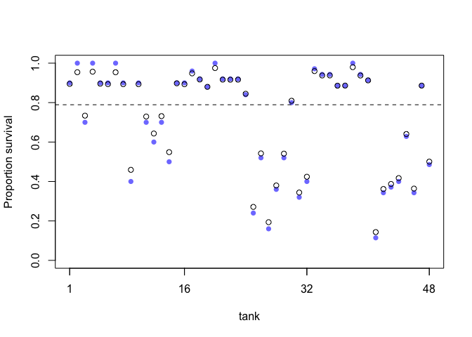

## Book practice


```r
library(rethinking)
data(reedfrogs)
d = reedfrogs
str(d)
```

```
## 'data.frame':	48 obs. of  5 variables:
##  $ density : int  10 10 10 10 10 10 10 10 10 10 ...
##  $ pred    : Factor w/ 2 levels "no","pred": 1 1 1 1 1 1 1 1 2 2 ...
##  $ size    : Factor w/ 2 levels "big","small": 1 1 1 1 2 2 2 2 1 1 ...
##  $ surv    : int  9 10 7 10 9 9 10 9 4 9 ...
##  $ propsurv: num  0.9 1 0.7 1 0.9 0.9 1 0.9 0.4 0.9 ...
```

```r
d$tank = 1:nrow(d)
dat = list(s = d$surv, n = d$density, tank = d$tank)
```


```r
m13.1 = ulam(
  alist(
    s ~ dbinom(n, p),
    logit(p) <- a[tank],
    a[tank] ~ dnorm(0, 1.5)),
  data = dat, chains = 4, log_lik = TRUE
  )

m13.2 = ulam(
  alist(
    s ~ dbinom(n, p),
    logit(p) <- a[tank],
    a[tank] ~ dnorm(a_bar, sigma),
    a_bar ~ dnorm(0, 1.5),
    sigma ~ dexp(1)),
  data = dat, chains = 4, log_lik = TRUE
  )
```


```r
precis(m13.1, depth = 2)
```

```
##              mean        sd        5.5%        94.5%    n_eff      Rhat
## a[1]   1.72060613 0.7715914  0.58285360  2.979004297 3878.002 0.9991780
## a[2]   2.37123005 0.8745005  1.05099069  3.866959364 3828.384 0.9991679
## a[3]   0.76449652 0.6356952 -0.23788782  1.779153984 4151.543 0.9988453
## a[4]   2.40390127 0.8871170  1.11198660  3.917311181 3396.798 0.9996130
## a[5]   1.71903279 0.7777882  0.53164553  3.028999833 3583.607 0.9998072
## a[6]   1.71448152 0.7669538  0.57085630  3.005418504 4093.667 0.9982675
## a[7]   2.40837559 0.9260606  1.08495786  3.944130269 2762.607 0.9999126
## a[8]   1.73056706 0.7677563  0.56348604  3.078067474 3279.791 0.9991675
## a[9]  -0.35563610 0.6063273 -1.36226639  0.639514038 3934.796 0.9984442
## a[10]  1.73240844 0.7875720  0.53141319  3.094032734 4720.319 0.9991418
## a[11]  0.76867267 0.6331171 -0.20840639  1.804733110 4745.790 0.9992370
## a[12]  0.37124638 0.6089999 -0.57884773  1.350751515 5356.347 0.9996587
## a[13]  0.77183249 0.6638060 -0.23309438  1.886041259 4597.851 0.9982522
## a[14]  0.01929417 0.6113424 -0.93188616  0.991403945 5144.218 0.9997290
## a[15]  1.69735771 0.7723685  0.52235329  3.047867947 3988.782 0.9992050
## a[16]  1.72465052 0.7663014  0.57793455  3.017883405 3608.613 0.9996581
## a[17]  2.54438043 0.6826239  1.53417684  3.697647318 4186.328 0.9981805
## a[18]  2.13964529 0.5965356  1.28081793  3.127667072 3193.528 0.9989360
## a[19]  1.80287448 0.5204174  1.02420111  2.667988813 5142.878 0.9981819
## a[20]  3.08081719 0.8031296  1.87561809  4.466054710 4205.928 0.9984326
## a[21]  2.14117594 0.5861907  1.29299123  3.098872252 4005.973 0.9984010
## a[22]  2.14138298 0.5789225  1.26209489  3.135867279 4335.811 0.9988644
## a[23]  2.14691431 0.5991972  1.27308446  3.138077980 4079.279 0.9988181
## a[24]  1.54037039 0.5025504  0.77592439  2.375834800 4465.343 0.9991731
## a[25] -1.09475937 0.4499836 -1.85394642 -0.400514013 4656.612 0.9993613
## a[26]  0.06877399 0.4067469 -0.56590307  0.719891054 4821.063 0.9982774
## a[27] -1.56436907 0.5264357 -2.42782997 -0.756496687 3298.320 0.9993433
## a[28] -0.55502701 0.4188488 -1.23551482  0.101233150 4735.252 0.9986813
## a[29]  0.08020301 0.3903075 -0.53860404  0.683152932 4853.892 0.9988951
## a[30]  1.30157268 0.4650485  0.57123756  2.074559883 4724.663 0.9994223
## a[31] -0.71612290 0.4223509 -1.38864655 -0.046699032 4973.192 0.9983560
## a[32] -0.38779598 0.4103665 -1.04089142  0.248364756 6468.485 0.9990463
## a[33]  2.84574966 0.6734888  1.84929089  4.001760753 3859.978 0.9986086
## a[34]  2.46448795 0.5866584  1.59463525  3.471771815 3828.269 0.9991868
## a[35]  2.45688901 0.5858661  1.59473175  3.431317944 3716.300 0.9993865
## a[36]  1.91046141 0.4670919  1.22223277  2.681305171 4084.941 0.9984676
## a[37]  1.91271908 0.4828918  1.18218366  2.730060528 3807.353 0.9989138
## a[38]  3.34424576 0.7706232  2.25095537  4.645236772 3624.880 0.9983260
## a[39]  2.48629704 0.5719219  1.63439847  3.455469558 3096.440 0.9991004
## a[40]  2.15615358 0.5305781  1.34210568  3.066866990 4732.261 0.9992017
## a[41] -1.91052312 0.4821026 -2.69471633 -1.201631776 3305.031 1.0000678
## a[42] -0.63977432 0.3610046 -1.20869351 -0.077534776 4895.271 0.9987767
## a[43] -0.52134229 0.3347494 -1.06978122  0.009342801 4261.673 0.9989163
## a[44] -0.40196273 0.3417765 -0.95275844  0.131912983 3923.601 0.9988370
## a[45]  0.50790359 0.3486236 -0.03346976  1.062549176 3929.794 0.9989788
## a[46] -0.62594090 0.3539658 -1.19482022 -0.075273381 4573.709 0.9985466
## a[47]  1.91432835 0.4892441  1.15797920  2.742486797 4790.641 0.9984751
## a[48] -0.05623810 0.3371049 -0.58828043  0.479542802 2949.629 0.9996184
```

```r
precis(m13.2, depth = 2)
```

```
##               mean        sd         5.5%       94.5%    n_eff      Rhat
## a[1]   2.141494498 0.9032827  0.840817588  3.67756445 3432.495 0.9991623
## a[2]   3.034142481 1.0885387  1.412839498  4.93531621 3338.346 0.9991702
## a[3]   1.014202909 0.6697148  0.010316613  2.11929818 3556.672 0.9986567
## a[4]   3.097933313 1.1464097  1.499736954  5.04239085 2087.525 0.9989413
## a[5]   2.153044513 0.8658099  0.810720309  3.62298136 2279.330 0.9985694
## a[6]   2.128679919 0.8855495  0.773544537  3.66070038 2586.209 0.9990595
## a[7]   3.028588119 1.1049333  1.440894372  4.94610053 2702.450 1.0007120
## a[8]   2.126267192 0.9108645  0.831678095  3.65771922 3650.160 0.9993450
## a[9]  -0.163645380 0.6421243 -1.227234964  0.80226342 3112.486 0.9987950
## a[10]  2.126365536 0.8711653  0.868883799  3.62287323 2589.227 0.9990001
## a[11]  0.991033419 0.6621305  0.005981718  2.08521918 3323.300 0.9995142
## a[12]  0.589772764 0.6323055 -0.387542017  1.61960149 3451.168 0.9986825
## a[13]  1.001978222 0.6492030  0.003840586  2.07491099 3849.147 0.9989068
## a[14]  0.195739810 0.5961105 -0.774450266  1.16887640 3278.095 0.9992475
## a[15]  2.172714432 0.8890522  0.878465905  3.66016469 2904.151 0.9993259
## a[16]  2.124370986 0.8567186  0.868578634  3.55927105 2315.863 0.9983650
## a[17]  2.907259330 0.8003644  1.778438292  4.28732114 2111.200 0.9998435
## a[18]  2.404282030 0.6814996  1.400678125  3.57569815 2932.516 0.9990212
## a[19]  1.990978904 0.5880859  1.136048872  2.98233354 3918.037 0.9986957
## a[20]  3.668298317 1.0100053  2.261981583  5.37760762 2097.624 1.0023720
## a[21]  2.395521597 0.6723171  1.410311348  3.53811716 2998.045 0.9991148
## a[22]  2.389389979 0.6502041  1.443104938  3.49891354 2579.601 0.9997116
## a[23]  2.393851548 0.6498926  1.426871280  3.48841576 3021.391 0.9993997
## a[24]  1.693945868 0.5225178  0.911512993  2.56457204 3950.584 0.9986334
## a[25] -0.988666192 0.4401653 -1.704705651 -0.29988355 3045.966 0.9990022
## a[26]  0.169996572 0.4086829 -0.474175039  0.81191630 3601.991 0.9999948
## a[27] -1.426697239 0.4884314 -2.256264202 -0.67403475 2939.780 0.9997451
## a[28] -0.490283882 0.4143059 -1.174024913  0.13661452 3701.631 0.9992931
## a[29]  0.164979351 0.4176062 -0.505381227  0.83460433 3788.606 0.9987072
## a[30]  1.445698902 0.4919306  0.697239061  2.29681364 3246.356 0.9987102
## a[31] -0.645232865 0.4072485 -1.300097850 -0.05019432 3659.076 0.9995800
## a[32] -0.306356782 0.3910264 -0.925911355  0.31854063 4097.817 0.9996745
## a[33]  3.173497099 0.7593129  2.086317196  4.47904280 2900.545 0.9993528
## a[34]  2.708305379 0.6639962  1.753001616  3.80579136 2913.983 0.9992994
## a[35]  2.711889835 0.6514863  1.773446347  3.79394069 2547.702 1.0004583
## a[36]  2.047788741 0.4971264  1.299766836  2.85789051 3345.903 0.9997806
## a[37]  2.053782374 0.5058451  1.321580793  2.89441234 3440.272 0.9991168
## a[38]  3.872925458 0.9640547  2.553972507  5.45669211 2436.644 1.0021219
## a[39]  2.704724527 0.6481371  1.756725529  3.80778138 2832.092 0.9982989
## a[40]  2.345878775 0.5529339  1.503144780  3.27585925 3465.980 0.9984281
## a[41] -1.787673247 0.4697350 -2.561146761 -1.08603827 4119.802 0.9987778
## a[42] -0.567178262 0.3363970 -1.116934577 -0.01930372 2927.217 0.9991807
## a[43] -0.458439964 0.3540811 -1.026101010  0.12225826 3953.022 0.9993705
## a[44] -0.334327231 0.3327692 -0.868226639  0.20189759 4042.744 0.9987931
## a[45]  0.578049302 0.3510592  0.028249688  1.13503716 3548.292 0.9995618
## a[46] -0.558159158 0.3444832 -1.130629356 -0.02244103 5238.806 0.9982714
## a[47]  2.051641298 0.5125345  1.278748765  2.88555604 3125.615 1.0003555
## a[48]  0.002654137 0.3241537 -0.508768417  0.51900075 4708.728 0.9983689
## a_bar  1.338950109 0.2599137  0.934195314  1.73806507 3010.537 0.9990668
## sigma  1.610670928 0.2165131  1.295900555  1.98331960 1166.601 1.0014588
```

```r
compare(m13.1, m13.2)
```

```
##           WAIC    pWAIC    dWAIC       weight       SE      dSE
## m13.2 200.7929 21.26133  0.00000 0.9990689766 7.152676       NA
## m13.1 214.7495 25.57198 13.95659 0.0009310234 4.631066 3.751624
```

```r
post = extract.samples(m13.2)
d$propsurv.est = logistic(apply(post$a, 2, mean))
plot(d$propsurv, ylim = c(0, 1), pch = 16, xaxt = "n", xlab = "tank", ylab = "Proportion survival", col = rangi2)
axis(1, at = c(1, 16, 32, 48, labels = c(1, 16, 32, 48)))
points(d$propsurv.est)
abline(h=mean(inv_logit(post$a_bar)), lty = 2)
```

<!-- -->


## 12E1

Normal(0, 1) will result in more shrinkage, since the smaller standard deviation will produce estimates closer to the mean of 0.


## 12E2


```r
m = ulam(
  alist(
    y ~ dbinom(1, p),
    logit(p) <- a[group] + b*x,
    a[group] ~ dnorm(0, 10),
    b ~ ndnorm(0, 1))
  )
```

## 12E3


```r
m = ulam(
  alist(
    y ~ dnorm(mu, sigma),
    mu <- a[group] + b*x,
    a[group] ~ dnorm(0, 10),
    b ~ ndnorm(0, 1),
    sigma ~ dcauchy(0, 2)),
  )
```

## 12M1


## 12M2


## 12H1


