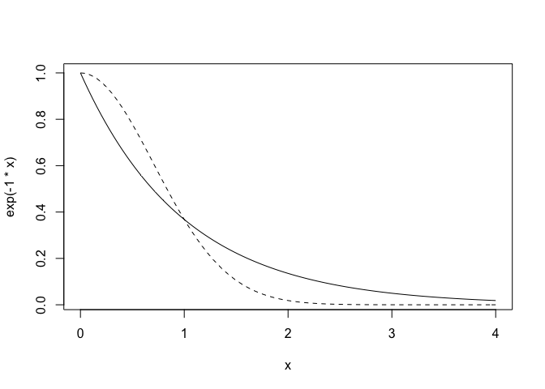
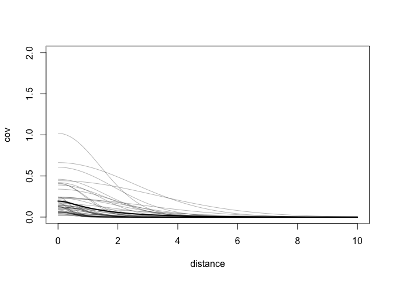
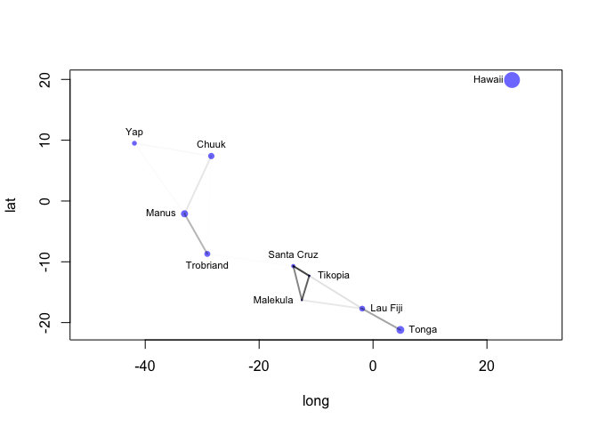
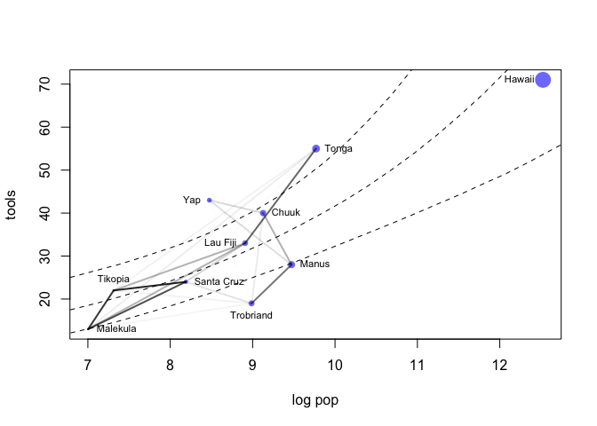

## Code from book chapter 14.5


```r
library(rethinking)
data("islandsDistMatrix")
Dmat = islandsDistMatrix

colnames(Dmat) = c("Ml", "Ti", "SC", "Ya", "Fi", "Tr", "Ch", "Mn", "To", "Ha")
round(Dmat, 1)
```

```
##             Ml  Ti  SC  Ya  Fi  Tr  Ch  Mn  To  Ha
## Malekula   0.0 0.5 0.6 4.4 1.2 2.0 3.2 2.8 1.9 5.7
## Tikopia    0.5 0.0 0.3 4.2 1.2 2.0 2.9 2.7 2.0 5.3
## Santa Cruz 0.6 0.3 0.0 3.9 1.6 1.7 2.6 2.4 2.3 5.4
## Yap        4.4 4.2 3.9 0.0 5.4 2.5 1.6 1.6 6.1 7.2
## Lau Fiji   1.2 1.2 1.6 5.4 0.0 3.2 4.0 3.9 0.8 4.9
## Trobriand  2.0 2.0 1.7 2.5 3.2 0.0 1.8 0.8 3.9 6.7
## Chuuk      3.2 2.9 2.6 1.6 4.0 1.8 0.0 1.2 4.8 5.8
## Manus      2.8 2.7 2.4 1.6 3.9 0.8 1.2 0.0 4.6 6.7
## Tonga      1.9 2.0 2.3 6.1 0.8 3.9 4.8 4.6 0.0 5.0
## Hawaii     5.7 5.3 5.4 7.2 4.9 6.7 5.8 6.7 5.0 0.0
```

```r
# compare linear and exponential decay
curve(exp(-1*x), from = 0, to  = 4)
curve(exp(-1*x^2), from = 0, to  = 4, add = TRUE, lty = 2)
```

<!-- -->

```r
data("Kline2")

d = Kline2
d$society = 1:10

dat_list = list(T = d$total_tools,
                P = d$population,
                society = d$society,
                Dmat = islandsDistMatrix)

m14.7 = ulam(
  alist(
    T ~ dpois(lambda),
    lambda <- (a*P^b/g)*exp(k[society]),
    vector[10]:k ~ multi_normal(0, SIGMA),
    matrix[10, 10]:SIGMA <- cov_GPL2(Dmat, etasq, rhosq, 0.01),
    c(a,b,g) ~ dexp(1),
    etasq ~ dexp(2),
    rhosq ~ dexp(0.5)
  ), data = dat_list, chains = 4, cores = 4, iter = 2000, log_lik = TRUE)
    
precis(m14.7, depth = 3)
```

```
##              mean         sd        5.5%        94.5%     n_eff     Rhat
## k[1]  -0.17270385 0.30064813 -0.64947560 0.2986574448  702.0055 1.000881
## k[2]  -0.02177091 0.28821936 -0.47877336 0.4326747746  623.1393 1.002110
## k[3]  -0.06982502 0.27422543 -0.50719715 0.3506360923  652.2831 1.002197
## k[4]   0.35506329 0.26033943 -0.03618797 0.7801184181  694.1010 1.006233
## k[5]   0.08302581 0.25794535 -0.29764209 0.4950002339  648.1067 1.006527
## k[6]  -0.37915849 0.26413471 -0.80937269 0.0009310554  732.5388 1.001720
## k[7]   0.15149198 0.25232380 -0.20717262 0.5575232045  639.3399 1.003968
## k[8]  -0.20543119 0.25447930 -0.60052811 0.1846160824  705.8663 1.003321
## k[9]   0.27399818 0.24639810 -0.10065863 0.6561752389  668.4340 1.007301
## k[10] -0.14562259 0.35045841 -0.72186951 0.3972997974  915.0285 1.005453
## g      0.59342202 0.59110350  0.07300654 1.6268796396 1564.0028 1.001293
## b      0.27292544 0.08512598  0.14165141 0.4108276915 1072.3943 1.001400
## a      1.42643844 1.08324532  0.26108624 3.4017478338 1527.9303 1.002116
## etasq  0.19152610 0.19647753  0.02925608 0.5302921760  966.4015 1.005396
## rhosq  1.32466216 1.58697599  0.08617739 4.3920985317 2008.1478 1.000608
```

```r
post = extract.samples(m14.7)

plot(NULL, xlab = "distance", ylab = "cov", xlim = c(0,10), ylim = c(0,2))

x_seq = seq(from = 0, to = 10, length.out = 100)
pmcov = sapply(x_seq, function(x) post$etasq*exp(-post$rhosq*x^2))
pmcov_mu = apply(pmcov, 2, mean)
lines(x_seq, pmcov_mu, lwd = 2)

for (i in 1:50)
  curve(post$etasq[i]*exp(-post$rhosq[i]*x^2), add = TRUE, col = col.alpha("black", 0.3))
```

<!-- -->

```r
K = matrix(0, nrow = 10, ncol = 10)

for(i in 1:10)
  for(j in 1:10)
    K[i,j] = median(post$etasq)*exp(-median(post$rhosq)*islandsDistMatrix[i,j]^2)
diag(K) = median(post$etasq) + 0.01

round(K, 2)
```

```
##       [,1] [,2] [,3] [,4] [,5] [,6] [,7] [,8] [,9] [,10]
##  [1,] 0.14 0.11 0.10 0.00 0.04 0.01 0.00 0.00 0.01  0.00
##  [2,] 0.11 0.14 0.12 0.00 0.04 0.01 0.00 0.00 0.01  0.00
##  [3,] 0.10 0.12 0.14 0.00 0.02 0.02 0.00 0.00 0.00  0.00
##  [4,] 0.00 0.00 0.00 0.14 0.00 0.00 0.02 0.02 0.00  0.00
##  [5,] 0.04 0.04 0.02 0.00 0.14 0.00 0.00 0.00 0.09  0.00
##  [6,] 0.01 0.01 0.02 0.00 0.00 0.14 0.01 0.08 0.00  0.00
##  [7,] 0.00 0.00 0.00 0.02 0.00 0.01 0.14 0.04 0.00  0.00
##  [8,] 0.00 0.00 0.00 0.02 0.00 0.08 0.04 0.14 0.00  0.00
##  [9,] 0.01 0.01 0.00 0.00 0.09 0.00 0.00 0.00 0.14  0.00
## [10,] 0.00 0.00 0.00 0.00 0.00 0.00 0.00 0.00 0.00  0.14
```

```r
Rho = round(cov2cor(K), 2)

colnames(Rho) = c("Ml", "Ti", "SC", "Ya", "Fi", "Tr", "Ch", "Mn", "To", "Ha")
rownames(Rho) = colnames(Rho)
Rho
```

```
##      Ml   Ti   SC   Ya   Fi   Tr   Ch   Mn   To Ha
## Ml 1.00 0.79 0.69 0.00 0.30 0.04 0.00 0.00 0.07  0
## Ti 0.79 1.00 0.86 0.00 0.30 0.05 0.00 0.00 0.05  0
## SC 0.69 0.86 1.00 0.00 0.16 0.11 0.01 0.01 0.02  0
## Ya 0.00 0.00 0.00 1.00 0.00 0.01 0.15 0.13 0.00  0
## Fi 0.30 0.30 0.16 0.00 1.00 0.00 0.00 0.00 0.60  0
## Tr 0.04 0.05 0.11 0.01 0.00 1.00 0.08 0.54 0.00  0
## Ch 0.00 0.00 0.01 0.15 0.00 0.08 1.00 0.31 0.00  0
## Mn 0.00 0.00 0.01 0.13 0.00 0.54 0.31 1.00 0.00  0
## To 0.07 0.05 0.02 0.00 0.60 0.00 0.00 0.00 1.00  0
## Ha 0.00 0.00 0.00 0.00 0.00 0.00 0.00 0.00 0.00  1
```

```r
psize = d$logpop/max(d$logpop)
psize = exp(psize*1.5) - 2

plot(d$lon2, d$lat, xlab = "long", ylab = "lat", col = rangi2, cex = psize, pch = 16, xlim = c(-50, 30))
labels = as.character(d$culture)
text(d$lon2, d$lat, labels = labels, cex = 0.7, pos = c(2, 4, 3, 3, 4, 1, 3, 2, 4, 2))

for(i in 1:10)
  for(j in 1:10)
    if(i < j)
      lines(c(d$lon2[i], d$lon2[j]), c(d$lat[i], d$lat[j]), 
            lwd = 2, col = col.alpha("black", Rho[i,j]^2))
```

<!-- -->

```r
logpop.seq = seq(from = 6, to = 14, length.out = 30)

lambda = sapply(logpop.seq, function(lp) post$a*exp(lp)^post$b/post$g)
lambda.median = apply(lambda, 2, median)
lambda.PI80 = apply(lambda, 2, PI, prob = 0.8)

plot(d$logpop, d$total_tools, col = rangi2, cex = psize, pch = 16, xlab = "log pop", ylab = "tools")
text(d$logpop, d$total_tools, labels = labels, cex = 0.7, pos = c(4,3,4,2,2,1,4,4,4,2))

lines(logpop.seq, lambda.median, lty = 2)
lines(logpop.seq, lambda.PI80[1,], lty = 2)
lines(logpop.seq, lambda.PI80[2,], lty = 2)

for(i in 1:10)
  for(j in 1:10)
    if(i < j)
      lines(c(d$logpop[i], d$logpop[j]), 
            c(d$total_tools[i], d$total_tools[j]),
            lwd = 2, col = col.alpha("black", Rho[i,j])
              )
```

<!-- -->

```r
# colnames(Rho) = c("Ml", "Ti", "SC", "Ya", "Fi", "Tr", "Ch", "Mn", "To", "Ha")
```

Now need to generate old model to compare:


```r
d$cid = ifelse(d$contact == "high", 2, 1)

dat2 = list(T = d$total_tools, P = d$population, cid = d$cid)

m11.11 = ulam(
  alist(T ~ dpois(lambda),
        lambda <- exp(a[cid])*P^b[cid]/g,
        a[cid] ~ dnorm(1,1),
        b[cid] ~ dexp(1),
        g ~ dexp(1)),
  data = dat2, chains = 4, log_lik = TRUE)
```

```
## 
## SAMPLING FOR MODEL '58422f20040c774e9740e486280fe76b' NOW (CHAIN 1).
## Chain 1: 
## Chain 1: Gradient evaluation took 2.1e-05 seconds
## Chain 1: 1000 transitions using 10 leapfrog steps per transition would take 0.21 seconds.
## Chain 1: Adjust your expectations accordingly!
## Chain 1: 
## Chain 1: 
## Chain 1: Iteration:   1 / 1000 [  0%]  (Warmup)
## Chain 1: Iteration: 100 / 1000 [ 10%]  (Warmup)
## Chain 1: Iteration: 200 / 1000 [ 20%]  (Warmup)
## Chain 1: Iteration: 300 / 1000 [ 30%]  (Warmup)
## Chain 1: Iteration: 400 / 1000 [ 40%]  (Warmup)
## Chain 1: Iteration: 500 / 1000 [ 50%]  (Warmup)
## Chain 1: Iteration: 501 / 1000 [ 50%]  (Sampling)
## Chain 1: Iteration: 600 / 1000 [ 60%]  (Sampling)
## Chain 1: Iteration: 700 / 1000 [ 70%]  (Sampling)
## Chain 1: Iteration: 800 / 1000 [ 80%]  (Sampling)
## Chain 1: Iteration: 900 / 1000 [ 90%]  (Sampling)
## Chain 1: Iteration: 1000 / 1000 [100%]  (Sampling)
## Chain 1: 
## Chain 1:  Elapsed Time: 0.352942 seconds (Warm-up)
## Chain 1:                0.302617 seconds (Sampling)
## Chain 1:                0.655559 seconds (Total)
## Chain 1: 
## 
## SAMPLING FOR MODEL '58422f20040c774e9740e486280fe76b' NOW (CHAIN 2).
## Chain 2: 
## Chain 2: Gradient evaluation took 8e-06 seconds
## Chain 2: 1000 transitions using 10 leapfrog steps per transition would take 0.08 seconds.
## Chain 2: Adjust your expectations accordingly!
## Chain 2: 
## Chain 2: 
## Chain 2: Iteration:   1 / 1000 [  0%]  (Warmup)
## Chain 2: Iteration: 100 / 1000 [ 10%]  (Warmup)
## Chain 2: Iteration: 200 / 1000 [ 20%]  (Warmup)
## Chain 2: Iteration: 300 / 1000 [ 30%]  (Warmup)
## Chain 2: Iteration: 400 / 1000 [ 40%]  (Warmup)
## Chain 2: Iteration: 500 / 1000 [ 50%]  (Warmup)
## Chain 2: Iteration: 501 / 1000 [ 50%]  (Sampling)
## Chain 2: Iteration: 600 / 1000 [ 60%]  (Sampling)
## Chain 2: Iteration: 700 / 1000 [ 70%]  (Sampling)
## Chain 2: Iteration: 800 / 1000 [ 80%]  (Sampling)
## Chain 2: Iteration: 900 / 1000 [ 90%]  (Sampling)
## Chain 2: Iteration: 1000 / 1000 [100%]  (Sampling)
## Chain 2: 
## Chain 2:  Elapsed Time: 0.320486 seconds (Warm-up)
## Chain 2:                0.385685 seconds (Sampling)
## Chain 2:                0.706171 seconds (Total)
## Chain 2: 
## 
## SAMPLING FOR MODEL '58422f20040c774e9740e486280fe76b' NOW (CHAIN 3).
## Chain 3: 
## Chain 3: Gradient evaluation took 9e-06 seconds
## Chain 3: 1000 transitions using 10 leapfrog steps per transition would take 0.09 seconds.
## Chain 3: Adjust your expectations accordingly!
## Chain 3: 
## Chain 3: 
## Chain 3: Iteration:   1 / 1000 [  0%]  (Warmup)
## Chain 3: Iteration: 100 / 1000 [ 10%]  (Warmup)
## Chain 3: Iteration: 200 / 1000 [ 20%]  (Warmup)
## Chain 3: Iteration: 300 / 1000 [ 30%]  (Warmup)
## Chain 3: Iteration: 400 / 1000 [ 40%]  (Warmup)
## Chain 3: Iteration: 500 / 1000 [ 50%]  (Warmup)
## Chain 3: Iteration: 501 / 1000 [ 50%]  (Sampling)
## Chain 3: Iteration: 600 / 1000 [ 60%]  (Sampling)
## Chain 3: Iteration: 700 / 1000 [ 70%]  (Sampling)
## Chain 3: Iteration: 800 / 1000 [ 80%]  (Sampling)
## Chain 3: Iteration: 900 / 1000 [ 90%]  (Sampling)
## Chain 3: Iteration: 1000 / 1000 [100%]  (Sampling)
## Chain 3: 
## Chain 3:  Elapsed Time: 0.300453 seconds (Warm-up)
## Chain 3:                0.365975 seconds (Sampling)
## Chain 3:                0.666428 seconds (Total)
## Chain 3: 
## 
## SAMPLING FOR MODEL '58422f20040c774e9740e486280fe76b' NOW (CHAIN 4).
## Chain 4: 
## Chain 4: Gradient evaluation took 9e-06 seconds
## Chain 4: 1000 transitions using 10 leapfrog steps per transition would take 0.09 seconds.
## Chain 4: Adjust your expectations accordingly!
## Chain 4: 
## Chain 4: 
## Chain 4: Iteration:   1 / 1000 [  0%]  (Warmup)
## Chain 4: Iteration: 100 / 1000 [ 10%]  (Warmup)
## Chain 4: Iteration: 200 / 1000 [ 20%]  (Warmup)
## Chain 4: Iteration: 300 / 1000 [ 30%]  (Warmup)
## Chain 4: Iteration: 400 / 1000 [ 40%]  (Warmup)
## Chain 4: Iteration: 500 / 1000 [ 50%]  (Warmup)
## Chain 4: Iteration: 501 / 1000 [ 50%]  (Sampling)
## Chain 4: Iteration: 600 / 1000 [ 60%]  (Sampling)
## Chain 4: Iteration: 700 / 1000 [ 70%]  (Sampling)
## Chain 4: Iteration: 800 / 1000 [ 80%]  (Sampling)
## Chain 4: Iteration: 900 / 1000 [ 90%]  (Sampling)
## Chain 4: Iteration: 1000 / 1000 [100%]  (Sampling)
## Chain 4: 
## Chain 4:  Elapsed Time: 0.338449 seconds (Warm-up)
## Chain 4:                0.278211 seconds (Sampling)
## Chain 4:                0.61666 seconds (Total)
## Chain 4:
```

```r
precis(m11.11, depth = 2)
```

```
##           mean         sd       5.5%     94.5%     n_eff      Rhat
## a[1] 0.8832226 0.64902582 -0.1866510 1.8991024  772.7305 1.0043972
## a[2] 0.9278753 0.83936871 -0.4317167 2.2482617  960.0108 0.9998497
## b[1] 0.2595749 0.03398553  0.2073534 0.3138332 1188.3190 0.9995292
## b[2] 0.2868687 0.10225359  0.1227619 0.4511602  843.5760 1.0018060
## g    1.0944334 0.70495500  0.3171724 2.3883043 1005.1773 1.0018177
```

```r
precis(m14.7, depth = 2)
```

```
##              mean         sd        5.5%      94.5%     n_eff     Rhat
## k[1]  -0.14690675 0.31969396 -0.65841692 0.35176458  718.8943 1.005633
## k[2]  -0.00530949 0.30280328 -0.48244986 0.47775063  704.7833 1.004379
## k[3]  -0.05287886 0.28671285 -0.49791783 0.38802611  710.9470 1.004792
## k[4]   0.36451020 0.26960691 -0.04609729 0.79865690  773.5958 1.002731
## k[5]   0.09104539 0.26550023 -0.31616636 0.50748484  723.9629 1.003519
## k[6]  -0.37307923 0.28052260 -0.82989597 0.04106347  853.8987 1.001634
## k[7]   0.15505381 0.25391950 -0.23682047 0.54322553  806.5768 1.001981
## k[8]  -0.20431295 0.26723001 -0.62694918 0.20156486  825.5792 1.002027
## k[9]   0.27274028 0.24402314 -0.09722475 0.64882606  804.5614 1.001691
## k[10] -0.16577259 0.34935921 -0.74037232 0.35493641 1064.0201 1.004371
## g      0.61401687 0.59690063  0.06822986 1.77072951 1149.8061 1.005328
## b      0.28102464 0.08900641  0.14597254 0.43333133  962.1317 1.008330
## a      1.36420410 1.05047268  0.21697026 3.30190623 1616.4019 1.001410
## etasq  0.19485740 0.18941705  0.03114088 0.54193947 1074.4251 1.000393
## rhosq  1.29061084 1.59883096  0.08567816 4.38337269 1694.6274 1.000848
```

```r
WAIC(m11.11)
```

```
##       WAIC      lppd  penalty  std_err
## 1 80.82948 -35.15473 5.260009 11.38902
```

```r
WAIC(m14.7)
```

```
##       WAIC      lppd penalty  std_err
## 1 67.72981 -29.74583 4.11907 2.338315
```

```r
compare(m11.11, m14.7)
```

```
##            WAIC        SE    dWAIC      dSE    pWAIC      weight
## m14.7  67.72981  2.338315  0.00000       NA 4.119070 0.998571693
## m11.11 80.82948 11.389022 13.09967 11.41927 5.260009 0.001428307
```

