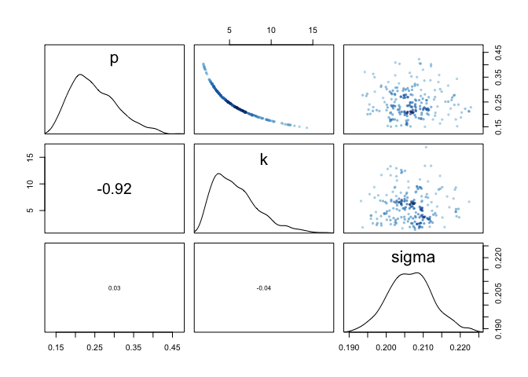
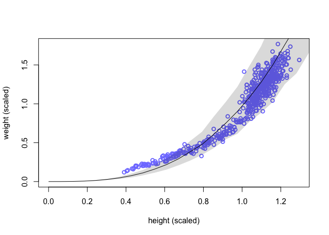
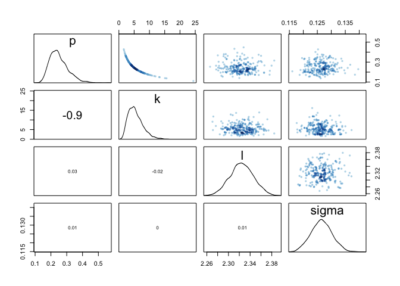
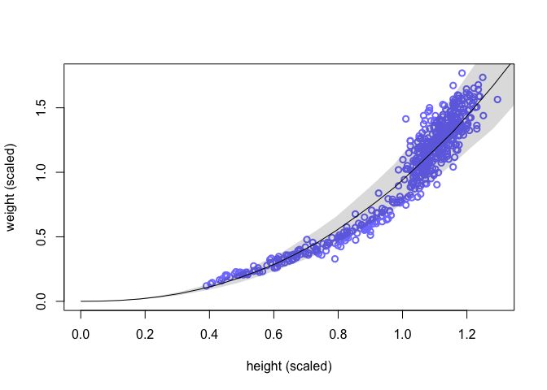
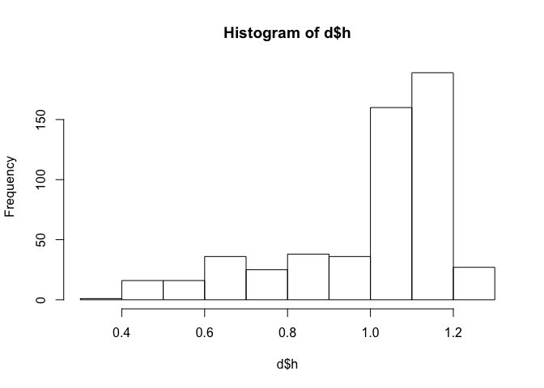
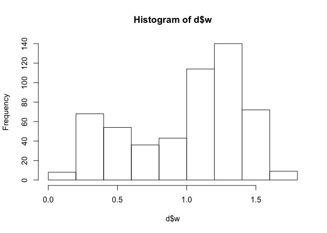
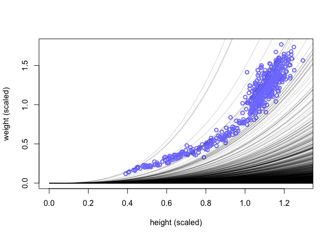

## 16M1

Modify the cylinder height model, m16.1, so that the exponent 3 on height is instead a free parameter. Do you recover the value of 3 or not? Plot the posterior predictions for the new model. How do they differ from those of m16.1?

Load and scale data:


```r
data("Howell1")
d = Howell1
d$w = d$weight/mean(d$weight)
d$h = d$height/mean(d$height)
```

Original model:


```r
m16.1 = ulam(
  alist(
    w ~ dlnorm(mu, sigma), 
    exp(mu) <- 3.141593 * k * p^2 * h^3,
    p ~ beta(2, 18),
    k ~ exponential(0.5),
    sigma ~ exponential(1)
  ),
  data = d, chains = 4, cores = 4
)
```

```
## Running /Library/Frameworks/R.framework/Resources/bin/R CMD SHLIB foo.c
## clang -I"/Library/Frameworks/R.framework/Resources/include" -DNDEBUG   -I"/Library/Frameworks/R.framework/Versions/3.6/Resources/library/Rcpp/include/"  -I"/Library/Frameworks/R.framework/Versions/3.6/Resources/library/RcppEigen/include/"  -I"/Library/Frameworks/R.framework/Versions/3.6/Resources/library/RcppEigen/include/unsupported"  -I"/Library/Frameworks/R.framework/Versions/3.6/Resources/library/BH/include" -I"/Library/Frameworks/R.framework/Versions/3.6/Resources/library/StanHeaders/include/src/"  -I"/Library/Frameworks/R.framework/Versions/3.6/Resources/library/StanHeaders/include/"  -I"/Library/Frameworks/R.framework/Versions/3.6/Resources/library/rstan/include" -DEIGEN_NO_DEBUG  -D_REENTRANT  -DBOOST_DISABLE_ASSERTS -DBOOST_PENDING_INTEGER_LOG2_HPP -include stan/math/prim/mat/fun/Eigen.hpp   -isysroot /Library/Developer/CommandLineTools/SDKs/MacOSX.sdk -I/usr/local/include  -fPIC  -Wall -g -O2  -c foo.c -o foo.o
## In file included from <built-in>:1:
## In file included from /Library/Frameworks/R.framework/Versions/3.6/Resources/library/StanHeaders/include/stan/math/prim/mat/fun/Eigen.hpp:13:
## In file included from /Library/Frameworks/R.framework/Versions/3.6/Resources/library/RcppEigen/include/Eigen/Dense:1:
## In file included from /Library/Frameworks/R.framework/Versions/3.6/Resources/library/RcppEigen/include/Eigen/Core:88:
## /Library/Frameworks/R.framework/Versions/3.6/Resources/library/RcppEigen/include/Eigen/src/Core/util/Macros.h:613:1: error: unknown type name 'namespace'
## namespace Eigen {
## ^
## /Library/Frameworks/R.framework/Versions/3.6/Resources/library/RcppEigen/include/Eigen/src/Core/util/Macros.h:613:16: error: expected ';' after top level declarator
## namespace Eigen {
##                ^
##                ;
## In file included from <built-in>:1:
## In file included from /Library/Frameworks/R.framework/Versions/3.6/Resources/library/StanHeaders/include/stan/math/prim/mat/fun/Eigen.hpp:13:
## In file included from /Library/Frameworks/R.framework/Versions/3.6/Resources/library/RcppEigen/include/Eigen/Dense:1:
## /Library/Frameworks/R.framework/Versions/3.6/Resources/library/RcppEigen/include/Eigen/Core:96:10: fatal error: 'complex' file not found
## #include <complex>
##          ^~~~~~~~~
## 3 errors generated.
## make: *** [foo.o] Error 1
```

Look at summary and posterior predictions:


```r
precis(m16.1)
```

```
##            mean          sd      5.5%      94.5%    n_eff     Rhat
## p     0.2479415 0.059402559 0.1672788  0.3574842 375.9918 1.004561
## k     5.7815978 2.714309317 2.3638278 10.8384450 393.6400 1.006096
## sigma 0.2066132 0.006033056 0.1970087  0.2167310 651.2880 1.004729
```

```r
pairs(m16.1)
```

<!-- -->

```r
h_seq = seq(from = 0 , to = max(d$w), length.out = 30)
w_sim = sim(m16.1, data = list(h = h_seq))
mu_mean = apply(w_sim, 2, mean)
w_CI = apply(w_sim, 2, PI)
plot(d$h, d$w, xlim = c(0, max(d$h)), ylim = c(0, max(d$w)), col = rangi2, lwd = 2, xlab = "height (scaled)", ylab = "weight (scaled)")
lines(h_seq, mu_mean)
shade(w_CI, h_seq)
```

<!-- -->

New model with the exponent on height estimated from the data:

This exponent should be positive, and since we aleardy think it's near 3, going with an exponential on 1, which should have a larger mean than the exp(0.5).

(would be better to do some prior prediction to figure out best prior for l)


```r
m16.1b = ulam(
  alist(
    w ~ dlnorm(mu, sigma), 
    exp(mu) <- 3.141593 * k * p^2 * h^l,
    p ~ beta(2, 18),
    k ~ exponential(0.5),
    l ~ exponential(0.1),
    sigma ~ exponential(1)
  ),
  data = d, chains = 4, cores = 4
)
```

```
## Running /Library/Frameworks/R.framework/Resources/bin/R CMD SHLIB foo.c
## clang -I"/Library/Frameworks/R.framework/Resources/include" -DNDEBUG   -I"/Library/Frameworks/R.framework/Versions/3.6/Resources/library/Rcpp/include/"  -I"/Library/Frameworks/R.framework/Versions/3.6/Resources/library/RcppEigen/include/"  -I"/Library/Frameworks/R.framework/Versions/3.6/Resources/library/RcppEigen/include/unsupported"  -I"/Library/Frameworks/R.framework/Versions/3.6/Resources/library/BH/include" -I"/Library/Frameworks/R.framework/Versions/3.6/Resources/library/StanHeaders/include/src/"  -I"/Library/Frameworks/R.framework/Versions/3.6/Resources/library/StanHeaders/include/"  -I"/Library/Frameworks/R.framework/Versions/3.6/Resources/library/rstan/include" -DEIGEN_NO_DEBUG  -D_REENTRANT  -DBOOST_DISABLE_ASSERTS -DBOOST_PENDING_INTEGER_LOG2_HPP -include stan/math/prim/mat/fun/Eigen.hpp   -isysroot /Library/Developer/CommandLineTools/SDKs/MacOSX.sdk -I/usr/local/include  -fPIC  -Wall -g -O2  -c foo.c -o foo.o
## In file included from <built-in>:1:
## In file included from /Library/Frameworks/R.framework/Versions/3.6/Resources/library/StanHeaders/include/stan/math/prim/mat/fun/Eigen.hpp:13:
## In file included from /Library/Frameworks/R.framework/Versions/3.6/Resources/library/RcppEigen/include/Eigen/Dense:1:
## In file included from /Library/Frameworks/R.framework/Versions/3.6/Resources/library/RcppEigen/include/Eigen/Core:88:
## /Library/Frameworks/R.framework/Versions/3.6/Resources/library/RcppEigen/include/Eigen/src/Core/util/Macros.h:613:1: error: unknown type name 'namespace'
## namespace Eigen {
## ^
## /Library/Frameworks/R.framework/Versions/3.6/Resources/library/RcppEigen/include/Eigen/src/Core/util/Macros.h:613:16: error: expected ';' after top level declarator
## namespace Eigen {
##                ^
##                ;
## In file included from <built-in>:1:
## In file included from /Library/Frameworks/R.framework/Versions/3.6/Resources/library/StanHeaders/include/stan/math/prim/mat/fun/Eigen.hpp:13:
## In file included from /Library/Frameworks/R.framework/Versions/3.6/Resources/library/RcppEigen/include/Eigen/Dense:1:
## /Library/Frameworks/R.framework/Versions/3.6/Resources/library/RcppEigen/include/Eigen/Core:96:10: fatal error: 'complex' file not found
## #include <complex>
##          ^~~~~~~~~
## 3 errors generated.
## make: *** [foo.o] Error 1
```

Getting some treedepth warnings.

Look at summary and posterior predictions:


```r
precis(m16.1b)
```

```
##            mean          sd      5.5%     94.5%     n_eff      Rhat
## p     0.2501188 0.057924812 0.1736031 0.3544364  713.6225 1.0049922
## k     5.4961999 2.451990572 2.3571705 9.8494553  883.7480 1.0023595
## l     2.3245381 0.021597957 2.2903286 2.3602424 1301.7396 0.9994418
## sigma 0.1265393 0.003838542 0.1203933 0.1327960  723.5328 1.0108968
```

```r
pairs(m16.1b)
```

<!-- -->

```r
w_sim = sim(m16.1b, data = list(h = h_seq))
mu_mean = apply(w_sim, 2, mean)
w_CI = apply(w_sim, 2, PI)
plot(d$h, d$w, xlim = c(0, max(d$h)), ylim = c(0, max(d$w)), col = rangi2, lwd = 2, xlab = "height (scaled)", ylab = "weight (scaled)")
lines(h_seq, mu_mean)
shade(w_CI, h_seq)
```

<!-- -->

Posterior predictions look similar, but follow the data a bit more at the low end in particular.

## 16M2

Conduct a prior predictive simulation for the cylinder height model. Begin with the priors in the chapter. Do these produce reasonable prior height distributions? If not, which modifications do you suggest?

(Does he mean height or weight?)


```r
hist(d$h) # 0 to 1.3
```

<!-- -->

```r
hist(d$w) # 0 to 1.6
```

<!-- -->

```r
pr = extract.prior(m16.1)
```

```
## Trying to compile a simple C file
```

```
## Running /Library/Frameworks/R.framework/Resources/bin/R CMD SHLIB foo.c
## clang -I"/Library/Frameworks/R.framework/Resources/include" -DNDEBUG   -I"/Library/Frameworks/R.framework/Versions/3.6/Resources/library/Rcpp/include/"  -I"/Library/Frameworks/R.framework/Versions/3.6/Resources/library/RcppEigen/include/"  -I"/Library/Frameworks/R.framework/Versions/3.6/Resources/library/RcppEigen/include/unsupported"  -I"/Library/Frameworks/R.framework/Versions/3.6/Resources/library/BH/include" -I"/Library/Frameworks/R.framework/Versions/3.6/Resources/library/StanHeaders/include/src/"  -I"/Library/Frameworks/R.framework/Versions/3.6/Resources/library/StanHeaders/include/"  -I"/Library/Frameworks/R.framework/Versions/3.6/Resources/library/rstan/include" -DEIGEN_NO_DEBUG  -D_REENTRANT  -DBOOST_DISABLE_ASSERTS -DBOOST_PENDING_INTEGER_LOG2_HPP -include stan/math/prim/mat/fun/Eigen.hpp   -isysroot /Library/Developer/CommandLineTools/SDKs/MacOSX.sdk -I/usr/local/include  -fPIC  -Wall -g -O2  -c foo.c -o foo.o
## In file included from <built-in>:1:
## In file included from /Library/Frameworks/R.framework/Versions/3.6/Resources/library/StanHeaders/include/stan/math/prim/mat/fun/Eigen.hpp:13:
## In file included from /Library/Frameworks/R.framework/Versions/3.6/Resources/library/RcppEigen/include/Eigen/Dense:1:
## In file included from /Library/Frameworks/R.framework/Versions/3.6/Resources/library/RcppEigen/include/Eigen/Core:88:
## /Library/Frameworks/R.framework/Versions/3.6/Resources/library/RcppEigen/include/Eigen/src/Core/util/Macros.h:613:1: error: unknown type name 'namespace'
## namespace Eigen {
## ^
## /Library/Frameworks/R.framework/Versions/3.6/Resources/library/RcppEigen/include/Eigen/src/Core/util/Macros.h:613:16: error: expected ';' after top level declarator
## namespace Eigen {
##                ^
##                ;
## In file included from <built-in>:1:
## In file included from /Library/Frameworks/R.framework/Versions/3.6/Resources/library/StanHeaders/include/stan/math/prim/mat/fun/Eigen.hpp:13:
## In file included from /Library/Frameworks/R.framework/Versions/3.6/Resources/library/RcppEigen/include/Eigen/Dense:1:
## /Library/Frameworks/R.framework/Versions/3.6/Resources/library/RcppEigen/include/Eigen/Core:96:10: fatal error: 'complex' file not found
## #include <complex>
##          ^~~~~~~~~
## 3 errors generated.
## make: *** [foo.o] Error 1
## 
## SAMPLING FOR MODEL 'b7f5ae462b975aebe1710b5494a9f402' NOW (CHAIN 1).
## Chain 1: 
## Chain 1: Gradient evaluation took 0.00017 seconds
## Chain 1: 1000 transitions using 10 leapfrog steps per transition would take 1.7 seconds.
## Chain 1: Adjust your expectations accordingly!
## Chain 1: 
## Chain 1: 
## Chain 1: Iteration:    1 / 2000 [  0%]  (Warmup)
## Chain 1: Iteration:  200 / 2000 [ 10%]  (Warmup)
## Chain 1: Iteration:  400 / 2000 [ 20%]  (Warmup)
## Chain 1: Iteration:  600 / 2000 [ 30%]  (Warmup)
## Chain 1: Iteration:  800 / 2000 [ 40%]  (Warmup)
## Chain 1: Iteration: 1000 / 2000 [ 50%]  (Warmup)
## Chain 1: Iteration: 1001 / 2000 [ 50%]  (Sampling)
## Chain 1: Iteration: 1200 / 2000 [ 60%]  (Sampling)
## Chain 1: Iteration: 1400 / 2000 [ 70%]  (Sampling)
## Chain 1: Iteration: 1600 / 2000 [ 80%]  (Sampling)
## Chain 1: Iteration: 1800 / 2000 [ 90%]  (Sampling)
## Chain 1: Iteration: 2000 / 2000 [100%]  (Sampling)
## Chain 1: 
## Chain 1:  Elapsed Time: 0.648187 seconds (Warm-up)
## Chain 1:                0.510184 seconds (Sampling)
## Chain 1:                1.15837 seconds (Total)
## Chain 1:
```

```r
mu = link(m16.1, post = pr, data = list(h = h_seq))
summary(exp(mu[,2]))
```

```
##      Min.   1st Qu.    Median      Mean   3rd Qu.      Max. 
## 0.000e+00 1.578e-06 6.197e-06 1.887e-05 1.857e-05 5.722e-04
```

```r
plot(d$h, d$w, xlim = c(0, max(d$h)), ylim = c(0, max(d$w)), col = rangi2, lwd = 2, xlab = "height (scaled)", ylab = "weight (scaled)")
mu_mean = apply(mu, 2, mean)
w_CI = apply(mu, 2, PI)
lines(h_seq, exp(mu_mean))
shade(exp(w_CI), h_seq)
```

<!-- -->

