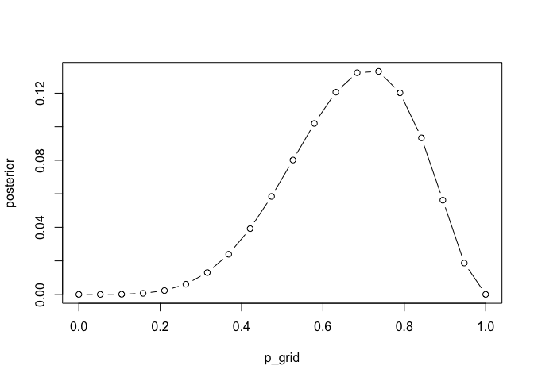
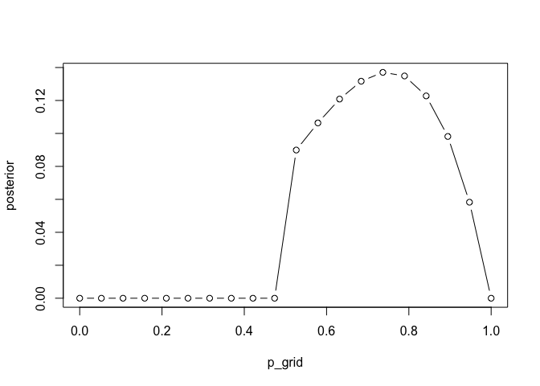
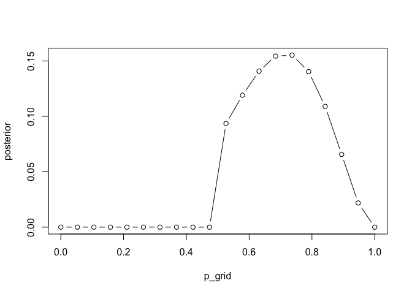

### 2E1

(2) Pr(rain|Monday) the probablility that it will rain, given that it is Monday.

Maybe also 4?

### 2E2

(3) The probability that it is Monday, given that it is raining.


### 2E3

(1) Pr(Monday|rain)

### 2E4

In the context of the globe-tossing example, what we mean when we say that the probability of water is 0.7 is the probability of sampling water on any given toss is 0.7. We think that the tossing we've done allows us to estimate the proportions of water and land on the globe, and that the most likely proportion given our data is around 0.7. So, the probability isn't really the end result of interest, but it lets us estimate a quantity we're interested in (assuming our model and measurements are okay).

### 2M1

(1) W W W


```r
p_grid = seq(from = 0, to = 1, length.out = 20)
prior = rep(1, 20)
likelihood = dbinom(3, 3, prob = p_grid)
un.pos = likelihood*prior
posterior = un.pos/sum(un.pos)
plot(p_grid, posterior, type = "b")
```

<!-- -->

(2) W W W L


```r
p_grid = seq(from = 0, to = 1, length.out = 20)
prior = rep(1, 20)
likelihood = dbinom(3, 4, prob = p_grid)
un.pos = likelihood*prior
posterior = un.pos/sum(un.pos)
plot(p_grid, posterior, type = "b")
```

<!-- -->

(3) L W W L W W W 


```r
p_grid = seq(from = 0, to = 1, length.out = 20)
prior = rep(1, 20)
likelihood = dbinom(5, 7, prob = p_grid)
un.pos = likelihood*prior
posterior = un.pos/sum(un.pos)
plot(p_grid, posterior, type = "b")
```

<!-- -->

### 2M2

(1) W W W


```r
prior = ifelse(p_grid < 0.5, 0, 1)
likelihood = dbinom(3, 3, prob = p_grid)
un.pos = likelihood*prior
posterior = un.pos/sum(un.pos)
plot(p_grid, posterior, type = "b")
```

<!-- -->

(2) W W W L


```r
prior = ifelse(p_grid < 0.5, 0, 1)
likelihood = dbinom(3, 4, prob = p_grid)
un.pos = likelihood*prior
posterior = un.pos/sum(un.pos)
plot(p_grid, posterior, type = "b")
```

<!-- -->

(3) L W W L W W W 


```r
prior = ifelse(p_grid < 0.5, 0, 1)
likelihood = dbinom(5, 7, prob = p_grid)
un.pos = likelihood*prior
posterior = un.pos/sum(un.pos)
plot(p_grid, posterior, type = "b")
```

<!-- -->

### 2M3


```r
Pr_earth = 0.5
Pr_mars = 0.5
Pr_land_earth = 0.3
Pr_land_mars = 1
Pr_earth_land = (Pr_land_earth*Pr_earth)/(Pr_land_earth*Pr_earth + Pr_land_mars*Pr_mars)
Pr_earth_land
```

```
## [1] 0.2307692
```

### 2M4

Three cards: B/B B/W W/W

How many ways can each card produce a black side?
B/B 2
B/W 1
W/W 0
So, of a total of three ways that the first black side can be produced, there is a 2/3 probability that is was produced by a B/B card.

### 2M5

Multiply the probability of producing a black side by the probability of drawing that type of card. The probability is now doubled for B/B since two are in the bag.
B/B 2 * 2 = 4
B/W 1 * 1 = 1
W/W 0 * 1 = 0
Probability that card is B/B = 4/5

### 2M6

Multiply the probability of producing a black side by the probability of drawing that type of card.
B/B 2 * 1 = 2
B/W 1 * 2 = 2
W/W 0 * 3 = 0
Even probabilities that card is B/B or B/W, so probability that other side is black is 0.5.

### 2M7 

Not sure I'm doing this exactly how he intends.
First   Second
B/B     B/W     1 * 0.5 = 0.5
W/W     1 * 1   = 1
B/W     B/B     0.5 * 0 = 0
W/W     0.5 * 1 = 0.5
W/W     B/W     0 * 0.5 = 0
B/B     0 * 0   = 0
Probability that first card is B/B = 1.5/2 = 0.75

### 2H1


```r
Pr_twins_A = 0.1
Pr_twins_B = 0.2
Pr_A = 0.5
Pr_B = 0.5
Pr_twins = Pr_twins_A*Pr_A + Pr_twins_B*Pr_B

Pr_twins*Pr_twins
```

```
## [1] 0.0225
```

```r
# 0.0225
```

### 2H2


```r
Pr_A_twins = Pr_twins_A*Pr_A/Pr_twins
# 0.33  
```

### 2H3


```r
Pr_single_A = 0.9
Pr_single_B = 0.8
Pr_A = 1/3
Pr_B = 2/3
Pr_single = Pr_single_A*Pr_A + Pr_single_B*Pr_B

Pr_A_single = Pr_single_A*Pr_A/Pr_single
# 0.36  
```

### 2H4


```r
Pr_testA_pandaA = 0.8
Pr_testB_pandaA = 0.2
Pr_testB_pandaB = 0.65
Pr_testA_pandaB = 0.35

Pr_pandaA = 0.5
Pr_pandaB = 0.5

Pr_testA = Pr_testA_pandaA*Pr_pandaA + Pr_testA_pandaB*Pr_pandaB

Pr_pandaA_testA = Pr_testA_pandaA*Pr_pandaA/Pr_testA
# 0.6956522

# Now with previous information

Pr_pandaA = 0.36
Pr_pandaB = 0.64

Pr_testA = Pr_testA_pandaA*Pr_pandaA + Pr_testA_pandaB*Pr_pandaB
Pr_pandaA_testA = Pr_testA_pandaA*Pr_pandaA/Pr_testA
# 0.5625

# When calculating denominator, are you supposed to use prior information?
```
