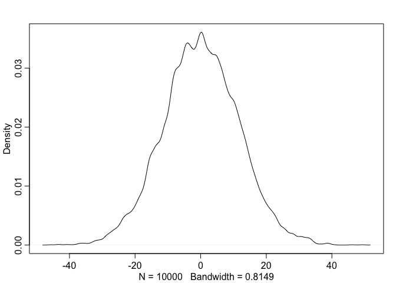
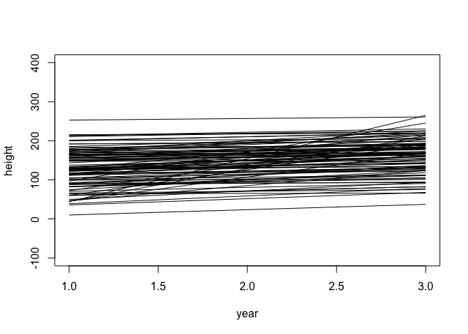
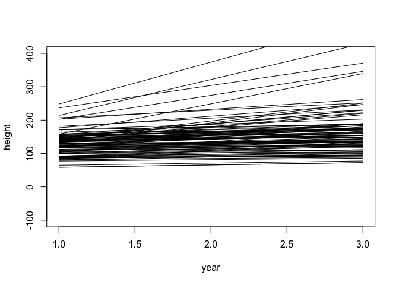
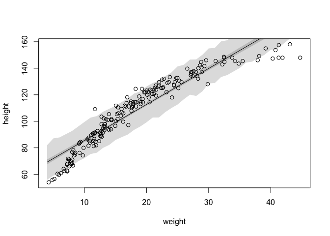
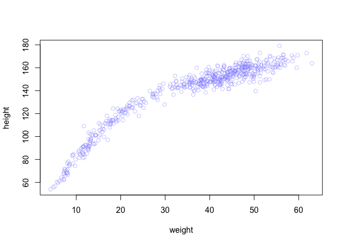
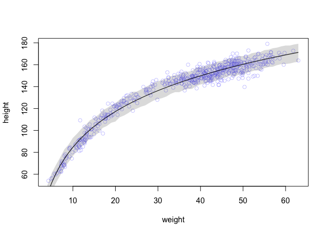

## 26 April 2019

### 4E1

The first line is the likelihood. 


### 4E2

Two parameters are in the posterior distribution: the mean and the variance.


### 4E3
$$
Pr(\mu, \sigma | y) = \frac{\Pi_i Normal(y | \mu, \sigma) Normal(\mu | 0, 10) Uniform (\sigma | 0, 10)}{\int \int \Pi Normal(y | \mu, \sigma) Normal(\mu | 0, 10) Uniform (\sigma | 0, 10) d\mu d\sigma}
$$

### 4E4

The second line, which describes a linear effect of x on the mean.


### 4E5

Three: the intercept, the slope, and the standard deviation.


### 4M1

**For the model definition below, simulate observed heights from the prior (not the posterior).**

$$
y_i ∼ Normal(\mu, \sigma) \\
\mu ∼ Normal(0, 10) \\
\sigma ∼ Uniform(0, 10)
$$


```r
sample_sigma = runif(1e4, 0, 10)
sample_mu = rnorm(1e4, 0, 10)
prior_h = rnorm(1e4, sample_mu, sample_sigma)
dens(prior_h)
```

<!-- -->


### 4M2

**Translate the model just above into a quap formula.**


```r
# m1 = quap(
#     alist(
#         y ~ dnorm(mu, sigma),
#         mu ~ dnorm(0, 10),
#         sigma ~ dunif(0, 10)
#     ), data = NA)
```


### 4M3

**Translate the quap model formula below into a mathematical model definition.**


```r
# flist <- alist(
#     y ~ dnorm( mu , sigma ),
#     mu <- a + b*x,
#     a ~ dnorm( 0 , 50 ),
#     b ~ dunif( 0 , 10 ),
#     sigma ~ dunif( 0 , 50 )
# )
```

$$
y_i \sim Normal(\mu, \sigma) \\

\mu_i = \alpha + \beta * x_i \\

\alpha \sim Normal(0, 5) \\

\beta \sim Normal(0, 10) \\

\sigma \sim Uniform(0, 50)
$$


## 3 May 2019

### 4M4

**A sample of students is measured for height each year for 3 years. After the third year, you want to fit a linear regression predicting height using year as a predictor. Write down the mathematical model definition for this regression, using any variable names and priors you choose. Be prepared to defend your choice of priors.**

$$
h_i \sim Normal(\mu_i, \sigma) \\

\mu_i = \alpha + \beta * (x_i-\bar{x}) \\

\alpha \sim Normal(150, 40) \\

\beta \sim Lognormal(2.3, 1) \\

\sigma \sim Uniform(0, 50) \\

$$
$\alpha$ should end up near-ish to the mean height in the sample. We don't know this yet, but given that these are students, they are probably 1-2 m tall?

$\beta$ represents the change in height per year. It seems unlikely students would grow much more than 10 cm per year (log(10) = 2.3), and the relationship is very likely to be positive (students aren't shrinking).

$\sigma$ represents the breadth of the normal distribution around the mean of the line. Has to be positive, otherwise we don't know much about it.

Probably would also want to account for repeated mesures on the same subjects.


```r
a = rnorm(1e4 , 150 , 40)
b = rlnorm(1e4, 2.3, 1)
N = 100
xbar = 2

plot(NULL, xlim = c(1, 3), ylim = c(-100, 400), xlab = "year", ylab = "height")
for (i in 1:N) curve(a[i] + b [i]*(x-xbar), add = TRUE, from = 1, to = 3)
```

<!-- -->


### 4M5

**Now suppose I tell you that the average height in the first year was 120 cm and that every student got taller each year. Does this information lead you to change your choice of priors? How?**

I would then center the prior for $\alpha$ on 120, but alter the centering of that redctor since I konw about the first year mean, rather than the intercept in the mean (second) year. 

$$
h_i \sim Normal(\mu_i, \sigma) \\

\mu_i = \alpha + \beta * (x_i) \\

\alpha \sim Normal(120, 40) \\

\beta \sim Lognormal(2.3, 1) \\

\sigma \sim Uniform(0, 50) \\
$$


```r
a = rnorm(1e4 , 120 , 30)
b = rlnorm(1e4, 2.3, 1)
N = 100
plot(NULL, xlim = c(1, 3), ylim = c(-100, 400), xlab = "year", ylab = "height")
for (i in 1:N) curve(a[i] + b [i]*(x), add = TRUE, from = 1, to = 3)
```

<!-- -->


### 4M6

**Now suppose I tell you that the variance among heights for students of the same age is never more than 64 cm. How does this lead you to revise your priors?**

I would then increase sigma to include 64. 

$$
h_i \sim Normal(\mu_i, \sigma) \\

\mu_i = \alpha + \beta * (x_i) \\

\alpha \sim Normal(120, 40) \\

\beta \sim Lognormal(2.3, 1) \\

\sigma \sim Uniform(0, 64) \\
$$

### 4H1

**The weights listed below were recorded in the !Kung census, but heights were not recorded for these individuals. Provide predicted heights and 89% intervals (either HPDI or PI) for each of these individuals. That is, fill in the table below, using model-based predictions.**

| Individual | weight | expected height | 89% HDPI       |
|------------|--------|-----------------|----------------|
| 1          | 46.95  | 156.35          | 148.55, 164.02 |
| 2          | 43.72  | 153.61          | 145.04, 161.01 |
| 3          | 64.78  | 172.53          | 165.07, 180.48 |
| 4          | 32.59  | 143.48          | 134.76, 149.98 |
| 5          | 54.63  | 163.04          | 155.71, 171.49 |


```r
data(Howell1)
d = Howell1 %>% filter(age >= 18)

xbar <- mean(d$weight)

mod = quap(
  alist(
    height ~ dnorm(mu, sigma),
    mu <- a + b*(weight - xbar),
    a ~ dnorm(178, 20),
    b ~ dlnorm(0, 1),
    sigma ~ dunif(0, 50)
  ), 
  data = d
)

precis(mod)
```

```
##              mean         sd        5.5%       94.5%
## a     154.6013677 0.27030764 154.1693638 155.0333715
## b       0.9032809 0.04192363   0.8362788   0.9702829
## sigma   5.0718806 0.19115475   4.7663784   5.3773828
```

```r
known_weights = c(46.95, 43.72, 64.78, 32.59, 54.63)

sim_height = sim(mod, data = list(weight = known_weights))

sim_height_means = apply(sim_height, 2, mean)
sim_height_means
```

```
## [1] 156.3133 153.4743 172.5034 143.1423 163.5220
```

```r
sim_height_HPDI = apply(sim_height, 2, HPDI, prob = 0.89)
t(sim_height_HPDI)
```

```
##         |0.89    0.89|
## [1,] 147.8785 163.9727
## [2,] 145.3237 161.5854
## [3,] 163.9118 180.6466
## [4,] 136.2190 151.8928
## [5,] 155.3231 171.0757
```


### 4H2

**Select out all the rows in the Howell1 data with ages below 18 years of age. If you do it right, you should end up with a new data frame with 192 rows in it.**

**(a) Fit a linear regression to these data, using quap. Present and interpret the estimates. For every 10 units of increase in weight, how much taller does the model predict a child gets?**

For every 10 units increase in weight, the model predicts that a child gets 27.2 cm taller.


```r
juv = Howell1 %>% filter(age < 18)

xbar <- mean(juv$weight)

mod_juv = quap(
  alist(
    height ~ dnorm(mu, sigma),
    mu <- a + b*(weight - xbar),
    a ~ dnorm(178, 20),
    b ~ dlnorm(0, 1),
    sigma ~ dunif(0, 50)
  ), 
  data = juv
)

precis(mod_juv)
```

```
##             mean         sd       5.5%      94.5%
## a     108.383386 0.60867111 107.410612 109.356160
## b       2.716657 0.06831738   2.607472   2.825841
## sigma   8.437409 0.43060089   7.749226   9.125593
```

**(b) Plot the raw data, with height on the vertical axis and weight on the horizontal axis. Super- impose the MAP regression line and 89% HPDI for the mean. Also superimpose the 89% HPDI for predicted heights.**


```r
max(juv$weight)
```

```
## [1] 44.73551
```

```r
weight_seq = seq(4, 45)
mu = link(mod_juv, data = data.frame(weight = weight_seq))
mu_mean = apply(mu, 2, mean)
mu_hpdi = apply(mu, 2, HPDI, prob = 0.89)
pred_hpdi = apply(sim(mod_juv, data = list(weight = weight_seq)), 2, HPDI, prob = 0.89)

plot(height ~ weight, data = juv)
lines(weight_seq, mu_mean)
shade(mu_hpdi, weight_seq)
shade(pred_hpdi, weight_seq)
```

<!-- -->

**(c) What aspects of the model fit concern you? Describe the kinds of assumptions you would change, if any, to improve the model. You don’t have to write any new code. Just explain what the model appears to be doing a bad job of, and what you hypothesize would be a better model.**

The model is performing poorly at the low and high ends of the weight axis. It might be better to change the model to allow some curvature.

### 4H3

**Suppose a colleague of yours, who works on allometry, glances at the practice problems just above. Your colleague exclaims, “That’s silly. Everyone knows that it’s only the logarithm of body weight that scales with height!” Let’s take your colleague’s advice and see what happens.**

**(a) Model the relationship between height (cm) and the natural logarithm of weight (log-kg). Use the entire Howell1 data frame, all 544 rows, adults and non-adults. Fit this model, using quadratic approximation:**


```r
data = Howell1

mod_log = quap(
  alist(
    height ~ dnorm(mu, sigma),
    mu <- a + b*log(weight),
    a ~ dnorm(178, 100),
    b ~ dnorm(0, 100),
    sigma ~ dunif(0, 50)
  ), 
  data = data
)

precis(mod_log)
```

```
##             mean        sd       5.5%      94.5%
## a     -23.784355 1.3351192 -25.918134 -21.650577
## b      47.075364 0.3825462  46.463981  47.686746
## sigma   5.134712 0.1556690   4.885922   5.383501
```

Because weight isn't centered in this model, the intercept is the estimated height of a person with weight  = 0. The beta is the rate of increase in height for every order of magnitude change in weight.

**(b) Begin with this plot:**


```r
plot( height ~ weight , data=Howell1 ,
    col=col.alpha(rangi2,0.4) )
```

<!-- -->

**Then use samples from the quadratic approximate posterior of the model in (a) to superimpose on the plot: (1) the predicted mean height as a function of weight, (2) the 97% HPDI for the mean, and (3) the 97% HPDI for predicted heights.**


```r
weight_seq = seq(4, 63)
mu = link(mod_log, data = data.frame(weight = weight_seq))
mu_mean = apply(mu, 2, mean)
mu_hpdi = apply(mu, 2, HPDI, prob = 0.89)
pred_hpdi = apply(sim(mod_log, data = list(weight = weight_seq)), 2, HPDI, prob = 0.89)


plot( height ~ weight , data=Howell1 ,
    col=col.alpha(rangi2,0.4) )
lines(weight_seq, mu_mean)
shade(mu_hpdi, weight_seq)
shade(pred_hpdi, weight_seq)
```

<!-- -->

The mu HPDI is really hard to see but it's there, just narrow.

