## 8E1 (7E1)

1) temperature affects the rate at which dough rises, per a certain amount of yeast
2) education leads to higher income, but the income returned for a given level of education depends on the field of work.
3) gasoline makes a car go, but the speed achieved per unit gas might depend on whether you are driving uphill, downhill, or flat. 


## 8E2 (7E2)

Statement 1. 


## 8E3 (7E3)

1) carm ~ heat*oil
2) speed ~ cyl + inj
3) beliefs ~ parentsorfriends
4) intel ~ social + appendages


## 8M1 (7M1) - assigned

In this case, it seems like the effects of water and shade also depend on temperature, and all three predictors may interact. While water and blooms have a generally positive relationship under cool temperatures, under hot temperatures this relationship is flat, and no matter how much water a plant recieves it will not produce more blooms. Same goes for shade, if the temperature is hot, then the plants could be in the light or the dark and still produce the same number of blooms (0). Knowing the temperature seems to be necessary if you want to predict how light and shade will affect bloom number. 


## 8M2 (7M2) - assigned

Maybe it would work to make the intercept indexed by temperature, so that it would represent the mean when temp == cool, but 0 when temp == hot. In this case, would you still want temperature to interact with shade and water so that those parameters could be 0 when temp == hot? I think so. If we're treating temperature as categorical here, then maybe this can also be coded with index terms. 

$\mu_i = \alpha[temp] + \beta_{w[temp]}W_i + \beta_{s[temp]}Si + \beta_{ws[temp]}W_iS_i$


## 8M3 (7M3)

The model could be something like:

Raven pop size ~ prey density * wolf density

My expectation is that when there is very little prey, it doesn't matter haw many wolves are around, because they probably don't make as many kills (and maybe they'd be less likely to share when food is scarce). Similarly, if there is a ton of prey but few wolves, then more prey is unlikely to have large effects on the availability of food to ravens (unless maybe increasing prey density makes it easier for the few wolves to catch prey, though this too would saturate at some point). When prey is very scarce, there may be stochastic crashes in the raven populations, resulting in non-linear declines at the low prey end of the axis. 


## 8H1 (7H1) - assigned


```r
# Load data
library(rethinking)
library(tidyverse)
library(cowplot)

data(tulips)
d <- tulips

# Center and standardize
d$blooms_std <- d$blooms / max(d$blooms)
d$water_cent <- d$water - mean(d$water)
d$shade_cent <- d$shade - mean(d$shade)
d$bed_index <- ifelse(d$bed == "a", 1, ifelse(d$bed == "b", 2, 3))
# Add bed as an indexed variable. Use a prior that is centered on no effect of bed but with which is would be very plausible for bed to account for differences of 25% in bloom number 

m1.1 <- quap(
  alist(
    blooms_std ~ dnorm(mu, sigma),
    mu <- a + bw*water_cent + bs*shade_cent + bws*water_cent*shade_cent + bb[bed_index],
    a ~ dnorm(0.5, 0.25),
    bw ~ dnorm(0, 0.25),
    bs ~ dnorm(0, 0.25),
    bws ~ dnorm(0, 0.25),
    bb[bed_index] ~ dnorm(0, 0.25),
    sigma ~ dexp(1)
 ),
  data=d)
```

Prior predictive simulation: what do these priors do, before seeing data?


```r
prior <- extract.prior(m1.1, n = 50)

# Attempting to make dataframe with Julin's approach, modified for 3 predictors. 
pripred =
  expand.grid(water_cent = c(-1, 0, 1),
              shade_cent = c(-1, 0, 1),
              bed_index = c(1, 2, 3)) %>%
  as_tibble() %>%
  mutate(key1 = bed_index, key2 = water_cent) %>%
  group_by(key1, key2) %>%
  nest() %>% 
  mutate(pred = map(data, ~ as_tibble(rethinking::link(m1.1, post = prior, data = .)))) %>% 
  unnest(pred) %>% 
  rename(bed_index = key1, water_cent = key2, `-1` = V1, `0` = V2, `1` = V3) %>%
  mutate(id = 1:nrow(.)) %>% 
  gather(key = shade_cent, value = "blooms_std", -bed_index, -water_cent, -id) 
```


```r
ggplot(data = pripred, aes(x = shade_cent, y = blooms_std, color = as.factor(bed_index), group = id)) +
  geom_hline(yintercept = 0) +
  geom_hline(yintercept = 1) +
  geom_line(alpha = 0.5) +
  facet_grid(.~water_cent)
```

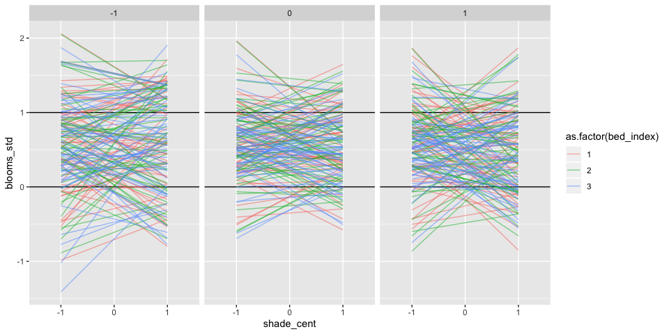<!-- -->

Could reign things in a bit more, but this isn't *too* bad. 

Now look at model:


```r
m1.1pred =
  expand.grid(water_cent = c(-1, 0, 1),
              shade_cent = c(-1, 0, 1),
              bed_index = c(1, 2, 3)) %>%
  as_tibble() %>%
  # Note that whichever variable is not a key is the one that can go on the x-axis (I think)
  mutate(key1 = bed_index, key2 = shade_cent) %>%
  group_by(key1, key2) %>%
  nest() %>% 
  mutate(pred = map(data, ~ as_tibble(rethinking::link(m1.1, n = 50, data = .)))) %>% 
  unnest(pred) %>% 
  rename(bed_index = key1, shade_cent = key2, `-1` = V1, `0` = V2, `1` = V3) %>%
  mutate(id = 1:nrow(.)) %>% 
  # Would be nice to move this somewhere else (I think near the map line) so that grouping is more versatile. Is that possible?
  gather(key = water_cent, value = "blooms_std", -bed_index, -shade_cent, -id) 

precis(m1.1, depth = 2)
```

```
##               mean         sd        5.5%       94.5%
## a      0.393058981 0.12596603  0.19174094  0.59437703
## bw     0.207436906 0.02536648  0.16689637  0.24797745
## bs    -0.113849448 0.02536185 -0.15438259 -0.07331631
## bws   -0.143892503 0.03098557 -0.19341344 -0.09437157
## bb[1] -0.121974086 0.12845613 -0.32727179  0.08332361
## bb[2]  0.001160803 0.12845514 -0.20413531  0.20645692
## bb[3]  0.013873733 0.12845524 -0.19142255  0.21917002
## sigma  0.108150650 0.01467971  0.08468964  0.13161166
```

```r
ggplot(data = m1.1pred, aes(x = water_cent, y = blooms_std, color = as.factor(bed_index), group = id)) +
  geom_hline(yintercept = 0) +
  geom_hline(yintercept = 1) +
  geom_line(alpha = 0.5) +
  facet_grid(.~shade_cent)
```

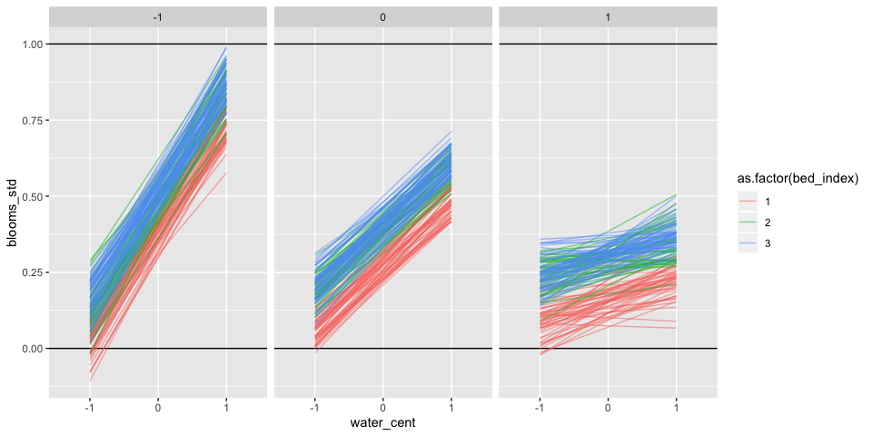<!-- -->

Note that the prep code for this plot isn't totally versatile, ie., if you want to switch which variables are shown on the facet, x-axis, and color, you have to change the prep block, because (I think) the group ids are being created across the variable not used as a key, but within the two variables used as keys. It would be nice to do this differently so that the plot could be confiugred any way with the same prep code - can't wrap my mind around whether that's possible. 

The results show that bed A tends to have slightly fewer blooms, but it's credible interval still overlaps with the other two beds. 


## 8H2 (7H2) - assigned


```r
# Make the old model 

m1.2 <- quap(
  alist(
    blooms_std ~ dnorm(mu, sigma),
    mu <- a + bw*water_cent + bs*shade_cent + bws*water_cent*shade_cent,
    a ~ dnorm(0.5, 0.25),
    bw ~ dnorm(0, 0.25),
    bs ~ dnorm(0, 0.25),
    bws ~ dnorm(0, 0.25),
    sigma ~ dexp(1)
 ),
  data=d)

compare(m1.1, m1.2)
```

```
##          WAIC    pWAIC    dWAIC    weight       SE      dSE
## m1.1 -23.2039 9.911069 0.000000 0.6283044 10.15390       NA
## m1.2 -22.1540 6.582727 1.049899 0.3716956 10.58124 8.145928
```

The model that includes bed has lower WAIC, and so it fits the data a bit better. I think this indicates that although beds aren't strongly different from each other, knowing which bed a plant grew in gives you a bit more information about how many blooms it is likely to make. However, the difference in WAIC is small and the SE of the diff is large, so the more complex model may not be justified.


```r
coeftab_plot(coeftab(m1.1, m1.2))
```

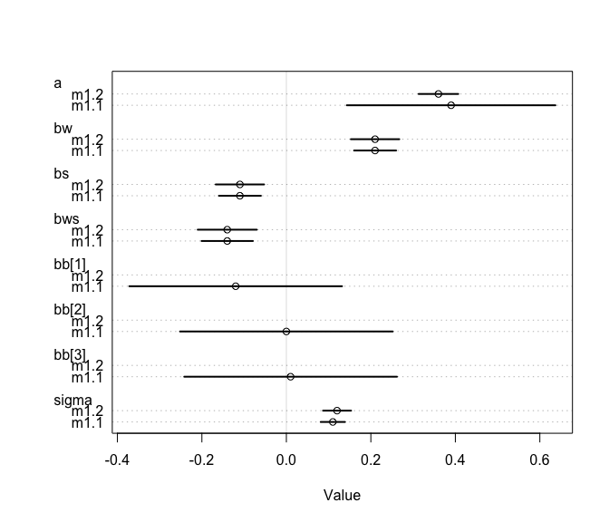<!-- -->

The uncertainty on the intercept is smaller in the model with bed; it seems like that uncertainty is instead represented in the $\beta$s for bed index.


## 8H3 (7H3)

A) Compare models with and without Seychelles

The model structure indicated in the question is slightly different from what's in the text of the paper. I like the version from the text better, but will check to see if it makes a difference.


```r
data(rugged)
d <- rugged

# Make log version of outcome
d$log_gdp <- log(d$rgdppc_2000)

# Extract countries with GDP data
dd <- d[complete.cases(d$rgdppc_2000), ]

# Rescale variables
dd$log_gdp_std <- dd$log_gdp / mean(dd$log_gdp)
dd$rugged_std <- dd$rugged / max(dd$rugged)
dd$cid = dd$cont_africa + 1 


without_sey = dd %>% 
  filter(country != "Seychelles")
  
# With Seychelles
m3.1 <- quap(
  alist(
    log_gdp_std ~ dnorm(mu, sigma),
    mu <- a[cid] + b[cid]*(rugged_std - mean(dd$rugged_std)),
    a[cid] ~ dnorm(1, 0.1),
    b[cid] ~ dnorm(0, 0.3),
    sigma ~ dexp(1)
 ), data = dd)

# Without Seychelles
m3.2 <- quap(
  alist(
    log_gdp_std ~ dnorm(mu, sigma),
    mu <- a[cid] + b[cid]*(rugged_std - mean(dd$rugged_std)),
    a[cid] ~ dnorm(1, 0.1),
    b[cid] ~ dnorm(0, 0.3),
    sigma ~ dexp(1)
 ), data = without_sey)

precis(m3.1, depth = 2)
```

```
##             mean          sd        5.5%       94.5%
## a[1]   1.0505787 0.009936281  1.03469862  1.06645882
## a[2]   0.8865577 0.015674444  0.86150690  0.91160848
## b[1]  -0.1425762 0.054746729 -0.23007207 -0.05508038
## b[2]   0.1325032 0.074200997  0.01391571  0.25109076
## sigma  0.1094886 0.005934551  0.10000404  0.11897316
```

```r
precis(m3.2, depth = 2)
```

```
##              mean          sd        5.5%       94.5%
## a[1]   1.05058411 0.009858728  1.03482796  1.06634026
## a[2]   0.87962326 0.015963995  0.85410972  0.90513681
## b[1]  -0.14265239 0.054329338 -0.22948116 -0.05582361
## b[2]   0.06787053 0.081002349 -0.06158687  0.19732793
## sigma  0.10862543 0.005904738  0.09918852  0.11806234
```

Alternate approach without indexing Africa variable. Maybe this is actually better, because it explicitly gives an estimate of the interaction rather than just fitting separate slopes. 


```r
# With Seychelles
m3.3 <- quap(
  alist(
    log_gdp_std ~ dnorm(mu, sigma),
    mu <- a + ba*(cont_africa) + br*(rugged_std - mean(dd$rugged_std)) + bar*(cont_africa)*(rugged_std - mean(dd$rugged_std)),
    a ~ dnorm(1, 0.1),
    br ~ dnorm(0, 0.3),
    ba ~ dnorm(0, 0.3),
    bar ~ dnorm(0, 0.3),
    sigma ~ dexp(1)
 ), data = dd)

# Without Seychelles
m3.4 <- quap(
  alist(
    log_gdp_std ~ dnorm(mu, sigma),
    mu <- a + ba*(cont_africa) + br*(rugged_std - mean(dd$rugged_std)) + bar*(cont_africa)*(rugged_std - mean(dd$rugged_std)),
    a ~ dnorm(1, 0.1),
    br ~ dnorm(0, 0.3),
    ba ~ dnorm(0, 0.3),
    bar ~ dnorm(0, 0.3),
    sigma ~ dexp(1)
 ), data = without_sey)

precis(m3.3, depth = 2)
```

```
##             mean          sd       5.5%       94.5%
## a      1.0502674 0.009932457  1.0343934  1.06614137
## br    -0.1339455 0.053936504 -0.2201465 -0.04774456
## ba    -0.1663955 0.018695336 -0.1962742 -0.13651673
## bar    0.2563460 0.089900775  0.1126672  0.40002479
## sigma  0.1095145 0.005938278  0.1000240  0.11900504
```

```r
precis(m3.4, depth = 2)
```

```
##             mean          sd        5.5%       94.5%
## a      1.0503067 0.009853761  1.03455853  1.06605496
## br    -0.1362920 0.053536257 -0.22185332 -0.05073076
## ba    -0.1738066 0.018909631 -0.20402787 -0.14358539
## bar    0.1909704 0.095077758  0.03901773  0.34292297
## sigma  0.1086372 0.005906373  0.09919770  0.11807675
```

The interaction intraval still doesn't include 0, but it's weakened when the Seychelles aren't included. 

B) Plot model predictions


```r
summary(dd$rugged_std)
```

```
##      Min.   1st Qu.    Median      Mean   3rd Qu.      Max. 
## 0.0004837 0.0713076 0.1579329 0.2149601 0.3155837 1.0000000
```

```r
m3.3pred =
  expand.grid(cont_africa = c(0, 1),
              rugged_std = c(0, 0.5, 1)) %>%
  as_tibble() %>%
  # Note that whichever variable is not a key is the one that can go on the x-axis (I think)
  mutate(key1 = cont_africa) %>%
  group_by(key1) %>%
  nest() %>% 
  mutate(pred = map(data, ~ as_tibble(rethinking::link(m3.3, n = 200, data = .)))) %>% 
  unnest(pred) %>% 
  rename(cont_africa = key1, `0` = V1, `1` = V2) %>%
  mutate(id = 1:nrow(.)) %>% 
  # Would be nice to move this somewhere else (I think near the map line) so that grouping is more versatile. Is that possible?
  gather(key = rugged_std, value = "GDP", -cont_africa, -id) 

m3.4pred =
  expand.grid(cont_africa = c(0, 1),
              rugged_std = c(0, 0.5, 1)) %>%
  as_tibble() %>%
  # Note that whichever variable is not a key is the one that can go on the x-axis (I think)
  mutate(key1 = cont_africa) %>%
  group_by(key1) %>%
  nest() %>% 
  mutate(pred = map(data, ~ as_tibble(rethinking::link(m3.4, n = 200, data = .)))) %>% 
  unnest(pred) %>% 
  rename(cont_africa = key1, `0` = V1, `1` = V2) %>%
  mutate(id = 1:nrow(.)) %>% 
  # Would be nice to move this somewhere else (I think near the map line) so that grouping is more versatile. Is that possible?
  gather(key = rugged_std, value = "GDP", -cont_africa, -id) 

a = ggplot() +
  geom_line(data = m3.3pred, aes(x = rugged_std, y = GDP, color = as.factor(cont_africa), group = id), alpha = 0.2) +
  guides(color = FALSE) +
  geom_smooth(data = m3.3pred, aes(x = rugged_std, y = GDP, group = as.factor(cont_africa), color = as.factor(cont_africa)), method = "lm", se  =FALSE)

b = ggplot(data = m3.4pred, aes(x = rugged_std, y = GDP, color = as.factor(cont_africa), group = id)) +
  geom_line(alpha = 0.2) +
  guides(color = FALSE) +
  geom_smooth(data = m3.4pred, aes(x = rugged_std, y = GDP, group = as.factor(cont_africa), color = as.factor(cont_africa)), method = "lm", se  =FALSE)


plot_grid(a,b)
```

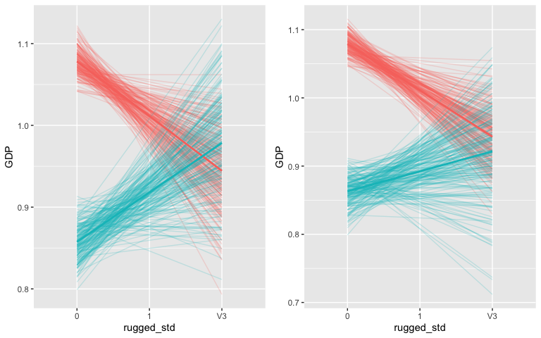<!-- -->

The interaction is somewhat weaker without Seychelles, that is, the African slope is a little bit flatter. 

C) Compare 3 models without Seychelles: ruggedness only, ruggedness and continent, and ruggedness * continent. 

Ruggedness * continent is model 3.4 above.


```r
# Ruggedness adn africa, no interaction
m3.5 <- quap(
  alist(
    log_gdp_std ~ dnorm(mu, sigma),
    mu <- a + ba*(cont_africa) + br*(rugged_std - mean(dd$rugged_std)),
    a ~ dnorm(1, 0.1),
    br ~ dnorm(0, 0.3),
    ba ~ dnorm(0, 0.3),
    sigma ~ dexp(1)
 ), data = without_sey)


# Ruggedness only
m3.6 <- quap(
  alist(
    log_gdp_std ~ dnorm(mu, sigma),
    mu <- a + br*(rugged_std - mean(dd$rugged_std)),
    a ~ dnorm(1, 0.1),
    br ~ dnorm(0, 0.3),
    sigma ~ dexp(1)
 ), data = without_sey)

coeftab_plot(coeftab(m3.4, m3.5, m3.6))
```

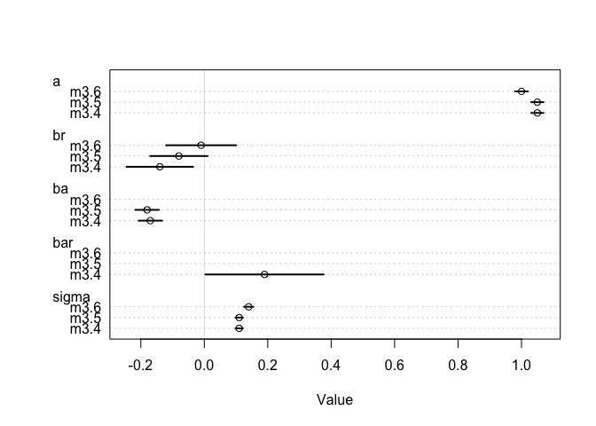<!-- -->

```r
compare(m3.4, m3.5, m3.6)
```

```
##           WAIC    pWAIC    dWAIC       weight       SE      dSE
## m3.4 -260.7882 4.571816  0.00000 8.245668e-01 15.14061       NA
## m3.5 -257.6930 4.056386  3.09520 1.754332e-01 14.45291  3.38808
## m3.6 -187.9665 2.638123 72.82164 1.268256e-16 13.39747 15.56752
```

The interaction model fits best, but not a whole lot better than the model without the interaction. 

Plot model predictions:


```r
m3.5pred =
  expand.grid(cont_africa = c(0, 1),
              rugged_std = c(0, 0.5, 1)) %>%
  as_tibble() %>%
  # Note that whichever variable is not a key is the one that can go on the x-axis (I think)
  mutate(key1 = cont_africa) %>%
  group_by(key1) %>%
  nest() %>% 
  mutate(pred = map(data, ~ as_tibble(rethinking::link(m3.5, n = 200, data = .)))) %>% 
  unnest(pred) %>% 
  rename(cont_africa = key1, `0` = V1, `1` = V2) %>%
  mutate(id = 1:nrow(.)) %>% 
  # Would be nice to move this somewhere else (I think near the map line) so that grouping is more versatile. Is that possible?
  gather(key = rugged_std, value = "GDP", -cont_africa, -id) 

m3.6pred =
  expand.grid(rugged_std = c(0, 0.5, 1)) %>%
  as_tibble() %>%
  # Note that whichever variable is not a key is the one that can go on the x-axis (I think)
  nest() %>% 
  mutate(pred = map(data, ~ as_tibble(rethinking::link(m3.6, n = 200, data = .)))) %>% 
  unnest(pred) %>% 
  rename(`0` = V1, `0.5` = V2, `1` = V3) %>%
  mutate(id = 1:nrow(.)) %>% 
  # Would be nice to move this somewhere else (I think near the map line) so that grouping is more versatile. Is that possible?
  gather(key = rugged_std, value = "GDP",  -id) 

c = ggplot() +
  geom_line(data = m3.5pred, aes(x = rugged_std, y = GDP, color = as.factor(cont_africa), group = id), alpha = 0.2) +
  guides(color = FALSE) +
  geom_smooth(data = m3.5pred, aes(x = rugged_std, y = GDP, group = as.factor(cont_africa), color = as.factor(cont_africa)), method = "lm", se  =FALSE)

e = ggplot() +
  geom_line(data = m3.6pred, aes(x = rugged_std, y = GDP, group = id), alpha = 0.2) +
  guides(color = FALSE) +
  geom_smooth(data = m3.6pred, aes(x = rugged_std, y = GDP, group = NA), method = "lm", se  =FALSE)

plot_grid(b, c, e, ncol = 3)
```

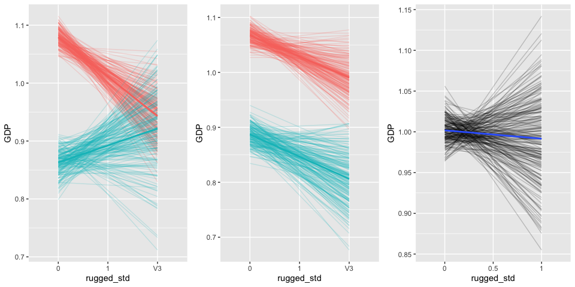<!-- -->

I still think that incorporating the interaction is the best way to describe the data. 


## 8H4 (7H4) - assigned

Evaluate the hypothesis that language diversity is partly a product of food security. 


```r
data(nettle)
d <- nettle

# Create outcome variable
d$lang.per.cap = d$num.lang/d$k.pop
hist(d$lang.per.cap, breaks = 40)
```

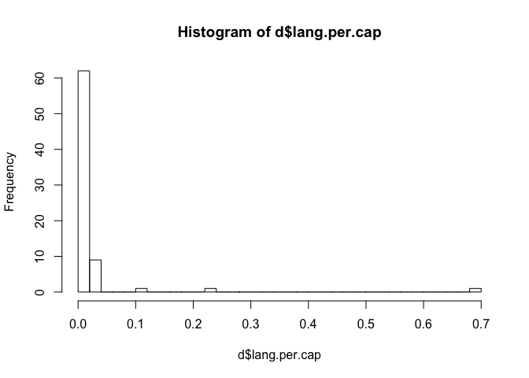<!-- -->

```r
# Most countries have few languages/capita
d$log.lang.per.cap = log(d$lang.per.cap)
summary(d$log.lang.per.cap)
```

```
##    Min. 1st Qu.  Median    Mean 3rd Qu.    Max. 
## -9.2814 -6.2196 -5.4952 -5.4566 -4.6111 -0.3842
```

```r
   # Min. 1st Qu.  Median    Mean 3rd Qu.    Max. 
# -9.2814 -6.2196 -5.4952 -5.4566 -4.6111 -0.3842 

# Some predictors of interest: mean.growing.season and sd.growing.season
# Prior on intercept: most countries have few languages per capita, so the mean of the logged response is ~-5.5
hist(d$mean.growing.season)
```

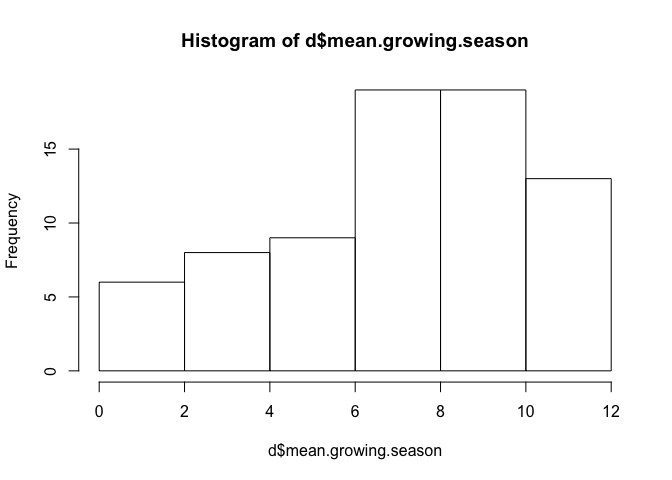<!-- -->

```r
# I'm going to center and scale mean growing season
d$mean.growing.season.cent = (d$mean.growing.season-mean(d$mean.growing.season))/sd(d$mean.growing.season)
summary(d$mean.growing.season.cent)
```

```
##     Min.  1st Qu.   Median     Mean  3rd Qu.     Max. 
## -2.23977 -0.53883  0.09972  0.00000  0.71283  1.57721
```

```r
#     Min.  1st Qu.   Median     Mean  3rd Qu.     Max. 
# -2.23977 -0.53883  0.09972  0.00000  0.71283  1.57721 

hist(log(d$area))
```

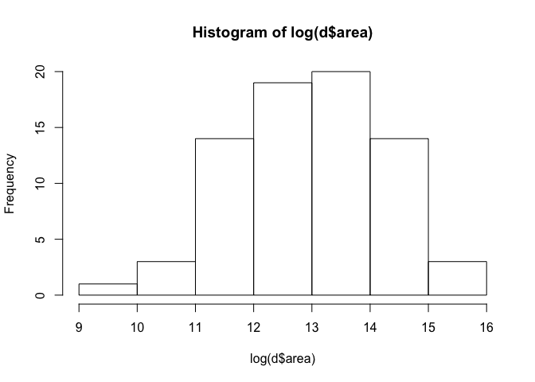<!-- -->

```r
# Also going to center log area
d$log.area.cent = log(d$area) - mean(log(d$area))
summary(d$log.area.cent)
```

```
##     Min.  1st Qu.   Median     Mean  3rd Qu.     Max. 
## -3.52662 -0.90595  0.04564  0.00000  0.95742  3.02207
```

```r
#     Min.  1st Qu.   Median     Mean  3rd Qu.     Max. 
# -3.52662 -0.90595  0.04564  0.00000  0.95742  3.02207 
    
hist(d$sd.growing.season)
```

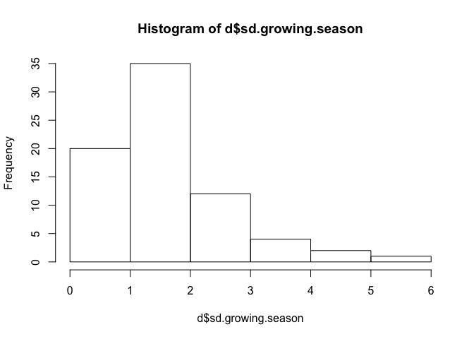<!-- -->

```r
# Also going to center sd
d$sd.growing.season.cent = (d$sd.growing.season-mean(d$sd.growing.season))/sd(d$sd.growing.season)
summary(d$sd.growing.season.cent)
```

```
##     Min.  1st Qu.   Median     Mean  3rd Qu.     Max. 
## -1.59387 -0.71448 -0.00862  0.00000  0.38300  3.91228
```

```r
#     Min.  1st Qu.   Median     Mean  3rd Qu.     Max. 
# -1.59387 -0.71448 -0.00862  0.00000  0.38300  3.91228 

# A) Build a model of languages/capita ~ mean growing season + log(area)
m4.1 <- quap(
  alist(
    log.lang.per.cap ~ dnorm(mu, sigma),
    mu <- a + bmg*mean.growing.season.cent + ba*log.area.cent, 
    a ~ dnorm(-5, 1),
    bmg ~ dnorm(0, 0.8),
    ba ~ dnorm(0, 0.8),
    sigma ~ dexp(1)
 ),
  data=d)

# Check how these priors are working. 
prior = extract.prior(m4.1, n = 200)

pripred =
  expand.grid(mean.growing.season.cent = c(-2.2, 0, 1.5),
              log.area.cent = c(-3.5, 0, 3)) %>%
  as_tibble() %>%
  mutate(key1 = log.area.cent) %>%
  group_by(key1) %>%
  nest() %>% 
  mutate(pred = map(data, ~ as_tibble(rethinking::link(m4.1, post = prior, data = .)))) %>% 
  unnest(pred) %>% 
  rename(log.area.cent = key1, `-2.2` = V1, `0` = V2, `1.5` = V3) %>%
  mutate(id = 1:nrow(.)) %>% 
  gather(key = mean.growing.season.cent, value = "lang_div", -log.area.cent, -id) 
```

Visualize prior predictions:


```r
ggplot(data = pripred, aes(x = as.numeric(mean.growing.season.cent), y = lang_div, color = as.factor(log.area.cent), group = id)) +
  geom_line(alpha = 0.5) +
  facet_grid(.~log.area.cent)
```

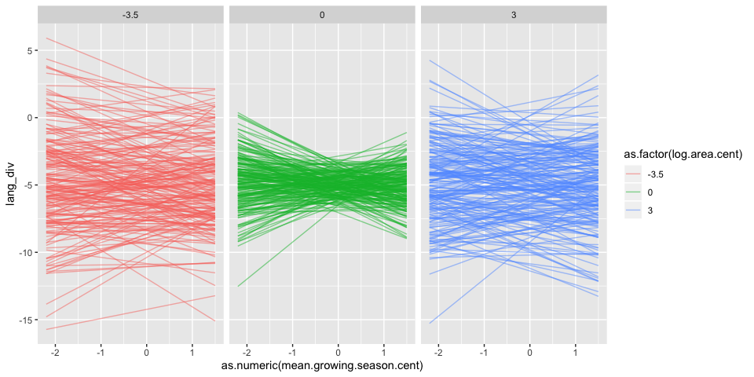<!-- -->
This seems ok, maybe the slopes are a bit constrained?


Now plot model predictions:


```r
m4.1pred =
  expand.grid(mean.growing.season.cent = c(-2.2, 0, 1.5),
              log.area.cent = c(-3.5, 0, 3)) %>%
  as_tibble() %>%
  mutate(key1 = log.area.cent) %>%
  group_by(key1) %>%
  nest() %>% 
  mutate(pred = map(data, ~ as_tibble(rethinking::link(m4.1, n=200, data = .)))) %>% 
  unnest(pred) %>% 
  rename(log.area.cent = key1, `-2.2` = V1, `0` = V2, `1.5` = V3) %>%
  mutate(id = 1:nrow(.)) %>% 
  gather(key = mean.growing.season.cent, value = "lang_div", -log.area.cent, -id) 

ggplot(data = m4.1pred, aes(x = as.numeric(mean.growing.season.cent), y = lang_div, color = as.factor(log.area.cent), group = id)) +
  geom_line(alpha = 0.5) +
  facet_grid(.~log.area.cent)
```

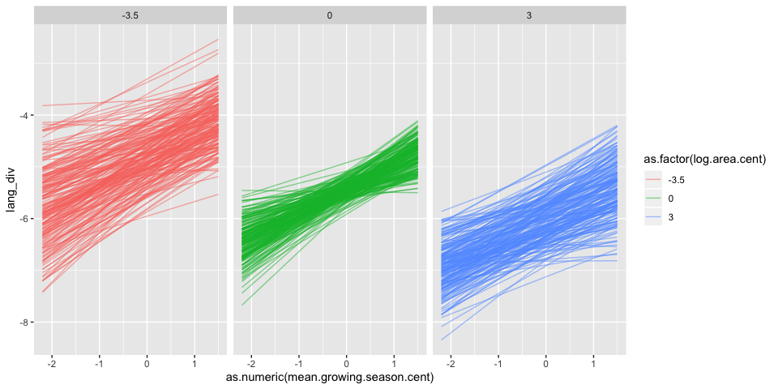<!-- -->

There is a positive relationship between growing season and language diversity, but a trending negative relationship between area and language diversity.

Also want to build a model with area only for comparison.


```r
m4.2 <- quap(
  alist(
    log.lang.per.cap ~ dnorm(mu, sigma),
    mu <- a + ba*log.area.cent, 
    a ~ dnorm(-5, 1),
    ba ~ dnorm(0, 0.8),
    sigma ~ dexp(1)
 ),
  data=d)

coeftab_plot(coeftab(m4.1, m4.2))
```

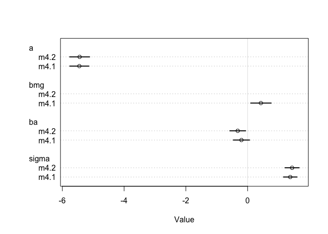<!-- -->

```r
# Compare with AIC

compare(m4.1, m4.2)
```

```
##          WAIC    pWAIC    dWAIC     weight       SE      dSE
## m4.1 268.5848 5.205373 0.000000 0.90832093 16.39773       NA
## m4.2 273.1714 4.472906 4.586607 0.09167907 17.03198 3.921088
```

In my first model, mean growing season has a positive relationship with language diversity (94% CI  = 0.10-0.55), indicating that areas with long growing seasons (and perhaps greater food security) have a higher diversity of languages. This lends support for the suggested hypothesis. Area tends to have a negative relationship with language diversity (though the 94% CI does not exclude 0), which I find surprising. I would think that large countries would have more potential to have isolated regions within them where language might diverge. The model that includes mean growing season has a marginally lower WAIC score, it's not super strongly justified but explains the data somewhat better than area only.


```r
# B) Build a model of languages/capita ~ sd growing season + log(area)
m4.3 <- quap(
  alist(
    log(lang.per.cap) ~ dnorm(mu, sigma),
    mu <- a + bsd*sd.growing.season.cent + ba*log.area.cent, 
    a ~ dnorm(-5, 1),
    bsd ~ dnorm(0, 0.8),
    ba ~ dnorm(0, 0.8),
    sigma ~ dexp(1)
 ),
  data=d)

precis(m4.3)
```

```
##             mean        sd       5.5%        94.5%
## a     -5.4444100 0.1634242 -5.7055935 -5.183226527
## bsd   -0.2159784 0.1903249 -0.5201544  0.088197525
## ba    -0.2362991 0.1507641 -0.4772493  0.004651037
## sigma  1.4248845 0.1154822  1.2403216  1.609447440
```

```r
m4.3pred =
  expand.grid(sd.growing.season.cent = c(-1.5, 0, 3.5),
              log.area.cent = c(-3.5, 0, 3)) %>%
  as_tibble() %>%
  mutate(key1 = log.area.cent) %>%
  group_by(key1) %>%
  nest() %>% 
  mutate(pred = map(data, ~ as_tibble(rethinking::link(m4.3, n=200, data = .)))) %>% 
  unnest(pred) %>% 
  rename(log.area.cent = key1, `-1.5` = V1, `0` = V2, `3.5` = V3) %>%
  mutate(id = 1:nrow(.)) %>% 
  gather(key = sd.growing.season.cent, value = "lang_div", -log.area.cent, -id) 

ggplot(data = m4.3pred, aes(x = as.numeric(sd.growing.season.cent), y = lang_div, color = as.factor(log.area.cent), group = id)) +
  geom_line(alpha = 0.5) +
  facet_grid(.~log.area.cent)
```

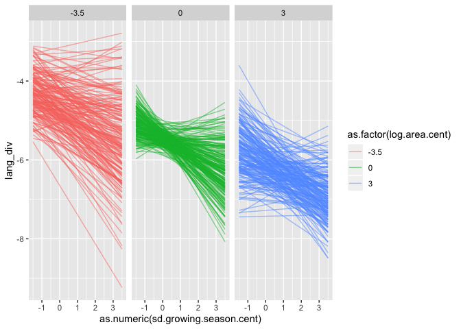<!-- -->
While the estimate for the effect of growing season SD on language diversity is negative, it has a lot of uncertainty associated with it, so we can't be confidentin that relationship. You can see that unceratinty in the variable slopes of the lines.


```r
# C) Build a model of languages/capita ~ sd growing season*mean growing season + log(area)
m4.4 <- quap(
  alist(
    log(lang.per.cap) ~ dnorm(mu, sigma),
    mu <- a + bsd*sd.growing.season.cent + bmg*mean.growing.season.cent + bsm*mean.growing.season.cent*sd.growing.season.cent + ba*log.area.cent, 
    a ~ dnorm(-5, 1),
    bsd ~ dnorm(0, 0.8),
    bmg ~ dnorm(0, 0.8),
    bsm ~ dnorm(0, 0.8),
    ba ~ dnorm(0, 0.8),
    sigma ~ dexp(1)
 ),
  data=d)

precis(m4.4)
```

```
##              mean        sd        5.5%      94.5%
## a     -5.43910459 0.1489704 -5.67718813 -5.2010210
## bsd   -0.34116097 0.1804433 -0.62954425 -0.0527777
## bmg    0.34128404 0.1823258  0.04989223  0.6326759
## bsm   -0.35917028 0.1527634 -0.60331575 -0.1150248
## ba    -0.02016059 0.1526995 -0.26420392  0.2238827
## sigma  1.29558453 0.1051599  1.12751867  1.4636504
```

```r
# compare(m4.4, m4.3, m4.2, m4.1)
# Get error: Error in data[[outcome]] : no such index at level 1

WAIC(m4.1)
```

```
## [1] 268.2852
## attr(,"lppd")
## [1] -129.1279
## attr(,"pWAIC")
## [1] 5.014688
## attr(,"se")
## [1] 16.28233
```

```r
# Works
WAIC(m4.2)
```

```
## [1] 272.8972
## attr(,"lppd")
## [1] -132.1182
## attr(,"pWAIC")
## [1] 4.330443
## attr(,"se")
## [1] 17.01189
```

```r
# Works
# WAIC(m4.3)
# Error
# WAIC(m4.4)
# Error
```

The interaction between mean and standard deviation differs from 0, indicating that the effect of each of these two variables depends upon the other. 

To understand, try plotting it:


```r
m4.4pred =
  expand.grid(sd.growing.season.cent = c(-1.5, 0, 3.5),
              log.area.cent = c(-3.5, 0, 3),
              mean.growing.season.cent = c(-2.2, 0, 1.5)) %>%
  as_tibble() %>%
  # Note that whichever variable is not a key is the one that can go on the x-axis (I think)
  mutate(key1 = sd.growing.season.cent, key2 = log.area.cent) %>%
  group_by(key1, key2) %>%
  nest() %>% 
  mutate(pred = map(data, ~ as_tibble(link(m4.4, n = 50, data = .)))) %>% 
  unnest(pred) %>% 
  rename(sd.growing.season.cent = key1, log.area.cent = key2, `-2.2` = V1, `0` = V2, `1.5` = V3) %>%
  mutate(id = 1:nrow(.)) %>% 
  # Would be nice to move this somewhere else (I think near the map line) so that grouping is more versatile. Is that possible?
  gather(key = mean.growing.season.cent, value = "lang_div", -sd.growing.season.cent, -log.area.cent, -id) 

ggplot(data = m4.4pred, aes(x = as.numeric(mean.growing.season.cent), y = lang_div, color = as.factor(sd.growing.season.cent), group = id)) +
  geom_line(alpha = 0.5) +
  facet_grid(.~log.area.cent)
```

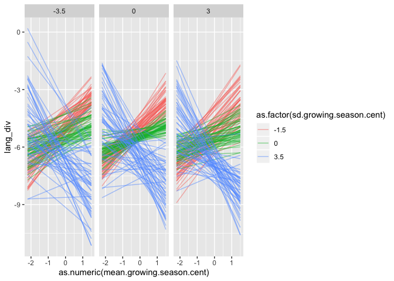<!-- -->
