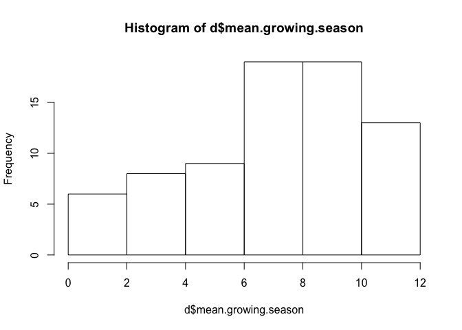
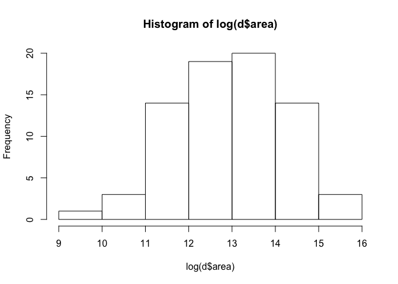
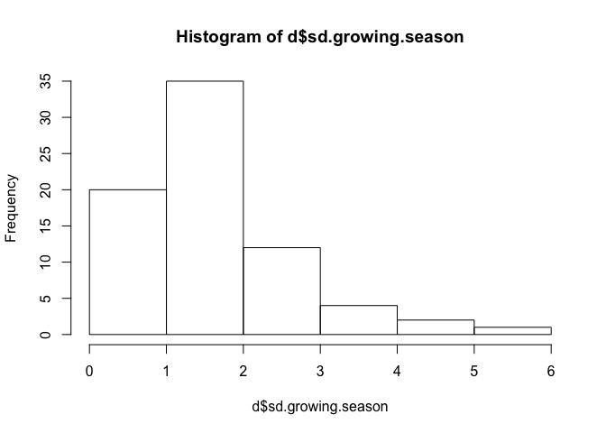

## 8E1 (7E1)

1) temperature affects the rate at which dough rises, per a certain amount of yeast
2) education leads to higher income, but the income returned for a given level of education depends on the field of work.
3) gasoline makes a car go, but the speed achieved per unit gas might depend on whether you are driving uphill, downhill, or flat. 

## 8E2 (7E2)

Statement 1. 


## 8E3 (7E3)

1) carm ~ heat*oil
2) speed ~ cyl + inj
3) beliefs ~ parentsorfriends
4) intel ~ social + appendages


## 8M1 (7M1) - assigned

In this case, it seems like the effects of water and shade also depend on temperature, and all three predictors may interact. While water and blooms have a generally positive relationship under cool temperatures, under hot temperatures this relationship is flat, and no matter how much water a plant recieves it will not produce more blooms. Same goes for shade, if the temperature is hot, then the plants could be in the light or the dark and still produce the same number of blooms (0). Knowing the temperature seems to be necessary if you want to predict how light and shade will affect bloom number. 


## 8M2 (7M2) - assigned

Maybe it would work to make the intercept indexed by temperature, so that it would represent the mean when temp == cool, but 0 when temp == hot. In this case, would you still want temperature to interact with shade and water so that those parameters could be 0 when temp == hot? I think so. If we're treating temperature as categorical here, then maybe this can also be coded with index terms. 

$\mu_i = \alpha[temp] + \beta_{w[temp]}W_i + \beta_{s[temp]}Si + \beta_{ws[temp]}W_iS_i$


## 8M3 (7M3)

The model could be something like:

Raven pop size ~ prey density * wolf density

My expectation is that when there is very little prey, it doesn't matter haw many wolves are around, because they probably don't make as many kills (and maybe they'd be less likely to share when food is scarce). Similarly, if there is a ton of prey but few wolves, then more prey is unlikely to have large effects on the availability of food to ravens (unless maybe increasing prey density makes it easier for the few wolves to catch prey, though this too would saturate at some point). When prey is very scarce, there may be stochastic crashes in the raven populations, resulting in non-linear declines at the low prey end of the axis. 


## 8H1 (7H1) - assigned


```r
# Load data
library(rethinking)
```

```
## Loading required package: rstan
```

```
## Loading required package: ggplot2
```

```
## Loading required package: StanHeaders
```

```
## rstan (Version 2.18.2, GitRev: 2e1f913d3ca3)
```

```
## For execution on a local, multicore CPU with excess RAM we recommend calling
## options(mc.cores = parallel::detectCores()).
## To avoid recompilation of unchanged Stan programs, we recommend calling
## rstan_options(auto_write = TRUE)
```

```
## Loading required package: parallel
```

```
## rethinking (Version 1.88)
```

```r
data(tulips)
d <- tulips

# Center and standardize
d$blooms_std <- d$blooms / max(d$blooms)
d$water_cent <- d$water - mean(d$water)
d$shade_cent <- d$shade - mean(d$shade)
d$bed_index <- ifelse(d$bed == "a", 1, ifelse(d$bed == "b", 2, 3))

# Add bed as an indexed variable. Use a prior that is centered on no effect of bed but with which is would be very plausible for bed to accout for differences of 25% in bloom number 
bed <- rnorm(1e4, 0, 0.25)
sum(abs(bed) < 0.25)/length(bed)
```

```
## [1] 0.6747
```

```r
m1.1 <- quap(
  alist(
    blooms_std ~ dnorm(mu, sigma),
    mu <- a + bw*water_cent + bs*shade_cent + bws*water_cent*shade_cent + bb[bed_index],
    a ~ dnorm(0.5, 0.25),
    bw ~ dnorm(0, 0.25),
    bs ~ dnorm(0, 0.25),
    bws ~ dnorm(0, 0.25),
    bb[bed_index] ~ dnorm(0, 0.25),
    sigma ~ dexp(1)
 ),
  data=d)

precis(m1.1, depth = 3)
```

```
##              mean         sd        5.5%       94.5%
## a      0.39305935 0.12596596  0.19174143  0.59437728
## bw     0.20743722 0.02536550  0.16689824  0.24797619
## bs    -0.11384932 0.02536088 -0.15438090 -0.07331774
## bws   -0.14389321 0.03098438 -0.19341223 -0.09437418
## bb[1] -0.12197417 0.12845587 -0.32727146  0.08332311
## bb[2]  0.00116017 0.12845488 -0.20413553  0.20645587
## bb[3]  0.01387256 0.12845498 -0.19142331  0.21916842
## sigma  0.10814643 0.01467828  0.08468771  0.13160516
```

Bed A tends to have slightly fewer blooms, but it's cridble interval still overlaps with the other two beds. 


## 8H2 (7H2) - assigned


```r
# Make the old model 

m1.2 <- quap(
  alist(
    blooms_std ~ dnorm(mu, sigma),
    mu <- a + bw*water_cent + bs*shade_cent + bws*water_cent*shade_cent,
    a ~ dnorm(0.5, 0.25),
    bw ~ dnorm(0, 0.25),
    bs ~ dnorm(0, 0.25),
    bws ~ dnorm(0, 0.25),
    sigma ~ dexp(1)
 ),
  data=d)

compare(m1.1, m1.2)
```

```
##           WAIC    pWAIC    dWAIC    weight       SE      dSE
## m1.1 -23.58269 9.708941 0.000000 0.6354401 10.04229       NA
## m1.2 -22.47143 6.422703 1.111254 0.3645599 10.36673 7.737849
```

The model that includes bed has lower WAIC, and so it fits the data better. I tihnk this indicates that although beds aren't strongly different from each other, knowing which bed a plant grew in gives you a bit of information about how many blooms it is likely to make. 


## 8H3 (7H3)


## 8H4 (7H4) - assigned

Evaluate the hypothesis that language diversity is partly a product of food security. 


```r
data(nettle)
d <- nettle

# Create outcome variable
d$lang.per.cap = d$num.lang/d$k.pop
hist(d$lang.per.cap, breaks = 40)
```

<!-- -->

```r
# Most countries have few languages/capita
d$log.lang.per.cap = log(d$lang.per.cap)
mean(d$log.lang.per.cap)
```

```
## [1] -5.456606
```

```r
# Some predictors of interest: mean.growing.season and sd.growing.season
# Prior on intercept: most countries have few languages per capita, so the mean of the logged response is ~-5
hist(d$mean.growing.season)
```

<!-- -->

```r
# I'm going to center and scale mean growing season
d$mean.growing.season.cent = (d$mean.growing.season-mean(d$mean.growing.season))/sd(d$mean.growing.season)
hist(log(d$area))
```

<!-- -->

```r
# Also going to center log area
d$log.area.cent = log(d$area) - mean(log(d$area))
hist(d$sd.growing.season)
```

<!-- -->

```r
# Values in SD growing season aren't too wild, so leave them as is?

# A) Build a model of languages/capita ~ mean growing season + log(area)
m4.1 <- quap(
  alist(
    log(lang.per.cap) ~ dnorm(mu, sigma),
    mu <- a + bmg*mean.growing.season.cent + ba*log.area.cent, 
    a ~ dnorm(-5, 1),
    bmg ~ dnorm(0, 0.25),
    ba ~ dnorm(0, 0.25),
    sigma ~ dexp(1)
 ),
  data=d)
precis(m4.1)
```

```
##             mean        sd        5.5%        94.5%
## a     -5.4451007 0.1587459 -5.69880723 -5.191394108
## bmg    0.3224048 0.1421223  0.09526597  0.549543648
## ba    -0.1901636 0.1179979 -0.37874703 -0.001580232
## sigma  1.3830279 0.1128991  1.20259340  1.563462481
```

In my first model, mean growing season has a positive relationship with language diversity (94% CI  = 0.10-0.55), indicating that areas with long growing seasons (and perhaps greater food security) have a higher diversity of languages. This lends support for the hypothesis. Area tends to have a negative relationship with language diversity (though the 94% CI does not exclude 0), which I find surprising. I would think that large countries would have more potential to have isolated regions within them where language might diverge. 


```r
# B) Build a model of languages/capita ~ sd growing season + log(area)
m4.2 <- quap(
  alist(
    log(lang.per.cap) ~ dnorm(mu, sigma),
    mu <- a + bsd*sd.growing.season + ba*log.area.cent, 
    a ~ dnorm(-5, 1),
    bsd ~ dnorm(0, 1),
    ba ~ dnorm(0, 1),
    sigma ~ dexp(1)
 ),
  data=d)

precis(m4.2)
```

```
##             mean        sd       5.5%        94.5%
## a     -5.0952284 0.3298800 -5.6224404 -4.568016395
## bsd   -0.2111391 0.1732744 -0.4880650  0.065786889
## ba    -0.2347988 0.1504900 -0.4753109  0.005713192
## sigma  1.4248125 0.1154651  1.2402770  1.609347987
```
While the estimate for the effect of growing season SD on language diversity is negative, it has a lot of uncertainty associated with it, so we can't be confident that it has a negative relationship with language diversity. 


```r
# C) Build a model of languages/capita ~ sd growing season*mean growing season + log(area)
m4.3 <- quap(
  alist(
    log(lang.per.cap) ~ dnorm(mu, sigma),
    mu <- a + bsd*sd.growing.season + bmg*mean.growing.season.cent + bsm*mean.growing.season.cent*sd.growing.season + ba*log.area.cent, 
    a ~ dnorm(-5, 1),
    bsd ~ dnorm(0, 1),
    bmg ~ dnorm(0, 1),
    bsm ~ dnorm(0, 1),
    ba ~ dnorm(0, 1),
    sigma ~ dexp(1)
 ),
  data=d)

precis(m4.3)
```

```
##              mean        sd       5.5%       94.5%
## a     -4.90570086 0.3119556 -5.4042661 -4.40713563
## bsd   -0.32131487 0.1650741 -0.5851352 -0.05749454
## bmg    0.87904601 0.2300532  0.5113766  1.24671539
## bsm   -0.31461799 0.1433704 -0.5437516 -0.08548442
## ba    -0.02346292 0.1525750 -0.2673073  0.22038141
## sigma  1.29596588 0.1052461  1.1277623  1.46416944
```

The interaction between mean and standard deviation differs from 0, indicating that the effect of each of these two variables depends upon the other. 

To understand, try plotting it:


```r
mu_sd1 = link(m4.3, data = data.frame(sd.growing.season = 1, mean.growing.season.cent = seq(from = min(d$mean.growing.season.cent), to = max(d$mean.growing.season.cent), by = 0.5), log.area.cent = mean(d$log.area.cent)))

# plot(d$log.lang.per.cap, d$mean.growing.season.cent)
  # for (i in 1:20) lines(-1:1, mu_sd1[i,], col=col.alpha("black",0.3))
```

Needs improvement: selection of priors, centering and scaling predictors
