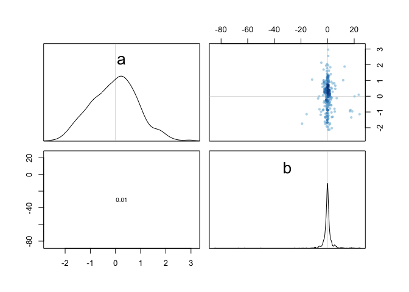
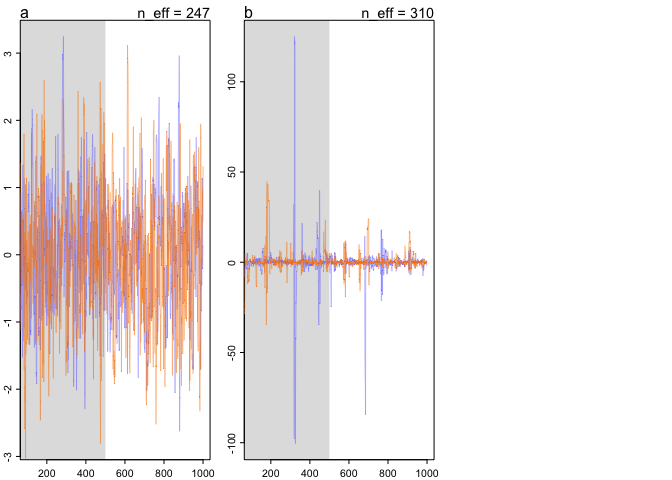

## 8E1

Which of the following is a requirement of the simple Metropolis algorithm?
(1)  The parameters must be discrete. <- No
(2)  The likelihood function must be Gaussian. <- No
(3)  The proposal distribution must be symmetric. <- Yes

## 8E2

Gibbs sampling is more efficient than the Metropolis algorithm. How does it achieve this extra efficiency? Are there any limitations to the Gibbs sampling strategy?

Gibbs sampling uses "smarter" proposals to characterize the posterior distribution with fewer samples than a classic metropolis algorithm. It does this with conjugate prior-likelihood pairs, which are analytically tractable.


## 8E3 

Which sort of parameters can Hamiltonian Monte Carlo not handle? Can you explain why?

HMC can't handle discrete parameters, because it can't calculate a gradient across categories. 


## 8M1

Re-estimate the terrain ruggedness model from the chapter, but now using a uniform prior and an exponential prior for the standard deviation, sigma. The uniform prior should be dunif(0,10) and the exponential should be dexp(1). Do the different priors have any detectible influence on the posterior distribution?


```r
data(rugged)
d <- rugged
d$log_gdp <- log(d$rgdppc_2000)
dd <- d[ complete.cases(d$rgdppc_2000) , ]
dd$log_gdp_std <- dd$log_gdp / mean(dd$log_gdp)
dd$rugged_std <- dd$rugged / max(dd$rugged)
dd$cid <- ifelse( dd$cont_africa==1 , 1 , 2 )

dat_slim <- list(
    log_gdp_std = dd$log_gdp_std,
    rugged_std = dd$rugged_std,
    cid = as.integer( dd$cid )
)
str(dat_slim)
```

```
## List of 3
##  $ log_gdp_std: num [1:170] 0.88 0.965 1.166 1.104 0.915 ...
##  $ rugged_std : num [1:170] 0.138 0.553 0.124 0.125 0.433 ...
##  $ cid        : int [1:170] 1 2 2 2 2 2 2 2 2 1 ...
```

```r
m9.1a <- ulam(
    alist(
        log_gdp_std ~ dnorm( mu , sigma ) ,
        mu <- a[cid] + b[cid]*( rugged_std - 0.215 ) ,
        a[cid] ~ dnorm( 1 , 0.1 ) ,
        b[cid] ~ dnorm( 0 , 0.3 ) ,
        sigma ~ dexp( 1 )
),
data=dat_slim , chains=2 , cores=4 , iter=1000 )

m9.1b <- ulam(
    alist(
        log_gdp_std ~ dnorm( mu , sigma ) ,
        mu <- a[cid] + b[cid]*( rugged_std - 0.215 ) ,
        a[cid] ~ dnorm( 1 , 0.1 ) ,
        b[cid] ~ dnorm( 0 , 0.3 ) ,
        sigma ~ dcauchy( 0 , 1 )
),
data=dat_slim , chains=2 , cores=4 , iter=1000 )

m9.1c <- ulam(
    alist(
        log_gdp_std ~ dnorm( mu , sigma ) ,
        mu <- a[cid] + b[cid]*( rugged_std - 0.215 ) ,
        a[cid] ~ dnorm( 1 , 0.1 ) ,
        b[cid] ~ dnorm( 0 , 0.3 ) ,
        sigma ~ dunif( 0, 10 )
),
data=dat_slim , chains=2 , cores=4 , iter=1000 )

precis(m9.1a, depth = 2)
```

```
##             mean          sd        5.5%       94.5%    n_eff      Rhat
## a[1]   0.8863822 0.015466988  0.86126732  0.91197399 1529.769 0.9994299
## a[2]   1.0500688 0.009945057  1.03421978  1.06582555 1490.708 1.0022804
## b[1]   0.1302179 0.075203336  0.01028932  0.25416205 1070.146 0.9984765
## b[2]  -0.1426470 0.053777681 -0.23148003 -0.05893573 1217.520 1.0073814
## sigma  0.1114758 0.006077840  0.10238256  0.12164832 1543.036 0.9984731
```

```r
precis(m9.1b, depth = 2)
```

```
##             mean          sd         5.5%       94.5%     n_eff      Rhat
## a[1]   0.8868247 0.015076464  0.863061846  0.91061182 1241.6353 0.9998675
## a[2]   1.0502304 0.009812701  1.035187146  1.06538619 1304.6269 0.9998985
## b[1]   0.1298718 0.075044338  0.009305759  0.24814811 1015.8578 1.0031323
## b[2]  -0.1404717 0.058672645 -0.235309130 -0.04769051  917.7496 0.9992365
## sigma  0.1116715 0.006686767  0.101844965  0.12272659 1386.9810 0.9982166
```

```r
precis(m9.1c, depth = 2)
```

```
##             mean          sd        5.5%       94.5%    n_eff      Rhat
## a[1]   0.8861945 0.016609860  0.86059937  0.91276426 1598.157 0.9983460
## a[2]   1.0501240 0.009893212  1.03389630  1.06559875 1588.079 1.0004466
## b[1]   0.1311550 0.077026616  0.01117283  0.25228974 1283.004 0.9990597
## b[2]  -0.1424958 0.056099893 -0.23348916 -0.05602652 1019.315 1.0018514
## sigma  0.1115264 0.006183913  0.10256159  0.12116427 1237.496 1.0006486
```

Altering these priors does not have any impact on the estimates of the posterior.


## 8M2

The Cauchy and exponential priors from the terrain ruggedness model are very weak. They can be made more informative by reducing their scale. Compare the dcauchy and dexp priors for progressively smaller values of the scaling parameter. As these priors become stronger, how does each influence the posterior distribution?


```r
m9.1d <- ulam(
    alist(
        log_gdp_std ~ dnorm( mu , sigma ) ,
        mu <- a[cid] + b[cid]*( rugged_std - 0.215 ) ,
        a[cid] ~ dnorm( 1 , 0.1 ) ,
        b[cid] ~ dnorm( 0 , 0.3 ) ,
        sigma ~ dexp( 1)
),
data=dat_slim , chains=2 , cores=4 , iter=1000 )


m9.1e <- ulam(
    alist(
        log_gdp_std ~ dnorm( mu , sigma ) ,
        mu <- a[cid] + b[cid]*( rugged_std - 0.215 ) ,
        a[cid] ~ dnorm( 1 , 0.1 ) ,
        b[cid] ~ dnorm( 0 , 0.3 ) ,
        sigma ~ dexp( 10)
),
data=dat_slim , chains=2 , cores=4 , iter=1000 )


m9.1f <- ulam(
    alist(
        log_gdp_std ~ dnorm( mu , sigma ) ,
        mu <- a[cid] + b[cid]*( rugged_std - 0.215 ) ,
        a[cid] ~ dnorm( 1 , 0.1 ) ,
        b[cid] ~ dnorm( 0 , 0.3 ) ,
        sigma ~ dexp( 100)
),
data=dat_slim , chains=2 , cores=4 , iter=1000 )

precis(m9.1d, depth = 2)
```

```
##             mean          sd        5.5%       94.5%    n_eff      Rhat
## a[1]   0.8865344 0.016381660  0.86168478  0.91315067 1268.765 0.9982900
## a[2]   1.0503479 0.010274732  1.03279771  1.06719881 2018.602 0.9980637
## b[1]   0.1343410 0.076241991  0.01412217  0.25762748 1313.769 1.0003612
## b[2]  -0.1442152 0.058611422 -0.23720562 -0.04918225 1248.172 0.9984648
## sigma  0.1115777 0.005879727  0.10278735  0.12172723 1064.560 0.9988071
```

```r
precis(m9.1e, depth = 2)
```

```
##             mean          sd        5.5%       94.5%     n_eff      Rhat
## a[1]   0.8865043 0.015807099  0.86028793  0.91031246 1108.2513 0.9992136
## a[2]   1.0502970 0.009694636  1.03440677  1.06537517 1800.8439 0.9997346
## b[1]   0.1329871 0.076179689  0.01207744  0.25338986 1350.4965 0.9984993
## b[2]  -0.1425911 0.053250786 -0.22359950 -0.06188119 1483.4959 1.0006272
## sigma  0.1112736 0.006069526  0.10217316  0.12121696  981.3131 1.0009950
```

```r
precis(m9.1f, depth = 2)
```

```
##             mean          sd        5.5%       94.5%     n_eff      Rhat
## a[1]   0.8864142 0.015744624  0.85996963  0.91196566 1318.2489 1.0000138
## a[2]   1.0499439 0.010117074  1.03393714  1.06639565 1396.2879 0.9996281
## b[1]   0.1290254 0.071582056  0.01486630  0.23516883 1466.8350 1.0009069
## b[2]  -0.1437159 0.052322404 -0.22199395 -0.05737894 1177.0563 1.0014467
## sigma  0.1081189 0.005819218  0.09928713  0.11728945  971.8216 1.0000462
```

```r
m9.1g <- ulam(
    alist(
        log_gdp_std ~ dnorm( mu , sigma ) ,
        mu <- a[cid] + b[cid]*( rugged_std - 0.215 ) ,
        a[cid] ~ dnorm( 1 , 0.1 ) ,
        b[cid] ~ dnorm( 0 , 0.3 ) ,
        sigma ~ dcauchy( 0, 1)
),
data=dat_slim , chains=2 , cores=4 , iter=1000 )
m9.1h <- ulam(
    alist(
        log_gdp_std ~ dnorm( mu , sigma ) ,
        mu <- a[cid] + b[cid]*( rugged_std - 0.215 ) ,
        a[cid] ~ dnorm( 1 , 0.1 ) ,
        b[cid] ~ dnorm( 0 , 0.3 ) ,
        sigma ~ dcauchy( 0, 0.1)
),
data=dat_slim , chains=2 , cores=4 , iter=1000 )
m9.1i <- ulam(
    alist(
        log_gdp_std ~ dnorm( mu , sigma ) ,
        mu <- a[cid] + b[cid]*( rugged_std - 0.215 ) ,
        a[cid] ~ dnorm( 1 , 0.1 ) ,
        b[cid] ~ dnorm( 0 , 0.3 ) ,
        sigma ~ dcauchy( 0, 0.01)
),
data=dat_slim , chains=2 , cores=4 , iter=1000 )

precis(m9.1g, depth = 2)
```

```
##             mean          sd         5.5%       94.5%     n_eff      Rhat
## a[1]   0.8864508 0.015888160  0.861148374  0.91311354 1058.3911 1.0005077
## a[2]   1.0512223 0.010218979  1.035449851  1.06710365 1477.2845 0.9983491
## b[1]   0.1286534 0.077417647  0.006065634  0.25996837  861.2252 0.9986904
## b[2]  -0.1451874 0.056065218 -0.234439656 -0.05476416 1017.1906 1.0008602
## sigma  0.1118142 0.006241922  0.102623223  0.12244231 1391.0253 0.9993637
```

```r
precis(m9.1h, depth = 2)
```

```
##             mean          sd        5.5%       94.5%    n_eff      Rhat
## a[1]   0.8864298 0.015749654  0.86154462  0.91118179 1473.658 1.0005846
## a[2]   1.0503424 0.009933203  1.03451562  1.06650343 1693.991 0.9990173
## b[1]   0.1305616 0.073325871  0.01119733  0.24563343 1295.968 0.9997910
## b[2]  -0.1375634 0.054598932 -0.22389394 -0.04996561 1022.027 0.9983052
## sigma  0.1112757 0.006265285  0.10184765  0.12177560 1999.624 0.9989206
```

```r
precis(m9.1i, depth = 2)
```

```
##             mean          sd       5.5%       94.5%    n_eff      Rhat
## a[1]   0.8868793 0.015607685  0.8611369  0.91168888 1528.703 0.9987089
## a[2]   1.0508752 0.009656045  1.0352868  1.06693735 1255.522 0.9984362
## b[1]   0.1315331 0.074720283  0.0161976  0.25121449 1367.279 0.9981823
## b[2]  -0.1411645 0.054032310 -0.2262197 -0.05193583 1057.199 0.9998490
## sigma  0.1107841 0.005911426  0.1017530  0.12099675 1844.988 1.0036589
```

Varying the exponenetial prior on sigma didn't have a big effect. Same with the Cauchy prior. Maybe I'm not varying them enough?

## 8H1

Run the model below and then inspect the posterior distribution and explain what it is accomplishing.


```r
# R code 9.26
mp <- ulam(alist(a ~ dnorm(0,1),
                     b ~ dcauchy(0,1)),
               data=list(y=1),
               start=list(a=0,b=0),
               chains=2 , cores=4 , iter=1000 )
```

```
## Warning: Bulk Effective Samples Size (ESS) is too low, indicating posterior means and medians may be unreliable.
## Running the chains for more iterations may help. See
## http://mc-stan.org/misc/warnings.html#bulk-ess
```

```
## Warning: Tail Effective Samples Size (ESS) is too low, indicating posterior variances and tail quantiles may be unreliable.
## Running the chains for more iterations may help. See
## http://mc-stan.org/misc/warnings.html#tail-ess
```

```r
pairs(mp)
```

<!-- -->

```r
traceplot(mp)
```

<!-- -->
Compare the samples for the parameters a and b. Can you explain the different trace plots, using what you know about the Cauchy distribution?

The model is sampling from a normal distribution and a cauchy distribution. The Cauchy distribution holds most of it's probability near the mean, but has long fat tails, so it produces a spiky caterpillar. 

## 8H2

Recall the divorce rate example from Chapter 5. Repeat that analysis, using map2stan thistime, fitting models m5.1, m5.2, and m5.3.  Use compare to compare the models on the basis of WAIC. Explain the results.


```r
data(WaffleDivorce)
d <- WaffleDivorce

# standardize variables
d$A <- scale( d$MedianAgeMarriage )
d$D <- scale( d$Divorce )
d$M <- scale( d$Marriage )

wh = list(A = d$A, D = d$D, M = d$M)


m5.1 <- ulam(alist(D ~ dnorm( mu , sigma ) ,
                   mu <- a + bA * A ,
                   a ~ dnorm( 0 , 0.2 ) ,
                   bA ~ dnorm( 0 , 0.5 ) ,
                   sigma ~ dexp( 1 )) , 
             data = wh, chains=2 , cores=4 , iter=1000, log_lik = TRUE)


m5.2 <- ulam(alist(D ~ dnorm( mu , sigma ) , 
                   mu <- a + bM * M , 
                   a ~ dnorm( 0 , 0.2 ) ,
                   bM ~ dnorm( 0 , 0.5 ) ,
                   sigma ~ dexp( 1 )) ,
             data = wh, chains=2 , cores=4 , iter=1000, log_lik = TRUE)


m5.3 <- ulam(alist(D ~ dnorm( mu , sigma ) ,
                   mu <- a + bM*M + bA*A ,
                   a ~ dnorm( 0 , 0.2 ) ,
                   bM ~ dnorm( 0 , 0.5 ) ,
                   bA ~ dnorm( 0 , 0.5 ) , 
                   sigma ~ dexp( 1 )) ,
             data = wh, chains=2 , cores=4 , iter=1000, log_lik = TRUE)

compare(m5.1, m5.2, m5.3)
```

```
##          WAIC    pWAIC    dWAIC       weight        SE       dSE
## m5.1 125.0415 3.214507  0.00000 0.8219952252 12.337814        NA
## m5.3 128.1093 4.958585  3.06788 0.1772913616 12.635886 0.7814203
## m5.2 139.1403 2.875967 14.09886 0.0007134132  9.747332 8.8941252
```


## optional: 8H6

Modify the Metropolis algorithm code from the chapter to write your own simple MCMCestimator for globe tossing data and model from Chapter2.


