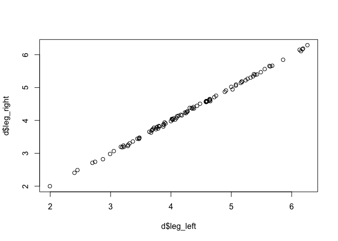
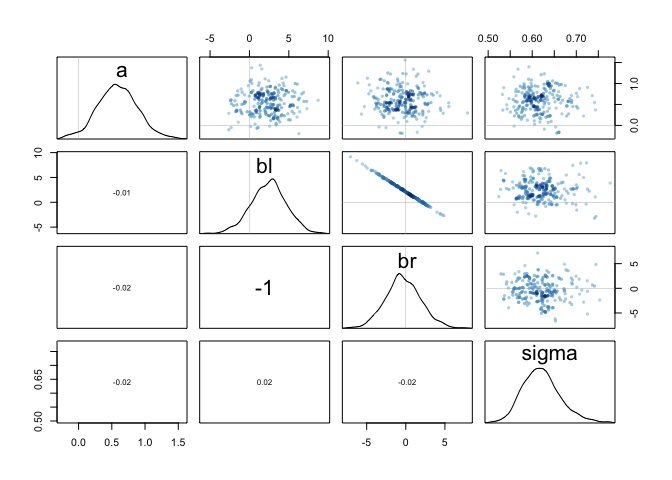
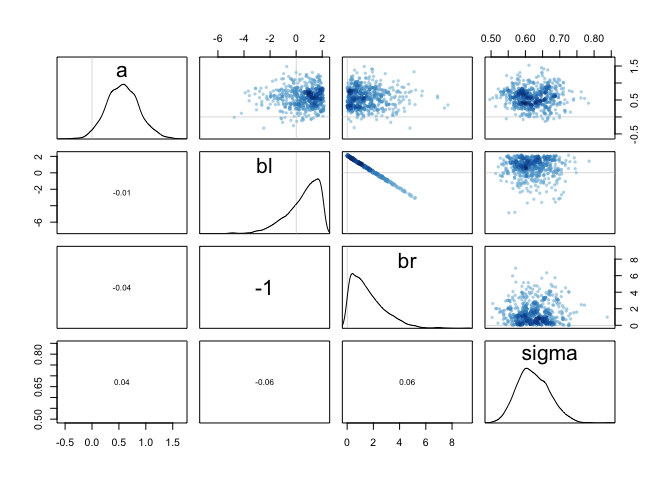

## 8E1

Which of the following is a requirement of the simple Metropolis algorithm?
(1)  The parameters must be discrete. <- No
(2)  The likelihood function must be Gaussian. <- No
(3)  The proposal distribution must be symmetric. <- Yes

## 8E2

Gibbs sampling is more efficient than the Metropolis algorithm. How does it achieve this extra efficiency? Are there any limitations to the Gibbs sampling strategy?

Gibbs sampling uses "smarter" proposals to characterize the posterior distribution with fewer samples than a classic metropolis algorithm. It does this with conjugate prior-likelihood pairs, which are analytically tractable.


## 8E3 

Which sort of parameters can Hamiltonian Monte Carlo not handle? Can you explain why?

HMC can't handle discrete parameters, because it can't calculate a gradient across categories. 


## 8M1

Re-estimate the terrain ruggedness model from the chapter, but now using a uniform prior and an exponential prior for the standard deviation, sigma. The uniform prior should be dunif(0,10) and the exponential should be dexp(1). Do the different priors have any detectible influence on the posterior distribution?


```r
data(rugged)
d <- rugged
d$log_gdp <- log(d$rgdppc_2000)
dd <- d[ complete.cases(d$rgdppc_2000) , ]
dd$log_gdp_std <- dd$log_gdp / mean(dd$log_gdp)
dd$rugged_std <- dd$rugged / max(dd$rugged)
dd$cid <- ifelse( dd$cont_africa==1 , 1 , 2 )

dat_slim <- list(
    log_gdp_std = dd$log_gdp_std,
    rugged_std = dd$rugged_std,
    cid = as.integer( dd$cid )
)
str(dat_slim)
```

```
## List of 3
##  $ log_gdp_std: num [1:170] 0.88 0.965 1.166 1.104 0.915 ...
##  $ rugged_std : num [1:170] 0.138 0.553 0.124 0.125 0.433 ...
##  $ cid        : int [1:170] 1 2 2 2 2 2 2 2 2 1 ...
```

```r
m9.1a <- ulam(
    alist(
        log_gdp_std ~ dnorm( mu , sigma ) ,
        mu <- a[cid] + b[cid]*( rugged_std - 0.215 ) ,
        a[cid] ~ dnorm( 1 , 0.1 ) ,
        b[cid] ~ dnorm( 0 , 0.3 ) ,
        sigma ~ dexp( 1 )
),
data=dat_slim , chains=2 , cores=4 , iter=1000 )

m9.1b <- ulam(
    alist(
        log_gdp_std ~ dnorm( mu , sigma ) ,
        mu <- a[cid] + b[cid]*( rugged_std - 0.215 ) ,
        a[cid] ~ dnorm( 1 , 0.1 ) ,
        b[cid] ~ dnorm( 0 , 0.3 ) ,
        sigma ~ dcauchy( 0 , 1 )
),
data=dat_slim , chains=2 , cores=4 , iter=1000 )

m9.1c <- ulam(
    alist(
        log_gdp_std ~ dnorm( mu , sigma ) ,
        mu <- a[cid] + b[cid]*( rugged_std - 0.215 ) ,
        a[cid] ~ dnorm( 1 , 0.1 ) ,
        b[cid] ~ dnorm( 0 , 0.3 ) ,
        sigma ~ dunif( 0, 10 )
),
data=dat_slim , chains=2 , cores=4 , iter=1000 )

precis(m9.1a, depth = 2)
```

```
##             mean          sd        5.5%       94.5%    n_eff      Rhat
## a[1]   0.8863822 0.015466988  0.86126732  0.91197399 1529.769 0.9994299
## a[2]   1.0500688 0.009945057  1.03421978  1.06582555 1490.708 1.0022804
## b[1]   0.1302179 0.075203336  0.01028932  0.25416205 1070.146 0.9984765
## b[2]  -0.1426470 0.053777681 -0.23148003 -0.05893573 1217.520 1.0073814
## sigma  0.1114758 0.006077840  0.10238256  0.12164832 1543.036 0.9984731
```

```r
precis(m9.1b, depth = 2)
```

```
##             mean          sd         5.5%       94.5%     n_eff      Rhat
## a[1]   0.8868247 0.015076464  0.863061846  0.91061182 1241.6353 0.9998675
## a[2]   1.0502304 0.009812701  1.035187146  1.06538619 1304.6269 0.9998985
## b[1]   0.1298718 0.075044338  0.009305759  0.24814811 1015.8578 1.0031323
## b[2]  -0.1404717 0.058672645 -0.235309130 -0.04769051  917.7496 0.9992365
## sigma  0.1116715 0.006686767  0.101844965  0.12272659 1386.9810 0.9982166
```

```r
precis(m9.1c, depth = 2)
```

```
##             mean          sd        5.5%       94.5%    n_eff      Rhat
## a[1]   0.8861945 0.016609860  0.86059937  0.91276426 1598.157 0.9983460
## a[2]   1.0501240 0.009893212  1.03389630  1.06559875 1588.079 1.0004466
## b[1]   0.1311550 0.077026616  0.01117283  0.25228974 1283.004 0.9990597
## b[2]  -0.1424958 0.056099893 -0.23348916 -0.05602652 1019.315 1.0018514
## sigma  0.1115264 0.006183913  0.10256159  0.12116427 1237.496 1.0006486
```

Altering these priors does not have any impact on the estimates of the posterior.


## 8M2

The Cauchy and exponential priors from the terrain ruggedness model are very weak. They can be made more informative by reducing their scale. Compare the dcauchy and dexp priors for progressively smaller values of the scaling parameter. As these priors become stronger, how does each influence the posterior distribution?


```r
m9.1d <- ulam(
    alist(
        log_gdp_std ~ dnorm( mu , sigma ) ,
        mu <- a[cid] + b[cid]*( rugged_std - 0.215 ) ,
        a[cid] ~ dnorm( 1 , 0.1 ) ,
        b[cid] ~ dnorm( 0 , 0.3 ) ,
        sigma ~ dexp( 1)
),
data=dat_slim , chains=2 , cores=4 , iter=1000 )


m9.1e <- ulam(
    alist(
        log_gdp_std ~ dnorm( mu , sigma ) ,
        mu <- a[cid] + b[cid]*( rugged_std - 0.215 ) ,
        a[cid] ~ dnorm( 1 , 0.1 ) ,
        b[cid] ~ dnorm( 0 , 0.3 ) ,
        sigma ~ dexp( 10)
),
data=dat_slim , chains=2 , cores=4 , iter=1000 )


m9.1f <- ulam(
    alist(
        log_gdp_std ~ dnorm( mu , sigma ) ,
        mu <- a[cid] + b[cid]*( rugged_std - 0.215 ) ,
        a[cid] ~ dnorm( 1 , 0.1 ) ,
        b[cid] ~ dnorm( 0 , 0.3 ) ,
        sigma ~ dexp( 100)
),
data=dat_slim , chains=2 , cores=4 , iter=1000 )

precis(m9.1d, depth = 2)
```

```
##             mean          sd        5.5%       94.5%    n_eff      Rhat
## a[1]   0.8865344 0.016381660  0.86168478  0.91315067 1268.765 0.9982900
## a[2]   1.0503479 0.010274732  1.03279771  1.06719881 2018.602 0.9980637
## b[1]   0.1343410 0.076241991  0.01412217  0.25762748 1313.769 1.0003612
## b[2]  -0.1442152 0.058611422 -0.23720562 -0.04918225 1248.172 0.9984648
## sigma  0.1115777 0.005879727  0.10278735  0.12172723 1064.560 0.9988071
```

```r
precis(m9.1e, depth = 2)
```

```
##             mean          sd        5.5%       94.5%     n_eff      Rhat
## a[1]   0.8865043 0.015807099  0.86028793  0.91031246 1108.2513 0.9992136
## a[2]   1.0502970 0.009694636  1.03440677  1.06537517 1800.8439 0.9997346
## b[1]   0.1329871 0.076179689  0.01207744  0.25338986 1350.4965 0.9984993
## b[2]  -0.1425911 0.053250786 -0.22359950 -0.06188119 1483.4959 1.0006272
## sigma  0.1112736 0.006069526  0.10217316  0.12121696  981.3131 1.0009950
```

```r
precis(m9.1f, depth = 2)
```

```
##             mean          sd        5.5%       94.5%     n_eff      Rhat
## a[1]   0.8864142 0.015744624  0.85996963  0.91196566 1318.2489 1.0000138
## a[2]   1.0499439 0.010117074  1.03393714  1.06639565 1396.2879 0.9996281
## b[1]   0.1290254 0.071582056  0.01486630  0.23516883 1466.8350 1.0009069
## b[2]  -0.1437159 0.052322404 -0.22199395 -0.05737894 1177.0563 1.0014467
## sigma  0.1081189 0.005819218  0.09928713  0.11728945  971.8216 1.0000462
```

```r
m9.1g <- ulam(
    alist(
        log_gdp_std ~ dnorm( mu , sigma ) ,
        mu <- a[cid] + b[cid]*( rugged_std - 0.215 ) ,
        a[cid] ~ dnorm( 1 , 0.1 ) ,
        b[cid] ~ dnorm( 0 , 0.3 ) ,
        sigma ~ dcauchy( 0, 1)
),
data=dat_slim , chains=2 , cores=4 , iter=1000 )
m9.1h <- ulam(
    alist(
        log_gdp_std ~ dnorm( mu , sigma ) ,
        mu <- a[cid] + b[cid]*( rugged_std - 0.215 ) ,
        a[cid] ~ dnorm( 1 , 0.1 ) ,
        b[cid] ~ dnorm( 0 , 0.3 ) ,
        sigma ~ dcauchy( 0, 0.1)
),
data=dat_slim , chains=2 , cores=4 , iter=1000 )
m9.1i <- ulam(
    alist(
        log_gdp_std ~ dnorm( mu , sigma ) ,
        mu <- a[cid] + b[cid]*( rugged_std - 0.215 ) ,
        a[cid] ~ dnorm( 1 , 0.1 ) ,
        b[cid] ~ dnorm( 0 , 0.3 ) ,
        sigma ~ dcauchy( 0, 0.01)
),
data=dat_slim , chains=2 , cores=4 , iter=1000 )

precis(m9.1g, depth = 2)
```

```
##             mean          sd         5.5%       94.5%     n_eff      Rhat
## a[1]   0.8864508 0.015888160  0.861148374  0.91311354 1058.3911 1.0005077
## a[2]   1.0512223 0.010218979  1.035449851  1.06710365 1477.2845 0.9983491
## b[1]   0.1286534 0.077417647  0.006065634  0.25996837  861.2252 0.9986904
## b[2]  -0.1451874 0.056065218 -0.234439656 -0.05476416 1017.1906 1.0008602
## sigma  0.1118142 0.006241922  0.102623223  0.12244231 1391.0253 0.9993637
```

```r
precis(m9.1h, depth = 2)
```

```
##             mean          sd        5.5%       94.5%    n_eff      Rhat
## a[1]   0.8864298 0.015749654  0.86154462  0.91118179 1473.658 1.0005846
## a[2]   1.0503424 0.009933203  1.03451562  1.06650343 1693.991 0.9990173
## b[1]   0.1305616 0.073325871  0.01119733  0.24563343 1295.968 0.9997910
## b[2]  -0.1375634 0.054598932 -0.22389394 -0.04996561 1022.027 0.9983052
## sigma  0.1112757 0.006265285  0.10184765  0.12177560 1999.624 0.9989206
```

```r
precis(m9.1i, depth = 2)
```

```
##             mean          sd       5.5%       94.5%    n_eff      Rhat
## a[1]   0.8868793 0.015607685  0.8611369  0.91168888 1528.703 0.9987089
## a[2]   1.0508752 0.009656045  1.0352868  1.06693735 1255.522 0.9984362
## b[1]   0.1315331 0.074720283  0.0161976  0.25121449 1367.279 0.9981823
## b[2]  -0.1411645 0.054032310 -0.2262197 -0.05193583 1057.199 0.9998490
## sigma  0.1107841 0.005911426  0.1017530  0.12099675 1844.988 1.0036589
```

Varying the exponenetial prior on sigma didn't have a big effect. Same with the Cauchy prior. Maybe I'm not varying them enough?

## 8H1

Run the model below and then inspect the posterior distribution and explain what it is accomplishing.


```r
# R code 9.26
mp <- ulam(alist(a ~ dnorm(0,1),
                     b ~ dcauchy(0,1)),
               data=list(y=1),
               start=list(a=0,b=0),
               chains=2 , cores=4 , iter=1000 )
```

```
## Warning: Bulk Effective Samples Size (ESS) is too low, indicating posterior means and medians may be unreliable.
## Running the chains for more iterations may help. See
## http://mc-stan.org/misc/warnings.html#bulk-ess
```

```
## Warning: Tail Effective Samples Size (ESS) is too low, indicating posterior variances and tail quantiles may be unreliable.
## Running the chains for more iterations may help. See
## http://mc-stan.org/misc/warnings.html#tail-ess
```

```r
pairs(mp)
```

<!-- -->

```r
traceplot(mp)
```

<!-- -->
Compare the samples for the parameters a and b. Can you explain the different trace plots, using what you know about the Cauchy distribution?

The model is sampling from a normal distribution and a cauchy distribution. The Cauchy distribution holds most of it's probability near the mean, but has long fat tails, so it produces a spiky caterpillar. 

## 8H2

Recall the divorce rate example from Chapter 5. Repeat that analysis, using map2stan thistime, fitting models m5.1, m5.2, and m5.3.  Use compare to compare the models on the basis of WAIC. Explain the results.


```r
data(WaffleDivorce)
d <- WaffleDivorce

# standardize variables
d$A <- scale( d$MedianAgeMarriage )
d$D <- scale( d$Divorce )
d$M <- scale( d$Marriage )

wh = list(A = d$A, D = d$D, M = d$M)


m5.1 <- ulam(alist(D ~ dnorm( mu , sigma ) ,
                   mu <- a + bA * A ,
                   a ~ dnorm( 0 , 0.2 ) ,
                   bA ~ dnorm( 0 , 0.5 ) ,
                   sigma ~ dexp( 1 )) , 
             data = wh, chains=2 , cores=4 , iter=1000, log_lik = TRUE)


m5.2 <- ulam(alist(D ~ dnorm( mu , sigma ) , 
                   mu <- a + bM * M , 
                   a ~ dnorm( 0 , 0.2 ) ,
                   bM ~ dnorm( 0 , 0.5 ) ,
                   sigma ~ dexp( 1 )) ,
             data = wh, chains=2 , cores=4 , iter=1000, log_lik = TRUE)


m5.3 <- ulam(alist(D ~ dnorm( mu , sigma ) ,
                   mu <- a + bM*M + bA*A ,
                   a ~ dnorm( 0 , 0.2 ) ,
                   bM ~ dnorm( 0 , 0.5 ) ,
                   bA ~ dnorm( 0 , 0.5 ) , 
                   sigma ~ dexp( 1 )) ,
             data = wh, chains=2 , cores=4 , iter=1000, log_lik = TRUE)

compare(m5.1, m5.2, m5.3)
```

```
##          WAIC    pWAIC    dWAIC       weight        SE       dSE
## m5.1 125.0415 3.214507  0.00000 0.8219952252 12.337814        NA
## m5.3 128.1093 4.958585  3.06788 0.1772913616 12.635886 0.7814203
## m5.2 139.1403 2.875967 14.09886 0.0007134132  9.747332 8.8941252
```

The model with median age of marriage only is the best.


## 8E4

Explain the difference between the effective number of samples, n_eff as calculated by Stan, and the actual number of samples.

The effective number of samples takes into account the amount of autocorrelation betwee the samples, which is often low when using HMC. As a result, the number of effective samples may be lower than the actual number (if there is some autocorrelation) or could be more than the number of samples (I don't really understand how it ends up being > the actual number of samples).


## 8M3

Re-estimate one of the Stan models from the chapter, but at different numbers of warmup iterations. Be sure to use the same number of sampling iterations in each case. Compare the n_eff values. How much warmup is enough?


```r
str(dat_slim)
```

```
## List of 3
##  $ log_gdp_std: num [1:170] 0.88 0.965 1.166 1.104 0.915 ...
##  $ rugged_std : num [1:170] 0.138 0.553 0.124 0.125 0.433 ...
##  $ cid        : int [1:170] 1 2 2 2 2 2 2 2 2 1 ...
```

```r
# First with warmup = 500

m9.1.500 <- ulam(
    alist(
        log_gdp_std ~ dnorm(mu, sigma),
        mu <- a[cid] + b[cid]*(rugged_std - 0.215),
        a[cid] ~ dnorm(1 , 0.1) ,
        b[cid] ~ dnorm(0 , 0.3) ,
        sigma ~ dexp(1)
),
data=dat_slim , chains=2 , cores=4 , iter=1000, warmup = 500)

# Now trying 200

m9.1.200 <- ulam(
    alist(
        log_gdp_std ~ dnorm(mu, sigma),
        mu <- a[cid] + b[cid]*(rugged_std - 0.215),
        a[cid] ~ dnorm(1 , 0.1) ,
        b[cid] ~ dnorm(0 , 0.3) ,
        sigma ~ dexp(1)
),
data=dat_slim , chains=2 , cores=4 , iter=700, warmup = 200)
```

```
## recompiling to avoid crashing R session
```

```r
# Now 50

m9.1.50 <- ulam(
    alist(
        log_gdp_std ~ dnorm(mu, sigma),
        mu <- a[cid] + b[cid]*(rugged_std - 0.215),
        a[cid] ~ dnorm(1 , 0.1) ,
        b[cid] ~ dnorm(0 , 0.3) ,
        sigma ~ dexp(1)
),
data=dat_slim , chains=2 , cores=4 , iter=550, warmup = 50)
```

```
## recompiling to avoid crashing R session
```

```r
# Now 10
m9.1.10 <- ulam(
    alist(
        log_gdp_std ~ dnorm(mu, sigma),
        mu <- a[cid] + b[cid]*(rugged_std - 0.215),
        a[cid] ~ dnorm(1 , 0.1) ,
        b[cid] ~ dnorm(0 , 0.3) ,
        sigma ~ dexp(1)
),
data=dat_slim , chains=2 , cores=4 , iter=510, warmup = 10)
```

```
## recompiling to avoid crashing R session
```

```
## Warning: There were 1 chains where the estimated Bayesian Fraction of Missing Information was low. See
## http://mc-stan.org/misc/warnings.html#bfmi-low
```

```
## Warning: Examine the pairs() plot to diagnose sampling problems
```

```r
precis(m9.1.500, depth = 2)
```

```
##             mean         sd         5.5%       94.5%     n_eff      Rhat
## a[1]   0.8872923 0.01672856  0.860448825  0.91417190 1609.6160 0.9992054
## a[2]   1.0503162 0.01062443  1.033566636  1.06703834 1833.9649 0.9993386
## b[1]   0.1309709 0.07890389  0.005800389  0.25615438 1412.9073 0.9991352
## b[2]  -0.1423467 0.05437349 -0.229049075 -0.05636093 1387.6816 0.9987081
## sigma  0.1116131 0.00621789  0.101934326  0.12194836  901.1012 1.0002407
```

```r
precis(m9.1.200, depth = 2)
```

```
##             mean          sd        5.5%       94.5%    n_eff      Rhat
## a[1]   0.8863765 0.015216894  0.86278246  0.91077975 1098.879 0.9982740
## a[2]   1.0509620 0.009981701  1.03561162  1.06697442 1241.227 0.9983124
## b[1]   0.1339652 0.069426286  0.02292912  0.24367562 1045.657 0.9987547
## b[2]  -0.1433675 0.055993633 -0.23419520 -0.05660557 1002.499 0.9992262
## sigma  0.1111783 0.006052588  0.10253740  0.12076262 1100.074 0.9988346
```

```r
precis(m9.1.50, depth = 2)
```

```
##             mean          sd         5.5%       94.5%     n_eff      Rhat
## a[1]   0.8867406 0.015457004  0.861114397  0.91041032 1116.1561 1.0002702
## a[2]   1.0509422 0.010159161  1.034407171  1.06661591 1036.6947 1.0053515
## b[1]   0.1269798 0.078567544  0.006017201  0.24651910  405.7323 1.0007629
## b[2]  -0.1424382 0.057139705 -0.235062683 -0.05518712  596.4863 0.9994437
## sigma  0.1113639 0.006376114  0.101566592  0.12164168  641.9570 1.0000787
```

```r
precis(m9.1.10, depth = 2)
```

```
##             mean         sd        5.5%       94.5%    n_eff     Rhat
## a[1]   0.8848547 0.02759862  0.86008540  0.91117572 298.5563 1.002564
## a[2]   1.0475828 0.04252187  1.03388861  1.06620245 272.8771 1.006591
## b[1]   0.1333835 0.07341565  0.01405673  0.25693163 419.4151 1.002663
## b[2]  -0.1519211 0.12449974 -0.22993018 -0.06312128 165.0383 1.004994
## sigma  0.1200343 0.11829881  0.10269206  0.12205815 183.4617 1.007657
```

Even a warmup of just 50 iterations produces effective sample sizes > 200. But dropping down to 10 results in some warnings: 

WARNING: No variance estimation is performed for num_warmup < 20

There were 2 chains where the estimated Bayesian Fraction of Missing Information was low. See http://mc-stan.org/misc/warnings.html#bfmi-lowExamine the pairs() plot to diagnose sampling problems

Need to figure out some terminology: iteration, transition, sample. Are these all the same, i.e., 500 iterations after warmp = 500 transitions and results in 500 samples?


## 8H3

Sometimes changing a prior for one parameter has unanticipated effects on other parameters. This is because when a parameter is highly correlated with another parameter in the posterior, the prior influences both parameters. Here’s an example to work and think through.

Go back to the leg length example in Chapter 5. Here is the code again, which simulates height and leg lengths for 100 imagined individuals:


```r
# R code 9.26
N <- 100
height <- rnorm(N,10,2)
leg_prop <- runif(N,0.4,0.5)
leg_left <- leg_prop*height +
    rnorm( N , 0 , 0.02 )
leg_right <- leg_prop*height +
    rnorm( N , 0 , 0.02 )
d <- data.frame(height,leg_left,leg_right)
# number of individuals
# sim total height of each
# leg as proportion of height
# sim left leg as proportion + error
# sim right leg as proportion + error
# combine into data frame
plot(d$leg_left, d$leg_right)
```

<!-- -->

```r
# Very correlated, good for standina and walking.
```

And below is the model you fit before, resulting in a highly correlated posterior for the two beta parameters. This time, fit the model using map2stan:


```r
# R code 9.27
m5.8s <- ulam(
    alist(
        height ~ dnorm(mu, sigma),
        mu <- a + bl*leg_left + br*leg_right,
        a ~ dnorm(10, 100),
        bl ~ dnorm(2, 10),
        br ~ dnorm(2, 10),
        sigma ~ dcauchy(0, 1)
),
data = d, chains = 4, start = list(a = 10, bl = 0, br = 0, sigma = 1), log_lik = TRUE)
```

```
## 
## SAMPLING FOR MODEL 'ab14edb9893dbde4812a43aa3d28bba8' NOW (CHAIN 1).
## Chain 1: 
## Chain 1: Gradient evaluation took 3.9e-05 seconds
## Chain 1: 1000 transitions using 10 leapfrog steps per transition would take 0.39 seconds.
## Chain 1: Adjust your expectations accordingly!
## Chain 1: 
## Chain 1: 
## Chain 1: Iteration:   1 / 1000 [  0%]  (Warmup)
## Chain 1: Iteration: 100 / 1000 [ 10%]  (Warmup)
## Chain 1: Iteration: 200 / 1000 [ 20%]  (Warmup)
## Chain 1: Iteration: 300 / 1000 [ 30%]  (Warmup)
## Chain 1: Iteration: 400 / 1000 [ 40%]  (Warmup)
## Chain 1: Iteration: 500 / 1000 [ 50%]  (Warmup)
## Chain 1: Iteration: 501 / 1000 [ 50%]  (Sampling)
## Chain 1: Iteration: 600 / 1000 [ 60%]  (Sampling)
## Chain 1: Iteration: 700 / 1000 [ 70%]  (Sampling)
## Chain 1: Iteration: 800 / 1000 [ 80%]  (Sampling)
## Chain 1: Iteration: 900 / 1000 [ 90%]  (Sampling)
## Chain 1: Iteration: 1000 / 1000 [100%]  (Sampling)
## Chain 1: 
## Chain 1:  Elapsed Time: 1.9664 seconds (Warm-up)
## Chain 1:                2.46528 seconds (Sampling)
## Chain 1:                4.43168 seconds (Total)
## Chain 1: 
## 
## SAMPLING FOR MODEL 'ab14edb9893dbde4812a43aa3d28bba8' NOW (CHAIN 2).
## Chain 2: 
## Chain 2: Gradient evaluation took 9e-06 seconds
## Chain 2: 1000 transitions using 10 leapfrog steps per transition would take 0.09 seconds.
## Chain 2: Adjust your expectations accordingly!
## Chain 2: 
## Chain 2: 
## Chain 2: Iteration:   1 / 1000 [  0%]  (Warmup)
## Chain 2: Iteration: 100 / 1000 [ 10%]  (Warmup)
## Chain 2: Iteration: 200 / 1000 [ 20%]  (Warmup)
## Chain 2: Iteration: 300 / 1000 [ 30%]  (Warmup)
## Chain 2: Iteration: 400 / 1000 [ 40%]  (Warmup)
## Chain 2: Iteration: 500 / 1000 [ 50%]  (Warmup)
## Chain 2: Iteration: 501 / 1000 [ 50%]  (Sampling)
## Chain 2: Iteration: 600 / 1000 [ 60%]  (Sampling)
## Chain 2: Iteration: 700 / 1000 [ 70%]  (Sampling)
## Chain 2: Iteration: 800 / 1000 [ 80%]  (Sampling)
## Chain 2: Iteration: 900 / 1000 [ 90%]  (Sampling)
## Chain 2: Iteration: 1000 / 1000 [100%]  (Sampling)
## Chain 2: 
## Chain 2:  Elapsed Time: 1.94887 seconds (Warm-up)
## Chain 2:                2.66424 seconds (Sampling)
## Chain 2:                4.61311 seconds (Total)
## Chain 2: 
## 
## SAMPLING FOR MODEL 'ab14edb9893dbde4812a43aa3d28bba8' NOW (CHAIN 3).
## Chain 3: 
## Chain 3: Gradient evaluation took 9e-06 seconds
## Chain 3: 1000 transitions using 10 leapfrog steps per transition would take 0.09 seconds.
## Chain 3: Adjust your expectations accordingly!
## Chain 3: 
## Chain 3: 
## Chain 3: Iteration:   1 / 1000 [  0%]  (Warmup)
## Chain 3: Iteration: 100 / 1000 [ 10%]  (Warmup)
## Chain 3: Iteration: 200 / 1000 [ 20%]  (Warmup)
## Chain 3: Iteration: 300 / 1000 [ 30%]  (Warmup)
## Chain 3: Iteration: 400 / 1000 [ 40%]  (Warmup)
## Chain 3: Iteration: 500 / 1000 [ 50%]  (Warmup)
## Chain 3: Iteration: 501 / 1000 [ 50%]  (Sampling)
## Chain 3: Iteration: 600 / 1000 [ 60%]  (Sampling)
## Chain 3: Iteration: 700 / 1000 [ 70%]  (Sampling)
## Chain 3: Iteration: 800 / 1000 [ 80%]  (Sampling)
## Chain 3: Iteration: 900 / 1000 [ 90%]  (Sampling)
## Chain 3: Iteration: 1000 / 1000 [100%]  (Sampling)
## Chain 3: 
## Chain 3:  Elapsed Time: 1.83771 seconds (Warm-up)
## Chain 3:                2.39564 seconds (Sampling)
## Chain 3:                4.23335 seconds (Total)
## Chain 3: 
## 
## SAMPLING FOR MODEL 'ab14edb9893dbde4812a43aa3d28bba8' NOW (CHAIN 4).
## Chain 4: 
## Chain 4: Gradient evaluation took 1e-05 seconds
## Chain 4: 1000 transitions using 10 leapfrog steps per transition would take 0.1 seconds.
## Chain 4: Adjust your expectations accordingly!
## Chain 4: 
## Chain 4: 
## Chain 4: Iteration:   1 / 1000 [  0%]  (Warmup)
## Chain 4: Iteration: 100 / 1000 [ 10%]  (Warmup)
## Chain 4: Iteration: 200 / 1000 [ 20%]  (Warmup)
## Chain 4: Iteration: 300 / 1000 [ 30%]  (Warmup)
## Chain 4: Iteration: 400 / 1000 [ 40%]  (Warmup)
## Chain 4: Iteration: 500 / 1000 [ 50%]  (Warmup)
## Chain 4: Iteration: 501 / 1000 [ 50%]  (Sampling)
## Chain 4: Iteration: 600 / 1000 [ 60%]  (Sampling)
## Chain 4: Iteration: 700 / 1000 [ 70%]  (Sampling)
## Chain 4: Iteration: 800 / 1000 [ 80%]  (Sampling)
## Chain 4: Iteration: 900 / 1000 [ 90%]  (Sampling)
## Chain 4: Iteration: 1000 / 1000 [100%]  (Sampling)
## Chain 4: 
## Chain 4:  Elapsed Time: 1.89173 seconds (Warm-up)
## Chain 4:                2.67992 seconds (Sampling)
## Chain 4:                4.57165 seconds (Total)
## Chain 4:
```

```
## Warning: There were 1095 transitions after warmup that exceeded the maximum treedepth. Increase max_treedepth above 10. See
## http://mc-stan.org/misc/warnings.html#maximum-treedepth-exceeded
```

```
## Warning: Examine the pairs() plot to diagnose sampling problems
```

Compare the posterior distribution produced by the code above to the posterior distribution produced when you change the prior for br so that it is strictly positive:


```r
# R code 9.29
m5.8s2 <- map2stan(
    alist(
        height ~ dnorm(mu, sigma),
        mu <- a + bl*leg_left + br*leg_right,
        a ~ dnorm(10, 100),
        bl ~ dnorm(2, 10),
        br ~ dnorm(2, 10) & T[0, ],
        sigma ~ dcauchy(0, 1)
),
data = d, chains = 4, start = list(a = 10, bl = 0, br = 0, sigma = 1), log_lik = TRUE)
```

```
## 
## SAMPLING FOR MODEL '67b8228a12852eb6889bac376b2faeff' NOW (CHAIN 1).
## Chain 1: 
## Chain 1: Gradient evaluation took 2.5e-05 seconds
## Chain 1: 1000 transitions using 10 leapfrog steps per transition would take 0.25 seconds.
## Chain 1: Adjust your expectations accordingly!
## Chain 1: 
## Chain 1: 
## Chain 1: Iteration:    1 / 2000 [  0%]  (Warmup)
## Chain 1: Iteration:  200 / 2000 [ 10%]  (Warmup)
## Chain 1: Iteration:  400 / 2000 [ 20%]  (Warmup)
## Chain 1: Iteration:  600 / 2000 [ 30%]  (Warmup)
## Chain 1: Iteration:  800 / 2000 [ 40%]  (Warmup)
## Chain 1: Iteration: 1000 / 2000 [ 50%]  (Warmup)
## Chain 1: Iteration: 1001 / 2000 [ 50%]  (Sampling)
## Chain 1: Iteration: 1200 / 2000 [ 60%]  (Sampling)
## Chain 1: Iteration: 1400 / 2000 [ 70%]  (Sampling)
## Chain 1: Iteration: 1600 / 2000 [ 80%]  (Sampling)
## Chain 1: Iteration: 1800 / 2000 [ 90%]  (Sampling)
## Chain 1: Iteration: 2000 / 2000 [100%]  (Sampling)
## Chain 1: 
## Chain 1:  Elapsed Time: 1.83548 seconds (Warm-up)
## Chain 1:                2.01699 seconds (Sampling)
## Chain 1:                3.85247 seconds (Total)
## Chain 1: 
## 
## SAMPLING FOR MODEL '67b8228a12852eb6889bac376b2faeff' NOW (CHAIN 2).
## Chain 2: 
## Chain 2: Gradient evaluation took 1.1e-05 seconds
## Chain 2: 1000 transitions using 10 leapfrog steps per transition would take 0.11 seconds.
## Chain 2: Adjust your expectations accordingly!
## Chain 2: 
## Chain 2: 
## Chain 2: Iteration:    1 / 2000 [  0%]  (Warmup)
## Chain 2: Iteration:  200 / 2000 [ 10%]  (Warmup)
## Chain 2: Iteration:  400 / 2000 [ 20%]  (Warmup)
## Chain 2: Iteration:  600 / 2000 [ 30%]  (Warmup)
## Chain 2: Iteration:  800 / 2000 [ 40%]  (Warmup)
## Chain 2: Iteration: 1000 / 2000 [ 50%]  (Warmup)
## Chain 2: Iteration: 1001 / 2000 [ 50%]  (Sampling)
## Chain 2: Iteration: 1200 / 2000 [ 60%]  (Sampling)
## Chain 2: Iteration: 1400 / 2000 [ 70%]  (Sampling)
## Chain 2: Iteration: 1600 / 2000 [ 80%]  (Sampling)
## Chain 2: Iteration: 1800 / 2000 [ 90%]  (Sampling)
## Chain 2: Iteration: 2000 / 2000 [100%]  (Sampling)
## Chain 2: 
## Chain 2:  Elapsed Time: 2.24436 seconds (Warm-up)
## Chain 2:                2.08615 seconds (Sampling)
## Chain 2:                4.33051 seconds (Total)
## Chain 2: 
## 
## SAMPLING FOR MODEL '67b8228a12852eb6889bac376b2faeff' NOW (CHAIN 3).
## Chain 3: 
## Chain 3: Gradient evaluation took 1.1e-05 seconds
## Chain 3: 1000 transitions using 10 leapfrog steps per transition would take 0.11 seconds.
## Chain 3: Adjust your expectations accordingly!
## Chain 3: 
## Chain 3: 
## Chain 3: Iteration:    1 / 2000 [  0%]  (Warmup)
## Chain 3: Iteration:  200 / 2000 [ 10%]  (Warmup)
## Chain 3: Iteration:  400 / 2000 [ 20%]  (Warmup)
## Chain 3: Iteration:  600 / 2000 [ 30%]  (Warmup)
## Chain 3: Iteration:  800 / 2000 [ 40%]  (Warmup)
## Chain 3: Iteration: 1000 / 2000 [ 50%]  (Warmup)
## Chain 3: Iteration: 1001 / 2000 [ 50%]  (Sampling)
## Chain 3: Iteration: 1200 / 2000 [ 60%]  (Sampling)
## Chain 3: Iteration: 1400 / 2000 [ 70%]  (Sampling)
## Chain 3: Iteration: 1600 / 2000 [ 80%]  (Sampling)
## Chain 3: Iteration: 1800 / 2000 [ 90%]  (Sampling)
## Chain 3: Iteration: 2000 / 2000 [100%]  (Sampling)
## Chain 3: 
## Chain 3:  Elapsed Time: 2.0799 seconds (Warm-up)
## Chain 3:                2.07491 seconds (Sampling)
## Chain 3:                4.15481 seconds (Total)
## Chain 3: 
## 
## SAMPLING FOR MODEL '67b8228a12852eb6889bac376b2faeff' NOW (CHAIN 4).
## Chain 4: 
## Chain 4: Gradient evaluation took 1.1e-05 seconds
## Chain 4: 1000 transitions using 10 leapfrog steps per transition would take 0.11 seconds.
## Chain 4: Adjust your expectations accordingly!
## Chain 4: 
## Chain 4: 
## Chain 4: Iteration:    1 / 2000 [  0%]  (Warmup)
## Chain 4: Iteration:  200 / 2000 [ 10%]  (Warmup)
## Chain 4: Iteration:  400 / 2000 [ 20%]  (Warmup)
## Chain 4: Iteration:  600 / 2000 [ 30%]  (Warmup)
## Chain 4: Iteration:  800 / 2000 [ 40%]  (Warmup)
## Chain 4: Iteration: 1000 / 2000 [ 50%]  (Warmup)
## Chain 4: Iteration: 1001 / 2000 [ 50%]  (Sampling)
## Chain 4: Iteration: 1200 / 2000 [ 60%]  (Sampling)
## Chain 4: Iteration: 1400 / 2000 [ 70%]  (Sampling)
## Chain 4: Iteration: 1600 / 2000 [ 80%]  (Sampling)
## Chain 4: Iteration: 1800 / 2000 [ 90%]  (Sampling)
## Chain 4: Iteration: 2000 / 2000 [100%]  (Sampling)
## Chain 4: 
## Chain 4:  Elapsed Time: 2.02237 seconds (Warm-up)
## Chain 4:                1.71897 seconds (Sampling)
## Chain 4:                3.74135 seconds (Total)
## Chain 4:
```

```
## Warning: There were 1927 divergent transitions after warmup. Increasing adapt_delta above 0.95 may help. See
## http://mc-stan.org/misc/warnings.html#divergent-transitions-after-warmup
```

```
## Warning: There were 4 transitions after warmup that exceeded the maximum treedepth. Increase max_treedepth above 10. See
## http://mc-stan.org/misc/warnings.html#maximum-treedepth-exceeded
```

```
## Warning: Examine the pairs() plot to diagnose sampling problems
```

```
## Warning: Bulk Effective Samples Size (ESS) is too low, indicating posterior means and medians may be unreliable.
## Running the chains for more iterations may help. See
## http://mc-stan.org/misc/warnings.html#bulk-ess
```

```
## Warning: Tail Effective Samples Size (ESS) is too low, indicating posterior variances and tail quantiles may be unreliable.
## Running the chains for more iterations may help. See
## http://mc-stan.org/misc/warnings.html#tail-ess
```

```
## Computing WAIC
```

```
## Warning in map2stan(alist(height ~ dnorm(mu, sigma), mu <- a + bl * leg_left + : There were 1927 divergent iterations during sampling.
## Check the chains (trace plots, n_eff, Rhat) carefully to ensure they are valid.
```

Note that T[0,] on the right-hand side of the prior for br. What the T[0,] does is truncate the normal distribution so that it has positive probability only above zero. In other words, that prior ensures that the posterior distribution for br will have no probability mass below zero.

Compare the two posterior distributions for m5.8s and m5.8s2. What has changed in the posterior distribution of both beta parameters? Can you explain the change induced by the change in prior?


```r
precis(m5.8s, depth = 2)
```

```
##             mean         sd      5.5%     94.5%     n_eff     Rhat
## a      0.5872583 0.29934073  0.129540 1.0660352 1065.4932 1.001162
## bl     2.4305382 2.24859284 -1.135989 6.0767872  809.1888 1.002518
## br    -0.3248183 2.25007130 -3.926555 3.2786422  808.6975 1.002515
## sigma  0.6212132 0.04322875  0.559087 0.6975437 1032.2984 1.000851
```

```r
precis(m5.8s2, depth = 2)
```

```
##            mean        sd       5.5%     94.5%    n_eff     Rhat
## a     0.5740270 0.3008805  0.1014882 1.0730795 976.5427 1.002022
## bl    0.5195161 1.2735477 -1.8430092 1.9798769 298.6040 1.012919
## br    1.5912973 1.2754870  0.1298425 3.9767016 299.3094 1.012850
## sigma 0.6233817 0.0469850  0.5535076 0.7030012 736.8330 1.002835
```

```r
pairs(m5.8s)
```

<!-- -->

```r
pairs(m5.8s2)
```

<!-- -->

By constraining the right leg parameter to be positive, it means that the left leg parameter is sometimes more negative than when the right leg is unconstrained, so the posterior for the left leg has a longer negative tail and the right leg parameter has a longer positive tail. 


## 8H4

For the two models fit in the previous problem, use DIC or WAIC to compare the effective numbers of parameters for each model. Which model has more effective parameters? Why?


```r
WAIC(m5.8s) # pWAIC = 4.06
```

```
## [1] 191.689
## attr(,"lppd")
## [1] -92.26387
## attr(,"pWAIC")
## [1] 3.580644
## attr(,"se")
## [1] 12.49673
```

```r
WAIC(m5.8s2) # pWAIC = 3.69
```

```
## [1] 191.679
## attr(,"lppd")
## [1] -92.65877
## attr(,"pWAIC")
## [1] 3.180706
## attr(,"se")
## [1] 12.6719
```

The number of effective parameters is slightly lower for the model with the constrained prior on the right leg. Perhaps this is because that parameter is less "unknown" in the second model, so it doesn't contribute as much to the variance in log-probability?

