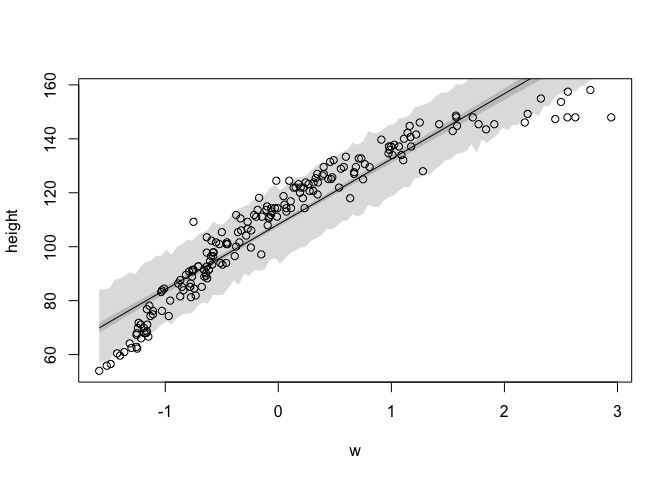
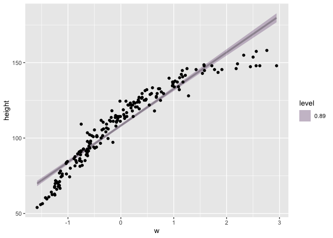
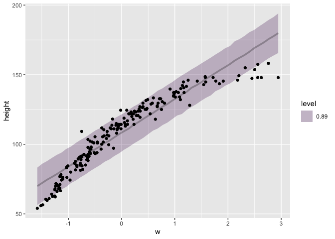

Load packages:


```r
library(rethinking)
library(brms)
library(tidyverse)
```


### 4H1

**The weights listed below were recorded in the !Kung census, but heights were not recorded for these individuals. Provide predicted heights and 89% intervals (either HPDI or PI) for each of these individuals. That is, fill in the table below, using model-based predictions.**

| Individual | weight | expected height | 89% HDPI       |
|------------|--------|-----------------|----------------|
| 1          | 46.95  |           | |
| 2          | 43.72  |         |  |
| 3          | 64.78  |          |  |
| 4          | 32.59  |        |  |
| 5          | 54.63  |    |  |


```r
data(Howell1)

d = Howell1 %>% 
  filter(age >= 18) %>% 
  mutate(w = standardize(weight))

w_mean = mean(d$weight)
w_sd= sd(d$weight)


mod4.1.1 = ulam(
  alist(
    height ~ dnorm(mu, sigma),
    mu <- a + b*w,
    a ~ dnorm(154, 20),
    b ~ dlnorm(0, 1),
    sigma ~ dexp(1)
  ), 
  data = d, chains = 2
)
```

```
## Running /Library/Frameworks/R.framework/Resources/bin/R CMD SHLIB foo.c
## clang -I"/Library/Frameworks/R.framework/Resources/include" -DNDEBUG   -I"/Library/Frameworks/R.framework/Versions/3.6/Resources/library/Rcpp/include/"  -I"/Library/Frameworks/R.framework/Versions/3.6/Resources/library/RcppEigen/include/"  -I"/Library/Frameworks/R.framework/Versions/3.6/Resources/library/RcppEigen/include/unsupported"  -I"/Library/Frameworks/R.framework/Versions/3.6/Resources/library/BH/include" -I"/Library/Frameworks/R.framework/Versions/3.6/Resources/library/StanHeaders/include/src/"  -I"/Library/Frameworks/R.framework/Versions/3.6/Resources/library/StanHeaders/include/"  -I"/Library/Frameworks/R.framework/Versions/3.6/Resources/library/rstan/include" -DEIGEN_NO_DEBUG  -D_REENTRANT  -DBOOST_DISABLE_ASSERTS -DBOOST_PENDING_INTEGER_LOG2_HPP -include stan/math/prim/mat/fun/Eigen.hpp   -isysroot /Library/Developer/CommandLineTools/SDKs/MacOSX.sdk -I/usr/local/include  -fPIC  -Wall -g -O2  -c foo.c -o foo.o
## In file included from <built-in>:1:
## In file included from /Library/Frameworks/R.framework/Versions/3.6/Resources/library/StanHeaders/include/stan/math/prim/mat/fun/Eigen.hpp:13:
## In file included from /Library/Frameworks/R.framework/Versions/3.6/Resources/library/RcppEigen/include/Eigen/Dense:1:
## In file included from /Library/Frameworks/R.framework/Versions/3.6/Resources/library/RcppEigen/include/Eigen/Core:88:
## /Library/Frameworks/R.framework/Versions/3.6/Resources/library/RcppEigen/include/Eigen/src/Core/util/Macros.h:613:1: error: unknown type name 'namespace'
## namespace Eigen {
## ^
## /Library/Frameworks/R.framework/Versions/3.6/Resources/library/RcppEigen/include/Eigen/src/Core/util/Macros.h:613:16: error: expected ';' after top level declarator
## namespace Eigen {
##                ^
##                ;
## In file included from <built-in>:1:
## In file included from /Library/Frameworks/R.framework/Versions/3.6/Resources/library/StanHeaders/include/stan/math/prim/mat/fun/Eigen.hpp:13:
## In file included from /Library/Frameworks/R.framework/Versions/3.6/Resources/library/RcppEigen/include/Eigen/Dense:1:
## /Library/Frameworks/R.framework/Versions/3.6/Resources/library/RcppEigen/include/Eigen/Core:96:10: fatal error: 'complex' file not found
## #include <complex>
##          ^~~~~~~~~
## 3 errors generated.
## make: *** [foo.o] Error 1
## 
## SAMPLING FOR MODEL '2b15743d90fb3adc4bab629eb0771aaa' NOW (CHAIN 1).
## Chain 1: 
## Chain 1: Gradient evaluation took 8.1e-05 seconds
## Chain 1: 1000 transitions using 10 leapfrog steps per transition would take 0.81 seconds.
## Chain 1: Adjust your expectations accordingly!
## Chain 1: 
## Chain 1: 
## Chain 1: Iteration:   1 / 1000 [  0%]  (Warmup)
## Chain 1: Iteration: 100 / 1000 [ 10%]  (Warmup)
## Chain 1: Iteration: 200 / 1000 [ 20%]  (Warmup)
## Chain 1: Iteration: 300 / 1000 [ 30%]  (Warmup)
## Chain 1: Iteration: 400 / 1000 [ 40%]  (Warmup)
## Chain 1: Iteration: 500 / 1000 [ 50%]  (Warmup)
## Chain 1: Iteration: 501 / 1000 [ 50%]  (Sampling)
## Chain 1: Iteration: 600 / 1000 [ 60%]  (Sampling)
## Chain 1: Iteration: 700 / 1000 [ 70%]  (Sampling)
## Chain 1: Iteration: 800 / 1000 [ 80%]  (Sampling)
## Chain 1: Iteration: 900 / 1000 [ 90%]  (Sampling)
## Chain 1: Iteration: 1000 / 1000 [100%]  (Sampling)
## Chain 1: 
## Chain 1:  Elapsed Time: 0.147882 seconds (Warm-up)
## Chain 1:                0.070226 seconds (Sampling)
## Chain 1:                0.218108 seconds (Total)
## Chain 1: 
## 
## SAMPLING FOR MODEL '2b15743d90fb3adc4bab629eb0771aaa' NOW (CHAIN 2).
## Chain 2: 
## Chain 2: Gradient evaluation took 5.4e-05 seconds
## Chain 2: 1000 transitions using 10 leapfrog steps per transition would take 0.54 seconds.
## Chain 2: Adjust your expectations accordingly!
## Chain 2: 
## Chain 2: 
## Chain 2: Iteration:   1 / 1000 [  0%]  (Warmup)
## Chain 2: Iteration: 100 / 1000 [ 10%]  (Warmup)
## Chain 2: Iteration: 200 / 1000 [ 20%]  (Warmup)
## Chain 2: Iteration: 300 / 1000 [ 30%]  (Warmup)
## Chain 2: Iteration: 400 / 1000 [ 40%]  (Warmup)
## Chain 2: Iteration: 500 / 1000 [ 50%]  (Warmup)
## Chain 2: Iteration: 501 / 1000 [ 50%]  (Sampling)
## Chain 2: Iteration: 600 / 1000 [ 60%]  (Sampling)
## Chain 2: Iteration: 700 / 1000 [ 70%]  (Sampling)
## Chain 2: Iteration: 800 / 1000 [ 80%]  (Sampling)
## Chain 2: Iteration: 900 / 1000 [ 90%]  (Sampling)
## Chain 2: Iteration: 1000 / 1000 [100%]  (Sampling)
## Chain 2: 
## Chain 2:  Elapsed Time: 0.119607 seconds (Warm-up)
## Chain 2:                0.06676 seconds (Sampling)
## Chain 2:                0.186367 seconds (Total)
## Chain 2:
```


```r
precis(mod4.1.1)
```

```
##             mean        sd       5.5%      94.5%     n_eff      Rhat
## a     154.603084 0.2770976 154.159509 155.054447 1169.4314 0.9989121
## b       5.809864 0.2789296   5.362527   6.236299  917.1969 0.9989309
## sigma   5.066270 0.1908488   4.768789   5.377844 1029.8120 0.9981027
```

```r
known_weights = c(46.95, 43.72, 64.78, 32.59, 54.63)
std_weights = (known_weights - w_mean)/w_sd

sim_height = sim(mod4.1.1, data = list(w = std_weights))

sim_height_means = apply(sim_height, 2, mean)
sim_height_means
```

```
## [1] 156.6254 153.7023 172.4815 143.5347 163.2426
```

```r
sim_height_HPDI = apply(sim_height, 2, HPDI, prob = 0.89)
t(sim_height_HPDI)
```

```
##         |0.89    0.89|
## [1,] 147.8335 164.2443
## [2,] 145.7822 160.9978
## [3,] 163.9385 180.1287
## [4,] 134.6496 151.5645
## [5,] 155.2728 171.4536
```


| Individual | weight | expected height | 89% HDPI       |
|------------|--------|-----------------|----------------|
| 1          | 46.95  | 156.33          | 149.0947 165.7247 |
| 2          | 43.72  | 153.41          | 144.9565 160.6330 |
| 3          | 64.78  | 172.45          | 164.6435 180.4169 |
| 4          | 32.59  | 143.43          | 136.0197 151.7234 |
| 5          | 54.63  | 163.36          | 156.0750 171.3711 |


With brms:


```r
m4.1.2 <- brm(height ~ w, data = d,
               prior=c(
                 set_prior("normal(154, 20)", class = "Intercept"),
                 set_prior("lognormal(0,1)", class = "b", lb = 0),
                 set_prior("exponential(1)", class = "sigma"))
               )
```

```
## Running /Library/Frameworks/R.framework/Resources/bin/R CMD SHLIB foo.c
## clang -I"/Library/Frameworks/R.framework/Resources/include" -DNDEBUG   -I"/Library/Frameworks/R.framework/Versions/3.6/Resources/library/Rcpp/include/"  -I"/Library/Frameworks/R.framework/Versions/3.6/Resources/library/RcppEigen/include/"  -I"/Library/Frameworks/R.framework/Versions/3.6/Resources/library/RcppEigen/include/unsupported"  -I"/Library/Frameworks/R.framework/Versions/3.6/Resources/library/BH/include" -I"/Library/Frameworks/R.framework/Versions/3.6/Resources/library/StanHeaders/include/src/"  -I"/Library/Frameworks/R.framework/Versions/3.6/Resources/library/StanHeaders/include/"  -I"/Library/Frameworks/R.framework/Versions/3.6/Resources/library/rstan/include" -DEIGEN_NO_DEBUG  -D_REENTRANT  -DBOOST_DISABLE_ASSERTS -DBOOST_PENDING_INTEGER_LOG2_HPP -include stan/math/prim/mat/fun/Eigen.hpp   -isysroot /Library/Developer/CommandLineTools/SDKs/MacOSX.sdk -I/usr/local/include  -fPIC  -Wall -g -O2  -c foo.c -o foo.o
## In file included from <built-in>:1:
## In file included from /Library/Frameworks/R.framework/Versions/3.6/Resources/library/StanHeaders/include/stan/math/prim/mat/fun/Eigen.hpp:13:
## In file included from /Library/Frameworks/R.framework/Versions/3.6/Resources/library/RcppEigen/include/Eigen/Dense:1:
## In file included from /Library/Frameworks/R.framework/Versions/3.6/Resources/library/RcppEigen/include/Eigen/Core:88:
## /Library/Frameworks/R.framework/Versions/3.6/Resources/library/RcppEigen/include/Eigen/src/Core/util/Macros.h:613:1: error: unknown type name 'namespace'
## namespace Eigen {
## ^
## /Library/Frameworks/R.framework/Versions/3.6/Resources/library/RcppEigen/include/Eigen/src/Core/util/Macros.h:613:16: error: expected ';' after top level declarator
## namespace Eigen {
##                ^
##                ;
## In file included from <built-in>:1:
## In file included from /Library/Frameworks/R.framework/Versions/3.6/Resources/library/StanHeaders/include/stan/math/prim/mat/fun/Eigen.hpp:13:
## In file included from /Library/Frameworks/R.framework/Versions/3.6/Resources/library/RcppEigen/include/Eigen/Dense:1:
## /Library/Frameworks/R.framework/Versions/3.6/Resources/library/RcppEigen/include/Eigen/Core:96:10: fatal error: 'complex' file not found
## #include <complex>
##          ^~~~~~~~~
## 3 errors generated.
## make: *** [foo.o] Error 1
## 
## SAMPLING FOR MODEL '36a7a7e8ae404afd669729a50bb3ccac' NOW (CHAIN 1).
## Chain 1: 
## Chain 1: Gradient evaluation took 3.2e-05 seconds
## Chain 1: 1000 transitions using 10 leapfrog steps per transition would take 0.32 seconds.
## Chain 1: Adjust your expectations accordingly!
## Chain 1: 
## Chain 1: 
## Chain 1: Iteration:    1 / 2000 [  0%]  (Warmup)
## Chain 1: Iteration:  200 / 2000 [ 10%]  (Warmup)
## Chain 1: Iteration:  400 / 2000 [ 20%]  (Warmup)
## Chain 1: Iteration:  600 / 2000 [ 30%]  (Warmup)
## Chain 1: Iteration:  800 / 2000 [ 40%]  (Warmup)
## Chain 1: Iteration: 1000 / 2000 [ 50%]  (Warmup)
## Chain 1: Iteration: 1001 / 2000 [ 50%]  (Sampling)
## Chain 1: Iteration: 1200 / 2000 [ 60%]  (Sampling)
## Chain 1: Iteration: 1400 / 2000 [ 70%]  (Sampling)
## Chain 1: Iteration: 1600 / 2000 [ 80%]  (Sampling)
## Chain 1: Iteration: 1800 / 2000 [ 90%]  (Sampling)
## Chain 1: Iteration: 2000 / 2000 [100%]  (Sampling)
## Chain 1: 
## Chain 1:  Elapsed Time: 0.075828 seconds (Warm-up)
## Chain 1:                0.04568 seconds (Sampling)
## Chain 1:                0.121508 seconds (Total)
## Chain 1: 
## 
## SAMPLING FOR MODEL '36a7a7e8ae404afd669729a50bb3ccac' NOW (CHAIN 2).
## Chain 2: 
## Chain 2: Gradient evaluation took 1.8e-05 seconds
## Chain 2: 1000 transitions using 10 leapfrog steps per transition would take 0.18 seconds.
## Chain 2: Adjust your expectations accordingly!
## Chain 2: 
## Chain 2: 
## Chain 2: Iteration:    1 / 2000 [  0%]  (Warmup)
## Chain 2: Iteration:  200 / 2000 [ 10%]  (Warmup)
## Chain 2: Iteration:  400 / 2000 [ 20%]  (Warmup)
## Chain 2: Iteration:  600 / 2000 [ 30%]  (Warmup)
## Chain 2: Iteration:  800 / 2000 [ 40%]  (Warmup)
## Chain 2: Iteration: 1000 / 2000 [ 50%]  (Warmup)
## Chain 2: Iteration: 1001 / 2000 [ 50%]  (Sampling)
## Chain 2: Iteration: 1200 / 2000 [ 60%]  (Sampling)
## Chain 2: Iteration: 1400 / 2000 [ 70%]  (Sampling)
## Chain 2: Iteration: 1600 / 2000 [ 80%]  (Sampling)
## Chain 2: Iteration: 1800 / 2000 [ 90%]  (Sampling)
## Chain 2: Iteration: 2000 / 2000 [100%]  (Sampling)
## Chain 2: 
## Chain 2:  Elapsed Time: 0.079065 seconds (Warm-up)
## Chain 2:                0.038701 seconds (Sampling)
## Chain 2:                0.117766 seconds (Total)
## Chain 2: 
## 
## SAMPLING FOR MODEL '36a7a7e8ae404afd669729a50bb3ccac' NOW (CHAIN 3).
## Chain 3: 
## Chain 3: Gradient evaluation took 3.6e-05 seconds
## Chain 3: 1000 transitions using 10 leapfrog steps per transition would take 0.36 seconds.
## Chain 3: Adjust your expectations accordingly!
## Chain 3: 
## Chain 3: 
## Chain 3: Iteration:    1 / 2000 [  0%]  (Warmup)
## Chain 3: Iteration:  200 / 2000 [ 10%]  (Warmup)
## Chain 3: Iteration:  400 / 2000 [ 20%]  (Warmup)
## Chain 3: Iteration:  600 / 2000 [ 30%]  (Warmup)
## Chain 3: Iteration:  800 / 2000 [ 40%]  (Warmup)
## Chain 3: Iteration: 1000 / 2000 [ 50%]  (Warmup)
## Chain 3: Iteration: 1001 / 2000 [ 50%]  (Sampling)
## Chain 3: Iteration: 1200 / 2000 [ 60%]  (Sampling)
## Chain 3: Iteration: 1400 / 2000 [ 70%]  (Sampling)
## Chain 3: Iteration: 1600 / 2000 [ 80%]  (Sampling)
## Chain 3: Iteration: 1800 / 2000 [ 90%]  (Sampling)
## Chain 3: Iteration: 2000 / 2000 [100%]  (Sampling)
## Chain 3: 
## Chain 3:  Elapsed Time: 0.078315 seconds (Warm-up)
## Chain 3:                0.047732 seconds (Sampling)
## Chain 3:                0.126047 seconds (Total)
## Chain 3: 
## 
## SAMPLING FOR MODEL '36a7a7e8ae404afd669729a50bb3ccac' NOW (CHAIN 4).
## Chain 4: 
## Chain 4: Gradient evaluation took 1.9e-05 seconds
## Chain 4: 1000 transitions using 10 leapfrog steps per transition would take 0.19 seconds.
## Chain 4: Adjust your expectations accordingly!
## Chain 4: 
## Chain 4: 
## Chain 4: Iteration:    1 / 2000 [  0%]  (Warmup)
## Chain 4: Iteration:  200 / 2000 [ 10%]  (Warmup)
## Chain 4: Iteration:  400 / 2000 [ 20%]  (Warmup)
## Chain 4: Iteration:  600 / 2000 [ 30%]  (Warmup)
## Chain 4: Iteration:  800 / 2000 [ 40%]  (Warmup)
## Chain 4: Iteration: 1000 / 2000 [ 50%]  (Warmup)
## Chain 4: Iteration: 1001 / 2000 [ 50%]  (Sampling)
## Chain 4: Iteration: 1200 / 2000 [ 60%]  (Sampling)
## Chain 4: Iteration: 1400 / 2000 [ 70%]  (Sampling)
## Chain 4: Iteration: 1600 / 2000 [ 80%]  (Sampling)
## Chain 4: Iteration: 1800 / 2000 [ 90%]  (Sampling)
## Chain 4: Iteration: 2000 / 2000 [100%]  (Sampling)
## Chain 4: 
## Chain 4:  Elapsed Time: 0.052427 seconds (Warm-up)
## Chain 4:                0.049344 seconds (Sampling)
## Chain 4:                0.101771 seconds (Total)
## Chain 4:
```

```r
summary(m4.1.2) 
```

```
##  Family: gaussian 
##   Links: mu = identity; sigma = identity 
## Formula: height ~ w 
##    Data: d (Number of observations: 352) 
## Samples: 4 chains, each with iter = 2000; warmup = 1000; thin = 1;
##          total post-warmup samples = 4000
## 
## Population-Level Effects: 
##           Estimate Est.Error l-95% CI u-95% CI Rhat Bulk_ESS Tail_ESS
## Intercept   154.60      0.27   154.07   155.14 1.00     3730     3030
## w             5.81      0.27     5.28     6.36 1.00     3461     2737
## 
## Family Specific Parameters: 
##       Estimate Est.Error l-95% CI u-95% CI Rhat Bulk_ESS Tail_ESS
## sigma     5.07      0.19     4.71     5.46 1.00     3696     2736
## 
## Samples were drawn using sampling(NUTS). For each parameter, Bulk_ESS
## and Tail_ESS are effective sample size measures, and Rhat is the potential
## scale reduction factor on split chains (at convergence, Rhat = 1).
```

```r
predict(m4.1.2, newdata = data.frame(w = std_weights), summary = TRUE, probs = c(0.055, 0.945))
```

```
##      Estimate Est.Error     Q5.5    Q94.5
## [1,] 156.4138  5.089662 148.2741 164.5756
## [2,] 153.4901  5.095963 145.4102 161.7458
## [3,] 172.4413  5.185375 164.0654 180.7614
## [4,] 143.4121  5.144350 135.0091 151.6368
## [5,] 163.1491  4.999716 155.1604 171.2606
```

Parameter estimates are nearly identical. Predictions too.


### 4H2

**Select out all the rows in the Howell1 data with ages below 18 years of age. If you do it right, you should end up with a new data frame with 192 rows in it.**

**(a) Fit a linear regression to these data, using quap. Present and interpret the estimates. For every 10 units of increase in weight, how much taller does the model predict a child gets?**

For every 10 units increase in weight, the model predicts that a child gets 27.1 cm taller.


```r
juv = Howell1 %>% 
  filter(age < 18) %>% 
  mutate(w = standardize(weight))

j_mean = mean(juv$weight)
j_sd= sd(juv$weight)

mean(juv$height)
```

```
## [1] 108.3189
```

```r
m4.2.1 = ulam(
  alist(
    height ~ dnorm(mu, sigma),
    mu <- a + b*w,
    a ~ dnorm(100, 20),
    b ~ dlnorm(0, 1),
    sigma ~ dexp(1)
  ),
  data = juv, chains = 2
)
```

```
## Running /Library/Frameworks/R.framework/Resources/bin/R CMD SHLIB foo.c
## clang -I"/Library/Frameworks/R.framework/Resources/include" -DNDEBUG   -I"/Library/Frameworks/R.framework/Versions/3.6/Resources/library/Rcpp/include/"  -I"/Library/Frameworks/R.framework/Versions/3.6/Resources/library/RcppEigen/include/"  -I"/Library/Frameworks/R.framework/Versions/3.6/Resources/library/RcppEigen/include/unsupported"  -I"/Library/Frameworks/R.framework/Versions/3.6/Resources/library/BH/include" -I"/Library/Frameworks/R.framework/Versions/3.6/Resources/library/StanHeaders/include/src/"  -I"/Library/Frameworks/R.framework/Versions/3.6/Resources/library/StanHeaders/include/"  -I"/Library/Frameworks/R.framework/Versions/3.6/Resources/library/rstan/include" -DEIGEN_NO_DEBUG  -D_REENTRANT  -DBOOST_DISABLE_ASSERTS -DBOOST_PENDING_INTEGER_LOG2_HPP -include stan/math/prim/mat/fun/Eigen.hpp   -isysroot /Library/Developer/CommandLineTools/SDKs/MacOSX.sdk -I/usr/local/include  -fPIC  -Wall -g -O2  -c foo.c -o foo.o
## In file included from <built-in>:1:
## In file included from /Library/Frameworks/R.framework/Versions/3.6/Resources/library/StanHeaders/include/stan/math/prim/mat/fun/Eigen.hpp:13:
## In file included from /Library/Frameworks/R.framework/Versions/3.6/Resources/library/RcppEigen/include/Eigen/Dense:1:
## In file included from /Library/Frameworks/R.framework/Versions/3.6/Resources/library/RcppEigen/include/Eigen/Core:88:
## /Library/Frameworks/R.framework/Versions/3.6/Resources/library/RcppEigen/include/Eigen/src/Core/util/Macros.h:613:1: error: unknown type name 'namespace'
## namespace Eigen {
## ^
## /Library/Frameworks/R.framework/Versions/3.6/Resources/library/RcppEigen/include/Eigen/src/Core/util/Macros.h:613:16: error: expected ';' after top level declarator
## namespace Eigen {
##                ^
##                ;
## In file included from <built-in>:1:
## In file included from /Library/Frameworks/R.framework/Versions/3.6/Resources/library/StanHeaders/include/stan/math/prim/mat/fun/Eigen.hpp:13:
## In file included from /Library/Frameworks/R.framework/Versions/3.6/Resources/library/RcppEigen/include/Eigen/Dense:1:
## /Library/Frameworks/R.framework/Versions/3.6/Resources/library/RcppEigen/include/Eigen/Core:96:10: fatal error: 'complex' file not found
## #include <complex>
##          ^~~~~~~~~
## 3 errors generated.
## make: *** [foo.o] Error 1
## 
## SAMPLING FOR MODEL '02cee8477629d75a2af4397e13611242' NOW (CHAIN 1).
## Chain 1: 
## Chain 1: Gradient evaluation took 4.5e-05 seconds
## Chain 1: 1000 transitions using 10 leapfrog steps per transition would take 0.45 seconds.
## Chain 1: Adjust your expectations accordingly!
## Chain 1: 
## Chain 1: 
## Chain 1: Iteration:   1 / 1000 [  0%]  (Warmup)
## Chain 1: Iteration: 100 / 1000 [ 10%]  (Warmup)
## Chain 1: Iteration: 200 / 1000 [ 20%]  (Warmup)
## Chain 1: Iteration: 300 / 1000 [ 30%]  (Warmup)
## Chain 1: Iteration: 400 / 1000 [ 40%]  (Warmup)
## Chain 1: Iteration: 500 / 1000 [ 50%]  (Warmup)
## Chain 1: Iteration: 501 / 1000 [ 50%]  (Sampling)
## Chain 1: Iteration: 600 / 1000 [ 60%]  (Sampling)
## Chain 1: Iteration: 700 / 1000 [ 70%]  (Sampling)
## Chain 1: Iteration: 800 / 1000 [ 80%]  (Sampling)
## Chain 1: Iteration: 900 / 1000 [ 90%]  (Sampling)
## Chain 1: Iteration: 1000 / 1000 [100%]  (Sampling)
## Chain 1: 
## Chain 1:  Elapsed Time: 0.080654 seconds (Warm-up)
## Chain 1:                0.048043 seconds (Sampling)
## Chain 1:                0.128697 seconds (Total)
## Chain 1: 
## 
## SAMPLING FOR MODEL '02cee8477629d75a2af4397e13611242' NOW (CHAIN 2).
## Chain 2: 
## Chain 2: Gradient evaluation took 2.1e-05 seconds
## Chain 2: 1000 transitions using 10 leapfrog steps per transition would take 0.21 seconds.
## Chain 2: Adjust your expectations accordingly!
## Chain 2: 
## Chain 2: 
## Chain 2: Iteration:   1 / 1000 [  0%]  (Warmup)
## Chain 2: Iteration: 100 / 1000 [ 10%]  (Warmup)
## Chain 2: Iteration: 200 / 1000 [ 20%]  (Warmup)
## Chain 2: Iteration: 300 / 1000 [ 30%]  (Warmup)
## Chain 2: Iteration: 400 / 1000 [ 40%]  (Warmup)
## Chain 2: Iteration: 500 / 1000 [ 50%]  (Warmup)
## Chain 2: Iteration: 501 / 1000 [ 50%]  (Sampling)
## Chain 2: Iteration: 600 / 1000 [ 60%]  (Sampling)
## Chain 2: Iteration: 700 / 1000 [ 70%]  (Sampling)
## Chain 2: Iteration: 800 / 1000 [ 80%]  (Sampling)
## Chain 2: Iteration: 900 / 1000 [ 90%]  (Sampling)
## Chain 2: Iteration: 1000 / 1000 [100%]  (Sampling)
## Chain 2: 
## Chain 2:  Elapsed Time: 0.077138 seconds (Warm-up)
## Chain 2:                0.045535 seconds (Sampling)
## Chain 2:                0.122673 seconds (Total)
## Chain 2:
```

```r
precis(m4.2.1)
```

```
##             mean        sd       5.5%      94.5%     n_eff      Rhat
## a     108.280274 0.6237928 107.298487 109.252787  948.3527 0.9982330
## b      24.223683 0.6194927  23.235670  25.210967  951.7391 0.9993226
## sigma   8.326764 0.4005258   7.709749   8.976873 1125.6474 1.0007482
```

```r
# b = 24.22
# for every scaled unit of weight, 24.22 effect on height
24.22/j_sd
```

```
## [1] 2.70938
```

```r
# One unit of weight has a 2.71 effect on height
24.22/j_sd*10
```

```
## [1] 27.0938
```

With brms: 

```r
m4.2.2 <- brm(height ~ w, data = juv,
               prior=c(
                 set_prior("normal(100, 20)", class = "Intercept"),
                 set_prior("lognormal(0,1)", class = "b", lb = 0),
                 set_prior("exponential(1)", class = "sigma"))
               )
```

```
## Running /Library/Frameworks/R.framework/Resources/bin/R CMD SHLIB foo.c
## clang -I"/Library/Frameworks/R.framework/Resources/include" -DNDEBUG   -I"/Library/Frameworks/R.framework/Versions/3.6/Resources/library/Rcpp/include/"  -I"/Library/Frameworks/R.framework/Versions/3.6/Resources/library/RcppEigen/include/"  -I"/Library/Frameworks/R.framework/Versions/3.6/Resources/library/RcppEigen/include/unsupported"  -I"/Library/Frameworks/R.framework/Versions/3.6/Resources/library/BH/include" -I"/Library/Frameworks/R.framework/Versions/3.6/Resources/library/StanHeaders/include/src/"  -I"/Library/Frameworks/R.framework/Versions/3.6/Resources/library/StanHeaders/include/"  -I"/Library/Frameworks/R.framework/Versions/3.6/Resources/library/rstan/include" -DEIGEN_NO_DEBUG  -D_REENTRANT  -DBOOST_DISABLE_ASSERTS -DBOOST_PENDING_INTEGER_LOG2_HPP -include stan/math/prim/mat/fun/Eigen.hpp   -isysroot /Library/Developer/CommandLineTools/SDKs/MacOSX.sdk -I/usr/local/include  -fPIC  -Wall -g -O2  -c foo.c -o foo.o
## In file included from <built-in>:1:
## In file included from /Library/Frameworks/R.framework/Versions/3.6/Resources/library/StanHeaders/include/stan/math/prim/mat/fun/Eigen.hpp:13:
## In file included from /Library/Frameworks/R.framework/Versions/3.6/Resources/library/RcppEigen/include/Eigen/Dense:1:
## In file included from /Library/Frameworks/R.framework/Versions/3.6/Resources/library/RcppEigen/include/Eigen/Core:88:
## /Library/Frameworks/R.framework/Versions/3.6/Resources/library/RcppEigen/include/Eigen/src/Core/util/Macros.h:613:1: error: unknown type name 'namespace'
## namespace Eigen {
## ^
## /Library/Frameworks/R.framework/Versions/3.6/Resources/library/RcppEigen/include/Eigen/src/Core/util/Macros.h:613:16: error: expected ';' after top level declarator
## namespace Eigen {
##                ^
##                ;
## In file included from <built-in>:1:
## In file included from /Library/Frameworks/R.framework/Versions/3.6/Resources/library/StanHeaders/include/stan/math/prim/mat/fun/Eigen.hpp:13:
## In file included from /Library/Frameworks/R.framework/Versions/3.6/Resources/library/RcppEigen/include/Eigen/Dense:1:
## /Library/Frameworks/R.framework/Versions/3.6/Resources/library/RcppEigen/include/Eigen/Core:96:10: fatal error: 'complex' file not found
## #include <complex>
##          ^~~~~~~~~
## 3 errors generated.
## make: *** [foo.o] Error 1
## 
## SAMPLING FOR MODEL '8fd45256062d85a316e708831f8fa340' NOW (CHAIN 1).
## Chain 1: 
## Chain 1: Gradient evaluation took 3.3e-05 seconds
## Chain 1: 1000 transitions using 10 leapfrog steps per transition would take 0.33 seconds.
## Chain 1: Adjust your expectations accordingly!
## Chain 1: 
## Chain 1: 
## Chain 1: Iteration:    1 / 2000 [  0%]  (Warmup)
## Chain 1: Iteration:  200 / 2000 [ 10%]  (Warmup)
## Chain 1: Iteration:  400 / 2000 [ 20%]  (Warmup)
## Chain 1: Iteration:  600 / 2000 [ 30%]  (Warmup)
## Chain 1: Iteration:  800 / 2000 [ 40%]  (Warmup)
## Chain 1: Iteration: 1000 / 2000 [ 50%]  (Warmup)
## Chain 1: Iteration: 1001 / 2000 [ 50%]  (Sampling)
## Chain 1: Iteration: 1200 / 2000 [ 60%]  (Sampling)
## Chain 1: Iteration: 1400 / 2000 [ 70%]  (Sampling)
## Chain 1: Iteration: 1600 / 2000 [ 80%]  (Sampling)
## Chain 1: Iteration: 1800 / 2000 [ 90%]  (Sampling)
## Chain 1: Iteration: 2000 / 2000 [100%]  (Sampling)
## Chain 1: 
## Chain 1:  Elapsed Time: 0.052531 seconds (Warm-up)
## Chain 1:                0.036411 seconds (Sampling)
## Chain 1:                0.088942 seconds (Total)
## Chain 1: 
## 
## SAMPLING FOR MODEL '8fd45256062d85a316e708831f8fa340' NOW (CHAIN 2).
## Chain 2: 
## Chain 2: Gradient evaluation took 1.3e-05 seconds
## Chain 2: 1000 transitions using 10 leapfrog steps per transition would take 0.13 seconds.
## Chain 2: Adjust your expectations accordingly!
## Chain 2: 
## Chain 2: 
## Chain 2: Iteration:    1 / 2000 [  0%]  (Warmup)
## Chain 2: Iteration:  200 / 2000 [ 10%]  (Warmup)
## Chain 2: Iteration:  400 / 2000 [ 20%]  (Warmup)
## Chain 2: Iteration:  600 / 2000 [ 30%]  (Warmup)
## Chain 2: Iteration:  800 / 2000 [ 40%]  (Warmup)
## Chain 2: Iteration: 1000 / 2000 [ 50%]  (Warmup)
## Chain 2: Iteration: 1001 / 2000 [ 50%]  (Sampling)
## Chain 2: Iteration: 1200 / 2000 [ 60%]  (Sampling)
## Chain 2: Iteration: 1400 / 2000 [ 70%]  (Sampling)
## Chain 2: Iteration: 1600 / 2000 [ 80%]  (Sampling)
## Chain 2: Iteration: 1800 / 2000 [ 90%]  (Sampling)
## Chain 2: Iteration: 2000 / 2000 [100%]  (Sampling)
## Chain 2: 
## Chain 2:  Elapsed Time: 0.052838 seconds (Warm-up)
## Chain 2:                0.043711 seconds (Sampling)
## Chain 2:                0.096549 seconds (Total)
## Chain 2: 
## 
## SAMPLING FOR MODEL '8fd45256062d85a316e708831f8fa340' NOW (CHAIN 3).
## Chain 3: 
## Chain 3: Gradient evaluation took 1.3e-05 seconds
## Chain 3: 1000 transitions using 10 leapfrog steps per transition would take 0.13 seconds.
## Chain 3: Adjust your expectations accordingly!
## Chain 3: 
## Chain 3: 
## Chain 3: Iteration:    1 / 2000 [  0%]  (Warmup)
## Chain 3: Iteration:  200 / 2000 [ 10%]  (Warmup)
## Chain 3: Iteration:  400 / 2000 [ 20%]  (Warmup)
## Chain 3: Iteration:  600 / 2000 [ 30%]  (Warmup)
## Chain 3: Iteration:  800 / 2000 [ 40%]  (Warmup)
## Chain 3: Iteration: 1000 / 2000 [ 50%]  (Warmup)
## Chain 3: Iteration: 1001 / 2000 [ 50%]  (Sampling)
## Chain 3: Iteration: 1200 / 2000 [ 60%]  (Sampling)
## Chain 3: Iteration: 1400 / 2000 [ 70%]  (Sampling)
## Chain 3: Iteration: 1600 / 2000 [ 80%]  (Sampling)
## Chain 3: Iteration: 1800 / 2000 [ 90%]  (Sampling)
## Chain 3: Iteration: 2000 / 2000 [100%]  (Sampling)
## Chain 3: 
## Chain 3:  Elapsed Time: 0.052205 seconds (Warm-up)
## Chain 3:                0.041037 seconds (Sampling)
## Chain 3:                0.093242 seconds (Total)
## Chain 3: 
## 
## SAMPLING FOR MODEL '8fd45256062d85a316e708831f8fa340' NOW (CHAIN 4).
## Chain 4: 
## Chain 4: Gradient evaluation took 1.3e-05 seconds
## Chain 4: 1000 transitions using 10 leapfrog steps per transition would take 0.13 seconds.
## Chain 4: Adjust your expectations accordingly!
## Chain 4: 
## Chain 4: 
## Chain 4: Iteration:    1 / 2000 [  0%]  (Warmup)
## Chain 4: Iteration:  200 / 2000 [ 10%]  (Warmup)
## Chain 4: Iteration:  400 / 2000 [ 20%]  (Warmup)
## Chain 4: Iteration:  600 / 2000 [ 30%]  (Warmup)
## Chain 4: Iteration:  800 / 2000 [ 40%]  (Warmup)
## Chain 4: Iteration: 1000 / 2000 [ 50%]  (Warmup)
## Chain 4: Iteration: 1001 / 2000 [ 50%]  (Sampling)
## Chain 4: Iteration: 1200 / 2000 [ 60%]  (Sampling)
## Chain 4: Iteration: 1400 / 2000 [ 70%]  (Sampling)
## Chain 4: Iteration: 1600 / 2000 [ 80%]  (Sampling)
## Chain 4: Iteration: 1800 / 2000 [ 90%]  (Sampling)
## Chain 4: Iteration: 2000 / 2000 [100%]  (Sampling)
## Chain 4: 
## Chain 4:  Elapsed Time: 0.047139 seconds (Warm-up)
## Chain 4:                0.035023 seconds (Sampling)
## Chain 4:                0.082162 seconds (Total)
## Chain 4:
```

```r
summary(m4.2.2)
```

```
##  Family: gaussian 
##   Links: mu = identity; sigma = identity 
## Formula: height ~ w 
##    Data: juv (Number of observations: 192) 
## Samples: 4 chains, each with iter = 2000; warmup = 1000; thin = 1;
##          total post-warmup samples = 4000
## 
## Population-Level Effects: 
##           Estimate Est.Error l-95% CI u-95% CI Rhat Bulk_ESS Tail_ESS
## Intercept   108.31      0.58   107.20   109.44 1.00     4242     2855
## w            24.26      0.61    23.07    25.47 1.00     3923     2865
## 
## Family Specific Parameters: 
##       Estimate Est.Error l-95% CI u-95% CI Rhat Bulk_ESS Tail_ESS
## sigma     8.34      0.43     7.54     9.25 1.00     3694     2874
## 
## Samples were drawn using sampling(NUTS). For each parameter, Bulk_ESS
## and Tail_ESS are effective sample size measures, and Rhat is the potential
## scale reduction factor on split chains (at convergence, Rhat = 1).
```
Parameter estimates are the same. 

**(b) Plot the raw data, with height on the vertical axis and weight on the horizontal axis. Super- impose the MAP regression line and 89% HPDI for the mean. Also superimpose the 89% HPDI for predicted heights.**

With ulam model:


```r
max(juv$w)
```

```
## [1] 2.944445
```

```r
min(juv$w)
```

```
## [1] -1.584212
```

```r
weight_seq = seq(from = min(juv$w), to = max(juv$w), length.out = 100)
mu = link(m4.2.1, data = data.frame(w = weight_seq))
mu_mean = apply(mu, 2, mean)
mu_hpdi = apply(mu, 2, HPDI, prob = 0.89)
pred_hpdi = apply(sim(m4.2.1, data = list(w = weight_seq)), 2, HPDI, prob = 0.89)

plot(height ~ w, data = juv)
lines(weight_seq, mu_mean)
shade(mu_hpdi, weight_seq)
shade(pred_hpdi, weight_seq)
```

<!-- -->

With BRMS:


```r
library(tidybayes)
```

```
## 
## Attaching package: 'tidybayes'
```

```
## The following objects are masked from 'package:brms':
## 
##     dstudent_t, pstudent_t, qstudent_t, rstudent_t
```

```r
library(modelr)
```

```
## 
## Attaching package: 'modelr'
```

```
## The following object is masked from 'package:rethinking':
## 
##     resample
```

```r
juv %>%
  data_grid(w = seq_range(w, n = 51)) %>%
  add_fitted_draws(m4.2.2) %>%
  ggplot(aes(x = w, y = height)) +
  stat_lineribbon(aes(y = .value), .width = 0.89, alpha = 0.25) +
  geom_point(data = juv) 
```

<!-- -->

```r
juv %>%
  data_grid(w = seq_range(w, n = 51)) %>%
  add_predicted_draws(m4.2.2) %>%
  ggplot(aes(x = w, y = height)) +
  stat_lineribbon(aes(y = .prediction), .width = c(.89), alpha = 0.25) +
  geom_point(data = juv) 
```

<!-- -->

And would just take a bit of editing to put the two on the same plot. 

**(c) What aspects of the model fit concern you? Describe the kinds of assumptions you would change, if any, to improve the model. You don’t have to write any new code. Just explain what the model appears to be doing a bad job of, and what you hypothesize would be a better model.**

The model is performing poorly at the low and high ends of the weight axis. It might be better to change the model to allow some curvature.

Could try to fix that with a quadratic fit, or a GAMM.


```r
library(rstan)
m4.2.3 <- stan_gamm4(height ~ w, data = juv,
               prior=c(
                 set_prior("normal(100, 20)", class = "Intercept"),
                 set_prior("lognormal(0,1)", class = "b", lb = 0),
                 set_prior("exponential(1)", class = "sigma"))
               )
summary(m4.2.3)
```

<!-- ## Tomato problem -->

