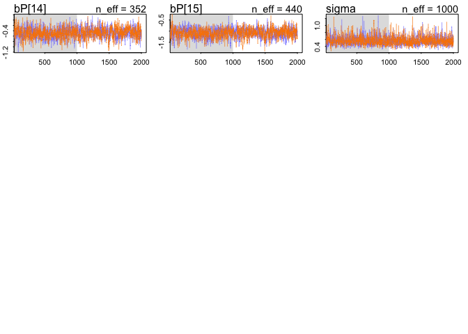

Load the data and look at data structure.


```r
library(tidyverse)
library(rethinking)
library(tidybayes)

dat = read_csv("clarkia_transplant_data.csv")

dat_nov_germ = list(
  nov_germ = dat$nov_germ,
  blk = dat$blk,
  temperature_diff = dat$temperature_diff_fall,
  pop = as.integer(as.factor(dat$pop))
)

table(round(dat_nov_germ$temperature_diff, 2), dat_nov_germ$pop)
```

```
##        
##           1   2   3   4   5   6   7   8   9  10  11  12  13  14  15
##   -1.59   0   0   0   0 236   0   0   0   0   0   0   0   0   0   0
##   -1.49   0   0   0 188   0   0   0   0   0   0   0   0   0   0   0
##   -1.3  228   0   0   0   0   0   0   0   0   0   0   0   0   0   0
##   -1.1    0   0   0   0   0   0   0 226   0   0   0   0   0   0   0
##   -0.69   0   0   0   0   0 229   0   0   0   0   0   0   0   0   0
##   -0.14   0   0   0   0   0   0   0   0   0   0   0   0   0 230   0
##   -0.04   0   0 234   0   0   0   0   0   0   0   0   0   0   0   0
##   0.34    0   0   0   0   0   0   0   0   0   0 176   0   0   0   0
##   0.68    0   0   0   0   0   0   0   0   0   0   0   0   0   0 235
##   0.7     0 236   0   0   0   0   0   0   0   0   0   0   0   0   0
##   1.19    0   0   0   0   0   0 200   0   0   0   0   0   0   0   0
##   1.54    0   0   0   0   0   0   0   0   0   0   0 240   0   0   0
##   1.6     0   0   0   0   0   0   0   0   0   0   0   0 128   0   0
##   1.67    0   0   0   0   0   0   0   0 232   0   0   0   0   0   0
##   1.94    0   0   0   0   0   0   0   0   0 232   0   0   0   0   0
```

```r
table(dat_nov_germ$blk, dat_nov_germ$pop)
```

```
##    
##      1  2  3  4  5  6  7  8  9 10 11 12 13 14 15
##   1 56 59 59 47 59 58 50 55 58 57 44 60 32 58 58
##   2 56 59 57 47 59 56 50 57 58 57 44 60 32 56 59
##   3 58 59 59 47 59 57 50 57 58 59 44 60 32 58 59
##   4 58 59 59 47 59 58 50 57 58 59 44 60 32 58 59
```


#### 1. Fit a simple model with effects of temperature difference (temperature_diff_fall) on November germination (nov_germ). Temperature difference is already centered and scaled (i.e., negative values are the smallest temperature differences). Make sure to use the appropriate likelihood for the germination data (0 = no germ, 1  = germ).

Fit model: 


```r
# Model with temperature only
m0 = ulam(
  alist(
    nov_germ ~ dbinom(1, p),
    logit(p) <- a + bT*temperature_diff,
    a ~ dnorm(0, 1.5),
    bT ~ dnorm(0, 0.5)
  ), data = dat_nov_germ, cores = 2, chains = 2, iter = 2000, log_lik = TRUE)

precis(m0, depth = 2)
```

```
##          mean         sd       5.5%      94.5%    n_eff     Rhat
## a   0.2047734 0.03642652  0.1456934  0.2596579 1216.346 1.001950
## bT -0.2127429 0.02973011 -0.2602620 -0.1661672 1057.771 1.002984
```

Check on chains:


```r
traceplot(m0)
```

<!-- -->

#### 2. Simulate from your priors to see if you've chosen reasonable priors, adjust them if necessary.


```r
prior = extract.prior(m0)
```

```
## 
## SAMPLING FOR MODEL 'c0628fc6583a8e27a955a78f4cdc6094' NOW (CHAIN 1).
## Chain 1: 
## Chain 1: Gradient evaluation took 0.000493 seconds
## Chain 1: 1000 transitions using 10 leapfrog steps per transition would take 4.93 seconds.
## Chain 1: Adjust your expectations accordingly!
## Chain 1: 
## Chain 1: 
## Chain 1: Iteration:    1 / 2000 [  0%]  (Warmup)
## Chain 1: Iteration:  200 / 2000 [ 10%]  (Warmup)
## Chain 1: Iteration:  400 / 2000 [ 20%]  (Warmup)
## Chain 1: Iteration:  600 / 2000 [ 30%]  (Warmup)
## Chain 1: Iteration:  800 / 2000 [ 40%]  (Warmup)
## Chain 1: Iteration: 1000 / 2000 [ 50%]  (Warmup)
## Chain 1: Iteration: 1001 / 2000 [ 50%]  (Sampling)
## Chain 1: Iteration: 1200 / 2000 [ 60%]  (Sampling)
## Chain 1: Iteration: 1400 / 2000 [ 70%]  (Sampling)
## Chain 1: Iteration: 1600 / 2000 [ 80%]  (Sampling)
## Chain 1: Iteration: 1800 / 2000 [ 90%]  (Sampling)
## Chain 1: Iteration: 2000 / 2000 [100%]  (Sampling)
## Chain 1: 
## Chain 1:  Elapsed Time: 1.23158 seconds (Warm-up)
## Chain 1:                0.957521 seconds (Sampling)
## Chain 1:                2.1891 seconds (Total)
## Chain 1:
```

```r
mu = link(m0, post = prior, data = list(temperature_diff = seq(-1.5, 2, by = 0.5)))

mu_plot = data.frame(mu) %>% 
  mutate(row = row_number()) %>% 
  pivot_longer(cols = X1:X8, names_to = "key", values_to = "value") %>% 
  mutate(temp_diff = (as.numeric(str_remove(key, "X")) - 4)/2)

ggplot(mu_plot, aes(x = temp_diff, y = value, group = row)) + 
  geom_line(alpha = 0.2)
```

<!-- -->

Seems ok, allows for many relationships between temperature difference and germination.

#### These blocks were set up in the field, and had differences in soil depth, slope, and competitive environment. So maybe a model that includes block will describe the data better.


```r
ggplot(dat, aes(x = blk, y = nov_germ)) + 
  stat_summary(fun.y = "mean", geom = "bar") +
  ylim(0,1)
```

<!-- -->

#### 3. Fit a model that includes an effect of block (blk), with no pooling.


```r
m0.5 = ulam(
  alist(
    nov_germ ~ dbinom(1, p),
    logit(p) <- a + bT*temperature_diff + bB[blk],
    a ~ dnorm(0, 1.5),
    bT ~ dnorm(0, 0.5),
    bB[blk] ~ dnorm(0, 0.5)
  ), data = dat_nov_germ, cores = 2, chains = 2, iter = 2000, log_lik = TRUE)

precis(m0.5, depth = 2)
```

```
##              mean         sd        5.5%      94.5%    n_eff     Rhat
## a      0.18672297 0.23516767 -0.20195435  0.5608138 484.1985 1.006413
## bT    -0.21906494 0.03173051 -0.26899839 -0.1677312 957.5494 1.000691
## bB[1]  0.20957102 0.23816142 -0.17064953  0.6053112 503.2418 1.005923
## bB[2]  0.34967931 0.24505705 -0.04388163  0.7424330 507.0994 1.005310
## bB[3] -0.51271112 0.23828790 -0.88907608 -0.1184151 500.7425 1.008169
## bB[4]  0.04037033 0.23908077 -0.34199664  0.4212065 513.9397 1.005468
```

#### 4. Fit a model that includes block, and allows partial pooling.


```r
m1 = ulam(
  alist(
    nov_germ ~ dbinom(1, p),
    logit(p) <- a + bT*temperature_diff + bB[blk],
    a ~ dnorm(0, 1.5),
    bT ~ dnorm(0, 0.5),
    bB[blk] ~ dnorm(0, sigma),
    sigma ~ dexp(1)
  ), data = dat_nov_germ, cores = 2, chains = 2, iter = 2000, log_lik = TRUE)

precis(m1, depth = 2)
```

```
##              mean         sd       5.5%       94.5%    n_eff      Rhat
## a      0.21833988 0.29722472 -0.2503199  0.62751196 275.7100 0.9996088
## bT    -0.22206011 0.02969912 -0.2693284 -0.17461632 971.4224 0.9997636
## bB[1]  0.17429356 0.30161633 -0.2497426  0.63787608 272.0157 0.9994793
## bB[2]  0.31871889 0.30254636 -0.1049246  0.79715586 265.7791 0.9998373
## bB[3] -0.53738518 0.30260962 -0.9770902 -0.06027151 265.8117 0.9995248
## bB[4]  0.01131437 0.29945549 -0.4113446  0.47985069 281.3280 0.9994705
## sigma  0.55049461 0.28746406  0.2502774  1.06791551 451.6014 1.0061327
```

#### The experiment included many individuals from each of the 15 populations. So, each individual is not an independent representative of a given temperature, but might be similar to other plants from that population for reasons besides temperature.

#### 5. Build a model that accounts for this by including population (pop) and allowing partial pooling between populations A) without block, and B) with block included as in the model above. How does including population affect the temperature estimate?

Population:


```r
m2 = ulam(
  alist(
    nov_germ ~ dbinom(1, p),
    logit(p) <- a + bT*temperature_diff + bP[pop],
    a ~ dnorm(0, 1.5),
    bT ~ dnorm(0, 0.5),
    bP[pop] ~ dnorm(0, sigma),
    sigma ~ dexp(1)
  ), data = dat_nov_germ, cores = 2, chains = 2, iter = 2000, log_lik = TRUE)

precis(m2, depth = 2)
```

```
##                 mean        sd         5.5%       94.5%    n_eff     Rhat
## a       0.1846499418 0.1549075 -0.057654811  0.42536205 248.6101 1.010493
## bT     -0.2158651299 0.1171446 -0.406547084 -0.02913788 336.1903 1.010399
## bP[1]   0.0005543511 0.2544110 -0.405684714  0.38572122 304.5767 1.012455
## bP[2]   0.1310091407 0.2034667 -0.194838516  0.46012259 374.4790 1.002739
## bP[3]   0.0135387538 0.1965130 -0.303391752  0.31393165 316.7366 1.012608
## bP[4]   0.4429671484 0.2852311 -0.002770798  0.90344149 384.8894 1.011143
## bP[5]   0.2819876147 0.2777617 -0.150122220  0.71474239 326.4473 1.012322
## bP[6]   0.5131873985 0.2214839  0.149423917  0.86375498 412.6718 1.009701
## bP[7]   0.3301354073 0.2310599 -0.036387194  0.69844704 411.5848 1.001500
## bP[8]  -0.0254491283 0.2409218 -0.402262843  0.34166724 366.9523 1.014885
## bP[9]   0.0033306799 0.2533115 -0.377397712  0.41672803 358.1317 1.003198
## bP[10]  0.3499064995 0.2761672 -0.082360755  0.81278368 383.0878 1.002481
## bP[11] -0.9455699168 0.2164764 -1.300095721 -0.61828855 465.6624 1.004472
## bP[12]  0.5685286791 0.2440619  0.183838913  0.95796178 363.3400 1.002288
## bP[13]  0.0903185825 0.2725459 -0.338824512  0.53502810 428.3306 1.001825
## bP[14] -0.4705513961 0.1939504 -0.785707130 -0.16903924 351.8621 1.010715
## bP[15] -1.0735534200 0.2122251 -1.425161338 -0.74678034 440.4355 1.004390
## sigma   0.5621965319 0.1250199  0.396641205  0.77726860 999.5635 1.002410
```

Block and population:


```r
m3 = ulam(
  alist(
    nov_germ ~ dbinom(1, p),
    logit(p) <- a + bT*temperature_diff + bB[blk] + bP[pop],
    a ~ dnorm(0, 1.5),
    bT ~ dnorm(0, 0.5),
    bB[blk] ~ dnorm(0, sigma),
    bP[pop] ~ dnorm(0, sigma2),
    sigma ~ dexp(1),
    sigma2 ~ dexp(1)
  ), data = dat_nov_germ, cores = 2, chains = 2, iter = 2000, log_lik = TRUE)

precis(m3, depth = 2)
```

```
##                mean        sd         5.5%       94.5%    n_eff      Rhat
## a       0.175277431 0.3527296 -0.422949836  0.69877466 369.3991 1.0069617
## bT     -0.217987226 0.1183124 -0.402975865 -0.02678283 525.6451 0.9995284
## bB[1]   0.214909855 0.3205575 -0.237622328  0.75934910 353.2592 1.0058854
## bB[2]   0.367574545 0.3224160 -0.080340472  0.93354120 358.6201 1.0041725
## bB[3]  -0.539753455 0.3214042 -0.998052975  0.01689811 354.9986 1.0042557
## bB[4]   0.040709753 0.3188856 -0.398545031  0.59898053 360.3517 1.0041992
## bP[1]   0.002014585 0.2654882 -0.420091340  0.41595470 558.9025 0.9995684
## bP[2]   0.123021160 0.2105494 -0.206447183  0.46366459 588.9928 1.0014924
## bP[3]   0.008486430 0.1970378 -0.310557188  0.31884610 543.6050 1.0012791
## bP[4]   0.459706771 0.2881879 -0.003078425  0.91505132 563.6283 0.9992806
## bP[5]   0.285792361 0.2838062 -0.151201560  0.72642916 543.9794 0.9994470
## bP[6]   0.520701290 0.2226389  0.167593386  0.88612746 511.6069 1.0004650
## bP[7]   0.327490215 0.2357537 -0.044265988  0.70636521 616.4544 1.0008384
## bP[8]  -0.026670899 0.2506466 -0.414345375  0.37295596 543.1662 0.9992196
## bP[9]  -0.010209234 0.2628721 -0.444126991  0.40131545 586.8317 1.0009365
## bP[10]  0.348470214 0.2828383 -0.103106157  0.79222155 609.0180 0.9998814
## bP[11] -0.980796196 0.2216383 -1.327613040 -0.61560560 582.8398 0.9995649
## bP[12]  0.576291686 0.2547201  0.171818811  0.98615937 596.4439 1.0002945
## bP[13]  0.081529516 0.2686179 -0.339366341  0.51990676 707.2190 0.9997636
## bP[14] -0.487014061 0.2051418 -0.803263738 -0.16214167 586.1357 1.0016030
## bP[15] -1.107724066 0.2249943 -1.465002201 -0.75230664 636.3388 1.0018886
## sigma   0.598854771 0.3523763  0.261155067  1.28448225 560.2987 1.0005691
## sigma2  0.570740916 0.1249379  0.405779374  0.79518535 866.4334 1.0000566
```

Look at temperature across the models: 


```r
plot(coeftab(m0, m0.5, m1, m2, m3))
```

<!-- -->


#### 6. Compare the five models you built using WAIC. Which fits best?


```r
compare(m0, m0.5, m1, m2, m3)
```

```
##          WAIC     pWAIC     dWAIC       weight       SE      dSE
## m3   4184.488 17.043129   0.00000 1.000000e+00 34.44372       NA
## m2   4272.043 14.648729  87.55491 9.720609e-20 29.97581 18.47073
## m1   4354.977  4.829819 170.48920 9.522266e-38 24.35651 25.58093
## m0.5 4355.230  4.971527 170.74207 8.391308e-38 24.35664 25.58679
## m0   4436.440  1.992535 251.95158 1.947199e-55 16.67050 30.63685
```

#### 7. Plot effects of temperature difference for the average block, and also make a plot that includes the variability across blocks.


```r
post = extract.samples(m3)
str(post)
```

```
## List of 6
##  $ a     : num [1:2000(1d)] -0.0289 0.1597 0.1534 0.0446 0.3286 ...
##  $ bT    : num [1:2000(1d)] -0.0746 -0.1034 -0.3173 -0.2932 0.0878 ...
##  $ bB    : num [1:2000, 1:4] 0.377 0.231 0.236 0.303 0.126 ...
##  $ bP    : num [1:2000, 1:15] 0.13486 0.17349 0.00845 0.15746 0.38459 ...
##  $ sigma : num [1:2000(1d)] 0.403 0.429 0.453 0.304 0.745 ...
##  $ sigma2: num [1:2000(1d)] 0.69 0.45 0.459 0.734 0.619 ...
##  - attr(*, "source")= chr "ulam posterior: 2000 samples from m3"
```

```r
dat_plot_temp = post %>%
  as.data.frame() %>%
  select(a, bT) %>% 
  crossing(temperature_diff = seq(-1.5, 2, by = 0.1)) %>%
  mutate(predicted_germ = inv_logit(a + bT*temperature_diff)) %>%
  group_by(temperature_diff) %>%
  point_interval(predicted_germ, 
                 .width = 0.95, .point = median, .interval = hdi)
```

```
## Warning: unnest() has a new interface. See ?unnest for details.
## Try `df %>% unnest(c(.lower, .upper))`, with `mutate()` if needed
```

```r
ggplot(dat_plot_temp, aes(x = temperature_diff, y = predicted_germ)) + 
  geom_line() +
  geom_ribbon(aes(ymin = .lower, ymax = .upper), alpha = 0.5)
```

<!-- -->

```r
dat_plot_temp_block = post %>%
  as.data.frame() %>%
  select(a, bT, bB.1, bB.2, bB.3, bB.4) %>% 
  pivot_longer(bB.1:bB.4, names_to = "blk", values_to = "block_effect") %>% 
  crossing(temperature_diff = seq(-1.5, 2, by = 0.1)) %>%
  mutate(predicted_germ = inv_logit(a + bT*temperature_diff + block_effect)) %>%
  group_by(temperature_diff, blk) %>%
  point_interval(predicted_germ, 
                 .width = 0.95, .point = median, .interval = hdi)
```

```
## Warning: unnest() has a new interface. See ?unnest for details.
## Try `df %>% unnest(c(.lower, .upper))`, with `mutate()` if needed
```

```r
ggplot(dat_plot_temp_block, aes(x = temperature_diff, y = predicted_germ, fill = blk)) + 
  geom_line() +
  geom_ribbon(aes(ymin = .lower, ymax = .upper), alpha = 0.5)
```

<!-- -->


```r
traceplot(m0.5)
```

<!-- -->

```r
traceplot(m1)
traceplot(m2)
```

<!-- -->

```
## Waiting to draw page 2 of 2
```

<!-- -->

```r
traceplot(m3)
```

<!-- -->

```
## Waiting to draw page 2 of 2
```

<!-- --><!-- -->

#### There are other complexities to this data. For example, there is also some family structure within populations (dam and sire) which could be included as hierarchical effects. There are also other response variables (November size, March survival and size, first flower date, last flower date, fruit number, estimated seed production) that might require different likelihoods (and in some cases treatment for over-dispersion or zero inflation). So if the above problems were too easy and you feel adventurous, you could try analyzing one of these responses instead of germination (you will need to filter out missing observations). 

