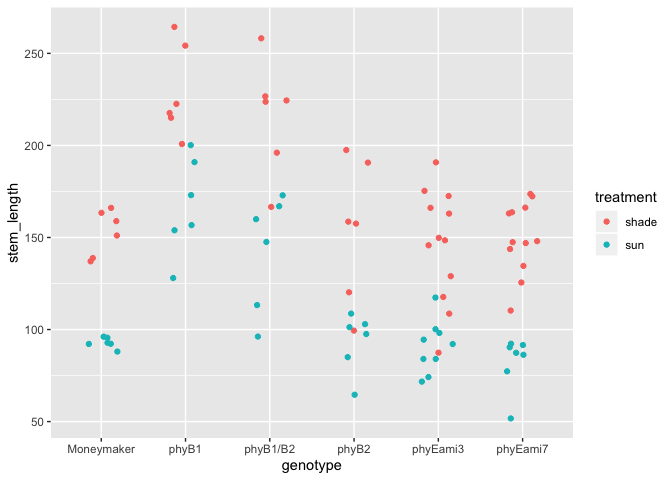
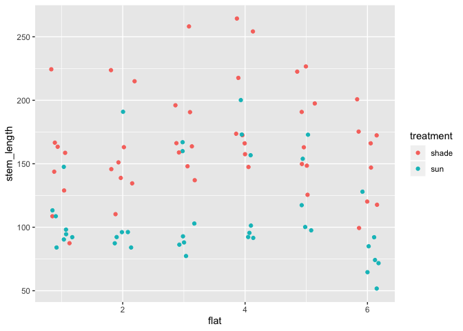
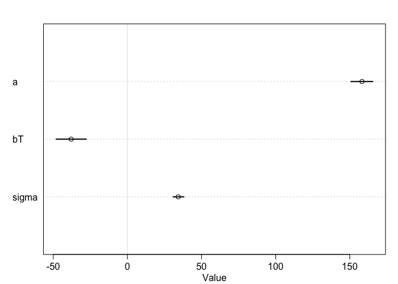

This csv has measurements of tomato internodes and petioles from wildtype (Moneymaker) and various phytochrome mutant lines.  Measurements were made at 3 time points, 21, 28, and 35 days after germination under two treatments, simulated sun and simulated shade.

For today let's focus on day 35.  Also let's focus on total stem length.

## Q1)

a) subset the data for day 35

b) create a new column "stem_length" that is the sum of epi, int1, int2, and int3

c) although flats are listed as 1-6, flats in sun and shade are separate. Create a new column "flat2" that corrects for this.


```r
library(tidyverse)
library(rethinking)

dat = read_csv("figure4phyE.csv") %>% 
  filter(day == 35) %>% 
  mutate(stem_length = epi + int1 + int2 + int3,
         flat2 = paste(treatment, flat, sep = "_"))
```

```
## Parsed with column specification:
## cols(
##   genotype = col_character(),
##   treatment = col_character(),
##   flat = col_double(),
##   day = col_double(),
##   epi = col_double(),
##   int1 = col_double(),
##   int2 = col_double(),
##   int3 = col_double(),
##   pet1 = col_double(),
##   pet2 = col_double(),
##   pet3 = col_double(),
##   pet4 = col_double()
## )
```

```r
hist(dat$stem_length)
```

<!-- -->

```r
ggplot(dat, aes(x = genotype, y = stem_length, color = treatment)) + 
  geom_jitter(width = 0.2)
```

<!-- -->

```r
ggplot(dat, aes(x = flat, y = stem_length, color = treatment)) + 
  geom_jitter(width = 0.2)
```

<!-- -->


Ultimately you want to know if any of the mutants have a different length from Moneymaker, in sun or in shade, or if the response to shade differs.

## Q2) Fit 3 models, all of which include genotype and treatment

a) do not include flat


```r
d1a = list(stem_length = dat$stem_length, 
          treatment = as.integer(as.factor(dat$treatment)) - 1, # 0 = shade, 1 = sun
          genotype = as.integer(as.factor(dat$genotype)))

m1.1a = ulam(
  alist(
    stem_length ~ dnorm(mu, sigma),
    mu <- aG[genotype] + treatment*bT + treatment*bGT[genotype],
    aG[genotype] ~ dnorm(150, 25),
    bT ~ dnorm(0, 10),
    bGT[genotype] ~ dnorm(0, 10),
    sigma ~ dexp(1)),
  data = d1a, chains = 2, cores = 2, iter = 2000, log_lik = TRUE)

precis(m1.1a, depth = 2)
```

```
##              mean       sd      5.5%       94.5%    n_eff      Rhat
## aG[1]  147.780892 7.239774 136.07889 159.2051468 2173.243 1.0001235
## aG[2]  217.612974 7.562166 205.30640 229.7787884 2303.562 0.9996280
## aG[3]  202.434002 7.370705 190.84081 214.1598571 2195.080 1.0000475
## aG[4]  148.844882 7.277049 137.35683 160.4021694 2320.849 1.0014475
## aG[5]  143.987971 5.786843 134.85566 153.2622534 2472.121 0.9993037
## aG[6]  145.505606 5.645155 136.26998 154.5375466 2615.893 0.9998569
## bT     -43.708481 5.135585 -52.06583 -35.3741083 1534.856 0.9999796
## bGT[1]  -6.367092 7.924858 -19.15889   6.5511457 2601.381 1.0004693
## bGT[2]  -3.709366 7.855713 -16.06318   8.9647882 2225.990 0.9993764
## bGT[3]  -9.099412 8.365736 -22.48257   4.1757977 2332.074 0.9995110
## bGT[4]  -6.732764 7.827651 -19.02508   5.8110090 2064.501 1.0014739
## bGT[5]  -6.294166 7.595913 -18.81172   5.1845002 1949.918 1.0002205
## bGT[6] -11.585118 7.651205 -23.59840   0.3660902 2286.782 1.0002082
## sigma   21.725531 1.538845  19.42200  24.3191630 2064.387 1.0019506
```

```r
plot(precis(m1.1a, depth = 2))
```

<!-- -->

```r
d1b = list(stem_length = dat$stem_length, 
          treatment = as.integer(as.factor(dat$treatment)) - 1, # 0 = shade, 1 = sun
          genotype = as.integer(as.factor(dat$genotype)))

m1.1b = ulam(
  alist(
    stem_length ~ dnorm(mu, sigma),
    mu <- aG[genotype] + treatment*bT,
    aG[genotype] ~ dnorm(150, 25),
    bT ~ dnorm(0, 10),
    sigma ~ dexp(1)),
  data = d1b, chains = 2, cores = 2, iter = 2000, log_lik = TRUE)

precis(m1.1b, depth = 2)
```

```
##            mean       sd      5.5%     94.5%    n_eff      Rhat
## aG[1] 147.44369 6.451419 136.73071 157.66937 2026.178 0.9999237
## aG[2] 218.48096 6.370880 207.99228 228.48054 1563.687 0.9998171
## aG[3] 201.06752 6.369386 190.98258 211.24983 1750.646 1.0024842
## aG[4] 148.63497 6.246717 138.70365 158.52374 2345.830 0.9994597
## aG[5] 143.87344 5.066684 135.64606 151.85468 1667.370 1.0025298
## aG[6] 143.49018 5.314733 134.75524 151.84488 1837.858 1.0004056
## bT    -49.64807 4.396500 -56.46492 -42.58506  869.552 1.0022678
## sigma  21.71088 1.509314  19.43342  24.19485 1544.958 0.9991678
```

```r
plot(precis(m1.1b, depth = 2))
```

<!-- -->

```r
d1c = list(stem_length = dat$stem_length, 
          treatment = as.integer(as.factor(dat$treatment)) - 1) # 0 = shade, 1 = sun

m1.1c = ulam(
  alist(
    stem_length ~ dnorm(mu, sigma),
    mu <- treatment*bT,
    bT ~ dnorm(0, 10),
    sigma ~ dexp(1)),
  data = d1c, chains = 2, cores = 2, iter = 2000, log_lik = TRUE)

precis(m1.1c, depth = 2)
```

```
##           mean       sd     5.5%     94.5%    n_eff      Rhat
## bT    32.36252 8.376589 18.88298  45.60232 1123.322 0.9994129
## sigma 97.11141 4.517366 89.99911 104.30167 1196.579 1.0021598
```

```r
plot(precis(m1.1c, depth = 2))
```

<!-- -->

```r
d1d = list(stem_length = dat$stem_length, 
          genotype = as.integer(as.factor(dat$genotype)))

m1.1d = ulam(
  alist(
    stem_length ~ dnorm(mu, sigma),
    mu <- aG[genotype],
    aG[genotype] ~ dnorm(150, 25),
    sigma ~ dexp(1)),
  data = d1d, chains = 2, cores = 2, iter = 2000, log_lik = TRUE)

precis(m1.1d, depth = 2)
```

```
##            mean       sd      5.5%     94.5%    n_eff      Rhat
## aG[1] 126.17863 9.347004 110.98721 140.84958 3016.670 0.9996630
## aG[2] 191.72803 8.467628 178.37347 205.20771 3175.787 0.9999911
## aG[3] 175.52973 8.682343 162.04120 189.64677 2704.995 0.9990541
## aG[4] 126.76060 9.192691 112.17038 141.13526 2794.814 1.0000295
## aG[5] 124.34476 7.212756 112.95831 135.59825 3142.968 0.9990781
## aG[6] 127.13663 7.428927 115.65625 139.22410 2685.627 0.9997988
## sigma  33.58182 2.093415  30.48861  37.08078 2332.401 0.9996237
```

```r
plot(precis(m1.1d, depth = 2))
```

<!-- -->

```r
compare(m1.1a, m1.1b, m1.1c, m1.1d)
```

```
##            WAIC       SE      dWAIC       dSE     pWAIC       weight
## m1.1b  821.3381 17.09407   0.000000        NA  8.775444 8.313631e-01
## m1.1a  824.5287 17.28907   3.190638  1.314702 11.457367 1.686369e-01
## m1.1d  909.2591 13.63630  87.920994 12.247774  7.764977 6.729604e-20
## m1.1c 1151.6618 16.40932 330.323714 20.378789  1.035800 1.552057e-72
```

All intercepts are positive and around 150-200, which is consistent with the data.
The best model has treatment and genotype, but no interaction.


b) include flat without pooling


```r
d2 = list(stem_length = dat$stem_length, 
          treatment = as.integer(as.factor(dat$treatment)) - 1, # 0 = shade, 1 = sun
          genotype = as.integer(as.factor(dat$genotype)),
          flat = as.integer(as.factor(dat$flat2)))

m1.2 = ulam(
  alist(
    stem_length ~ dnorm(mu, sigma),
    mu <- aG[genotype] + treatment*bT + bF[flat],
    aG[genotype] ~ dnorm(150, 25),
    bT ~ dnorm(0, 10),
    bF[flat] ~ dnorm(0, 10),
    sigma ~ dexp(1)),
  data = d2, chains = 2, cores = 2, iter = 2000, log_lik = TRUE)

precis(m1.2, depth = 2)
```

```
##               mean       sd       5.5%      94.5%    n_eff      Rhat
## aG[1]  140.7677891 7.042358 129.593992 152.378790 1489.810 0.9993482
## aG[2]  210.5013870 6.781253 199.831013 221.269529 1693.808 0.9994786
## aG[3]  195.4521837 6.884912 184.534579 206.334338 1414.866 0.9998753
## aG[4]  143.8433551 6.725037 133.247682 154.526911 1345.291 0.9995233
## aG[5]  140.1292930 5.903871 130.573394 149.611218 1342.278 0.9994680
## aG[6]  136.1951694 5.834204 126.720924 145.320631 1266.924 0.9992966
## bT     -39.1180244 5.635176 -48.144193 -30.219033 1088.433 1.0006980
## bF[1]   -4.3622744 6.257615 -14.208081   5.710344 1729.031 1.0001906
## bF[2]    4.0800068 6.496688  -5.952487  14.532730 1742.800 0.9998122
## bF[3]   16.3756403 6.527345   5.566362  26.503024 1605.162 1.0008552
## bF[4]   18.9171991 6.471452   8.786997  29.222634 1900.844 0.9999828
## bF[5]   15.0197945 6.665263   4.146352  25.635959 1891.597 0.9992073
## bF[6]    0.5304058 6.354113  -9.554000  10.642166 1636.001 0.9990789
## bF[7]   -7.6431185 6.608143 -17.935300   3.056801 2357.487 0.9997428
## bF[8]   -8.2704699 6.848136 -18.941928   3.049235 2514.240 0.9994678
## bF[9]   -3.6533266 6.793680 -14.727029   7.167859 2234.470 1.0001770
## bF[10]  -0.1706669 6.796853 -10.993484  10.649014 2071.228 1.0000978
## bF[11]   0.7641965 6.948291 -10.221262  12.044970 2259.397 1.0015628
## bF[12] -19.8490004 6.737080 -30.779707  -8.958923 2161.396 0.9994981
## sigma   19.4275203 1.461024  17.251057  21.847229 2288.997 1.0003744
```

```r
plot(precis(m1.2, depth = 2))
```

<!-- -->

c) use a hierarchical model that allows partial pooling across flats


```r
m1.3 = ulam(
  alist(
    stem_length ~ dnorm(mu, sigma),
    mu <- aG[genotype] + treatment*bT + bF[flat],
    aG[genotype] ~ dnorm(150, 25),
    bT ~ dnorm(0, 10),
    bF[flat] ~ dnorm(0, f_sigma),
    # f_bar ~ dnorm(0, 10),
    f_sigma ~ dexp(1),
    sigma ~ dexp(1)),
  data = d2, chains = 2, cores = 2, iter = 2000, log_lik = TRUE)
```

```
## Warning: There were 6 divergent transitions after warmup. Increasing adapt_delta above 0.95 may help. See
## http://mc-stan.org/misc/warnings.html#divergent-transitions-after-warmup
```

```
## Warning: Examine the pairs() plot to diagnose sampling problems
```

```
## Warning: The largest R-hat is 1.05, indicating chains have not mixed.
## Running the chains for more iterations may help. See
## http://mc-stan.org/misc/warnings.html#r-hat
```

```
## Warning: Bulk Effective Samples Size (ESS) is too low, indicating posterior means and medians may be unreliable.
## Running the chains for more iterations may help. See
## http://mc-stan.org/misc/warnings.html#bulk-ess
```

```
## Warning: Tail Effective Samples Size (ESS) is too low, indicating posterior variances and tail quantiles may be unreliable.
## Running the chains for more iterations may help. See
## http://mc-stan.org/misc/warnings.html#tail-ess
```

```r
precis(m1.3, depth = 2)
```

```
##                 mean       sd        5.5%       94.5%      n_eff      Rhat
## aG[1]   144.08088320 6.975698 132.7327490 155.0803445  337.97661 1.0020700
## aG[2]   214.51527693 7.608964 202.3189338 226.7879513  254.17181 1.0008337
## aG[3]   198.22928537 6.979412 186.7612216 208.7598412  448.30493 1.0006622
## aG[4]   146.18230949 7.005394 134.6919427 157.1590775  419.07511 1.0003377
## aG[5]   142.24682169 5.754427 132.8833244 150.7757541  487.66712 0.9993415
## aG[6]   139.70625562 6.423937 128.9336282 149.9196998  231.07895 1.0006842
## bT      -44.62128766 7.212105 -54.3039031 -31.6801626  139.30273 1.0038670
## bF[1]    -2.97914189 4.975916 -11.6576423   4.0323487  552.44854 1.0057701
## bF[2]     1.65677935 5.258708  -5.7008781  11.5555231  480.41689 1.0002016
## bF[3]     9.03386019 8.328894  -0.6830916  24.6649543  104.73394 1.0101186
## bF[4]    10.66657139 9.285301  -0.4617600  26.4280597   87.77330 1.0078750
## bF[5]     8.44547679 7.953557  -0.6692476  23.1103792   99.72748 1.0067818
## bF[6]     0.07973411 5.078274  -8.0476741   8.2733719 1230.45167 1.0055600
## bF[7]    -3.97167621 6.108784 -15.1896531   3.2887307  196.90404 1.0078745
## bF[8]    -4.63304591 6.451980 -16.7632023   2.7268658  206.02366 1.0018630
## bF[9]    -1.62686597 5.593621 -11.8375210   6.2615541  654.40779 1.0036200
## bF[10]    0.10392404 5.193696  -8.4482441   8.7171891 1118.17540 1.0019608
## bF[11]    0.93574118 5.424597  -7.4581284  10.1958302 1324.03834 1.0047067
## bF[12]  -11.09688703 9.580312 -27.8330019   0.3735816   79.62106 1.0125376
## f_sigma   6.17448782 3.808724   0.6684097  12.4199602   48.83574 1.0189298
## sigma    20.33244273 1.732325  17.6908363  23.0772204  121.00328 1.0101447
```

```r
plot(precis(m1.3, depth = 2))
```

<!-- -->


Q3) Compare the models, which is preferred?


```r
compare(m1.1b, m1.2, m1.3)
```

```
##           WAIC       SE     dWAIC      dSE     pWAIC      weight
## m1.2  808.1304 16.81592  0.000000       NA 15.780829 0.963520405
## m1.3  814.7510 16.84213  6.620583 3.358043 14.928475 0.035173831
## m1.1b 821.3381 17.09407 13.207610 7.398747  8.775444 0.001305765
```

The model without pooling but with flats is preferred. 

Q4) Using the hierarchical model, make posterior predictions
a) for average cluster


```r
post = extract.samples(m1.3)


avg_flat = rnorm(2000, 0, post$f_sigma)

# Assume block effect is 0
d_link1 = link(m1.3, replace = list(flat = 0))

avg_flat = rnorm(2000, 0, post$f_sigma)

# Assume block effect is 0
d_link1 = link(m1.3, replace = list(flat = avg_flat))
```


b) for same clusters
c) showing the "marginal" from cluster
d) showing new clusters.

Q5) Reparameterize the model to help with divergent transitions (even if there aren't any)

Q6--optional)
a) Which genotypes differ from MoneyMaker in Sun conditions?
b) Which genotypes differ from MoneyMaker in Shade conditions?
c) Which genotypes differ from MoneyMaker in their response to shade (difference in sun vs shade)?

